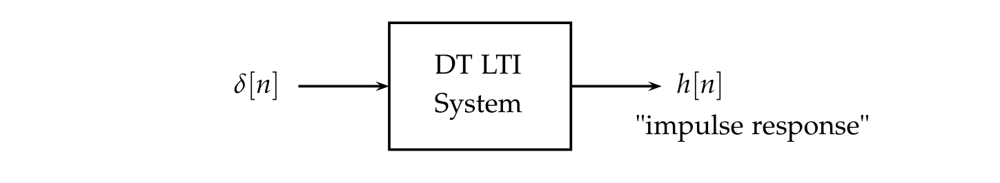
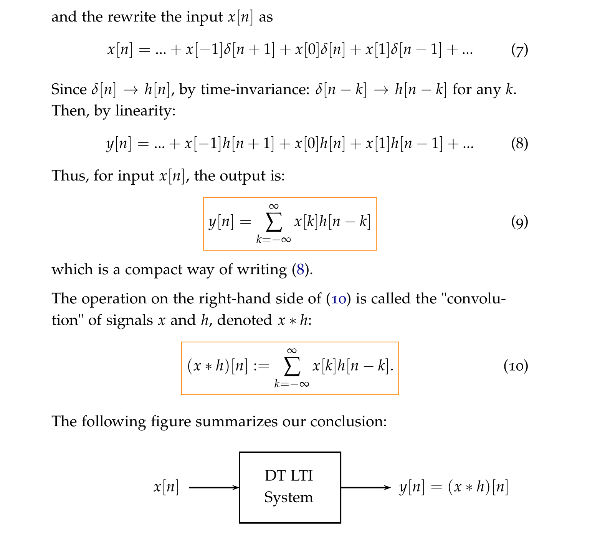
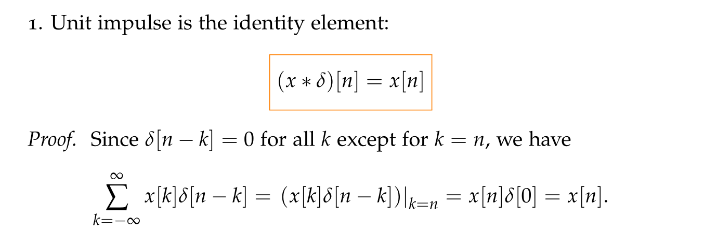
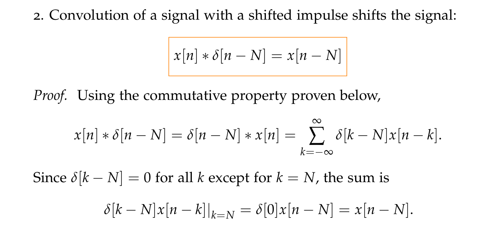
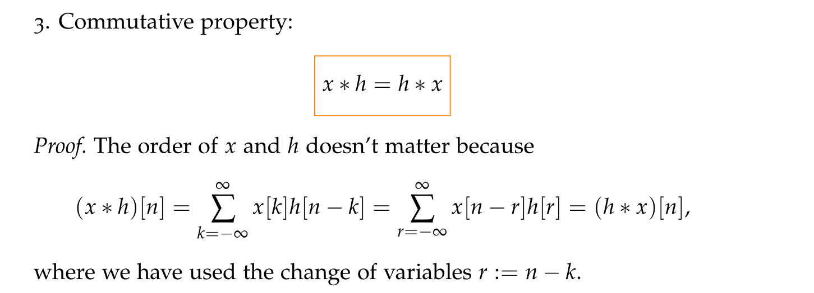
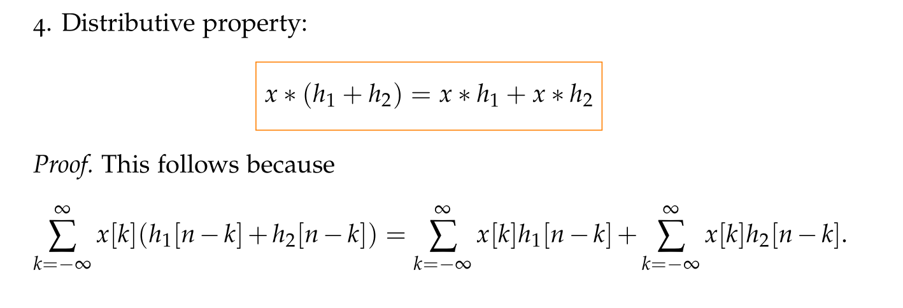
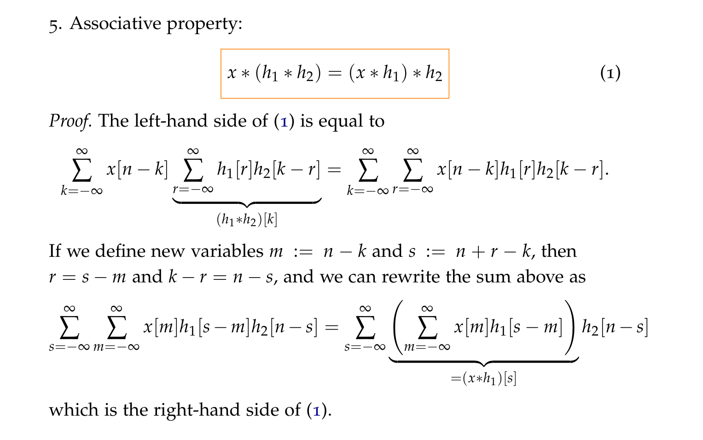

Lecture 1~2
# System Types
## Memory

## Causality

## Stability

## Linearity

## Time Invariance
> 

# Convolution
## Definition Under LTI
> [!def]
> 

## Properties
### Identity Element
> [!property] Identity Element
> 

### Shifted Impulse
> [!property]
> 

   

### Communtative
> [!property]
> 

### Distributive
> [!property]
> 

### Associative 
> [!property]
> 

