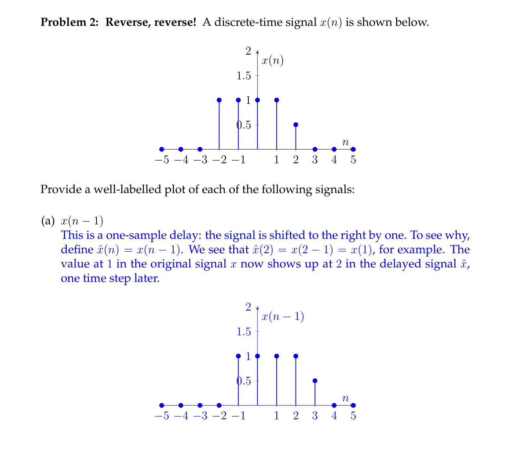
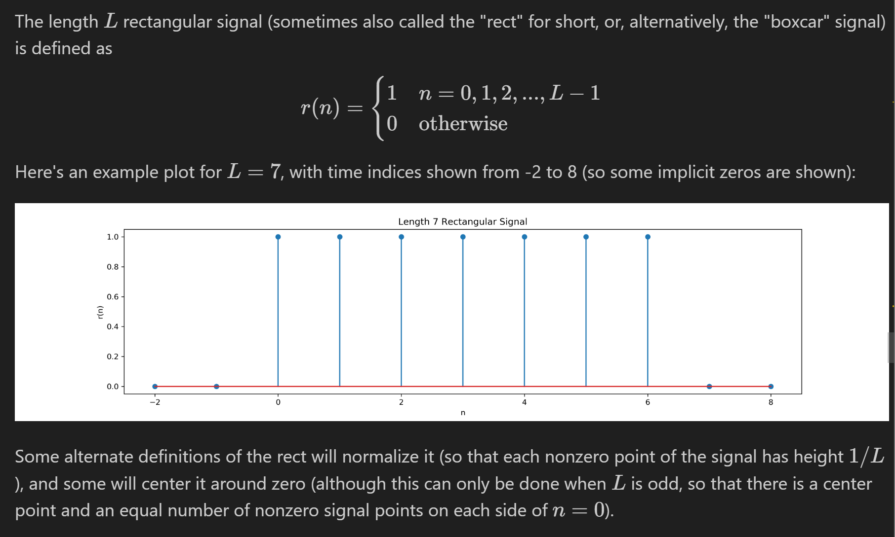

Lecture 1~2
# System Types
## Memory
> [!def]
> A system is called memoryless if its output at a given time depends on the input only at that time.
> 
> The moving average filter $y[n]=\frac{1}{3}(x[n-1]+x[n]+x[n+1])$ is not memoryless since it depends on the input at times that are not the current time($n+1$ and $n-1$).


## Causality
> [!def]
> A system is called causal if its output depends on the input at present and past times only, not on future times.
> 
> This is causal, since it only depends on current time, not the future times. It is also memoryless.
> 
> The **moving average filter** $y[n]=\frac{1}{3}(x[n-1]+x[n]+x[n+1])$ is **not causal** since it depends on the input at times that are not the current time($n+1$ and $n-1$).


## Stability
> [!def]
> A system is called stable if all bounded inputs generate bounded outputs. It is unstable if not stable; that is, if there exists a bounded input for which the output grows unbounded.
> 
> 
> More on this see [Stability_Feedback_Control](../../Machine_Learning/Control_LA_Circuit/EECS16B/Module2_Robotic_Control/Stability_Feedback_Control.md) though the definition here is a bit different.


## Linearity
> [!def]
> 


## Time Invariance
> [!def]
> 


## Identification Exercises
> [!example] EECS120 Fa19 Disc01 P1
> Suppose the system input is $x(n)$ and output is $y(n)$.
> 


## Drawing Signals
> [!example] EECS120 Fa19 Disc01 P2
> 


## Quick Testing
> [!important]
> 


# Convolution
## Definition Under LTI
> [!def]
> 


## Properties(Discrete)
### Identity Element
> [!property] Identity Element
> 


### Shifted Impulse
> [!property]
> 

   

### Communtative
> [!property]
> 


### Distributive
> [!property]
> 


### Associative 
> [!property]
> 


## Properties(Continuous)


## Computing Exercises
> [!example] EECS120 Fa19 Disc01 P3
> 


# Signals in Python
## How to Represent
> [!important]
> 


## Rectangular Signal
> [!def]
> 
```python
n_axis = np.arange(-2, 8)
r_axis = np.array([0,0,1,1,1,1,1,0,0,0])

plt.stem(n_axis, r_axis)

plt.xlabel("n")
plt.ylabel("r(n)")
```
> [!code] Output
> 


## One-Sided Decaying Exponential Signal
> [!def]
> 
```python
def decaying_expo(rate, n_start, n_end):
    """
    Returns a right-sided decaying exponential signal, truncated to the provided indices.
    
    Parameters:
    rate    - The decay rate.
    n_start - The first time index to use in generating the signal. 
    n_end   - The last time index to use in generating the signal.
    
    Returns:
    n       - The time indices the signal is generated for: n_start, n_start + 1, ..., n_end.
    sig     - The signal values for each input in n.
    
    If n_start is not less than n_end, a ValueError will be raised, as this specifies an empty
    range of time indices to generate the signal over.    
    """
    if n_start >= n_end:
        raise ValueError("n_start must be less than n_end")
    
    def u(n):
        return n >= 0

    n_list = np.arange(n_start, n_end + 1)
    sig_list = np.exp(-1 * rate * n_list) * u(n_list)
    return n_list, sig_list
	
	
	
index_list, sig_list = decaying_expo(0.95, -5, 20)
plt.stem(index_list, sig_list)
```
> [!code] Output
> 


# Convolution in Python
## Three Mode of Convolution
> [!important]
> - `full mode`
> - `same mode`: 
> - `valid mode`


## Convolution Shape


