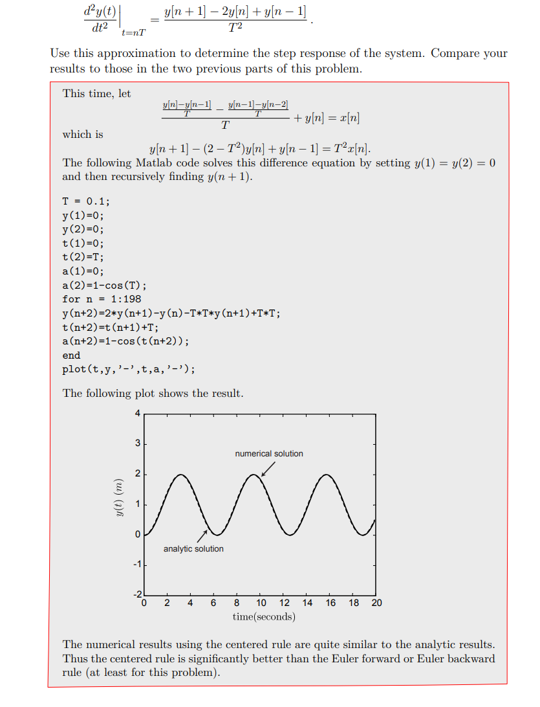

# Block Diagram
## Mathematical Properties
> [!property]
> 

> [!example]
> 

# DT Operator Algebra
## Principles
> [!important]
> 

## Accumulator
> [!def]
> 

## Reciprocal Operator
> [!important]
> 

## Feedback Operator
> [!def]
> 

## Cyclic/Acyclic Path
> [!important]
> 

# CT Operator Algebra
## Basic Definitions
> [!def]
> 
> Here $\mathcal{A}$ is like making accumulation.
> 
> 

## Evaluating Operator Expressions
> [!def]
> 

## Operator Algebra
> [!property]
> 

> [!example]
> 

# Unit Sample Response
## System Functionals and USR
> [!def]
> For a discrete time system, the unit sample response(or unit impulse response) is the output of the system given the input of this form $$x[n]=\begin{cases}1&n\geq 0\\0&\textbf{otherwise} \end{cases}$$.
> 
> Unit sample response is very closely related to the concepts of poles and system functional. 

> [!example]
> This example shows how to use the expression of system functional to find the poles and unit sample resposne of the DT system.
> 
> Suppose we have an LTI system as follows:
> $$y[n]=\frac{3}{4}y[n-1]-\frac{1}{8}y[n-2]+x[n]$$ where $x[n]$ is a unit impulse input.
> 1. We start by finding the system functional $$\frac{\mathcal{Y}}{\mathcal{X}}=\frac{1}{(1-\frac{1}{2}\mathcal{R})(1-\frac{1}{4}\mathcal{R})}$$
> 2. We use partial fraction to get the following: $$\frac{\mathcal{Y}}{\mathcal{X}}=\frac{2}{1-\frac{1}{2}\mathcal{R}}+\frac{-1}{1-\frac{1}{4}\mathcal{R}}$$
> 3. The poles are just the coefficients of the two denominators: $p_{0}=\frac{1}{2}$ and $p_{1}=\frac{1}{4}$
> 4. The expression for unit sample response is just $$h[n]=2\cdot (\frac{1}{2})^{n}+(-1)\cdot (\frac{1}{4})^{n},\forall n\geq 0$$

## From USR to System Functional
> [!example]
> 

## Finding USR by System Functional
> [!example]
> 

# Poles
## Finding Poles from USR
> [!important]
> 

## Repeated Poles
> [!example]
> 

# Euler's Approximation Methods
> [!example]
> 
> The (b) here uses the knowledge from [Second Order Unit Step Response](../../../Mathematics/Differential_Equations/MIT_18.03SC/3.5_Impulse_Response.md#4%20Second%20Order%20Unit%20Step%20Response) which says that for a system if we have unit step input, then the $y(t)$ and $\dot{y}(t)$ are both continuous at 0.
> 
> 

