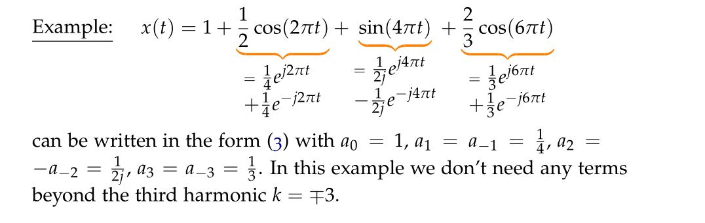

Lec4

# CT Periodic Signals
## Definition
> [!def]
> A **continuous-time** signal $x(t)$ is periodic if there exists $T$ such that $\forall t$, we have $x(t+T)=x(t)$. 
> - The smallest $T$ among those satisfying $T$'s is called "fundamental period".
> - Every multiple of $T$ is also a period.
> 

## Sum of Periodic Signals
> [!important]
> **Question: In continuous time, is sum of periodic signals still periodic? Not always.**
> 
> For those signals that are composed of multiple signals, the fundamental period is the LCM(least common multiples) of the period of each signal.
> - $x(t)=cos(\frac{2\pi}{3}t)+sin(\frac{\pi}{10}t)$ has $T_1=\frac{2\pi}{\frac{2\pi}{3}}=3$ and $T_{2}=\frac{2\pi}{\frac{\pi}{10}}=20$. $T=LCM(3,20)=60$. This is because there exists integers $n_1,n_2$ such that $n_1T_{1}= n_2T_2$ and that $\frac{T_1}{T_2}$ is rational.
> - $x(t)=cos(2\pi t)+cos(t)$ is not periodic since $T_1=1$ and $T_2=2\pi$, where $\frac{T_1}{T_2}=\frac{1}{2\pi}\notin \mathbb{Q}$
> 

# Fourier Series
## Definition
> [!def]
> 

## Conjugate Symmetry Property
> [!important]
> 
> **Proof:** We could use change of variable $k=-s$ such that
> $$\begin{aligned}x^*(t) & =\sum_{k=-\infty}^{\infty} a_k^* e^{-j k \omega_0 t} \\& =\sum_{s=-\infty}^{\infty} a_{-s}^* e^{j s \omega_0 t} \\& =\sum_{k=-\infty}^{\infty} a_{-k}^* e^{j k \omega_0 t}\end{aligned}$$
> By pattern matching we have that the FS coefficients of $x^{*}(t)$ is $b_{k}=a_{-k}^{*}$.
> 
> **Corollary:**
> If $x(t)$ is a real-valued signal, then we must have $x(t)=x^*(t)$ so that $a_{k}=b_{k}=a_{-k}^{*}$

## Arithmetic Properties
### Linearity
> [!property]
> 
> **Proof:**
> $$\begin{aligned}x(t) & =\sum_{k=-\infty}^{\infty} a_k e^{j k \omega_0 t} \\y(t) & =\sum_{k=-\infty}^{\infty} b_k e^{j k \omega_0 t} \\A x(t)+B y(t) & =\sum_{k=-\infty}^{\infty}\left(A a_k+B b_k\right) e^{j k \omega_0 t} \\c_k & =A a_k+B b_k\end{aligned}$$

### Time Shift
> [!property]
> 
> **Proof:**
> $$\begin{aligned}x(t) & =\sum_{k=-\infty}^{\infty} a_k e^{j k \omega_0 t} \\x\left(t-t_0\right) & =\sum_{k=-\infty}^{\infty} a_k e^{j k \omega_0\left(t-t_0\right)} \\\hat{x}(t) & =\sum_{k=-\infty}^{\infty}\left(a_k e^{-j k \omega_0 t_0}\right) \cdot e^{j k \omega_0 t} \\b_k & =a_k e^{-j k \omega_0 t_0}\end{aligned}$$
> 

### Time Reversal
> [!property]
> 
> **Proof:**
> $$\begin{aligned}x(t) & =\sum_{k=-\infty}^{\infty} a_k e^{j k \omega_0 t} \\x(-t) & =\sum_{k=-\infty}^{\infty} a_k e^{-j k \omega_0 t} \\& =\sum_{s=-\infty}^{\infty} a_{-s} e^{j s \omega_0 t} \\& =\sum_{k=-\infty}^{\infty} a_{-k} e^{j k \omega_0 t} \\b_k & =a_{-k}\end{aligned}$$
> 

## FS Coefficients
> [!important]
> 

> [!example] Square Wave
> 

> [!example] Triangle Wave
> 

# Convergence Theorem
## Main Theorem
> [!motiv]
> 

> [!thm]
> 

> [!example]
> 

