Lec5

# DT Periodic Signals
## Definition
> [!def]
> 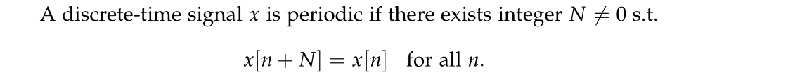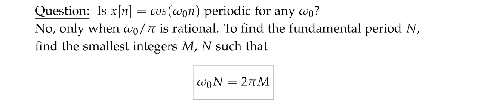

> [!example]
> 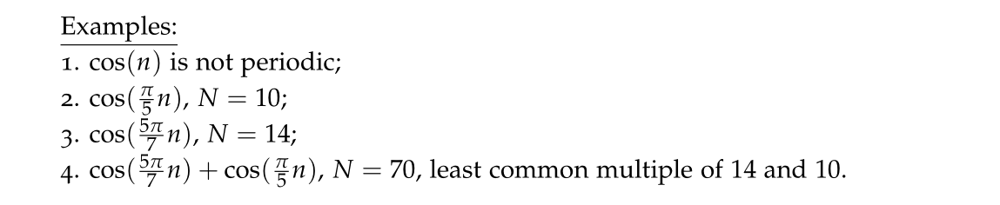
> The last one can also be computed by first finding the fundmental period(which is the LCM of $2.8$ and $10$, which is $70$, then find the fundamental frequency $w_{0}=\frac{2\pi}{70}$). Finally, $\frac{w_{0}}{2\pi}=\frac{M}{N}=\frac{1}{70}$, which implies that $N=70$.

## Sum of DT periodic Signal
> [!important]
> **Question: In discrete time, is sum of two DT periodic signals still periodic? Yes, always.**
> Since in order for a discrete time signal($f(w_0n)$) to be periodic, $\frac{w_0}{2\pi}$ has to be rationa. More detailedly, $\exists M,N$ such that $w_{0}N=2\pi M$. 
> 
> In this case, for any time DT periodic signal $f(w_{0}t)$ and $g(w_{1}t)$, we always have $T_{f}=\frac{2\pi}{w_{f}}\in \mathbb{R}$ and $T_{g}=\frac{2\pi}{w_{g}}\in \mathbb{R}$. Since $N=a\times LCM(T_{f}, T_{g})$($a$ is the denominator of $LCM$) always exists(Proof Sketch see below), we can always obtain an integer $N$ such that the summation of the signal has $N$ as its period.

> [!proof]
> 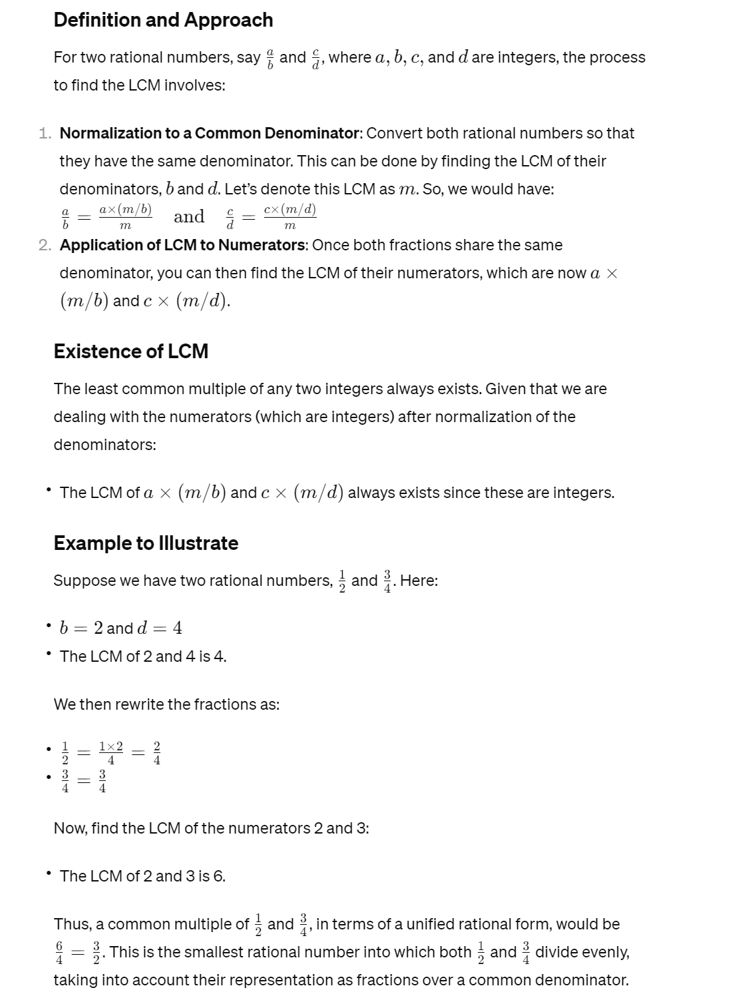

## Oscillation Speed
> [!important]
> 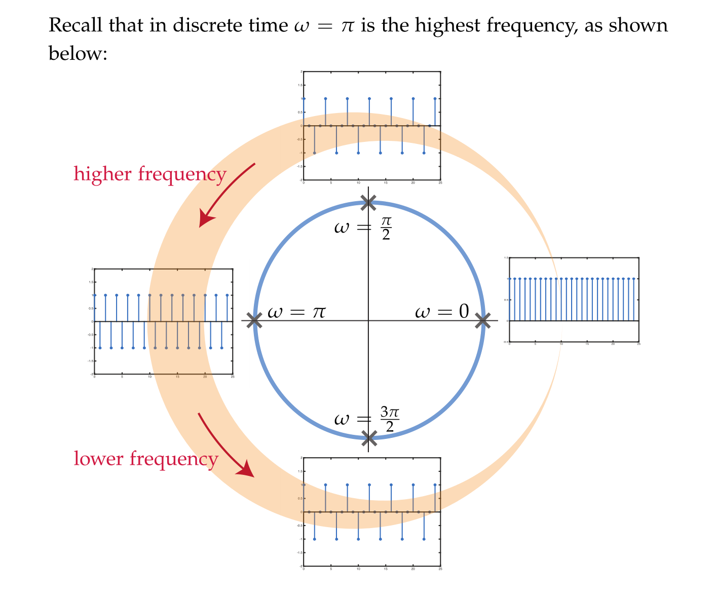

# DT Fourier Series
## Definition
> [!def]
> 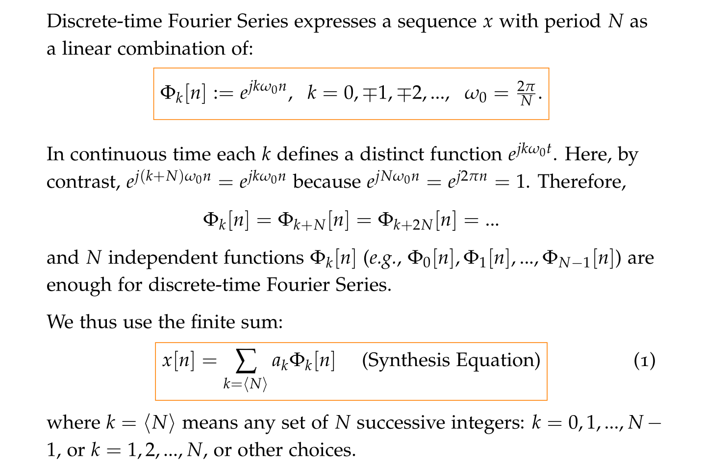
> We see that different from CT Fourier Series, the DT fourier series is a finite sum. So there is no convergence theorm of DT Fourier Series. 
> - As long as we sum enough $\Phi$ terms, we will recover the original signal.
> 
> 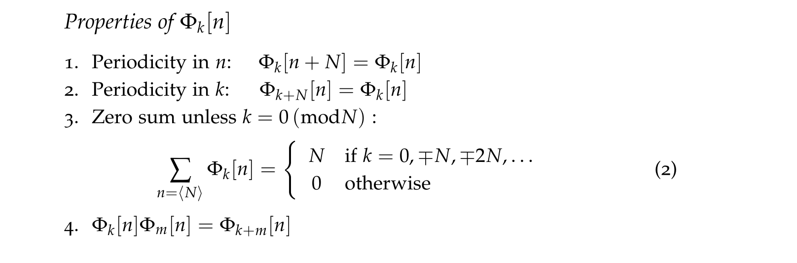

> [!example]
> 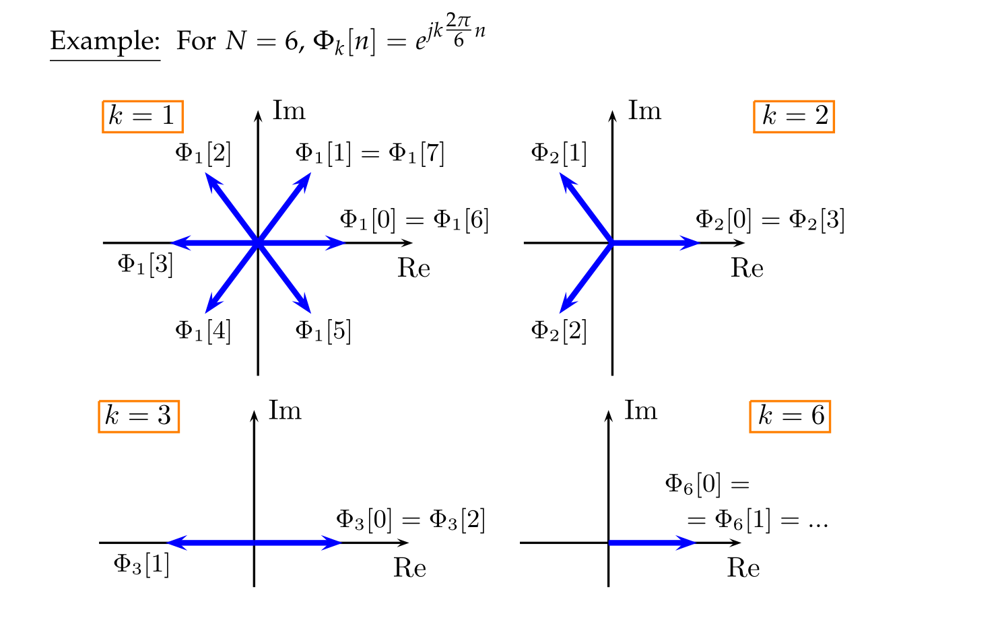

## FS Coefficients
> [!important]
> 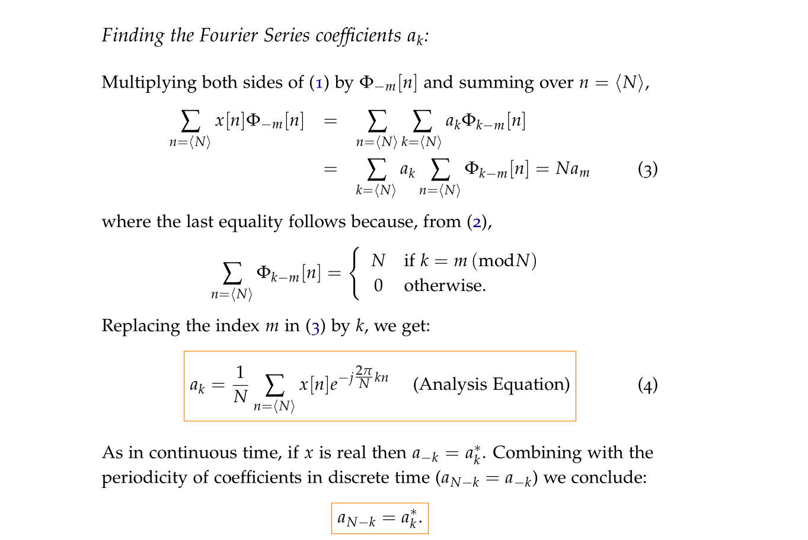

> [!example]
> 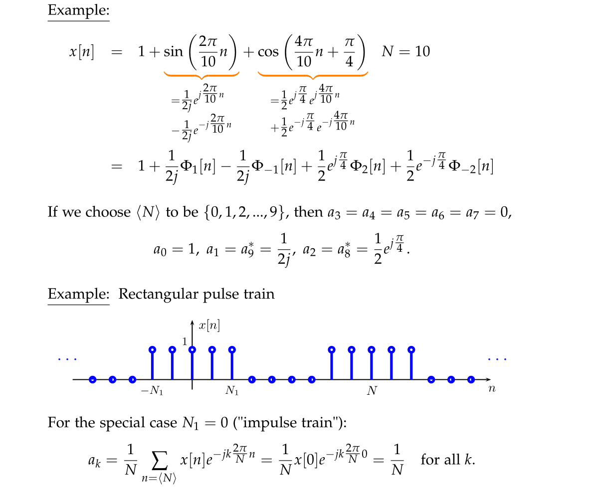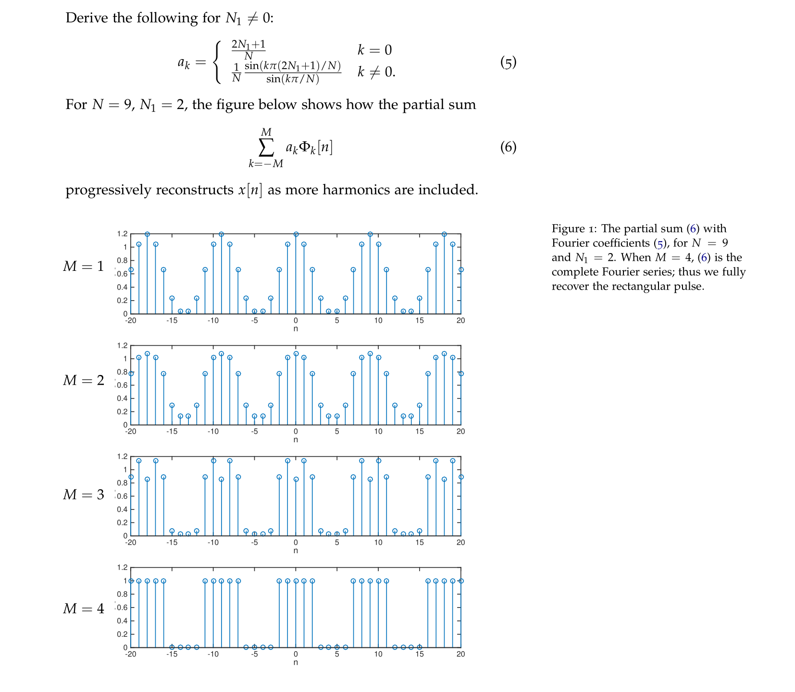

# Summary
> [!summary]
> 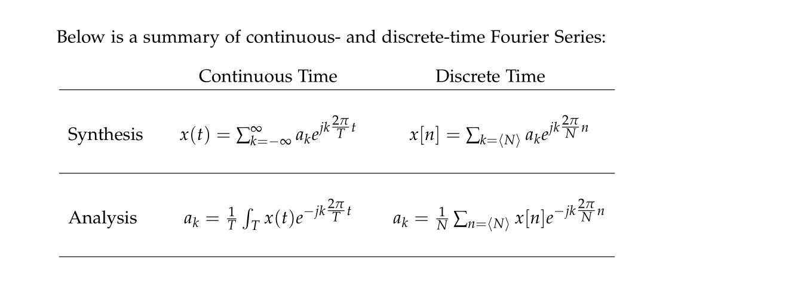

