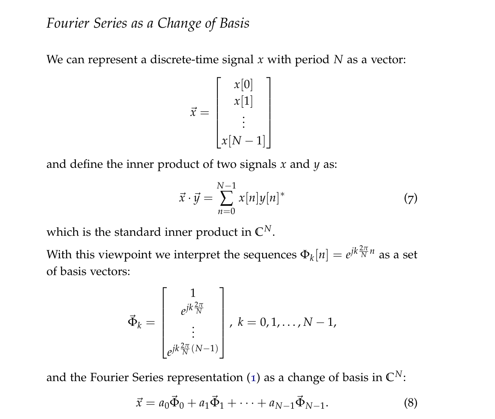
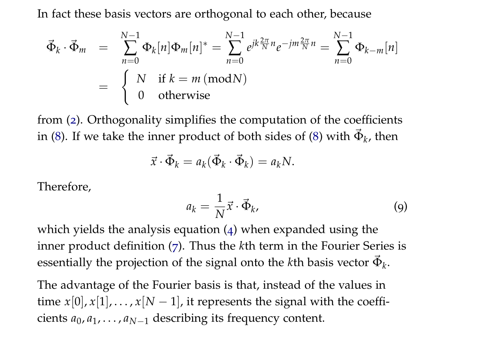

Lec5 ~ 7
# Fourier Series as a Change of Basis
> [!important]
> 
>
> In continuous time, we used basis signals $\Phi_k(t)=e^{jk\frac{2\pi}{T}t},k=-\infty, \ldots, \infty$
> 
> Vector Space of square integrable functions on $[0,T]$:
> $$\begin{aligned}L_2([0, T])\{x:[0, T] & \left.\left.\rightarrow \mathbb{C}\left|\quad \int_0^{T}\right| x(t)\right|^2 d t<\infty\right\} \\\|x\|_{L_2} & =\sqrt{\int_0^{T}|x(t)|^2 d t}\end{aligned}$$
> and that $$\langle x, y\rangle=\int_0^T x(t) y(t)^* d t \quad\langle x, x\rangle=\|x\|_{L_2}^2$$ We can use this to show that $\Phi_k(t)$'s are orthogonal to each other where: $$\begin{aligned}\langle\Phi_{k},\Phi_{m}\rangle&=\int_0^{T}e^{jk\frac{2\pi}{T}t}e^{-jm\frac{2\pi}{T}t}dt\\&=\int_0^{T}e^{j(k-m)\frac{2\pi}{T}t}dt\\&=\begin{cases}T&k=m\\0&\text{otherwise} \end{cases}\end{aligned}$$

# CT Fourier Transform

# DT Fourier Transform
