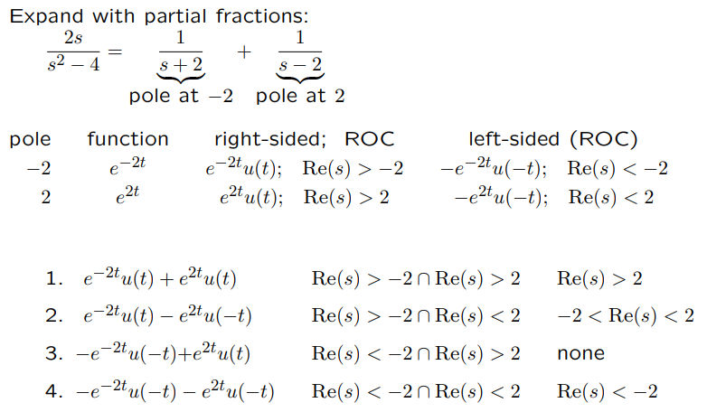

# Definition
> [!def]
> 

> [!example] Example 1
> 

> [!example] Example 2
> 

# Left and Right ROC
> [!def]
> 

> [!example] Example
> 

## Time Domain Interpretation of ROC
> [!def]
> 

> [!example] Example 1
> We change $s$ from 0 to minus infinity and the red function is changing correspondingly.
> Pole: $s=0$
> 
> Pole: $s = -\frac{1}{2}$
> 
> 
> 
> Pole: $s = -1.5$
> 

> [!example] Example 2
> 

