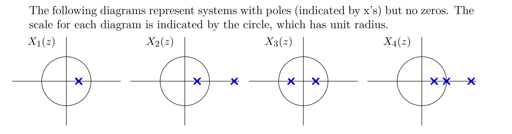

# Concept Map
> [!important]
> 

# Z-Transform
## Definition
> [!def]
> For a time-indexed signal $x[n]$, the z-transform of it is $$\sum\limits_{n=-\infty}^{\infty}x[n]z^{-n}$$ where $z$ is a complex variable.

## Region of Convergence
> [!def]
> For a **right-sided signal** defined as $$x[n]=\alpha^{n}u[n]$$, its z-transform is $$\sum\limits_{n=0}^{\infty}\alpha^{n}z^{-n}=1+\alpha\cdot z^{-1}+\alpha^{2}\cdot z^{-2}+\cdots$$ If we want this series to converge then $|\alpha\cdot z^{-1}|<1$, which is when $|z|>|\alpha|$ and the z-transform is $$\frac{1}{1-\alpha\cdot z^{-1}}=\frac{z}{z-\alpha}$$
> For a **left-sided signal** defined anti-causally as $$x[n]=-\alpha^{n}u[-n-1]$$, its z-transform is $$\sum\limits_{n=-\infty}^{1}-\alpha^{n}z^{-n}=-(\alpha^{-1}\cdot z+\alpha^{-2}\cdot z^{2}+\cdots)$$. If we want this series to converge then $|\alpha^{-1}\cdot z|<1$, which is when $|z|<|\alpha|$ and the z-transform is $$_\frac{\alpha^{-1}\cdot z}{1-\alpha^{-1}z}=-\frac{z}{\alpha - z}=\frac{z}{z-\alpha}$$
> 
> So in conclusion, for the same z-transform, we usually have two signals that could be transformed to the same z-transform with flipped ROC.

## Poles/Zeros
> [!example] HW3 P5
> 

## Stability/Poles/ROC
> [!important]
> For a DT system to be stable, we know that all the poles of the system should be within the unit circle. And here is a more useful definition/corollary using the concept of ROC.
> 

> [!corollary] 
> A system is stable iff the ROC of its Z transform includes the unit circle.
> 
> **Proof:**
> 
> For the **right-sided** signal, we know its ROC is right-sided. So if the system is stable, then all the poles should be within unit circle, that means the ROC **would** include the unit circle like the one below:
> 
> For the **left-sided** signal, the ROC is left-sided(closed), so if the left-sided system is stable, then all the poles should be outside the unit circle, that means ROC **would** include the unit circle.

> [!example]
> 

## Causality
> [!important]
> A linear, time-invariant system is causal if its unit-sample reponse is zero for $t<0$.

> [!example]
> 
> As long as all the signal represented by the poles are right-sided.
> 
> 

# Periodic Signal
## Periodicity of Signals
> [!important]
> 

## Integrated Example
> [!example]
> 

# Engineer Design Problems

# Appendix: Z-transform Look-up Table
> [!important]
> 

