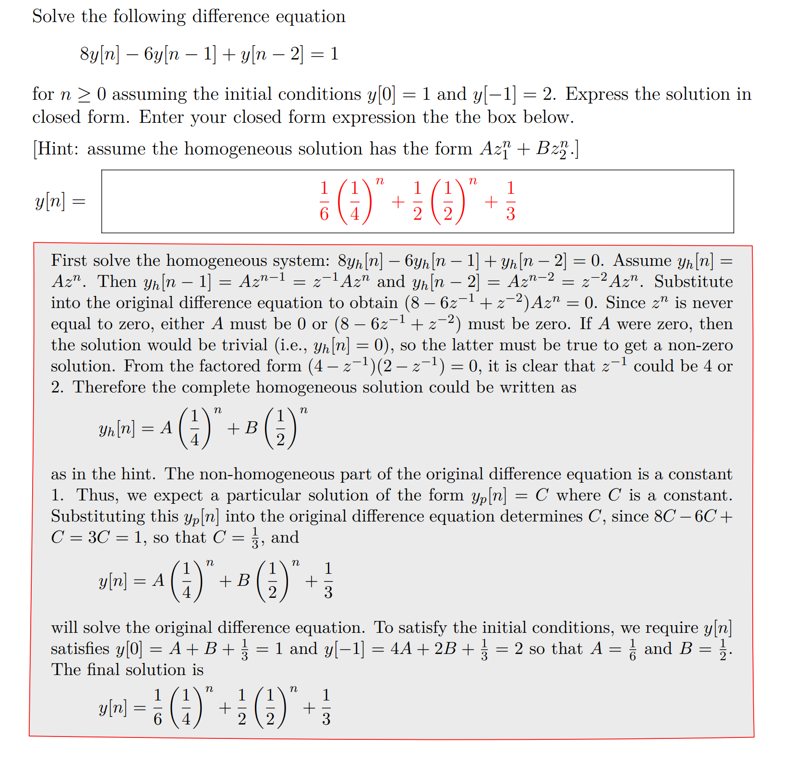

# Leaky-Tanks - Euler's Approximation
> [!important]
> 

# Solving Difference Equation
> [!example]
> The procedure is similar to that of solving differential equations.
> 

# Accumulator
## Definition
> [!important]
> For some system, it will keep the information from previous input $x[i]~\forall i=1,2,\cdots, n-1$ in the current timestep $y[n]$. Such system is called accumulator, an example would be:
> $$y[n]=x[n]+\alpha \cdot y[n-1]$$ where $\alpha$ determine the pattern of the output of the system.

## Pole
> [!info] Pole of the accumulator
> To calculate the pole, we compute as follows:
> $$\mathcal{Y}=\mathcal{X}+\alpha \mathcal{R}\cdot \mathcal{Y}$$ and the system functional is:
> $$\frac{\mathcal{Y}}{\mathcal{X}}=\frac{1}{1-\alpha\mathcal{R}}$$, substituting $z=\frac{1}{\mathcal{R}}$ we get the system function which is:
> $$\frac{z}{z-\alpha}$$ so that the pole is $\alpha$

## Unit Sample Response
> [!important]
> 

## Example - Drug Denoising
> [!example]
> 
> Can also solve using homogenous and inhomogenous part separately for general solution:
> 1. First re-write the system into $$y[n]-\alpha\cdot y[n-1]=x[n]$$. The homogenous solution is of the form $$y_{h}[n]=C\cdot \alpha^n$$.
> 2. Find the particular solution. Since $x[n]=1,\forall n$, we assume $y[n]=T$ and could get $y_{p}[n]=\frac{1}{1-\alpha}$.
> 3. Write out the general solution: $$y[n]=C\cdot \alpha^n+\frac{1}{1-\alpha}$$
> Finally use the initial condition $y[0]=1$ to solve for $C$ and get $$y[n]=-\frac{\alpha}{1-\alpha}\cdot \alpha^n+\frac{1}{1-\alpha}=\frac{1-\alpha^{n+1}}{1-\alpha}$$
>
> 

