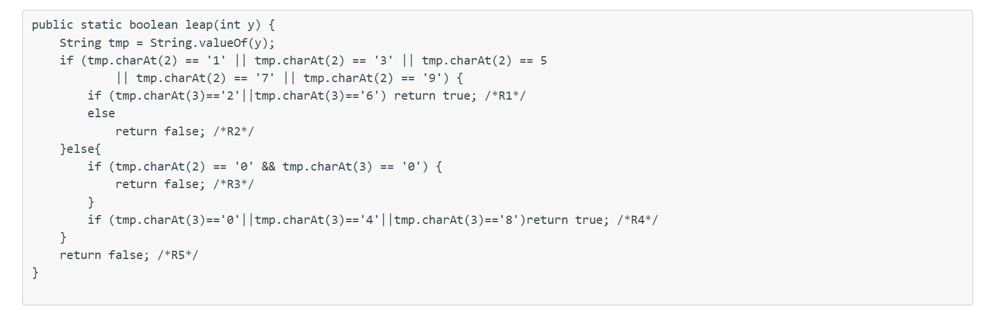

# P1: Don't Repeat Codes
## Concepts
> [!concept]
> 
> - Duplicated code is a risk to safety. If you have identical or very similar code in two places, then the fundamental risk is that there's a bug in both copies, and some maintainer fixes the bug in one place but not the other.
> - Avoid duplication like you'd avoid crossing the street without looking. Copy-and-paste is an enormously tempting programming tool, and you should feel a frisson of danger run down your spine every time you use it. The longer the block you're copying, the riskier it is.
> - [Don't Repeat Yourself](http://en.wikipedia.org/wiki/Don't_repeat_yourself), or DRY for short, has become a programmer's mantra.
> - The dayOfYear example is full of identical code. How would you DRY it out?

## Code Analysis
> [!example]
> 

# P2: Comments where needed
## Concepts
> [!concept]
> A quick general word about commenting. Good software developers write comments in their code, and do it judiciously. Good comments should make the code easier to understand, safer from bugs (because important assumptions have been documented), and ready for change.
> One kind of crucial comment is a specification, which appears above a method or above a class and documents the behavior of the method or class. In Java, this is conventionally written as a Javadoc comment, meaning that it starts with `/**` and includes `@`-syntax, like `@param` and `@return` for methods. Here's an example of a spec:
> 
> **Specifications document assumptions.** We've already mentioned specs a few times, and there will be much more to say about them in a future reading.
> **Another crucial comment is one that specifies the provenance or source of a piece of code that was copied or adapted from elsewhere.** This is vitally important for practicing software developers, when you adapt code you found on the web. Here is an example:
> 
> 
> **One reason for documenting sources is to avoid violations of copyright.** Small snippets of code on Stack Overflow are typically in the public domain, but code copied from other sources may be proprietary or covered by other kinds of open source licenses, which are more restrictive. Another reason for documenting sources is that the code can fall out of date; the [Stack Overflow answer](http://stackoverflow.com/questions/4328711/read-url-to-string-in-few-lines-of-java-code) from which this code came has evolved significantly in the years since it was first answered.
> Some comments are bad and unnecessary. Direct transliterations of code into English, for example, do nothing to improve understanding, because you should assume that your reader at least knows Java:
> 

## Code Analysis
> [!example]
> 

# P3: Fail Fast
## Definition
> [!concept]
> The code detects the potential bugs as fast as possible through:
> - Static Checking
> - Dynamic Error Throwing/Dynamic Checking
> - If the code fails to do so, then we say that the code doesn't fail fast.
> - Typically, if the code fails fast, then static checking fails fasther than dynamic checking and dynamic checking is faster than no checking at all.

> [!example]
> The following codes don't fail fast, since if we pass in the argument in the wrong order(i.e. switch month and dayOfMonth), the code won't catch such logic flaw quickly.
> 

## Code Analysis
> [!example] Logics
> 
> We will examine a few bugs that programmers may make when they try to pass in the arguments and execute the function.
> 1. `dayOfYear(1, 3, 2019)`, it is good. The sequence of arguments is right, following the US convention of date representation(i.e. day/month/year), and the program delivers the right answer.
> 2. `dayOfYear(0, 3, 2019)`, it is one plausible mistake, where the programmer use a zero-based index for month(i.e. 0 stands for January insrtead of one). Here since for the case of month == 1 or month == 0, the code delivers the same right output, thus the answer is luckily right.
> 3. `dayOfYear(3, 1, 2019)`, it is pausible that the programmer is using a non-US date representation system where (3, 1, 2019) means Jan 3rd for him, but March 1st for US, and thus the answer should be wrong.
> 4. `dayOfYear("January", 3, 2019)`, here we have another plausible mistake where the programmer think that(probably because of missing comment or design specifications of the function) the first argument should be of String type. Thus, it would trigger static checking error and the code won't be executed.
> 5. `dayOfYear(2019, 1, 3)`, wrong order of parameter passing. This is plausible if the programmer is assuming the arguments are in year/month/day order, which is a common international standard (ISO 8601, in fact). It quietly produces the wrong answer because none of the if statements match the huge month number, so it ends up treating it the same as January, but 1 was passed for dayOfMonth, so it returns the answer for January 1. 
> 6. `dayOfYear(1, 2019, 3)`: This is implausible because no convention for writing dates puts the year in the middle. That's just silly, like putting the month at the beginning.

> [!example] Fails Fast
> 

# P4: Avoid Magic Numbers
## Definition of Magic Numbers
> [!important]
> There are really only two constants that computer scientists recognize as valid in and of themselves: 0, 1, and maybe 2. (Okay, three constants.)
> All other constants are called [magic](https://en.wikipedia.org/wiki/Magic_number_(programming)#Unnamed_numerical_constants), because they appear as if out of thin air with no explanation. One way to explain a number is with a comment, but a far better way is to declare the number as a named constant with a good, clear name.
> The following codes are full of magic numbers:
> 
> - The months 2, …, 12 would be far more readable as `FEBRUARY`, …, `DECEMBER`.
> - The days-of-months 30, 31, 28 would be more readable (and eliminate duplicate code) if they were in a data structure like an array, list, or map, e.g. `MONTH_LENGTH[month]`.
> - The mysterious numbers 59 and 90 are particularly pernicious examples of magic numbers. Not only are they uncommented and undocumented, but they are also the result of a _computation done by hand_ by the programmer. Don't hardcode constants that you've computed by hand. Java is better at arithmetic than you are. Explicit computations like `31 + 28` make the provenance of these mysterious numbers much clearer. `MONTH_LENGTH[JANUARY] + MONTH_LENGTH[FEBRUARY]` would be clearer still.

## Code Analysis
> [!example] 
> 

## Code Fixes
> [!example]
> 

# P5: One Purpose for Each Variable
## Concepts - final keyword
> [!important]
> 
> **Principles: Don't reuse parameters, and don't reuse variables.** 
> - Variables are not a scarce resource in programming. Introduce them freely, give them good names, and just stop using them when you stop needing them. 
> - You will confuse your reader if a variable that used to mean one thing suddenly starts meaning something different a few lines down. 
> - Not only is this an ease-of-understanding question, but it's also a safety-from-bugs and ready-for-change question.
> 
> **Fixes: Method parameters, in particular, should generally be left unmodified.** (This is important for being ready-for-change — in the future, some other part of the method may want to know what the original parameters of the method were, so you shouldn't blow them away while you're computing.) 
> - It's a good idea to use `final` for method parameters, and as many other variables as you can. 
> - The `final` keyword says that the variable should never be reassigned, and the **Java compiler will check it statically.**
> 
> 

## Code Analysis
> [!example]
> 
> Let's examine a few cases:
> 1. `leap(2016)`: Trace through the code as follows. First, `tmp` is set to the string "2016". `tmp.charAt(2)` is the character '1' (remember 0-based indexing), so the first if statement is true. `tmp.charAt(3)` is '6', so the next if statement then returns true.
> 2. `leap(2017)`: Now `tmp` is "2017". `tmp.charAt(2)` is again character '1' so it enters the first if block, but then `tmp.charAt(3)` is '7', so it executes the else block and returns on line R2.
> 3. `leap(2050)`: This is a bit tricky. Note that leap() is returning the wrong answer in this case, because 2050 is **not** a leap year. 
> 	- The reason this happens is a subtle bug in the program: the expression tmp.charAt(2) == 5,which should be tmp.charAt(2) == '5'. 
> 	- Instead of testing the third character in 2050 against '5' and finding a match, it tests the character against the integer 5. Since the character's value is actually 53 (the Unicode value of the character '5'), the test fails, and the code continues to produce the wrong answer. 
> 	- You might ask why Java even allows a character to be compared against an integer -- why isn't it a static type error? Indeed, it should be. If you tried to compare a String with an integer, Java would indeed produce a type error. But for historical reasons, coming from its legacy in the C and C++ programming languages, characters in Java are numeric types, like int and long, and automatically convert to integers when they need to. Static typing didn't save us here, because Java's type system is very weak in places, like automatic numeric type conversion.We can also attribute this failure to the code's lack of DRYness.
> 4. `leap(-2016)`: The code returns false on line R5. Notice that this code doesn't fail fast -- when given unexpected input, it simply produces the wrong answer.
> 5. `leap(916)`: There is an error while the code is being executed. This code is making the assumption that the year has exactly 4 digits. When it has fewer than 4 digits, then tmp.charAt(3), which tries to look at the fourth digit in the string, will fail with a dynamic error in the same way that indexing beyond the end of a Python string would fail with an error.
> 6. How many magic numbers are there in this piece of codes? All the calls of the form `charAt(_number_) == _character_` use two magic numbers: the index number, and the expected result character. There are 12 such calls, so 24 magic numbers in all.
> 7. What if we correct it as follows?
> 

# P6: Use Good Names
## Concepts
> [!concept]
> Good method and variable names are long and self-descriptive. Comments can often be avoided entirely by making the code itself more readable, with better names that describe the methods and variables.
> - In Python, classes are typically Capitalized, variables are lowercase, and `words_are_separated_by_underscores`.
> - In Java, we use `camel case`, where the first letter of each word is capitalized:
> 	- methodsAreNamedWithCamelCaseLikeThis
> 	- variablesAreAlsoCamelCase
> 	- CONSTANTS_ARE_IN_ALL_CAPS_WITH_UNDERSCORES
> 	- ClassesAreCapitalized
> 	- packages.are.lowercase.and.separated.by.dots
> - ALL_CAPS_WITH_UNDERSCORES is used for `static final` constants. All variables declared inside a method, including `final` ones, use camelCaseNames.

## Code Analysis
> [!example]
> 

# P7: Use Whitespace to help the readers
## Concepts
> [!concept]
> 
> Put spaces within code lines to make them easy to read. The leap example has some lines that are packed together — put in some spaces.
> Never use tab characters for indentation, only space characters. Note that we say _characters_, not keys. **We're not saying you should never press the Tab key, only that your editor should never put a tab character into your source file in response to your pressing the Tab key.** The reason for this rule is that different tools treat tab characters differently — sometimes expanding them to 4 spaces, sometimes to 2 spaces, sometimes to 8. If another programmer views your source code in a different editor, then the indentation may be completely screwed up. Just use spaces. **Always set your programming editor to insert space characters when you press the Tab key**. [Unless the team you're working with has opposite policy](http://blog.codinghorror.com/death-to-the-space-infidels/), of course.

## Code Analysis
> [!important]
> 

# P8: Don't Use Global Variables; Return, Don't Print
## Why Global Variables are bad?
> [!important]
> Avoid global variables. Let's break down what we mean by _global variable_. A global variable is:
> - a _variable_, a name whose meaning can be changed
> - that is _global_, accessible and changeable from anywhere in the program.
> - [Why Global Variables Are Bad](http://c2.com/cgi/wiki?GlobalVariablesAreBad) [[cached version](http://web.archive.org/web/20160902115611/http://c2.com/cgi/wiki?GlobalVariablesAreBad)] has a good list of the dangers of global variables.
> - In Java, a global variable is declared `public static`. The `public` modifier makes it accessible anywhere, and `static` means there is a single instance of the variable.
> - In general, change global variables into parameters and return values, or put them inside objects that you're calling methods on. We'll see many techniques for doing that in future readings.

## Methods Should Return Results, not Print Them
> [!concept]
> 
> - `countLongWords` isn't ready for change. It sends some of its result to the console, `System.out`. That means that if you want to use it in another context — where the number is needed for some other purpose, like computation rather than human eyes — it would have to be rewritten.
> - **In general, only the highest-level parts of a program should interact with the human user or the console. Lower-level parts should take their input as parameters and return their output as results.** The sole exception here is debugging output, which can of course be printed to the console. But that kind of output shouldn't be a part of your design, only a part of how you debug your design.

## Code Analysis
> [!example]
> 

