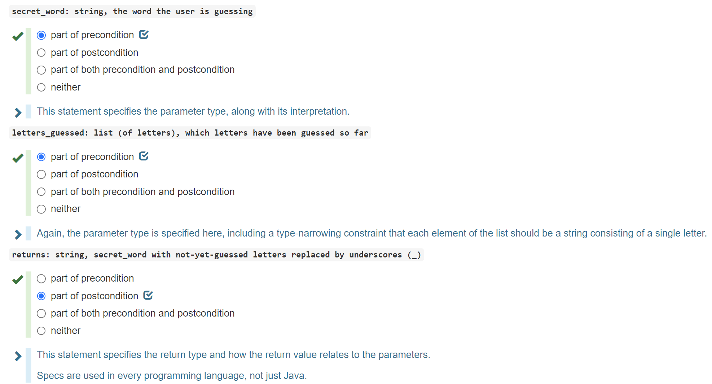

# Behavioral Equivalence
> [!concept] Behavioral Equivalence 
> To determine ==behavioral equivalence==, our question is whether we could substitute one implementation for the other. Below are two implementations of the `find()` method.

```start-multi-column  
ID: ExampleRegion1  
number of columns: 2   
```

```java
// Find the index of an integer in an array
static int find(int[] arr, int val) {
    for (int i = 0; i < arr.length; i++) {
        if (arr[i] == val) return i;
    }
    return -1;
}
```

--- end-column ---

```java
// Improved Search, from both ends.
static int find(int[] arr, int val) {
    for (int i = 0, j = arr.length-1; i <= j; i++, j--) {
        if (arr[i] == val) return i;
        if (arr[j] == val) return j;
    }
    return -1;
}
```

--- end-multi-column
> [!bug] Behavioral Difference
> In turns out that the two programs don't have so-called behavioral equivalence. 
> Not only do these implementations have different performance characteristics, they actually have different behavior. 
> - If `val` happens to appear _more than once_ in the array, the original `find` always returns the lowest index at which it occurs. 
> - But the new `find` might return the lowest index or the highest index, whichever it finds first.
> 

> [!example] One Possible Specfication
> The notion of behavioral equivalence is in the eye of the beholder — that is, the client. In order to make it possible to substitute one implementation for another, and to know when this is acceptable, we need a specification that states exactly what the client depends on.
> 
> In this case, a specification that would allow these two implementations to be behaviorally equivalent might be:
> 
> 


# Specification Structure
> [!concept]
> Abstractly speaking, a ==_specification_== of a method has several parts:
> - A _method signature_, giving the name, parameter types, return type, and exceptions thrown
> - A _requires_ clause, describing additional restrictions on the parameters
> - An _effects_ clause, describing the return value, exceptions, and other effects of the method
> 
> Taken together, these parts form the ==_precondition_== and the ==_postcondition_== of the method.
> 
> The ==precondition== is an obligation on the ==client== (the caller of the method). It is a condition over the state in which the method is invoked. One aspect of the precondition is the number and types of the parameters in the method signature. Additional conditions are written down in the _requires_ clause, for example:
> - narrowing a parameter type (e.g. `x >= 0` to say that an `int` parameter x must actually be a nonnegative `int`)
> - interactions between parameters (e.g., `val` occurs exactly once in `arr`)
>  
> The ==postcondition== is an obligation on the ==implementer== of the method. It includes the parts that Java can statically check: the return type and declared checked exceptions. Additional conditions are written down in the _effects_ clause, including:
> - how the return value relates to the inputs
> - which exceptions are thrown, and when
> - whether and how objects are mutated
> 
> **In general, the postcondition is a condition on the state of the program _after_ the method is invoked, assuming the precondition was true _before_.**
> 
> The overall structure is a logical implication: _if_ the precondition holds when the method is called, _then_ the postcondition must hold when the method completes.
> 
> If the precondition does _not_ hold when the method is called, the implementation is _not_ bound by the postcondition. It is free to do anything, including never returning, throwing an exception, returning arbitrary results, making arbitrary mutations, etc.
> 
> A specification of a method ==can== talk about the parameters and return value of the method, but it ==should never== talk about _local variables_ of the method or _private fields_ of the method’s class. You should consider the implementation invisible to the reader of the spec. It’s behind the firewall as far as clients are concerned.
> 
> In Java, the source code of the method is often unavailable to the reader of your spec, because the Javadoc tool only extracts the spec comments from your code and renders them as HTML.
> 


> [!example] Exercise
> 


# Java Specifications
> [!concept]
> Java has a convention for documentation comments called [Javadoc](http://en.wikipedia.org/wiki/Javadoc), in which parameters are described by `@param` clauses and results are described by `@return` clauses. 
> 
> - You ==should== put the preconditions into `@param` where possible, and postconditions into `@return`. 
> 
> - You ==should not== put any static type in the spec, since it is automatically checked by Java Compiler, and don't need to occupy some place in the spec.
> 
> So a specification like this:
> 

> [!bug] Problematic Specifications
> 

> [!example] Concise Javadoc
> 

> [!example] Python Doc Example
> Python 3 typically don't haver static type checking so we expect a different form of documentation from Java.
> 

> [!example] Example 2
> 


# Null References
## Why we should avoid null reference?
> [!concept]
> - Primitives cannot be `null`
> - Reference Types can be `null`
> - `null` is different from empty string `""` or empty arrays `[]` where we can call member functions and access its element. But trying to access the attributes of `null` objects will trigger `NullPointerException`.
> - Sometimes, programmers are unaware of the potential access of the member functions of `null` object. For example when we have a collection of reference type `List<String tmp` where we add a `null` to it. Then when we try to run `tmp.get(0)` , we get the `null` object and thus when we further try to access the member function in the following way: `tmp.get(0).<member_function>` we will get the `NullPointerExceptionError`.


> [!example] Exercise 1: NullPointerException
> 

> [!example] Exercise 2: More Null Exercises
> 

> [!example] Exercise 3: Null Preconditions and Postconditions
> 
> - Null values are troublesome and unsafe, so much so that most methods simply avoid them entirely. As a general convention, **null values are disallowed in parameters and return values** unless the spec explicitly says otherwise. So every method has a precondition on the object and array types in its parameters that they be non-null – including elements of collections like arrays, sets, lists, and maps. Every method that can return object or array types implicitly has a postcondition that their values are non-null, again including elements of collection types.
> - **If a method allows null values in a parameter, it needs to explicitly state it, or if it might return a null value in a result, it should explicitly state it**. But these are in general not good ideas. **Avoid `null`**.
> - To sum up, a method has an implicit precondition and postcondition that the parameters and return value cannot be null. In other words, in the method specifications, there may not be any null keywords but null are implicitly assumed to be illegal. If the method allow null value then it has to explicitly mention it in the specifications.
> 
> **Let's see the following examples of specifications:**
> 
> The first example is `String.startsWith(String str)`, we see that there is no mentioning of `null` keyword, which implies that the method doesn't allow parameters and return values to be `null`. We say that this method has a precondition that the parameters cannot be null.
> 
> The second example is `BigInteger(String val)`, where there is only a `NumberFormatException` and no mentioning of `null`, so same as before. We say that this method has a precondition that the parameters cannot be null.
> 
> 
> The third example is `File(String pathname)`, this method allows null parameters and explicitly state that `NullPointerException` will be triggered upon null input of pathname. 
> 
> 
> For those methods that have implicit restriction of null parameter, if it turns out that the input is null, then since the precondition of the method isn't met, the method can do anything, like the following example:
> 
> 


## How to avoid null?
> [!concept]
> Google has their own [discussion of `null` in Guava, the company’s core Java libraries](https://github.com/google/guava/wiki/UsingAndAvoidingNullExplained). The project explains
> 
> Careless use of `null` can cause a staggering variety of bugs. Studying the Google code base, we found that something like 95% of collections weren’t supposed to have any null values in them, and having those **fail fast*** rather than silently accept `null` would have been helpful to developers.
> 
> Additionally, `null` is unpleasantly ambiguous. It’s rarely obvious what a `null` return value is supposed to mean — for example, `Map.get(key)` can return `null` either because the value in the map is `null`, or the value is not in the map. Null can mean failure, can mean success, can mean almost anything. Using something other than `null` **makes your meaning clear**.
> 
> If you avoid using `null`, there is still sometimes a need for a parameter or return value to indicate that a value is missing. For example, what should [`Map.get(key)`](http://docs.oracle.com/en/java/javase/15/docs/api/java.base/java/util/Map.html#get(java.lang.Object)) return when the key is not found in the map? One good tool for this problem is [`Optional<T>`](http://docs.oracle.com/en/java/javase/15/docs/api/java.base/java/util/Optional.html). You can think of `Optional<T>` like a very constrained `List<T>` of length at most 1. It either contains just one element of type `T`, or it is empty. The `isPresent()` method tests whether or not it is empty, and `get()` and `getOrElse()` unpack the value if present. The key advantage of `Optional<T>` is that it can be used _sparingly_, only in places where it’s sensible for the spec to allow for a missing value, and it clearly expresses the intention of the spec in those cases.


## Emptiness
> [!concept]
> Recall that in Python, `None` is not the same as the empty string `""`, the empty list `[ ]`, or the empty dictionary `{ }`. These empty objects like these are _valid objects_ that simply happen to contain no elements. But you can use them with all the usual operations allowed by the type. For example, `len("")` returns 0, and `"" + "a"` returns `"a"`. That’s not true of `None` – `len(None)` and `None + "a"` both produce errors.
> 
> The same idea translates to Java. The `null` reference is not a valid string, or list, or map, or any other object. But the empty string `""` is a valid `String` value, and the empty list `List.of()` is a valid list value.
> 
> The upshot of this is that **empty values are always allowed as parameter or return values**, unless a spec explicitly disallows them.

> [!example] Vacuous Statement
> Let's see the following method, `List.of()`:
> 
> If we pass a sequence of strings then it will return a list of specified strings.
> 
> If we pass `""`(empty string), we will get `[""]` with length 1. If we pass nothing (`List.of()`), we will get `[]` with length 0.
> 
> Now consider the following problem:
> 


# Testing and Specifications
## White-Box and Black-box Testing Cannot go beyond Specs
> [!concept]
> In testing, we talk about _black box tests_ that are chosen with only the specification in mind, and _glass box tests_ that are chosen with knowledge of the actual implementation. 
> 
> But it’s important to note that **even glass box tests must follow the specification**. Your implementation may provide stronger guarantees than the specification calls for, or it may have specific behavior where the specification is undefined. 
> 
> **But your test cases should not count on that behavior. **
> 
> Test cases must be correct, obeying the contract just like every other client.
> 
> For example, suppose you are testing this specification of `find`, slightly different from the one we’ve used so far:
> 
> 
> This spec has:
> - A strong precondition in the sense that `val` is required to be found.
> - A fairly weak postcondition in the sense that if `val` appears more than once in the array, this specification says nothing about which particular index of `val` is returned. 
> - Even if you implemented `find` so that it always returns the lowest index, **your test case can’t assume that specific behavior:**
> 
> 
> - Similarly, even if you implemented `find` so that it (sensibly) throws an exception when `val` isn’t found, instead of returning some arbitrary misleading index, your test case can’t assume that behavior, because it can’t call `find()` in a way that violates the precondition.
> - So what does glass box testing mean, if it can’t go beyond the spec? **It means you are trying to find new test cases that exercise different parts of the implementation, but still checking those test cases in an implementation-independent way, following the spec.** 简单来说，就是即便你知道了函数的实现逻辑，也不能为所欲为不按照`Specifications`来设计测试用例。


## Examples - Great Common Divisors
> [!example] 
> 


# Specifications for Mutating Methods
> [!concept]
> 如果spec中没有涉及到任何关于null的字眼，那么默认情况下spec隐含不能传入null的precondition。
> 
> 类似地，如果spec中没有涉及到任何关于mutation的字眼，比如the list is modified之类，那么默认情况下spec隐含着不能mutate input的precondition。
> 
> 


# Exceptions
## Handling Special Results
> [!concept] Try-Catch Idiom
> Exceptions are not just for signaling bugs. They can be used to improve the structure of code that involves functions with special results.
> 
> An unfortunately common way to handle special results is to return special values. Lookup operations in the Java library are often designed like this: you get an index of -1 when expecting a positive integer, or a `null` reference when expecting an object. This approach is OK if used sparingly, but it has two problems. 
> 
> First, it’s tedious to check the return value. Second, it’s easy to forget to do it. 
> 
> Also, it’s not always easy to find a ‘special value’. Suppose we have a `BirthdayBook` class with a lookup method. Here’s one possible method signature:
> 
> What should the method do if the birthday book doesn’t have an entry for the person whose name is given? Well, we could return some special date that is not going to be used as a real date. Bad programmers have been doing this for decades; they would return 9/9/99, for example, since it was _obvious_ that no program written in 1960 would still be running at the end of the century.
> 
> 

> [!example] Example 1: Missing catch clause
> 

> [!example] Example 2: Try and Catch Block , Different Scopes
> 

> [!example] Example 3: Catch Block Variable Declarations
> 
> 

> [!example] Chained Exceptions
> 
> We catch the `NotFoundException` and throw a `DateTimeException` instead. 
> 
> Note that the `NotFoundException` is passed to the `DateTimeException` constructor. 
> 
> This pattern of [**chained exceptions**](http://docs.oracle.com/javase/tutorial/essential/exceptions/chained.html) is useful for throwing exceptions that are meaningful and useful to the client while preserving this underlying cause of the exception for debugging.


## Checked/Unchecked Exceptions
> [!concept]
> **Checked_ exceptions** are called that because they are checked by the compiler:
> - If a method might throw a checked exception, the possibility must be declared in its signature. `Not­Found­Exception` would be a checked exception, and that’s why the signature ends with `throws Not­Found­Exception`.
> - If a method calls another method that may throw a checked exception, it must either handle it, or declare the exception itself, since if it isn’t caught locally it will be propagated up to callers.
>  
>  So if you call `BirthdayBook`’s `lookup` method and forget to handle the `Not­Found­Exception`, the compiler will reject your code. This is very useful, because it ensures that exceptions that are expected to occur will be handled.
>  
> **Unchecked_ exceptions**, in contrast, are used to signal bugs. These exceptions are not expected to be handled by the code except perhaps at the top level. 
> - We wouldn’t want every method up the call chain to have to declare that it (might) throw all the kinds of bug-related exceptions that can happen at lower call levels: index out of bounds, null values, illegal arguments, assertion failures, etc.
> - As a result, for an unchecked exception the compiler will not check for `try`-`catch` or a `throws` declaration. Java still allows you to write a `throws` clause for an unchecked exception as part of a method signature, but this has no effect, and is thus a bit funny, and we don’t recommend doing it.
>  
> All exceptions may have a message associated with them. If not provided in the constructor (_e.g._, [as described for `Runtime­Exception`](http://docs.oracle.com/en/java/javase/15/docs/api/java.base/java/lang/RuntimeException.html#%3Cinit%3E(java.lang.String))), the reference to the message string is `null`. This can result in confusing stack traces that start, for example:
> 


## Exception Hierarchy
> [!concept]
> 
> To understand how Java decides whether an exception is checked or unchecked, let’s look at the class hierarchy for Java exceptions.
> - [`Exception`](http://docs.oracle.com/en/java/javase/15/docs/api/java.base/java/lang/Exception.html) is the normal base class of **checked** exceptions. The compiler applies static checking to methods using these exceptions. A checked exception must either be caught or declared when it’s possible for it to be thrown.
> - However, [`RuntimeException`](http://docs.oracle.com/en/java/javase/15/docs/api/java.base/java/lang/RuntimeException.html) and its subclasses are **unchecked** exceptions. `RuntimeException` and its subclasses don’t have to be declared in the `throws` clause of a method that throws them, and doesn’t have to be caught or declared by a caller of such a method.
> - In addition, [`Error`](http://docs.oracle.com/en/java/javase/15/docs/api/java.base/java/lang/Error.html) and its subclasses are **unchecked** exceptions. This part of the hierarchy is reserved for errors produced by the Java runtime system, such as [`StackOverflow­Error`](http://docs.oracle.com/en/java/javase/15/docs/api/java.base/java/lang/StackOverflowError.html) and [`OutOfMemory­Error`](http://docs.oracle.com/en/java/javase/15/docs/api/java.base/java/lang/OutOfMemoryError.html). For some reason [`Assertion­Error`](http://docs.oracle.com/en/java/javase/15/docs/api/java.base/java/lang/AssertionError.html) also extends `Error`, even though it indicates a bug in user code, not in the runtime. Errors should be considered unrecoverable, and should _not_ be caught by your code.
> - When you define your own exceptions, you should either subclass `Exception` (to make it a checked exception) or `RuntimeException` (to make it unchecked). Don’t subclass `Error`, because these kinds of exceptions are reserved by Java itself.
> - When you catch an exception with a `try-catch` statement, you should catch the most specific exception class possible. If you are expecting a `FileNotFoundException`, that’s what your `catch` statement should use. Catching a broad class of exceptions, like `Exception` or `RuntimeException` or `Error`, is not safe from bugs or ready for change, because it catches every possible subclass of these exceptions, which may interfere with static checking and hide bugs.
> - One of the confusing aspects of the Java exception hierarchy is that `RuntimeException` is itself a subclass of `Exception`. So the whole `Exception` family includes both checked exceptions (its direct descendents) and unchecked exceptions (the `RuntimeException` branch of the family) But `Error` is _not_ a subclass of `Exception`, so all the unchecked `Error`-like exceptions are outside the `Exception` family.

> [!example] Example 1: Naming the Exception
> 

> [!example] Example 2: Defining the Exception
> 

> [!example] Example 3: Checked & Unchecked
> 

> [!example] Example 4: Exception Translation
> 
> The design pattern in the last exercise above – changing a low-level exception like `PathNotFoundException` into a higher-level exception like `RobotStuckException` – is called ==_exception translation_==. 
> 
> Exception translation allows a module to be more ready for change by hiding its implementation, in this case the fact that it currently happens to use `findPath`.


## Exceptions in Specifications
> [!important]
> Since an exception is a possible output from a method, it may have to be described in the postcondition for the method. The Java way of documenting an exception as a postcondition is a `@throws` clause in the Javadoc comment. 
> 
> Java may also require the exception to be included in the method signature, using a `throws` declaration. This section discusses when to use each of these ways of indicating the possibility of an exception, and when not to.
> 
> We have different ways to write specifications for different types of Exceptions:


### Exceptions that signal a Special Result
> [!important]
> 


### Exceptions that signal unexpected failures
> [!important]
> 


## Practice Examples
> [!example] Example 1: Unchecked&Unchecked
> 
## Practice Examples
> [!example] Example 1: Unchecked&Unchecked
> 

> [!example] Example 2: Early Termination of Iterations
> 


