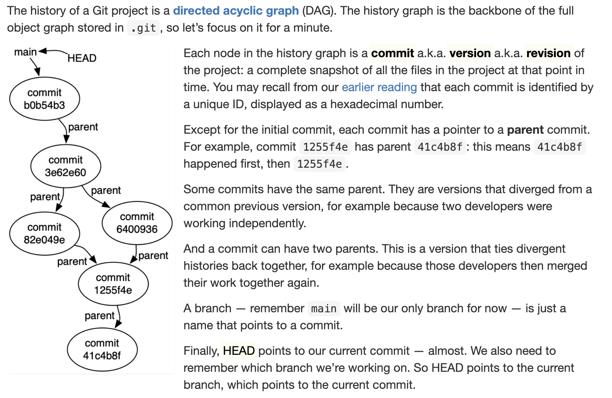
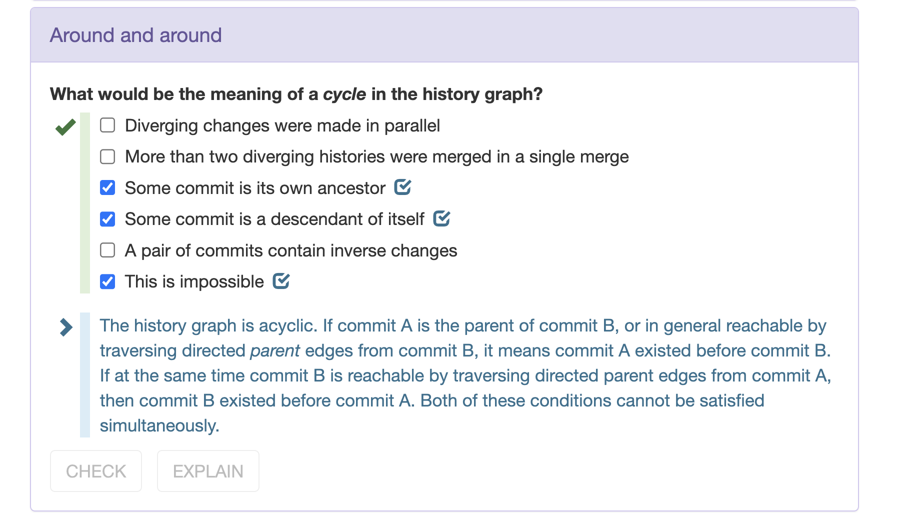
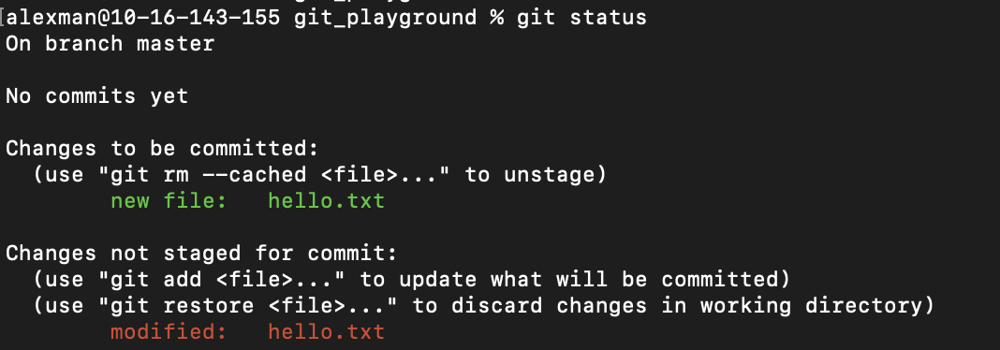
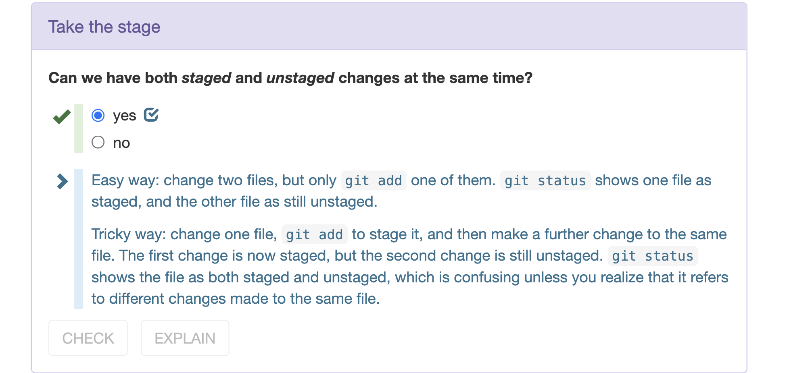
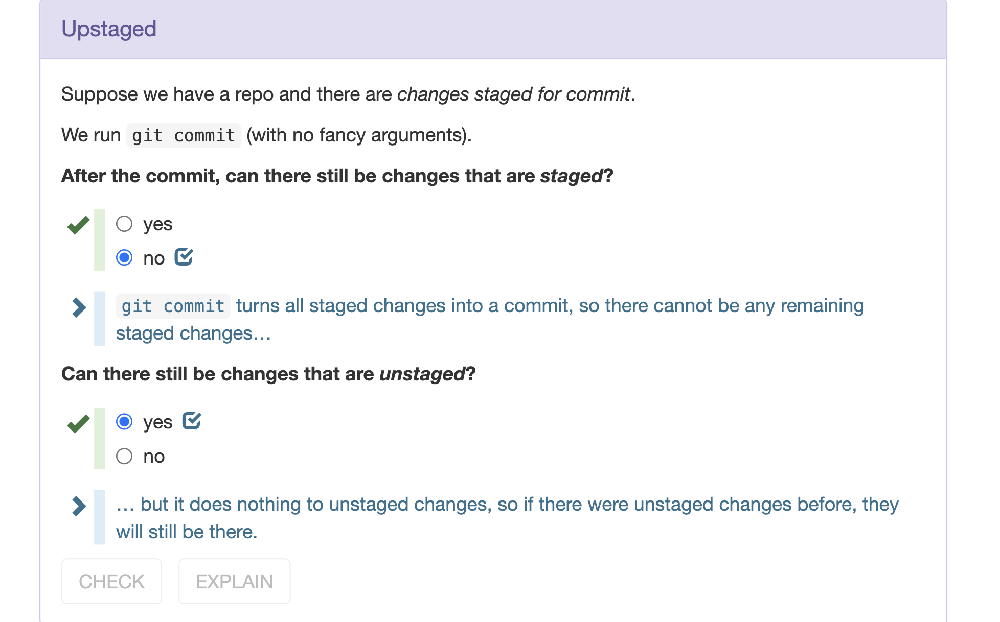
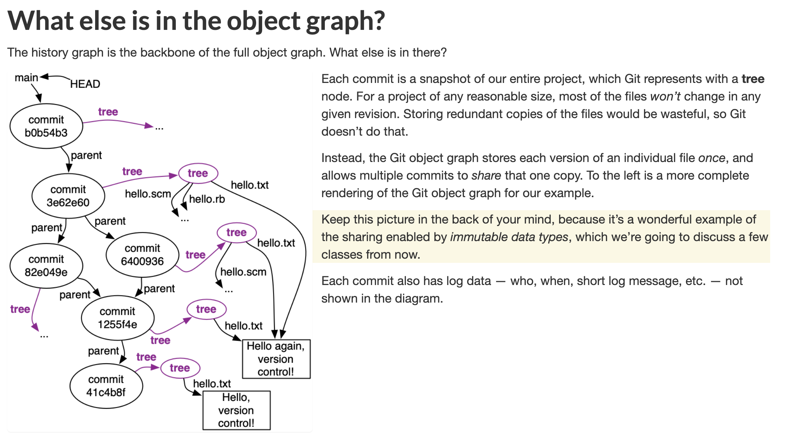

# Git Object Graph
## DAG Property
> [!def]
> 

# Git Operations
## Don'ts in the commit
> [!important]
> 1. Don't commit `java.class` file and only commit source codes.

## Staged and Unstaged
> [!important]
> 

## Sharing References Property
> [!important]
> 

# Useful Commands
## Git Log
> [!important]
> https://git-scm.com/book/en/v2/Git-Basics-Viewing-the-Commit-History
> 1. `git log --pretty=format:"%h %s" --graph`shows the DAG of a git's repository's commit history.
> 2. `git log -p -2` shows the last 2 commits with modification details with the granularity to the file content.
> 3. `git log -p filename` shows the same of a specific file.
> 4. `git log --stat` shows per commit how many insertions, deletions and number of files changed.
> 5. `git log filename` shows the modification history of the particular file.
> 6. `git log --name-status` is super useful, it's used to see 
> 	- how many new files have been added.
> 	- how many times existing files have been modified.
> 	- how many times a file is deleted.

## Git Show
> [!important]
> 1. `git show commitID` checks what the commit does compared with the last commit. In other words, only shows the difference.
> 2. `git show commitID:` shows the filenames in a particular commit.
> 3. `git show commitID:filename` checks the file content in a particular commit.