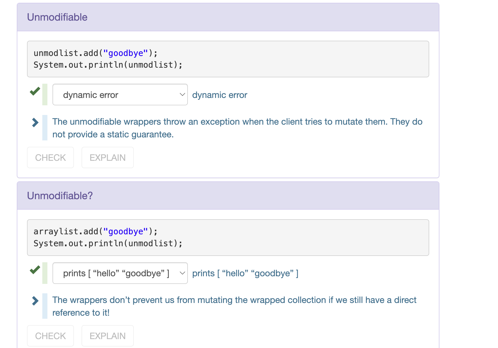

# String&StringBuilder
> [!def]
> `String` is immutable and `StringBuilder` is mutable.
> 
> When doing the following expansion:
> 
> - If we use `String`, lots of temporary copies will be created. The overall runtime is $O(1+2+\cdots, +n)=O(n^2)$.
> - If we use `StringBuilder`, the runtime is just $O(n)$.
> 
> 
> When Java implements `+`, it uses StringBuilder to minimize the copy operations.

# Date Object
> [!def]
> Since `Date` object is mutable, modifying its state here could cause program elsewhere to have undefined behaviors. 
> 
> `Aliasing` makes this problem even worse.
> 
> To avoid this, use `defensive copying`, which means when we want to return `Date` object from a method, return a copy of it. But this requires extra work. And also, it is also meaningless to modify a `Date` object, since we only need to read from it.

> [!important] java.time
> Never use `Date`, it is mutable and could cause lots of problems when we return it from a method or trying to modify its internal states.
> 
> Instead, try using `java.time.LocalDateTime` or `java.time.Instant` instead.
> 
> Actually, all the classes defined in `java.time` library are immutable.

# Iterators
> [!def]
> We should have at least two private fields:
> 1. The reference to the object to be iterated. This should be of `final` type since across the entire lifetime we should not reassign the reference of the iteratee.
> 2. The `index`, which marks the current position of the iterator.
> 
> And two instance method:
> 1. `hasNext()`: non-mutator method
> 2. `next()`: mutator method, will change `index` by one. (Change the internal state of the `Iterator Class`). 
> 3.

> [!property]
> `next()` has a precondition that `hasNext()` returns `true`, otherwise it will throw unchecked Exception `IndexOutOfBoundException`.
> 
> `next()` has two postcondition:
> 1. The return value must be the next element from the container.
> 2. The `this.index` must be advanced by one.

> [!bug] Caveats
> If we want to modify the iteratee while iterating through it, we should use `iter.remove()` instead of `iteratee.remove(...)`
> 
> The `Collection` Class ensures that when multiple iterators are iterating over the same object, it will throw unchecked exception `ConcurrentModificationException`

# Useful Immutability Types
> [!example]
> 

# Avoid Bugs With Immutability

# Assertions
> [!important]
> `assert` may be disabled by the IDE, so prevent code like `assert list.remove()`. If your IDE disables `assert`, `list.remove(elem)` won't be executed. 
> 
> So we'd better use `boolean flag = list.remove(...); assert flag;` so that no matter `assert` is disabled or not, the element will be removed from the list(if any).

> [!example]
> 

# Conclusion
> [!important]
> Returning a mutable object from a method is never safe!
> 

