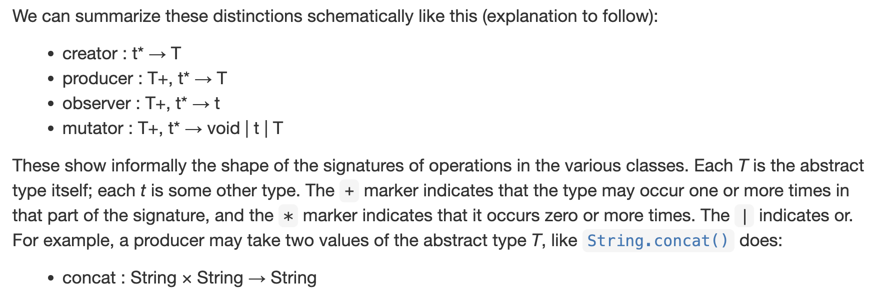
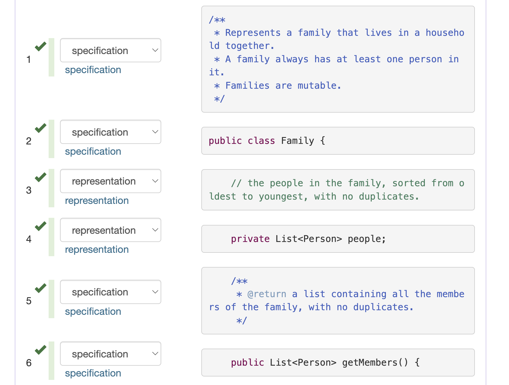
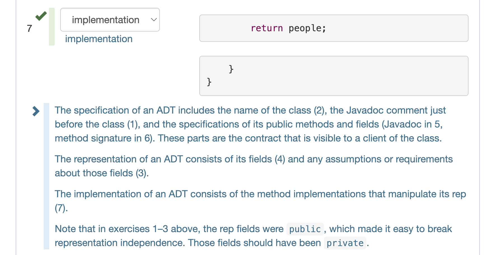
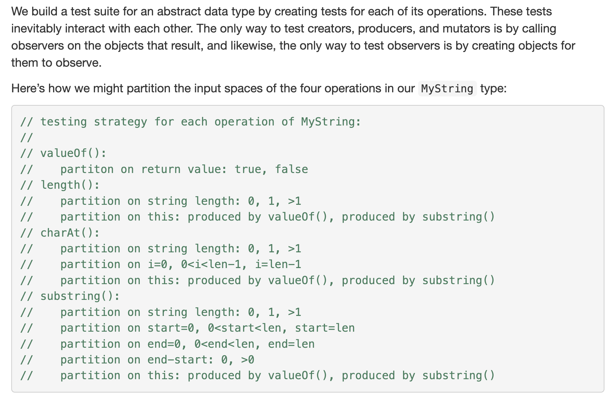
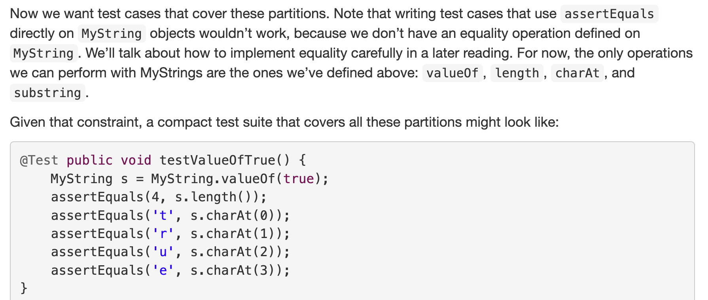
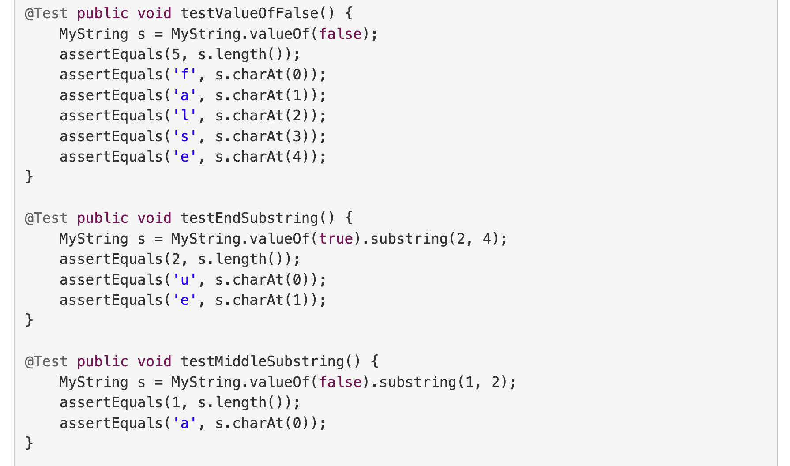
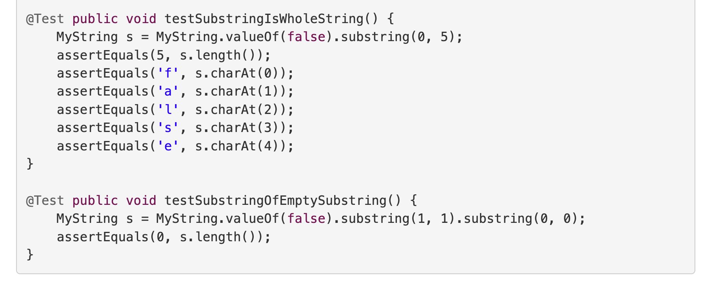
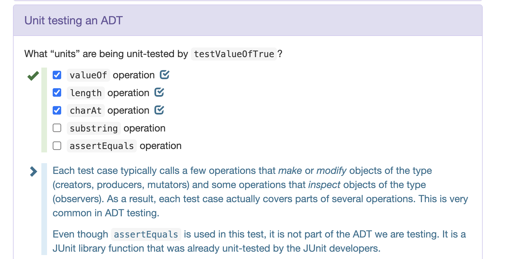
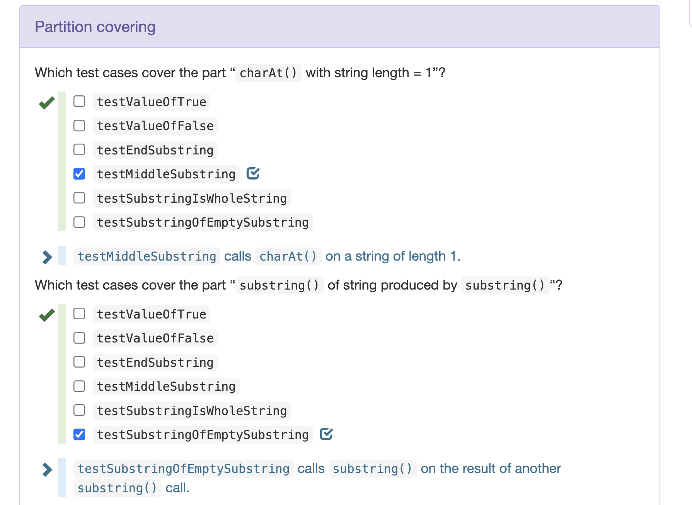
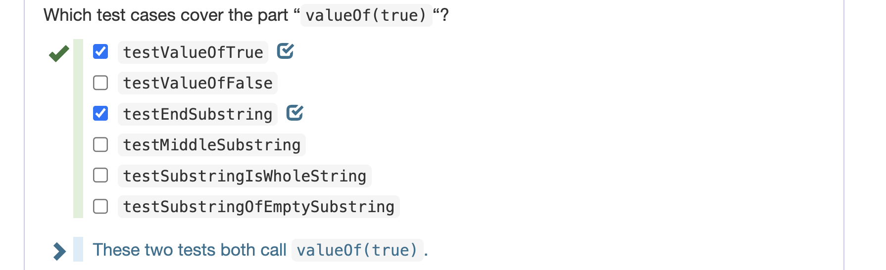

# Operations on ADTs
> [!def]
> The operations of an abstract type are classified as follows:
> - ==**Creators**== create new objects of the type. A creator may take values of other types as arguments, but not an object of the type being constructed. 
> 	- **Factory Method Design Pattern**: Call `new T()` inside of a static method, like `List.of(...)`
> 	- Used to create ADT objects.
> - ==**Producers**== also create new objects of the type, but require one or more existing objects of the type as input. The `concat` method of `String`, for example, is a producer: it takes two strings and produces a new string representing their concatenation.
> 	- Used to produce the objects of the same type as the caller.
> - ==**Observers**== take objects of the abstract type and return objects of a different type. The `size` method of `List`, for example, returns an `int`. 
> 	- It is used to inspect some of the properties of an object.
> - ==**Mutators**== change objects. The `add` method of `List`, for example, mutates a list by adding an element to the end.
> 
> 

# Components of ADTs
## Specifications
> [!def]
> The specification of an ADT includes:
> - The name of the class
> - The Javadoc comment just before the class
> - The specifications of its public methods and fields
> 
> These parts are the contract that is visible to a client of the class.

## Representation
> [!def]
> The representation of an ADT consists of:
> - Its fields and any assumptions or requirements about those fields.

## Implementations
> [!def]
> The implementation of an ADT consists of the method implementations that manipulate its representation.

## Example
> [!example]
> 

# Testing of ADTs
> [!def]
> 

