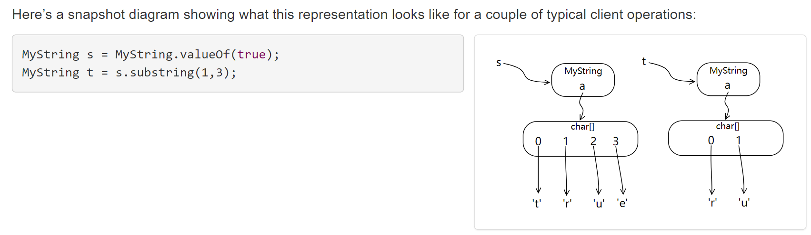
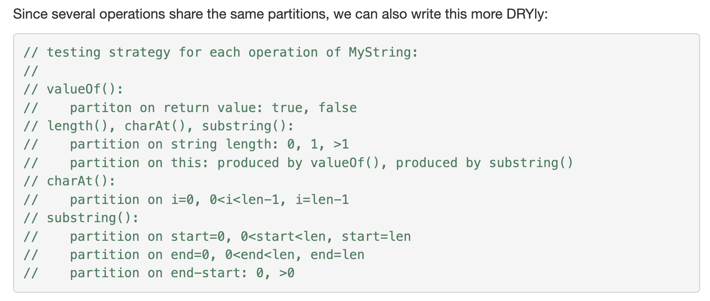

# Operations on ADTs
> [!def]
> The operations of an abstract type are classified as follows:
> - ==**Creators**== create new objects of the type. A creator may take values of other types as arguments, but not an object of the type being constructed. 
> 	- **Factory Method Design Pattern**: Call `new T()` inside of a static method, like `List.of(...)`
> 	- Used to create ADT objects.
> - ==**Producers**== also create new objects of the type, but require one or more existing objects of the type as input. The `concat` method of `String`, for example, is a producer: it takes two strings and produces a new string representing their concatenation.
> 	- Used to produce the objects of the same type as the caller.
> - ==**Observers**== take objects of the abstract type and return objects of a different type. The `size` method of `List`, for example, returns an `int`. 
> 	- It is used to inspect some of the properties of an object.
> - ==**Mutators**== change objects. The `add` method of `List`, for example, mutates a list by adding an element to the end.
> 
> 


# Components of ADTs
## Specifications
> [!def]
> The specification of an ADT includes:
> - The name of the class
> - The Javadoc comment just before the class
> - The specifications of its public methods and fields
> 
> These parts are the contract that is visible to a client of the class.

## Representation
> [!def]
> The representation of an ADT consists of:
> - Its fields and any assumptions or requirements about those fields.


## Implementations
> [!def]
> The implementation of an ADT consists of the method implementations that manipulate its representation.


## Example
> [!example]
> 


# Good ADTs Properties
## Representation Independence
> [!def]
> Critically, a good abstract data type should be ==**representation independent**==. This means that the use of an abstract type is independent of its representation (the actual data structure or data fields used to implement it), so that changes in representation have no effect on code outside the abstract type itself. 
> 
> **In other words, we can change the implementation of Tweet without affecting all the clients who are directly accessing those fields.**
> 
> For example, the operations offered by `List` are independent of whether the list is represented as a linked list or as an array.
> 
> As an implementer, you will only be able to safely change the representation of an ADT if its operations are fully specified with preconditions and postconditions, so that clients know what to depend on, and you know what you can safely change.


## String Design Example
### Specifications
> [!code]
```java
/** MyString represents an immutable sequence of characters. */
public class MyString { 

    //////////////////// Example of a creator operation ///////////////
    /**
     * @param b a boolean value
     * @return string representation of b, either "true" or "false"
     */
    public static MyString valueOf(boolean b) { ... }

    //////////////////// Examples of observer operations ///////////////
    /**
     * @return number of characters in this string
     */
    public int length() { ... }

    /**
     * @param i character position (requires 0 <= i < string length)
     * @return character at position i
     */
    public char charAt(int i) { ... }

    //////////////////// Example of a producer operation ///////////////    
    /** 
     * Get the substring between start (inclusive) and end (exclusive).
     * @param start starting index
     * @param end ending index.  Requires 0 <= start <= end <= string length.
     * @return string consisting of charAt(start)...charAt(end-1)
     */
    public MyString substring(int start, int end) { ... }

    /////// no mutator operations (why not?)
}
```

### Representation 1
> [!code]
> 
```java
/** MyString represents an immutable sequence of characters. */
public class MyString {

	private char[] a;

    public static MyString valueOf(boolean b) {
	    MyString s = new MyString();
	    s.a = b ? new char[] { 't', 'r', 'u', 'e' } 
	            : new char[] { 'f', 'a', 'l', 's', 'e' };
	    return s;
	}

    public int length() {
	    return a.length;
	}

    public char charAt(int i) {
	    return a[i];
	}
	
	public MyString substring(int start, int end) {
		MyString that = new MyString();
		that.a = new char[end - start];
		System.arraycopy(this.a, start, that.a, 0, end - start);
		return that;
	}

}
```
> [!bug] Low Efficiency
>   One problem with this implementation is that it’s passing up an opportunity for performance improvement. Because this data type is immutable, the `substring` operation doesn’t really have to copy characters out into a fresh array. 
>   
>   It could just point to the original `MyString` object’s character array and keep track of the start and end that the new substring object represents. In some versions of Java, the built-in `String` implementation does exactly this.

### Representation 2 - Optimized
> [!code]
> 
```java
public class MyString {

	private char[] a;
	private int start;
	private int end;
	
	public static MyString valueOf(boolean b) {
	    MyString s = new MyString();
	    s.a = b ? new char[] { 't', 'r', 'u', 'e' } 
	            : new char[] { 'f', 'a', 'l', 's', 'e' };
	    s.start = 0;
	    s.end = s.a.length;
	    return s;
	}
	
	public int length() {
	    return end - start;
	}
	
	public char charAt(int i) {
	  return a[start + i];
	}
	
	public MyString substring(int start, int end) {
	    MyString that = new MyString();
	    that.a = this.a;
	    that.start = this.start + start;
	    that.end = this.start + end;
	    return that;
	}
}
```


## Family Example
> [!example] Example 1
> 

> [!example] Example 2
> 

> [!example] Example 3
> 


# Invariants
> [!overview]
> An ==_invariant_== is a property of a program that is always true, for every possible runtime state of the program.


## Immutibility
> [!def]
> Immutability is one crucial invariant that we’ve already encountered: once created, an immutable object should always represent the same value, for its entire lifetime.


## Rep Exposure/Independence
> [!def]
> **Representation Exposure:** Code outside the class can modify the representation directly.
>  
>  **Representation Independence:** We can safely modify how we implement a class without affecting how clients can access the class's field and the clients can trust the specifications of the class that we give them to guide the usages.

> [!example] Example 1
> 

> [!example] Example 2
> 


## Statically-checked Invariants
> [!example]
> 


# Rep Invariants and Abstraction Function


# Testing of ADTs
> [!def]
> 


