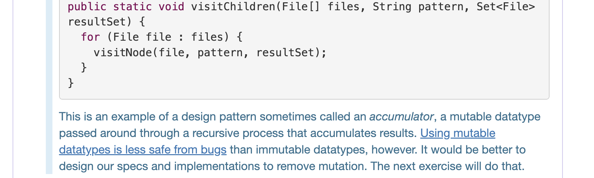

# Mutual Recursion
## Find the file with Patterns
> [!important]
> 

## Accumulator: Return All the Files
> [!important] Design Pattern: Accumulators
> This is an example of a design pattern sometimes called an _accumulator_, a mutable datatype passed around through a recursive process that accumulates results. 
> 
> Using mutable datatypes is less safe from bugs than immutable datatypes, however. It would be better to design our specs and implementations to remove mutation. The next exercise will do that.
> 
> According to [Methods Should Return Results, not Print Them](2_Code_Review_Principles.md#Methods%20Should%20Return%20Results,%20not%20Print%20Them), we want to modify the codes above:
> 

> [!example] Immutable Improvement
> 

## Reentrant Code
> [!concept]
> 

> 