# Program Validation
> [!concept]
> Testing is an example of a more general process called _validation_. The purpose of validation is to uncover problems in a program and thereby increase your confidence in the program's correctness. Validation includes:
> - **Formal reasoning** about a program, usually called _verification_. Verification constructs a formal proof that a program is correct. **Verification is tedious to do by hand**, and automated tool support for verification is still an active area of research. Nevertheless, small, crucial pieces of a program may be formally verified, such as the scheduler in an operating system, or the bytecode interpreter in a virtual machine, or [the filesystem in an operating system](http://www.csail.mit.edu/crash_tolerant_data_storage).
> - **Code review.** Having _somebody else carefully read your code, and reason informally about it_, can be a good way to uncover bugs. It's much like having somebody else proofread an essay you have written. We talked about code review in [another reading](https://openlearninglibrary.mit.edu/courses/course-v1:MITx+6.005.1x+3T2016/jump_to_id/vertical-reading-2-objectives).
> - **Testing**. Running the program on carefully selected inputs and checking the results.
> 
> **Even with the best validation, it's very hard to achieve perfect quality in software.** Here are some typical _residual defect rates_ (bugs left over after the software has shipped) per kloc (one thousand lines of source code):
> - 1 - 10 defects/kloc: Typical industry software.
> - 0.1 - 1 defects/kloc: High-quality validation. The Java libraries might achieve this level of correctness.
> - 0.01 - 0.1 defects/kloc: The very best, safety-critical validation. NASA and aerospace companies can achieve this level.
> 
> **This can be discouraging for large systems.** For example, if you have shipped a million lines of typical industry source code (1 defect/kloc), it means you missed 1000 bugs!

# Why Software Testing is Hard
> [!concept]
> Here are some approaches that unfortunately don't work well in the world of software.

## Exhaustive Testing
> [!concept]
> **Exhaustive testing**, also called brute force testing or complete testing is a software testing technique in which all possible combinations of scenarios and inputs are tested to confirm that a software system functions properly under every possible situation.
> **Exhaustive testing is infeasible**. The space of possible test cases is generally too big to cover exhaustively. Imagine exhaustively testing a 32-bit floating-point multiply operation, `a*b`. There are 2^64 test cases!

## Haphazard Testing
> [!concept]
> **Haphazard testing** (“just try it and see if it works”) is less likely to find bugs, unless the program is so buggy that an arbitrarily-chosen input is more likely to fail than to succeed. It also doesn't increase our confidence in program correctness.

> [!example]
> 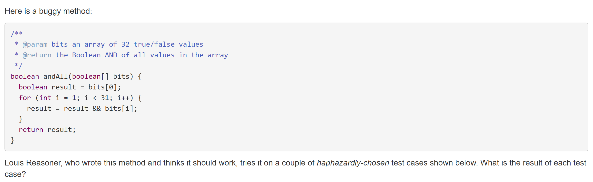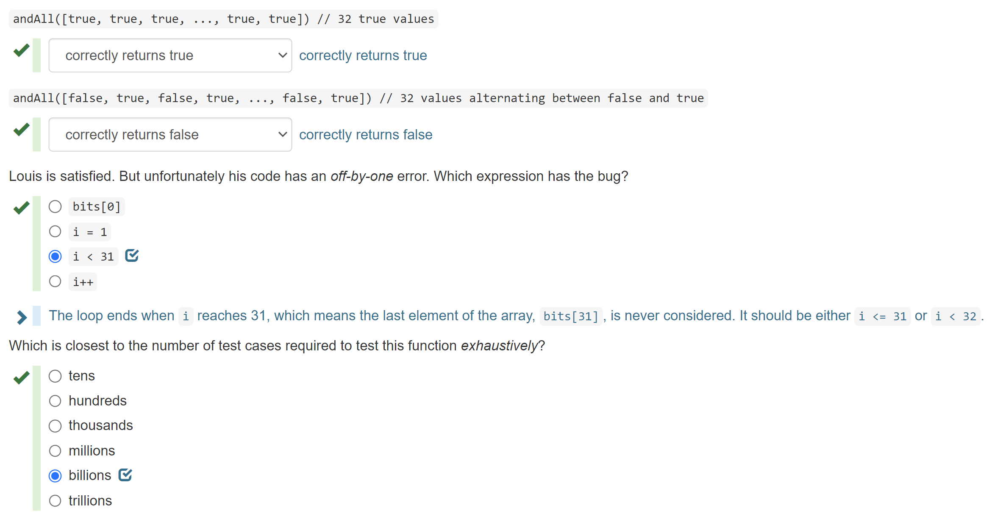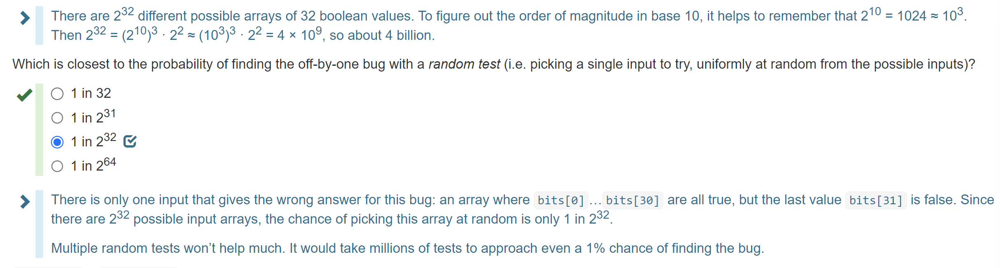

## Random or Statistical Testing
> [!concept]
> **Random or statistical testing** doesn't work well for software. Other engineering disciplines can test small random samples (e.g. 1% of hard drives manufactured) and infer the defect rate for the whole production lot. 
> - **Physical systems** can use many tricks to speed up testing time, like opening a refrigerator 1000 times in 24 hours instead of 10 years. These tricks give known failure rates (e.g. mean lifetime of a hard drive), but they **assume continuity or uniformity across the space of defects.** This is true for physical artifacts. 
> - But **it's not true for software.** Software behavior varies discontinuously and discretely across the space of possible inputs. **Although the system may seem to work fine across a broad range of inputs, it could still abruptly fail at a single boundary point.** The [famous Pentium division bug](http://www.willamette.edu/~mjaneba/pentprob.html) affected approximately 1 in 9 billion divisions. Stack overflows, out of memory errors, and numeric overflow bugs tend to happen abruptly, and always in the same way, not with probabilistic variation. That's different from physical systems, where there is often visible evidence that the system is approaching a failure point (cracks in a bridge) or failures are distributed probabilistically near the failure point (so that statistical testing will observe some failures even before the point is reached). Instead, test cases must be chosen carefully and systematically, and that's what we'll look at next.

## Case Study
> [!example]
> 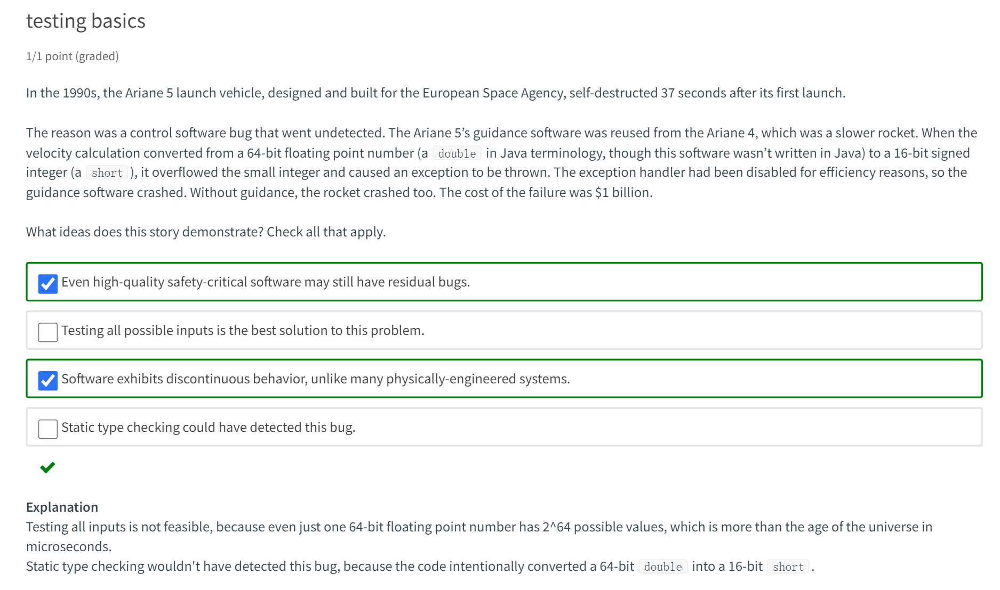

# Test-first Programming
## Concepts
> [!concept]
> Before we dive in, we need to define some terms:
> - A ==_module_== is a part of a software system that can be designed, implemented, tested, and reasoned about separately from the rest of the system. In this reading, we’ll focus on modules that are functions, represented by Java methods. In future readings we’ll broaden our view to think about larger modules, like a class with multiple interacting methods.
> - A ==_specification_== (or spec) describes the behavior of a module. For a function, the specification gives the types of the parameters and any additional constraints on them (e.g. `sqrt`’s parameter must be nonnegative). It also gives the type of the return value and how the return value relates to the inputs. **In Java code, the specification consists of the _method signature_ and _the comment above it_ that describes what it does.**
> - A module has an ==_implementation_== that provides its behavior, and ==_clients_== that use the module. For a function, the implementation is the body of the method, and the clients are other code that calls the method. The specification of the module constrains both the client and the implementation. We’ll have much more to say about specifications, implementations, and clients a few classes from now.
> - A ==_test case_== is a particular choice of inputs, along with the expected output behavior required by the specification.
> - A ==_test suite_== is a set of test cases for a module.
> 
> You’ve already seen and used these concepts on problem set 0. You were given some specifications for Java methods and asked to write an implementation for each one. You were also given a test suite for each method that you could run to see if your implementation obeyed the spec.
> 
> It turns out that this is a good pattern to follow when designing a program from scratch. In ==_test-first programming_==, you write the spec and the tests before you even write any code. The development of a single function proceeds in this order:
> - **Spec**: Write a specification for the function.
> - **Test**: Write tests that exercise the specification.
> - **Implement**: Write the implementation.
> 
> Once your implementation passes the tests you wrote, you’re done.
> 
> The biggest benefit of test-first programming is safety from bugs. Don’t leave testing until the end of development, when you have a big pile of unvalidated code. Leaving testing until the end only makes debugging longer and more painful, because bugs may be anywhere in your code. It’s far more pleasant to test your code as you develop it.

## Example
> [!example]
> 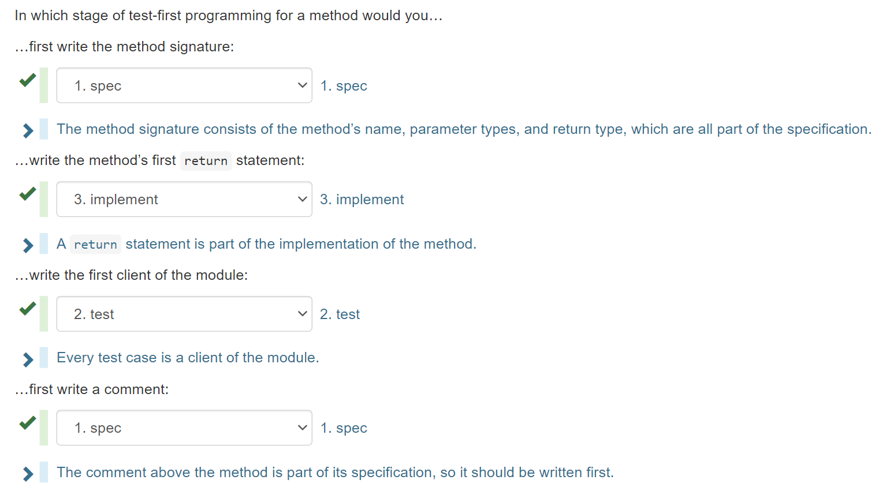

# Systematic Testing
## Concepts
> [!concept]
> Rather than exhaustive, haphazard, or randomized testing, we want to test _systematically_. ==Systematic testing== means that we are choosing test cases in a principled way, with the goal of designing a test suite with three desirable properties:
> - **Correct**. A correct test suite is a legal client of the specification, and it accepts all legal implementations of the spec without complaint. This gives us the freedom to change how the module is implemented internally without necessarily having to change the test suite. 
> 	- A correct test suite should accept any legal implementation, which means all its test cases have to pass. In other words, as long as the implementations follow what the spec says, then all the test cases should pass. 
> 	- Correctness only cares about the legal implementations of the spec and only have to ensure that all these legal implementations pass the test cases. If the implementation doesn't follow the spec, then the even is some of the test cases fail, it is still correct, but may not be thorough.
> 	- Failing on buggy implementations is also desirable, of course, but that is thoroughness, not correctness.
> - **Thorough**. A thorough test suite finds actual bugs in the implementation, caused by mistakes that programmers are likely to make.
> 	- T1 can be larger than T2 without being more thorough – redundant test cases in T1 can find the same bugs, or even fewer bugs than T2.
> 	- But if T1 rejects a superset of buggy implementations compared to T2, then T1 is more thorough than T2.
> 	- If T1 accepts more legal implementations than T2, then T1 may be correct, and T2 certainly is incorrect. However, this does not speak to their relative _thoroughness_.
> - **Small**. A small test suite, with few test cases, is faster to write in the first place, and easier to update if the specification evolves. Small test suites are also faster to run. You will be able to run your tests more frequently if your test suites are small and fast.
> 
> **By these criteria:**
> - _Exhaustive testing_ is _thorough_ but infeasibly large. 
> - _Haphazard testing_ tends to be _small_ but _not thorough_. 
> - _Randomized testing_ can achieve thoroughness only at the cost of large size.
> 
> Designing a test suite for both thoroughness and small size requires having the right attitude. Normally when you’re coding, your goal is to make the program work. But as a test suite designer, you want to _make it fail_. That’s a subtle but important difference. A good tester intentionally pokes at all the places the program might be vulnerable, so that those vulnerabilities can be eliminated.
> 
> The need to adopt a testing attitude is another argument for test-first programming. It is all too tempting to treat code you’ve already written as a precious thing, a fragile eggshell, and test it very lightly just to see it work. For _thorough_ testing, though, you have to be brutal. Test-first programming allows you to put on your testing hat, and adopt that brutal perspective, before you’ve even written any code.

## Example
> [!example]
> 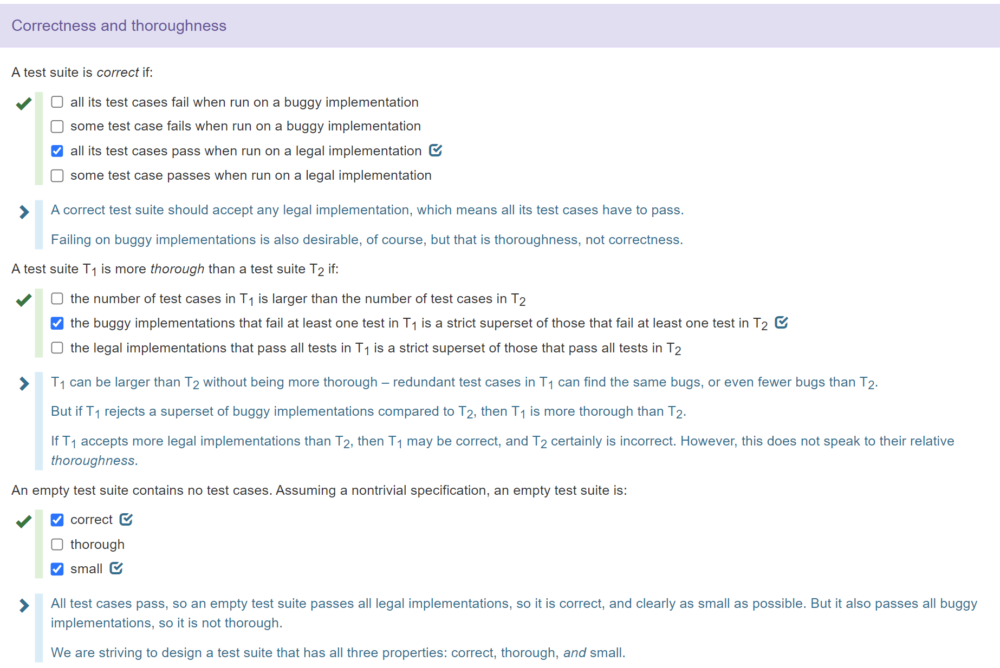

# Testcases Design Principles
## Choosing Test Cases by Partitioning
### Concepts
> [!concept]
> Creating a good test suite is a challenging and interesting design problem. We want to pick a set of test cases that is small enough to run quickly, yet large enough to validate the program.
> 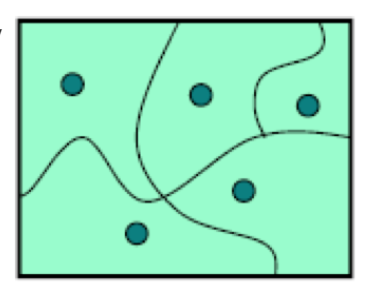
> To do this, we divide the input space into **subdomains**, each consisting of a set of inputs. Taken together, the subdomains form a ==_partition_==: a collection of ==_disjoint_== sets that _completely covers_ the input space, so that every input lies in exactly one subdomain. Then we choose one test case from each subdomain, and that’s our test suite.
> - **Disjointness:** This means the intersection of subdomains should be empty set.
> - **Completeness:** This means the union of subdomains should be the entire input space or even be a superset of the input space.
> - **Correctness:** This means all the partitions that you define should be legal subdomain of input, which means that all the partitions should be subset of the input space.
> 
> **The idea behind subdomains is to partition the input space into sets of similar inputs on which the program has similar behavior.** Then we use one representative of each set. This approach makes the best use of limited testing resources by choosing dissimilar test cases, and forcing the testing to explore parts of the input space that random testing might not reach.
> 
> We can also partition the output space into subdomains (similar outputs on which the program has similar behavior) if we need to ensure our tests will explore different parts of the output space. Most of the time, partitioning the input space is sufficient.

### abs() example
> [!example]
> 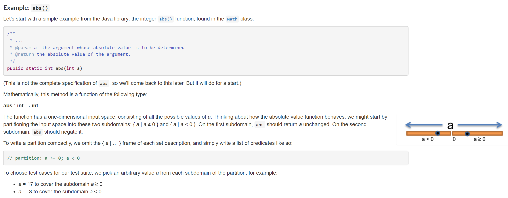

### max() example
> [!example]
> 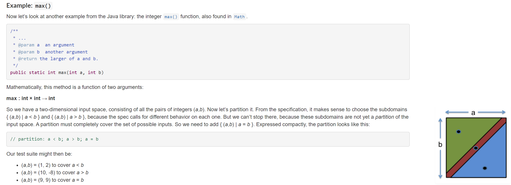

### sqrt() example
> [!example]
> 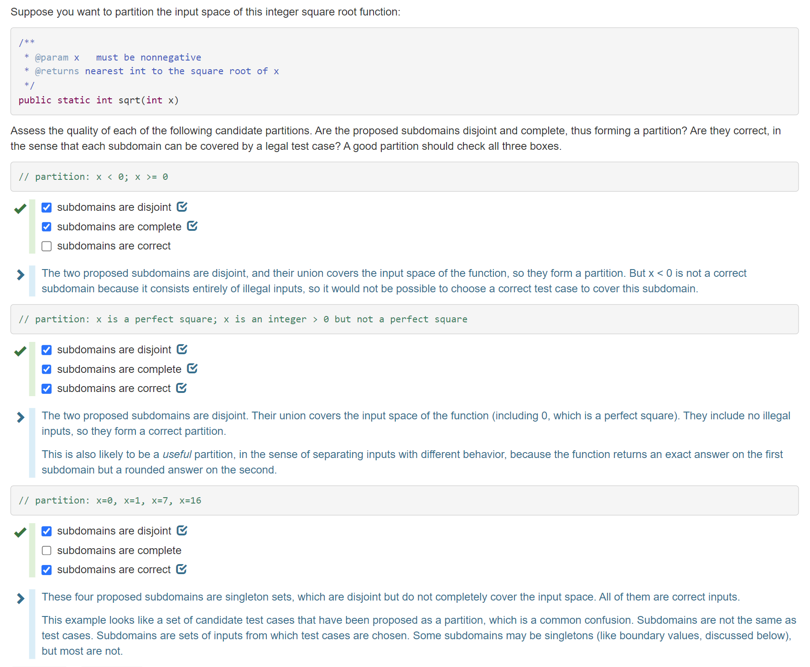

### gcd() example
> [!example]
> 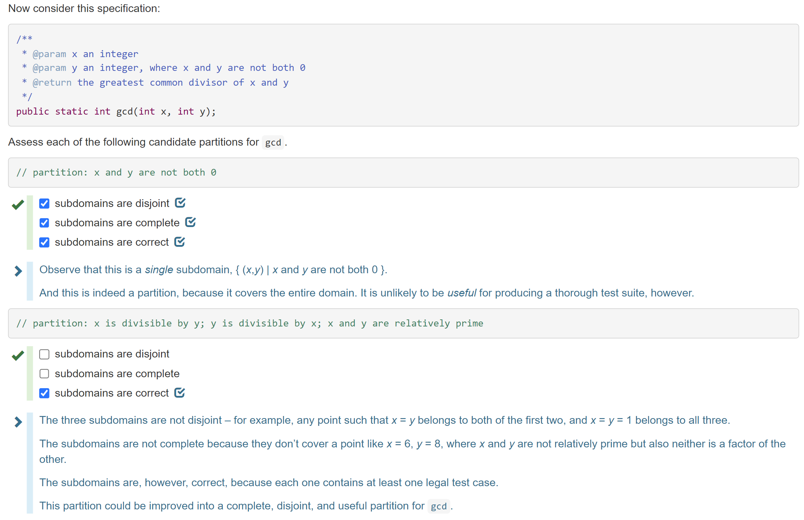

## Including Boundaries in the Partitions
### Concepts
> [!concept]
> Bugs often occur at ==_boundaries_== between subdomains. Some examples:
> - 0 is a boundary between positive numbers and negative numbers
> - The maximum and minimum values of numeric types, like `int` or `double`
> - Emptiness for collection types, like the empty string, empty list, or empty set
> - The first and last element of a sequence, like a string or list
>  
> Why do bugs often happen at boundaries? One reason is that programmers often make **off-by-one mistakes**, like writing `<=` instead of `<`, or initializing a counter to 0 instead of 1. Another is that some boundaries may need to be handled as special cases in the code. Another is that boundaries may be places of discontinuity in the code’s behavior. When an `int` variable grows beyond its maximum positive value, for example, it abruptly becomes a negative number.

### abs() can return negatives
> [!important]
> 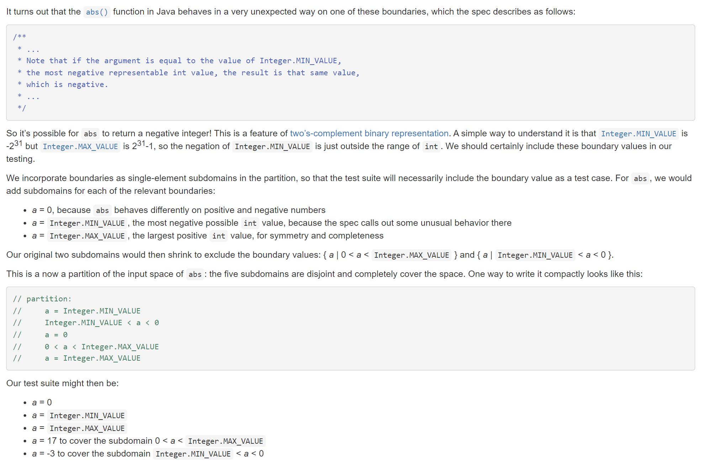

### String Example
> [!example]
> 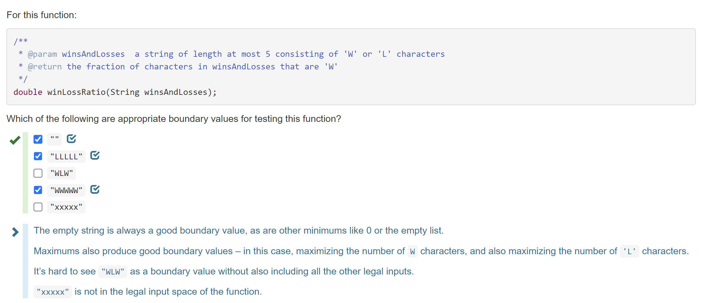

## Multiple Partitions vs One Partitions
### One Partition
> [!concept]
> 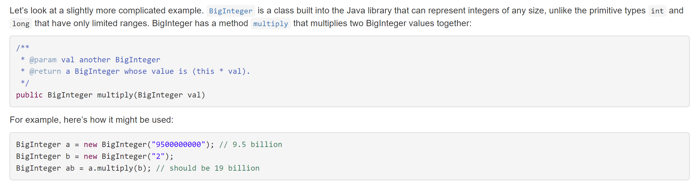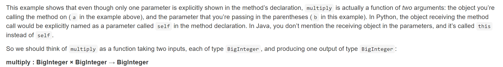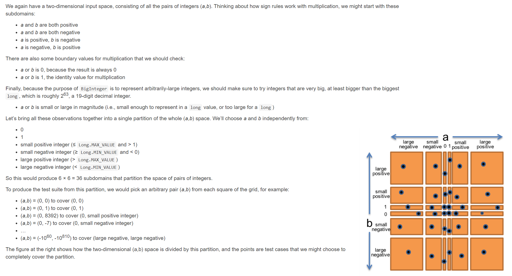
> **Remarks:**
> - Multiple Partitions here mean that we create a independent partition on each input and these partitions don't have any interaction with each other. It's like the marginal distribution in probability.
> 	- Aims to use as few test cases as possible to cover more subdomains from multiple partitions.
> 	- Aims to be small and efficient.
> - Single Partitions are shown above where we divide the input space as precisely as possible, it's like joint distribution in probability.
> 	- Aims to be thorough.

> [!example]
> 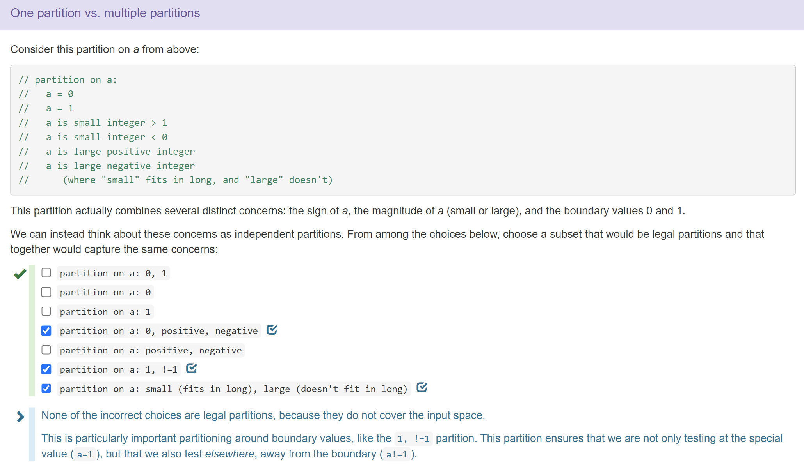

### Multiple Partitions
> [!concept]
> 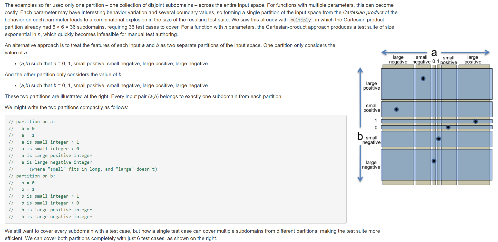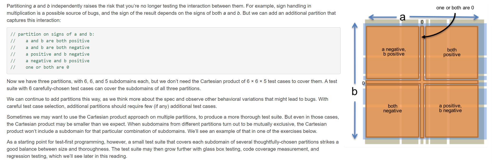

> [!example]
> 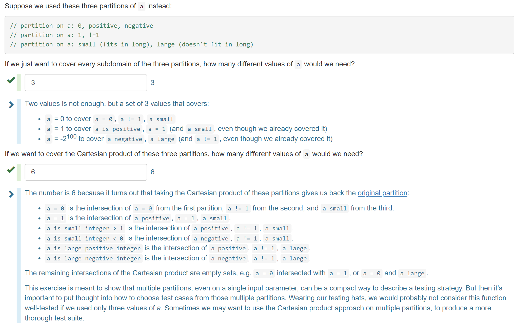

## Partitions expressed on Outputs
> [!concept]
> 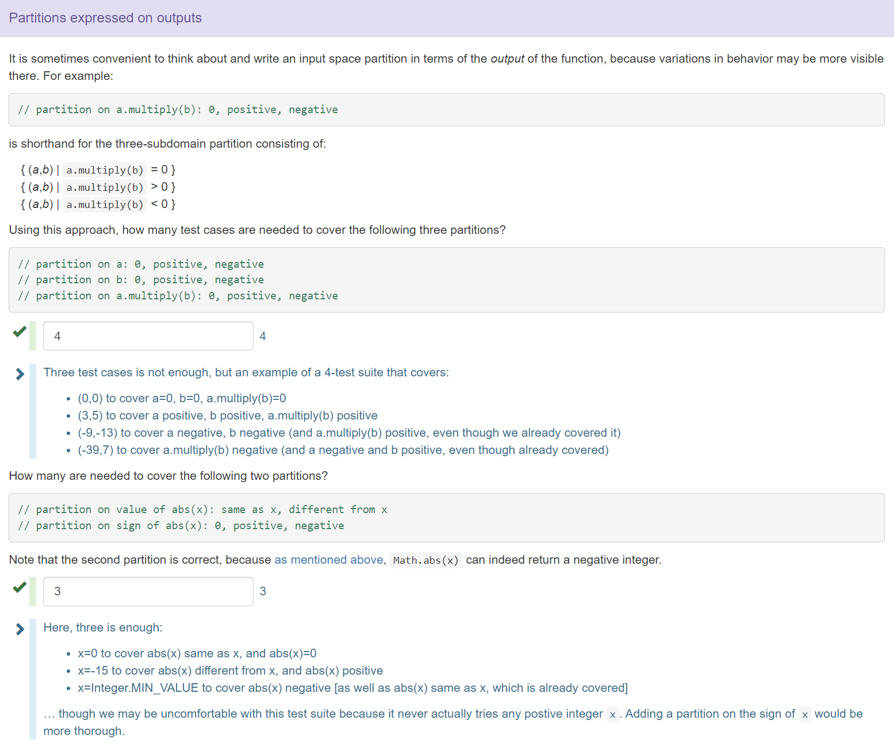

# Testcases Design Examples
## BigInteger Multiplication Example
### Step 1: Determine Input Space Dimension
> [!important] BigInteger Multiplication
> 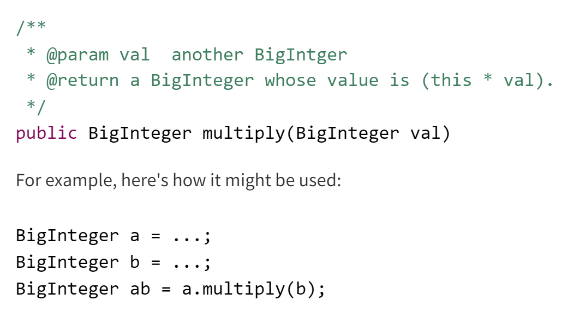
> [`BigInteger`](http://docs.oracle.com/javase/8/docs/api/?java/math/BigInteger.html) is a class built into the Java library that can represent integers of any size, unlike the primitive types `int` and `long` that have only limited ranges. BigInteger has a method `multiply` that multiplies two BigInteger values together.
> - Even though only one parameter is explicitly shown in the method's declaration, `multiply` is actually a function of _two_ arguments: the object you're calling the method on (`a` in the example above), and the parameter that you're passing in the parentheses (`b` in this example). 
> - In Python, the object receiving the method call would be explicitly named as a parameter called `self` in the method declaration. In Java, you don't mention the receiving object in the parameters, and it's called `this` instead of `self`.
> - So we should think of `multiply` as a function taking two inputs, each of type `BigInteger`, and producing one output of type `BigInteger`:**`multiply : BigInteger × BigInteger → BigInteger`**

### Step 2: Partition the Input Space
> [!concept]
> So we have a **two-dimensional input space**, consisting of all the pairs of integers (a,b). Now let's partition it. Thinking about how multiplication works, we might start with these partitions:
> - a and b are both positive
> - a and b are both negative
> - a is positive, b is negative
> - a is negative, b is positive
> There are also some special cases for multiplication that we should check: 0, 1, and -1.
> - a or b is 0, 1, or -1
> 
> Finally, as a suspicious tester trying to find bugs, we might suspect that the implementor of BigInteger might try to make it faster by using `int` or `long` internally when possible and only fall back on an expensive general representation (like a list of digits) when the value is too big. So we should definitely also try integers that are very big, bigger than the biggest `long`.
> - a or b is small
> - the absolute value of a or b is bigger than `Long.MAX_VALUE`, the biggest possible primitive integer in Java, which is roughly 2^63.
> 
> Let's bring all these observations together into a straightforward partition of the whole `(a,b)` space. We'll choose `a` and `b` independently from:
> - 0
> - 1
> - -1
> - small positive integer
> - small negative integer
> - huge positive integer
> - huge negative integer
> 
> So this will produce 7 × 7 = 49 partitions that completely cover the space of pairs of integers.

### Step 3: Produce Test Suite
> [!important]
> To produce the test suite, we would pick an arbitrary pair (a,b) from each square of the grid, for example:
> - (a,b) = (-3, 25) to cover (small negative, small positive
> - (a,b) = (0, 30) to cover (0, small positive)
> - (a,b) = (2^100, 1) to cover (large positive, 1)
> - etc.
> 
> The figure shows how the two-dimensional (a,b) space is divided by this partition, and the points are test cases that we might choose to completely cover the partition.
> 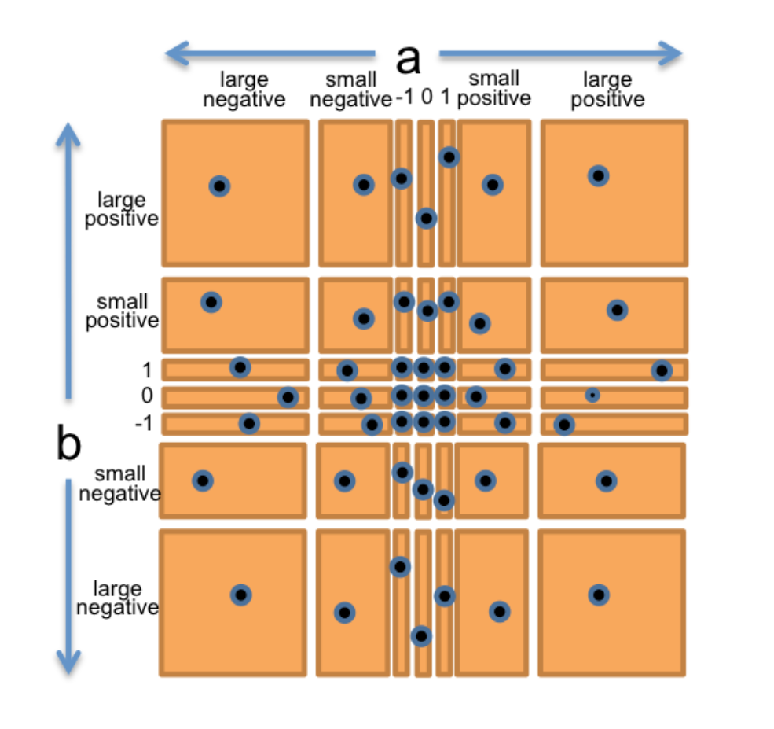

## Max() Function Example
> [!code]
> 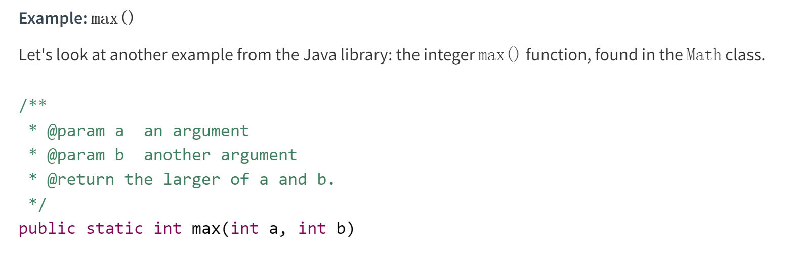

### Step 1: Determine Input Space
> [!concept]
> The input space is very clear here, just two arguments:
> 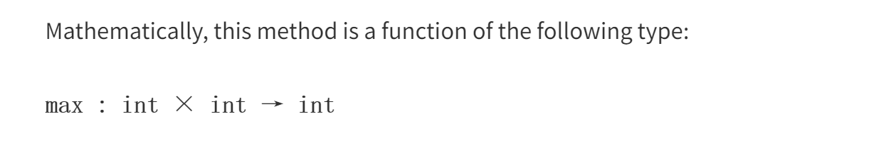

### Step 2: Partion the Input Space
> [!concept] Design
> 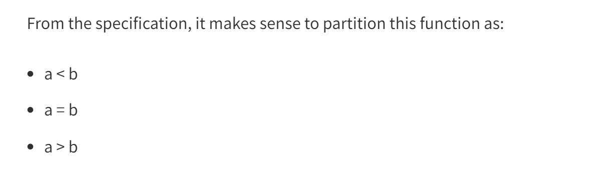

### Step 3: Produce Test Suite
> [!concept]
> 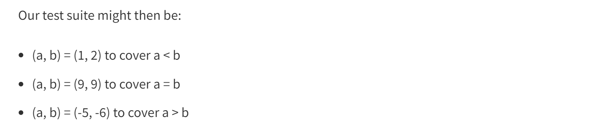

### Step 4: Include Boundaries in the Partition
> [!important]
> 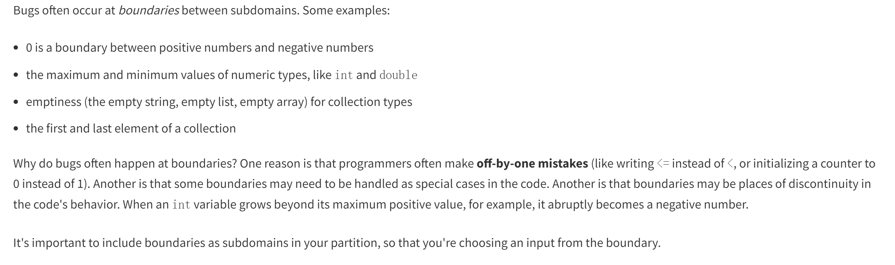

### Step 5: Redo Partition and Test Suite
> [!concept]
> 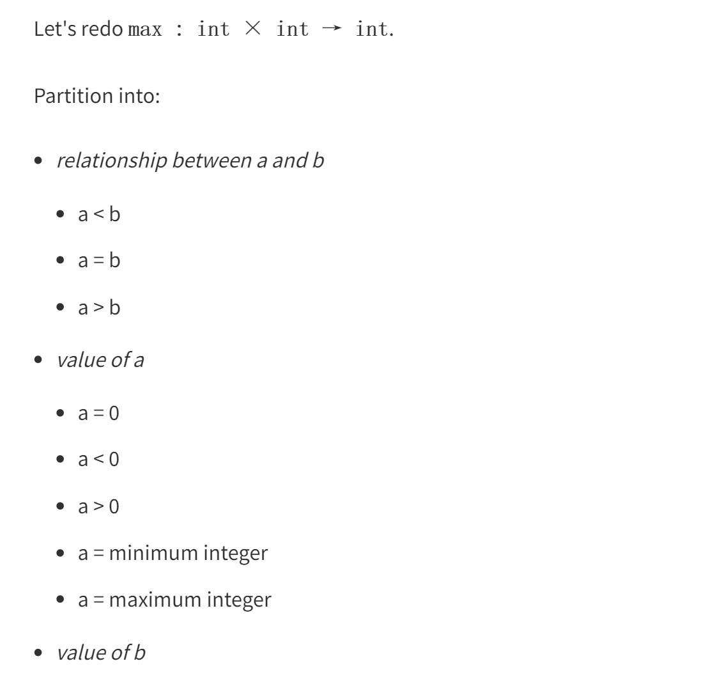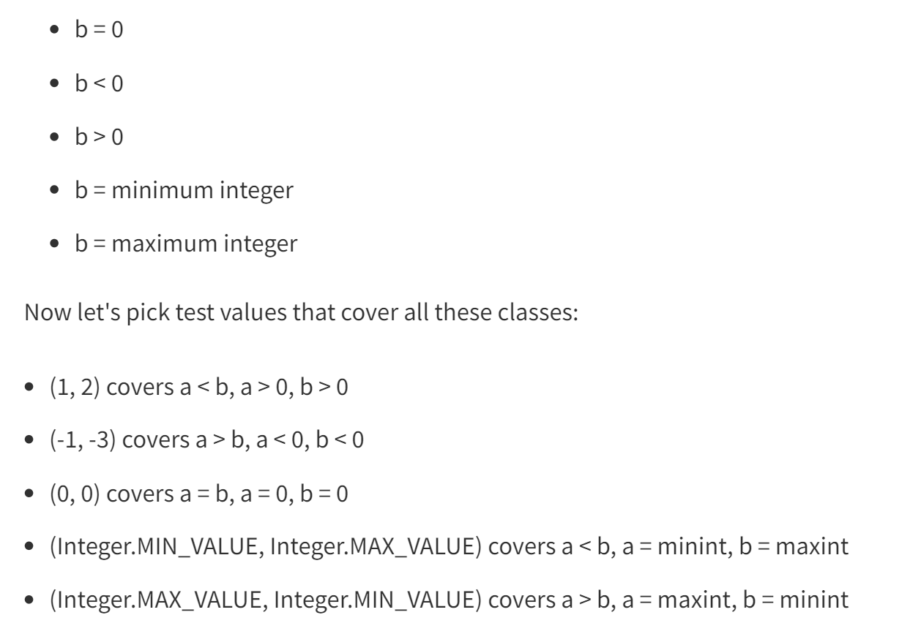

## String Example
> [!example]
> 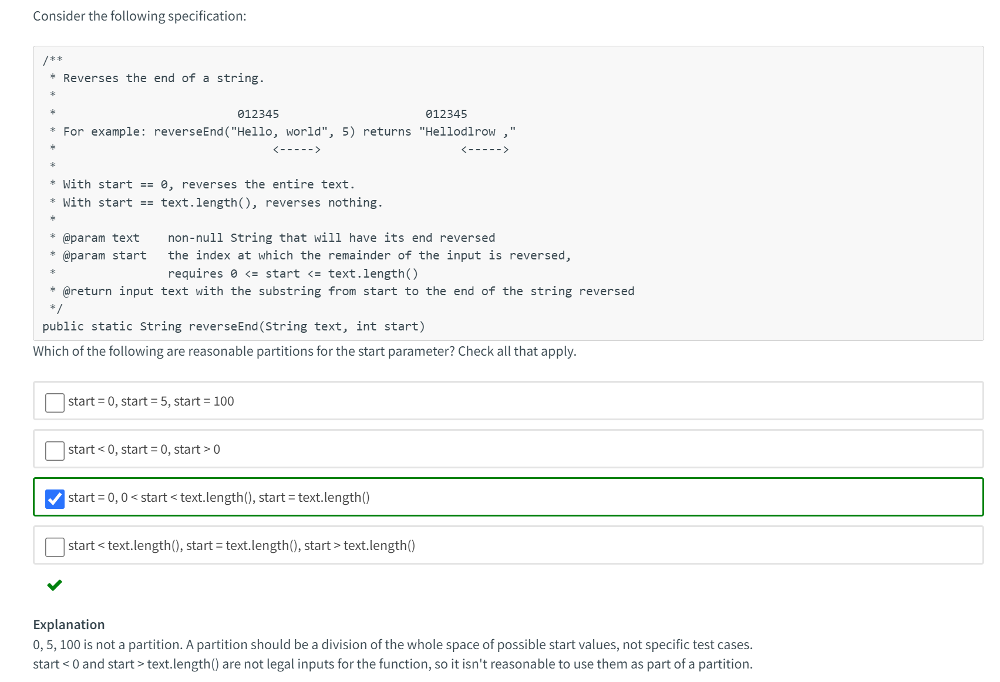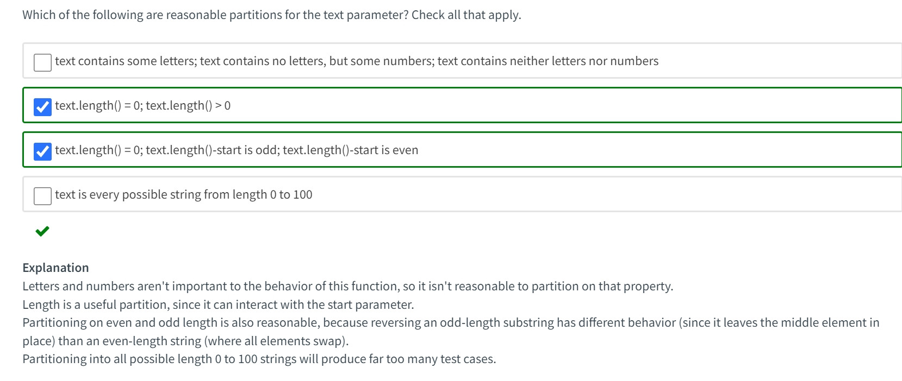
> **Remarks:**
> - Here the option 1 basically partition the input space into three subdomains, strings with letters, strings without letters(in which subpartitioned into whether strings can have numbers), but we don't care about the components of the string, we only care about the length of the string.
> - Option 4 clearly doesn't add up to the whole input domain and even within this partition, we will have to design at least 100 test cases, which is a bit too much.

# Blackbox and Whitebox Testing
## Concepts
> [!def]
> Recall from above that the _specification_ is the description of the function's behavior — the types of parameters, type of return value, and constraints and relationships between them.
> - **Blackbox testing** means **choosing test cases only from the specification, not the implementation of the function.** In other words, black box testing validates the spec by exploring its behavior and writing clients (test cases).
> - **Whitebox testing** (also called glass box testing) means choosing test cases with knowledge of how the function is actually implemented. For example, if the implementation selects different algorithms depending on the input, then you should partition according to those domains. If the implementation keeps an internal cache that remembers the answers to previous inputs, then you should test repeated inputs.
> 
> When doing whitebox testing, you must take care that your test cases don't _require_ specific implementation behavior that isn't specifically called for by the spec. For example, if the spec says “throws an exception if the input is poorly formatted,” then your test shouldn't check _specifically_ for a NullPointerException just because that's what the current implementation does. The specification in this case allows _any_ exception to be thrown, so your test case should likewise be general to preserve the implementor's freedom. We'll have much more to say about this in the class on specs.

## Example
> [!example]
> 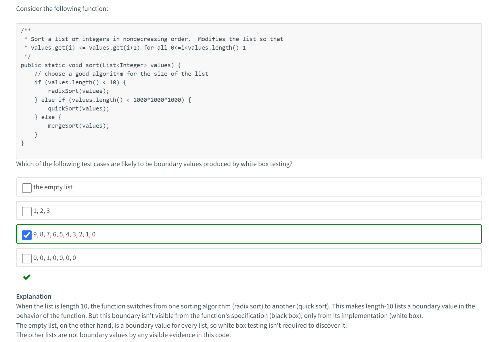
> **Remarks:**
> Here the empty list is actually a boundary case for black box testing since from the spec we can infer that if the input list is empty, then getting ith index will throw an error.

# Documenting Your Testing Strategy
## Documentation Example
> [!important]
> 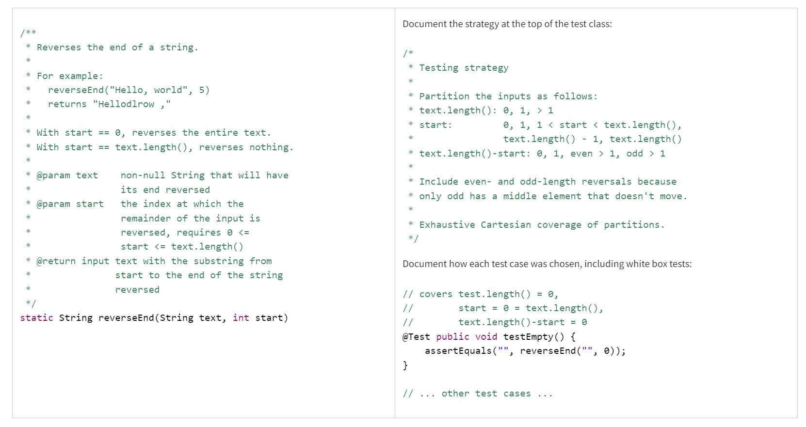
> It’s a good idea to write down the testing strategy you used to create a test suite: the partitions, their subdomains, and which subdomains each test case was chosen to cover. Writing down the strategy makes the thoroughness of your test suite much more visible to the reader.
> 
> 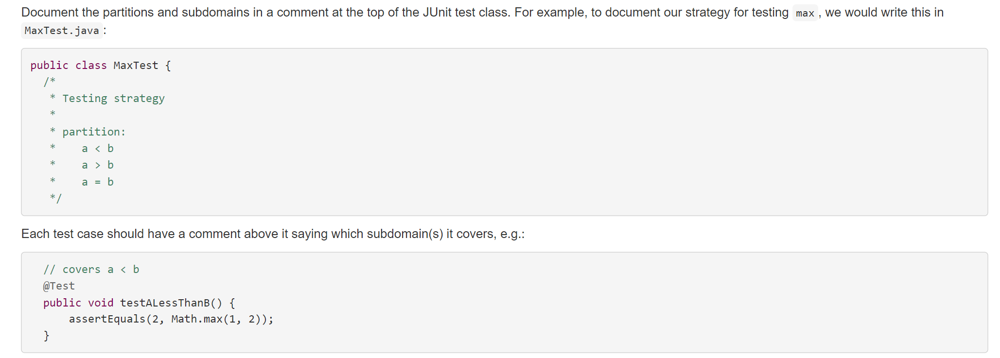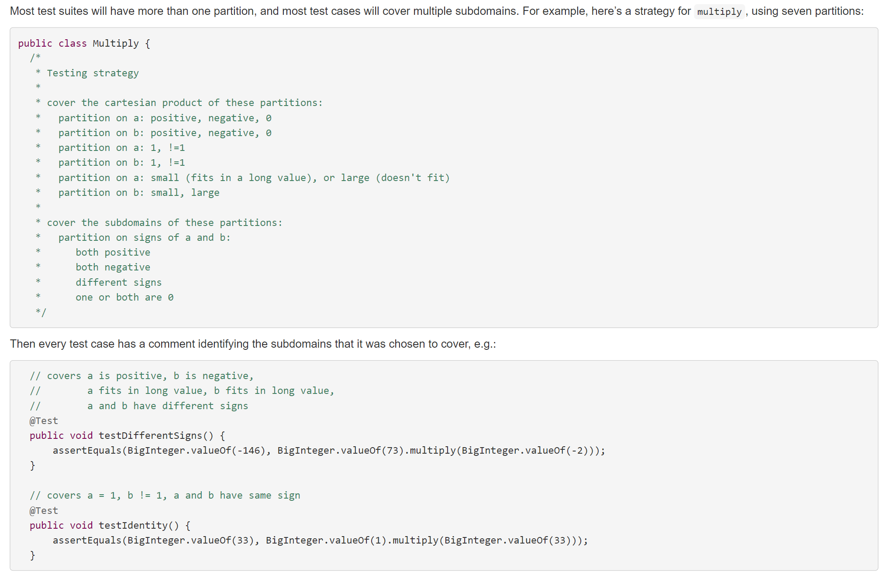

> [!example]
> 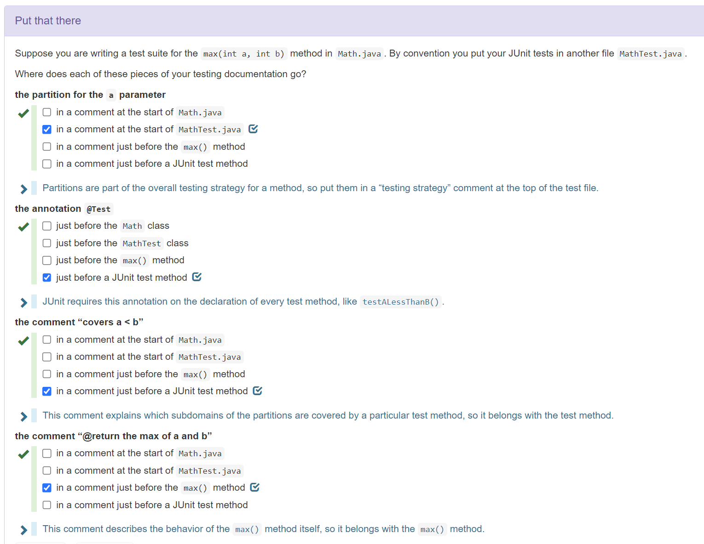

## Coverage
> [!def]
> One way to judge a test suite is to ask how thoroughly it exercises the program. This notion is called _coverage_. There are three common kinds of coverage:
> - **Statement coverage**: is every statement run by some test case?
> - **Branch coverage**: for every `if` or `while` statement in the program, are both the true and the false direction taken by some test case?
> - **Path coverage**: is every possible combination of branches — every path through the program — taken by some test case?
> 
> Branch coverage is stronger (requires more tests to achieve) than statement coverage, and path coverage is stronger than branch coverage. In industry, 100% statement coverage is a common goal, but even that is rarely achieved due to unreachable defensive code (like “should never get here” assertions). 100% branch coverage is highly desirable, and safety critical industry code has even more arduous criteria (e.g., “MCDC,” modified decision/condition coverage). **Unfortunately 100% path coverage is infeasible, requiring exponential-size test suites to achieve.**
> 
> **A standard approach to testing is to add tests until the test suite achieves adequate statement coverage**: i.e., so that every reachable statement in the program is executed by at least one test case. In practice, statement coverage is usually measured by a code coverage tool, which counts the number of times each statement is run by your test suite. With such a tool, white box testing is easy; you just measure the coverage of your black box tests, and add more test cases until all important statements are logged as executed.

## EclEmma - Test Coverage Tool
> [!example]
> A good code coverage tool for Eclipse is [EclEmma](http://www.eclemma.org/), shown below:
> 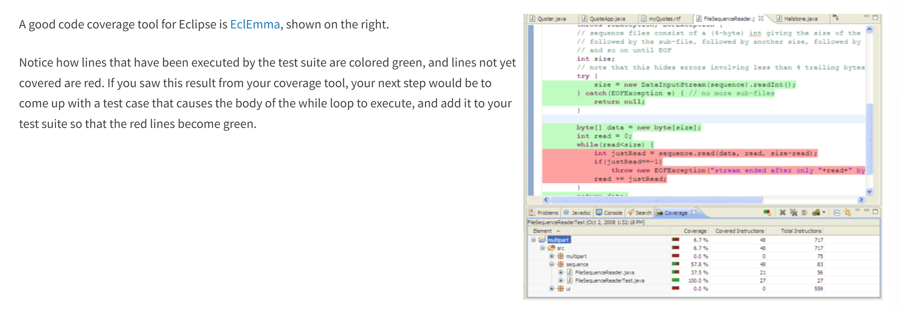
> In EclEmma:
> - A line that has been executed by the test suite is colored green
> - A line not yet covered is red. 
> - A line containing a branch that has been executed in only one direction – always true but never false, or vice versa – is colored yellow.
> - If you saw the result below from your coverage tool, your next step would be to come up with a test case that causes the `if` test to be true at least once, and add it to your test suite so that the yellow and red lines become green.
> 
> 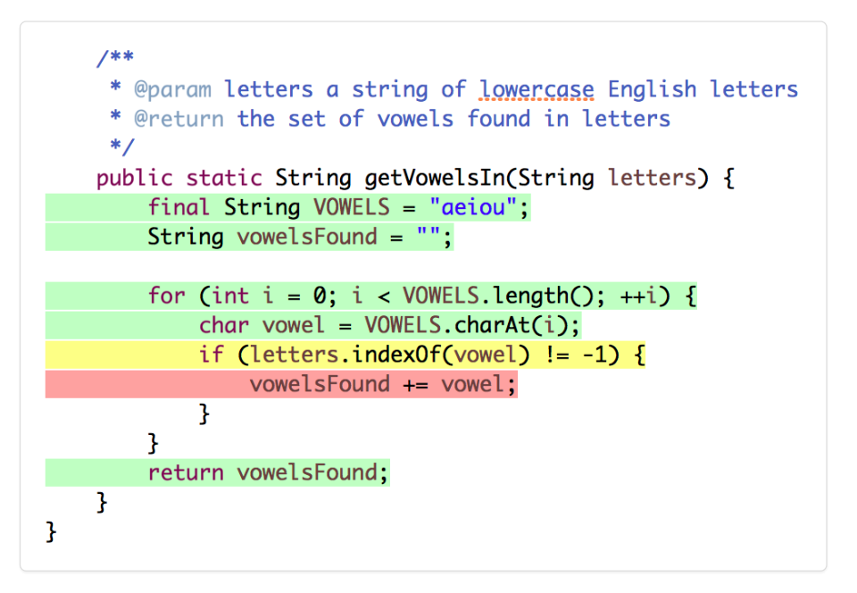

## Use the Coverage Tool
> [!test]
> 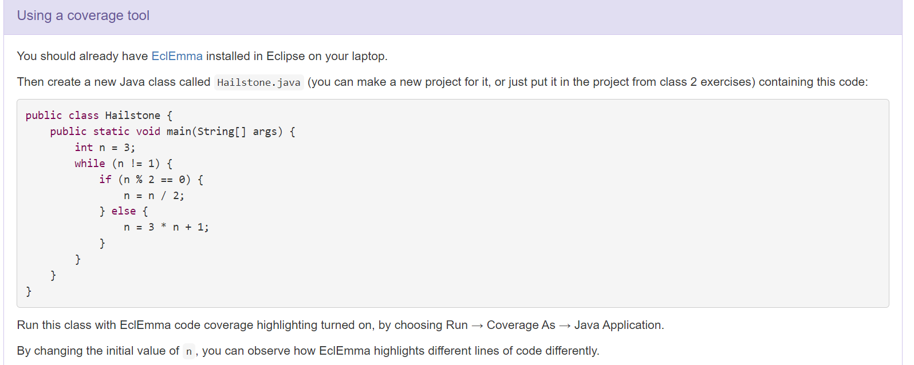
> 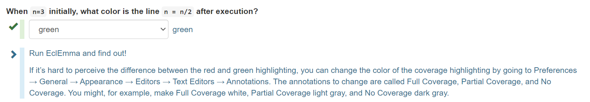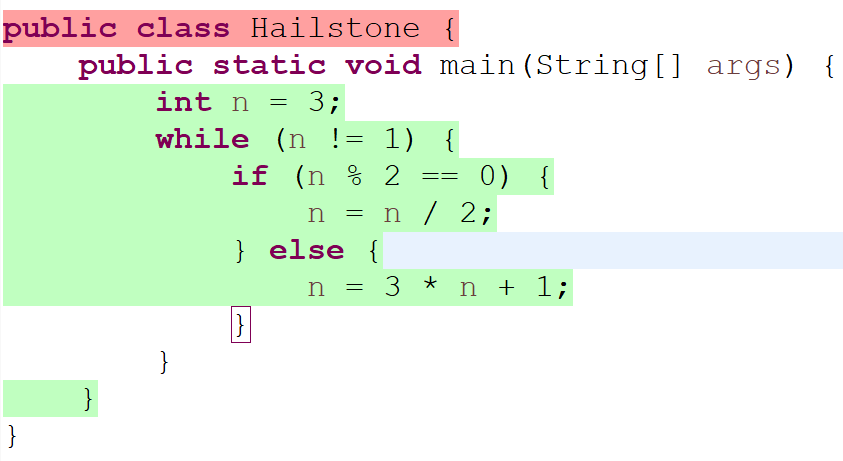
> 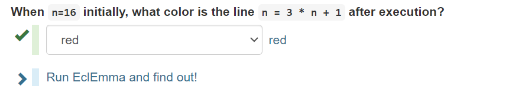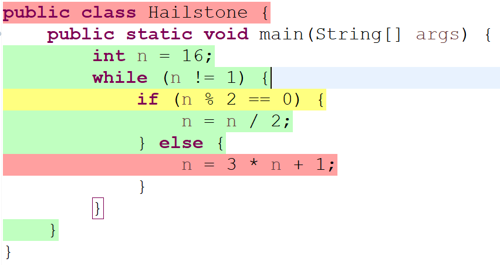
> 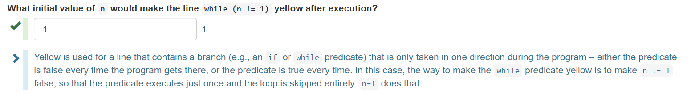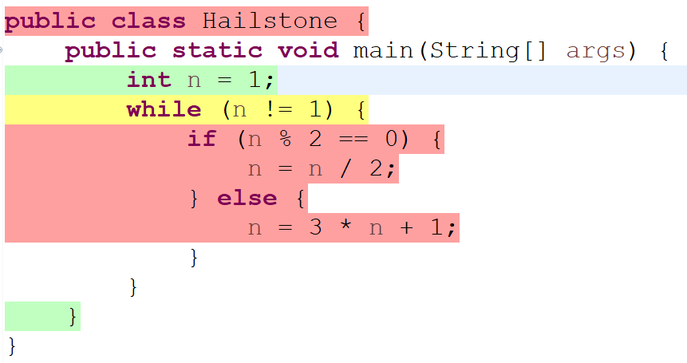

# Unit and Integration Testing
## Unit Tests and Stub
> [!concept]
> A well-tested program will have tests for every individual module (where a module is a method or a class) that it contains. A test that tests an individual module, in isolation if possible, is called a **unit test**. Testing modules in isolation leads to much easier debugging. When a unit test for a module fails, you can be more confident that the bug is found in that module, rather than anywhere in the program.
> 
> Suppose you’re building a document search engine. Two of your modules might be `load()`, which loads a file, and `extract()`, which splits a document into its component words:
> 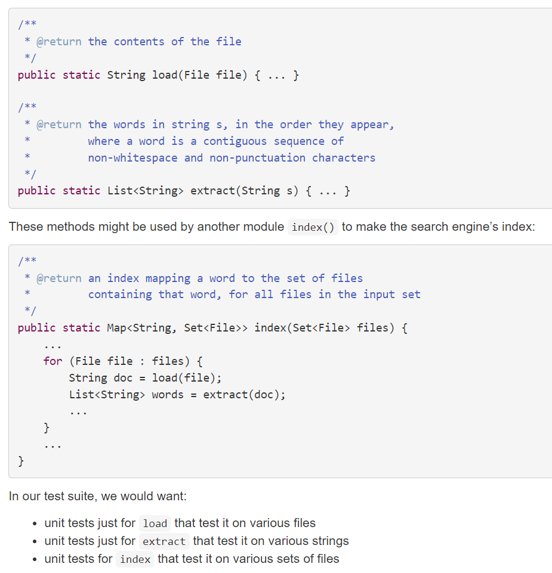
> One mistake that programmers sometimes make is writing test cases for `extract` in such a way that the test cases depend on `load` to be correct. For example, a test case might use `load` to load a file, and then pass its result as input to `extract`. But this is _not_ a unit test of `extract`. If the test case fails, then we don’t know if the failure is due to a bug in `load` or `extract`.
> 
> It’s better to think about and test `extract` in isolation. Using test partitions that involve realistic file content might be reasonable, because that’s how `extract` is actually used in the program. But don’t actually call `load` from the test case, because `load` may be buggy! Instead, store file content as a literal string, and pass it directly to `extract`. That way you’re writing an isolated unit test, and if it fails, you can be more confident that the bug is in the module it’s actually testing.Note that the unit tests for `index` can’t easily be isolated in this way. When a test case calls `index`, it is testing the correctness of not only the code inside `index`, but also all the methods called by `index`. If the test fails, the bug might be in any of those methods. That’s why we want separate tests for `load` and `extract`, to increase our confidence in those modules individually and localize the problem to the `index` code that connects them together.
> 
> Isolating a higher-level module like `index` is possible if we write ==**stub**== versions of the modules that it calls. For example, a stub for `load` wouldn’t access the filesystem at all, but instead would return mock file content no matter what `File` was passed to it. A stub for a class is often called a [**mock object**](http://en.wikipedia.org/wiki/Mock_object). Stubs are an important technique when building large systems, but we will generally not use them in 6.031.

## Integration Test
> [!concept]
> In contrast to a unit test, an ==**integration test**== tests a combination of modules, or even the entire program. 
> 
> If all you have are integration tests, then when a test fails, you have to hunt for the bug. It might be anywhere in the program. 
> 
> Integration tests are still important, because a program can fail at the connections between modules. For example, one module may be expecting different inputs than it’s actually getting from another module. 
> 
> But if you have a thorough set of unit tests that give you confidence in the correctness of individual modules, then you’ll have much less searching to do to find the bug.

> [!example] Pizza Analogy
> 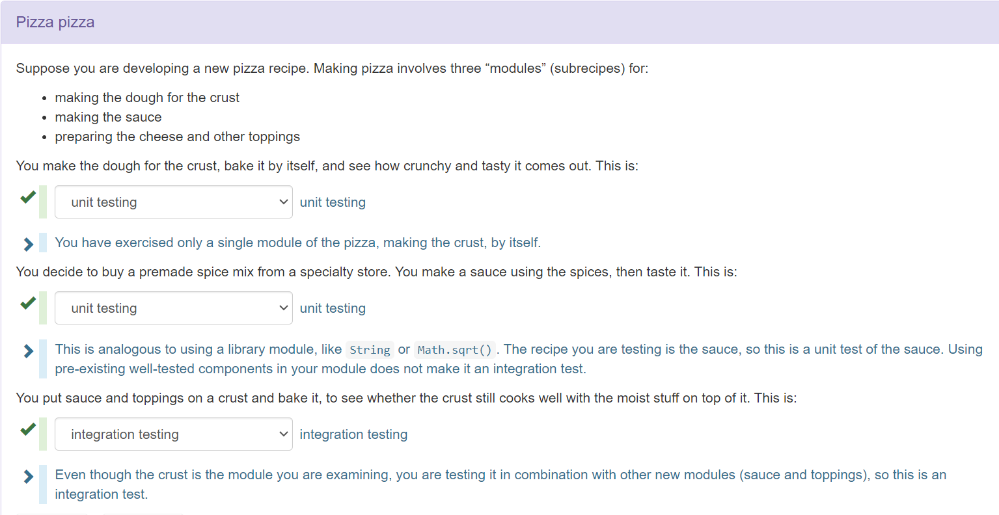

# Automated Regression Testing
## Concepts
> [!concept]
> Nothing makes tests easier to run, and more likely to be run, than complete automation. ==**Automated testing**== means running the tests and checking their results automatically.
> 
> The code that runs tests on a module is a ==**test driver**== (also known as a test harness or test runner). A test driver should not be an interactive program that prompts you for inputs and prints out results for you to manually check. Instead, a test driver should invoke the module itself on fixed test cases and automatically check that the results are correct. The result of the test driver should be either “all tests OK” or “these tests failed: …” A good testing framework, like JUnit, allows you to build and run this kind of test driver, with a suite of automated tests.
> 
> Note that automated testing frameworks like JUnit make it easy to run the tests, but you still have to come up with good test cases yourself. ==Automatic test generation== is a hard problem, still a subject of active computer science research.
> 
> Once you have test automation, it’s very important to rerun your tests when you modify your code. Software engineers know from painful experience that ==any== change to a large or complex program is dangerous. Whether you’re fixing another bug, adding a new feature, or optimizing the code to make it faster, an automated test suite that preserves a baseline of correct behavior – even if it’s only a few tests – will save your bacon. Running the tests frequently while you’re changing the code prevents your program from ==regressing== — introducing other bugs when you fix new bugs or add new features. 
> 
> Running all your tests after every change is called ==**regression testing**==.
> 
> Whenever you find and fix a bug, take the input that elicited the bug and add it to your automated test suite as a test case. This kind of test case is called a ==regression test==. This helps to populate your test suite with good test cases. 
> - Regression test creates test cases from bugs.
> - Remember that a test is good if it elicits a bug — and every regression test did in one version of your code! 
> - Saving regression tests also protects against reversions that reintroduce the bug. The bug may be an easy error to make, since it happened once already.
> 
> This idea also leads to ==test-first debugging==. When a bug arises, immediately write a test case for it that elicits it, and immediately add it to your test suite. Once you find and fix the bug, all your test cases will be passing, and you’ll be done with debugging and have a regression test for that bug.
> 
> In practice, these two ideas, automated testing and regression testing, are almost always used in combination. Regression testing is only practical if the tests can be run often, automatically. Conversely, if you already have automated testing in place for your project, then you might as well use it to prevent regressions. So **automated regression testing** is a best-practice of modern software engineering.

## Concept Checks
> [!example]
> 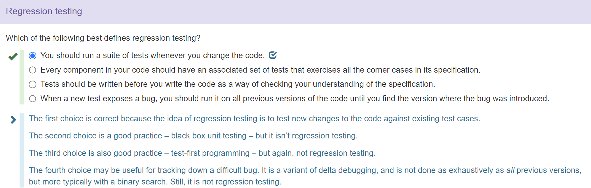

# Iterative Test-First Programming
## Concepts
> [!concept]
> Let’s revisit the test-first programming idea that we introduced at the start of this reading, and refine it. Effective software engineering does not follow a linear process. Practice ==**iterative**== test-first programming, in which you are prepared to go back and revise your work in previous steps:
> - Write a **specification** for the function.
> - Write tests that exercise the spec. As you find problems, **iterate** on the spec and the tests.
> - Write an implementation. As you find problems, **iterate** on the spec, the tests, and the implementation.
> 
> Each step helps to validate the previous steps. Writing tests is a good way to understand the specification. The specification can be incorrect, incomplete, ambiguous, or missing corner cases. Trying to write tests can uncover these problems early, before you’ve wasted time working on an implementation of a buggy spec. Similarly, writing the implementation may help you discover missing or incorrect tests, or prompt you to revisit and revise the specification.
> 
> Since it may be necessary to iterate on previous steps, it doesn’t make sense to devote enormous amounts of time making one step perfect before moving on to the next step. **Plan for iteration:**
> 
> - For a large specification, start by writing only one part of the spec, proceed to test and implement that part, then iterate with a more complete spec.
> - For a complex test suite, start by choosing a few important partitions, and create a small test suite for them. Proceed with a simple implementation that passes those tests, and then iterate on the test suite with more partitions.
> - For a tricky implementation, first write a simple brute-force implementation that tests your spec and validates your test suite. Then move on to the harder implementation with confidence that your spec is good and your tests are correct.
> 
> Iteration is a feature of every modern software engineering process (such as [Agile](https://en.wikipedia.org/wiki/Agile_software_development) and [Scrum](https://en.wikipedia.org/wiki/Scrum_(software_development))), with good empirical support for its effectiveness. Iteration requires a different mindset than you may be used to as a student solving homework and exam problems. Instead of trying to solve a problem perfectly from start to finish, iteration means reaching a rough solution as soon as possible, and then steadily refining and improving it, so that you have time to discard and rework if necessary. Iteration makes the best use of your time when a problem is difficult and the solution space is unknown.

## Concept Check
> [!example]
> 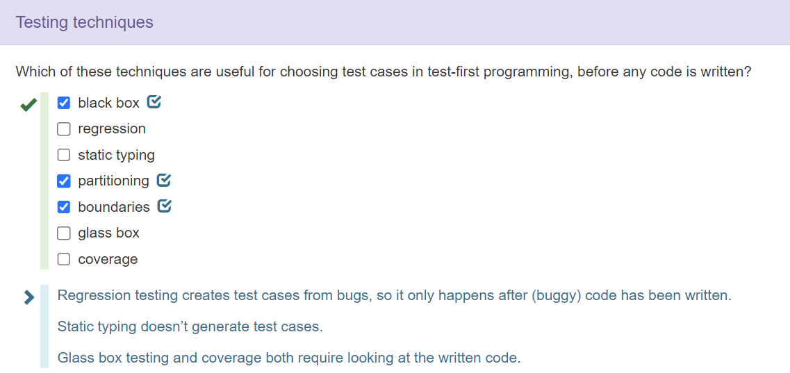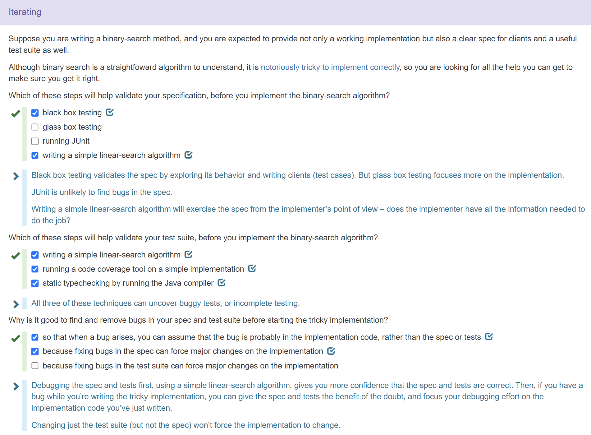

