# Behavioral Equivalence
> [!concept] Behavioral Equivalence 
> To determine ==behavioral equivalence==, our question is whether we could substitute one implementation for the other. Below are two implementations of the `find()` method.

```start-multi-column  
ID: ExampleRegion1  
number of columns: 2   
```

```java
// Find the index of an integer in an array
static int find(int[] arr, int val) {
    for (int i = 0; i < arr.length; i++) {
        if (arr[i] == val) return i;
    }
    return -1;
}
```

--- end-column ---

```java
// Improved Search, from both ends.
static int find(int[] arr, int val) {
    for (int i = 0, j = arr.length-1; i <= j; i++, j--) {
        if (arr[i] == val) return i;
        if (arr[j] == val) return j;
    }
    return -1;
}
```

--- end-multi-column
> [!bug] Behavioral Difference
> In turns out that the two programs don't have so-called behavioral equivalence. 
> Not only do these implementations have different performance characteristics, they actually have different behavior. 
> - If `val` happens to appear _more than once_ in the array, the original `find` always returns the lowest index at which it occurs. 
> - But the new `find` might return the lowest index or the highest index, whichever it finds first.
> 

> [!example] One Possible Specfication
> The notion of behavioral equivalence is in the eye of the beholder — that is, the client. In order to make it possible to substitute one implementation for another, and to know when this is acceptable, we need a specification that states exactly what the client depends on.
> 
> In this case, a specification that would allow these two implementations to be behaviorally equivalent might be:
> 
> 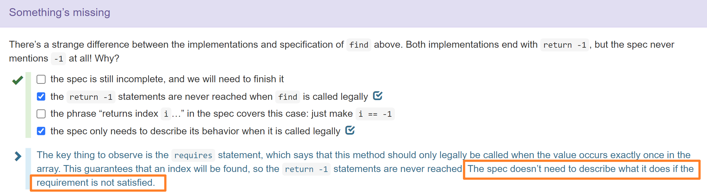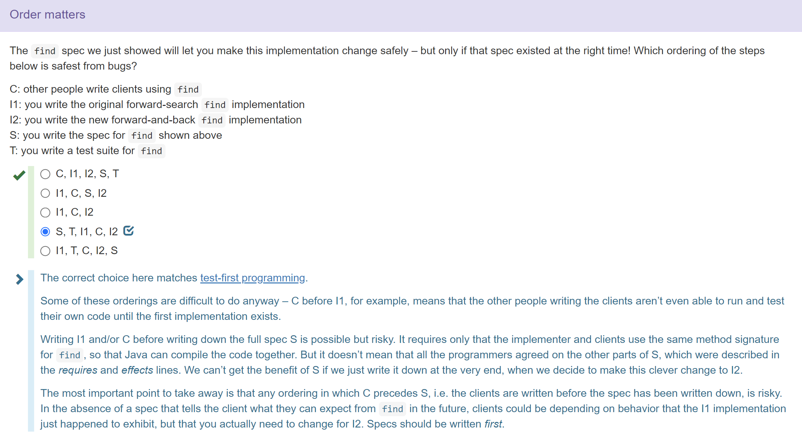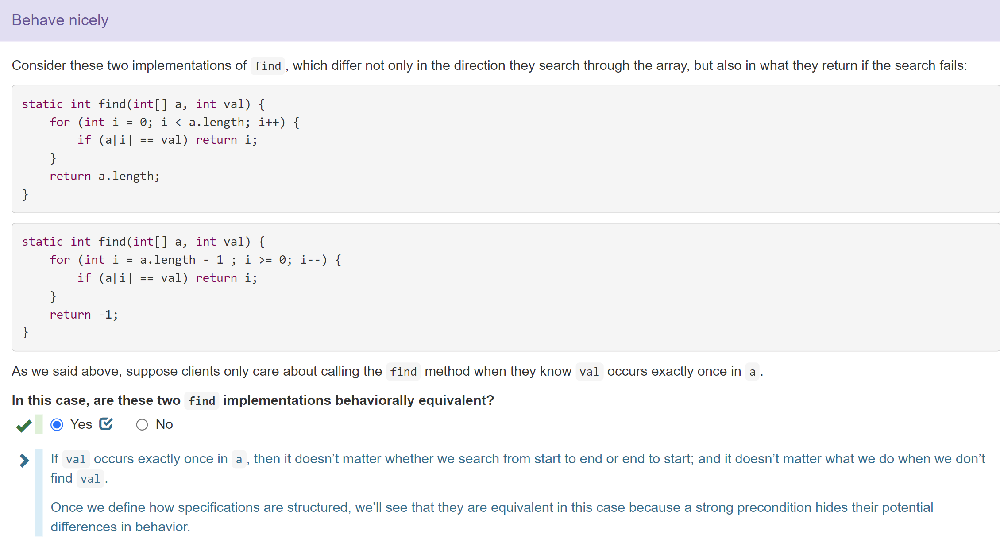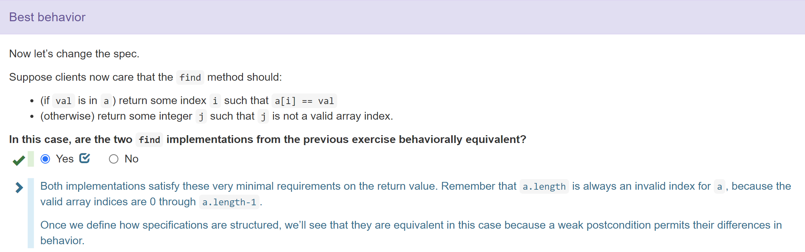


# Specification Structure
> [!concept]
> Abstractly speaking, a ==_specification_== of a method has several parts:
> - A _method signature_, giving the name, parameter types, return type, and exceptions thrown
> - A _requires_ clause, describing additional restrictions on the parameters
> - An _effects_ clause, describing the return value, exceptions, and other effects of the method
> 
> Taken together, these parts form the ==_precondition_== and the ==_postcondition_== of the method.
> 
> The ==precondition== is an obligation on the ==client== (the caller of the method). It is a condition over the state in which the method is invoked. One aspect of the precondition is the number and types of the parameters in the method signature. Additional conditions are written down in the _requires_ clause, for example:
> - narrowing a parameter type (e.g. `x >= 0` to say that an `int` parameter x must actually be a nonnegative `int`)
> - interactions between parameters (e.g., `val` occurs exactly once in `arr`)
>  
> The ==postcondition== is an obligation on the ==implementer== of the method. It includes the parts that Java can statically check: the return type and declared checked exceptions. Additional conditions are written down in the _effects_ clause, including:
> - how the return value relates to the inputs
> - which exceptions are thrown, and when
> - whether and how objects are mutated
> 
> **In general, the postcondition is a condition on the state of the program _after_ the method is invoked, assuming the precondition was true _before_.**
> 
> The overall structure is a logical implication: _if_ the precondition holds when the method is called, _then_ the postcondition must hold when the method completes.
> 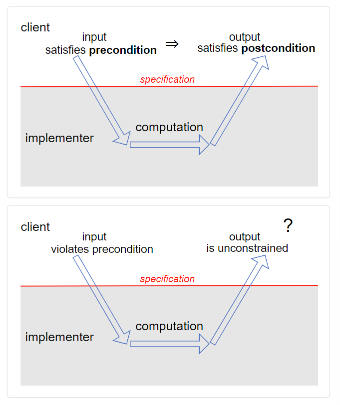
> If the precondition does _not_ hold when the method is called, the implementation is _not_ bound by the postcondition. It is free to do anything, including never returning, throwing an exception, returning arbitrary results, making arbitrary mutations, etc.
> 
> A specification of a method ==can== talk about the parameters and return value of the method, but it ==should never== talk about _local variables_ of the method or _private fields_ of the method’s class. You should consider the implementation invisible to the reader of the spec. It’s behind the firewall as far as clients are concerned.
> 
> In Java, the source code of the method is often unavailable to the reader of your spec, because the Javadoc tool only extracts the spec comments from your code and renders them as HTML.
> 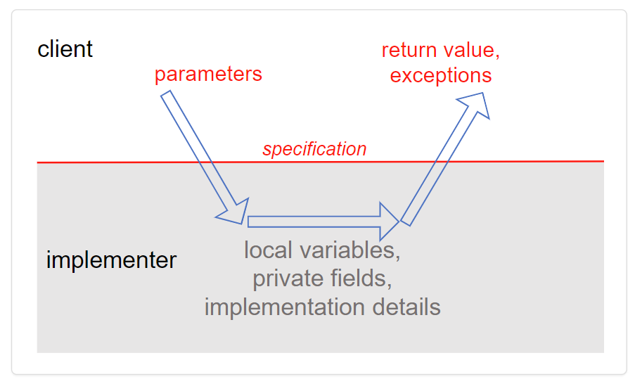


> [!example] Exercise
> 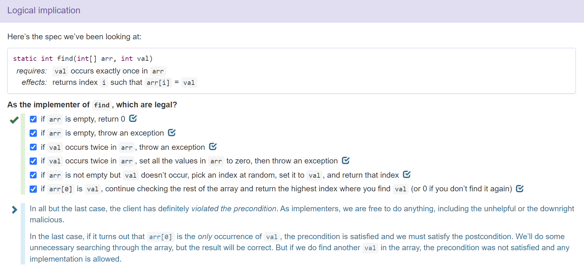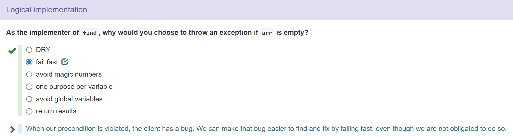


# Java Specifications
> [!concept]
> Java has a convention for documentation comments called [Javadoc](http://en.wikipedia.org/wiki/Javadoc), in which parameters are described by `@param` clauses and results are described by `@return` clauses. 
> 
> - You ==should== put the preconditions into `@param` where possible, and postconditions into `@return`. 
> 
> - You ==should not== put any ststic type in the spec, since it is automatically checked by Java Compiler, and don't need to occupy some place in the spec.
> 
> So a specification like this:
> 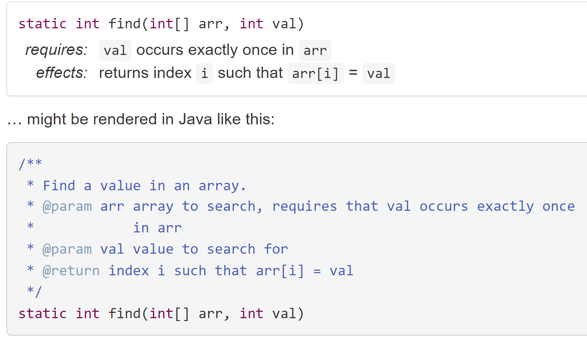

> [!bug] Problematic Specifications
> 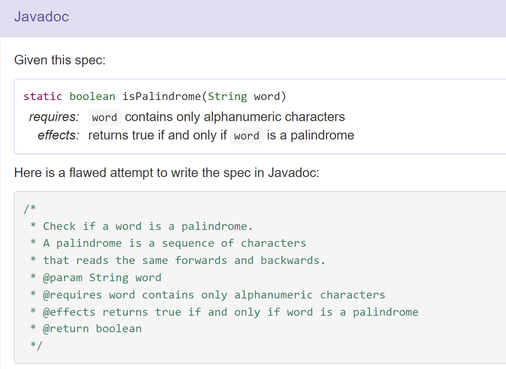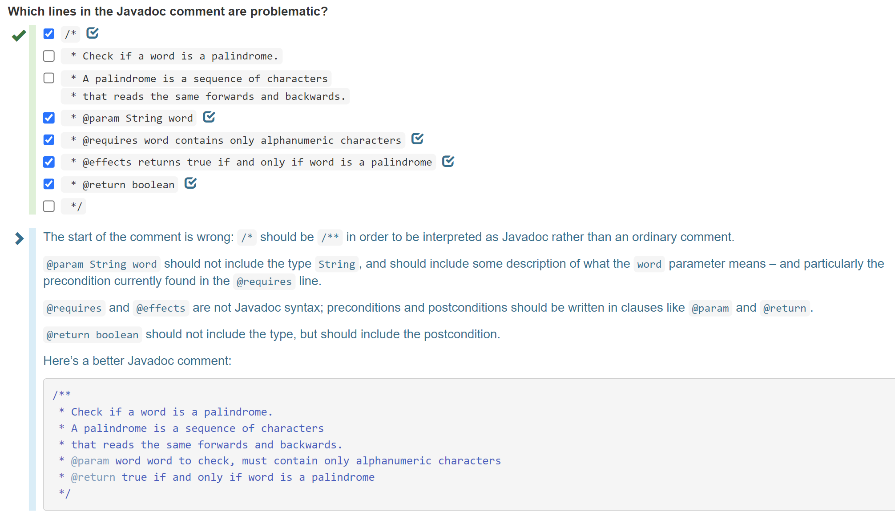

> [!example] Concise Javadoc
> 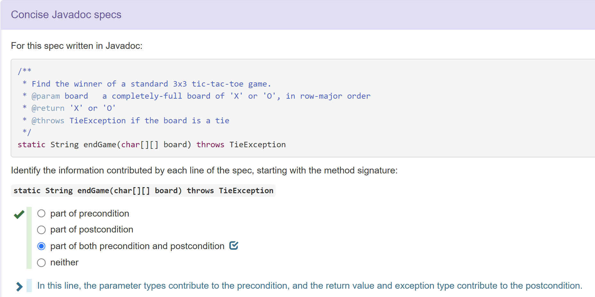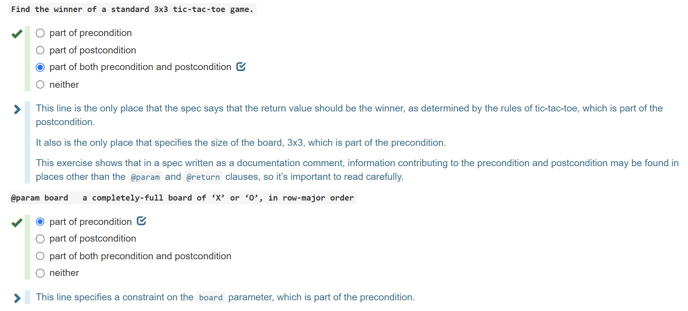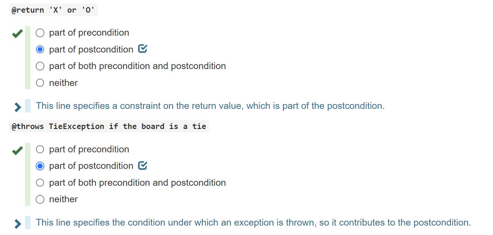

> [!example] Python Doc Example
> Python 3 typically don't haver static type checking so we expect a different form of documentation from Java.
> 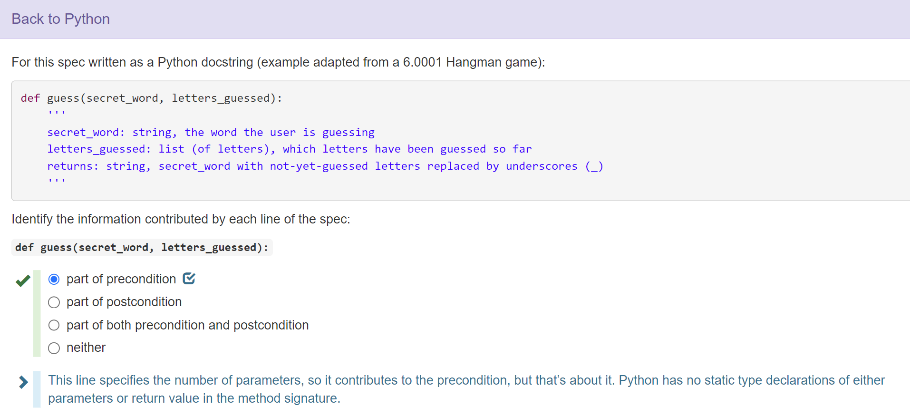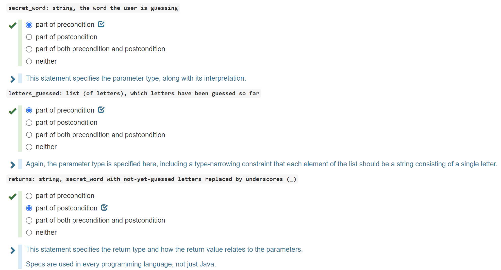


# Null References
> [!concept]
> 


