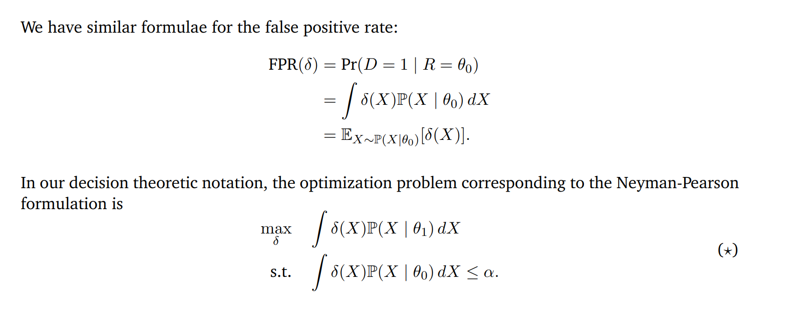

# Neyman-Pearson Formulation
## TPR/FPR
> [!motiv] Motivation
> In general, our the optimal decision rule makes the true positive rate as high as possible, while making very few false positives.
> 

## Likelihood Ratio Test
Also see [5 Likelihood-Ratio Test](../../../Mathematics/Probablity_Statistics/Statistics_Model_Perspective/假设检验/Parametric_Hypothesis_Testing.md#5%20Likelihood-Ratio%20Test)
> [!def]
> 

## Neyman-Pearson Lemma
> [!lemma]
> 
> See [Weak Duality](../../../Computer_Science/Machine_Learning/Optimization_EECS127AB/3_Convex_Optimization/Lagrangian_Duality_Theory.md#Weak%20Duality) for this inequality.
> 
> 

> [!example]
> 

# False Discovery Rate
