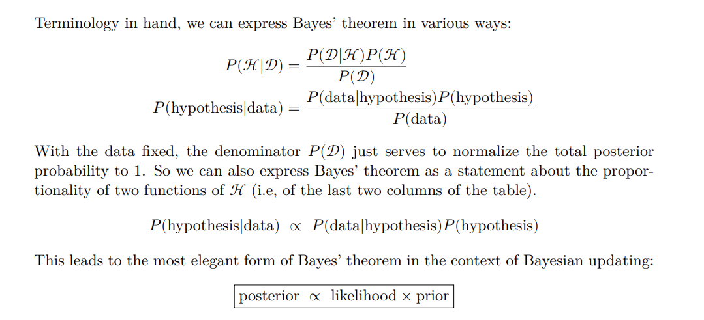
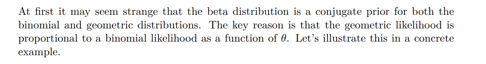
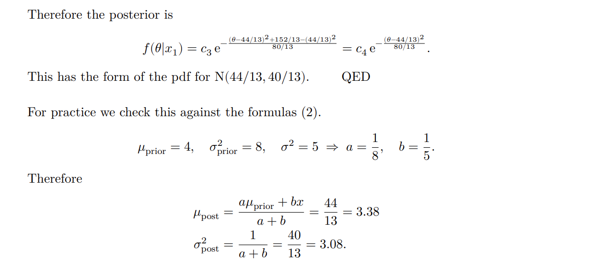
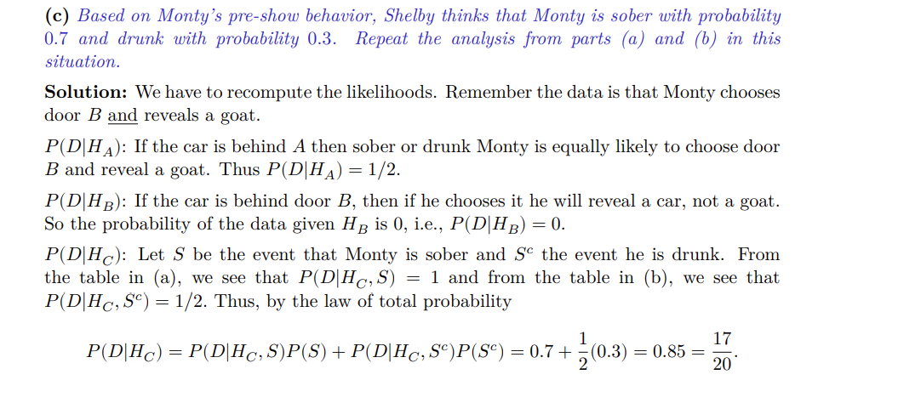

# Bayesian Updating
> [!summary]
> 

# Beta Priors
## Definition
> [!def] Beta Distribution
> 
>

> [!important] Beta Constant
> 
> Deriving this is a bit complicated and not suitable for the purpose of learning.
> 
> To see this in gaussian, recall that the gaussian pdf is $$f(\theta)=\frac{1}{\sqrt{2\pi}\sigma}exp\{-\frac{1}{2}(\frac{x-\mu}{\sigma})^2\}$$
> and the $\theta\in (-\infty,\infty)$.
> 
> Here the $\sqrt{2\pi}$ is the normalizing constant and can be computed by $\int_{-\infty}^{\infty}\frac{1}{\sigma}e^{-\frac{1}{2}(\frac{\theta-\mu}{\sigma})^2}d\theta=\sqrt{2\pi}$ by change of variable.
> 
> To see this in exponential distribution, recall that the exponential pdf is $$f(\theta)=\lambda e^{\lambda\theta}$$
> where $\theta\in [0,\infty)$ and we can compute the normarlizing constant by $$\int_{0}^{\infty}e^{-\lambda\theta}d\theta=\frac{1}{\lambda}$$

## Hyperparameters Interpretations
> [!important]
> When $a>b$, large values have higher probability.
> 
> When $a<b$, small values have higher probability.
> 
> 
> When $a=b=1$, we have a uniform distribution over $[0,1]$
> 
> 

## Conjugate Priors
> [!important]
> 
> Beta prior is a conjugate prior for binomial bernoulli and geometric likelihood.
> 
> **Note:** To memorize, the posterior beta parameter follows (a + # success, b + # failure) where # success + # failure = total number of experiments.

# Guassian Priors
## Conjugate Priors
> [!important]
> Gaussian prior is the conjugate prior of itself.
> 

> [!example] One data point
> 

> [!example] Multiple Data Point
> 

> [!proof]
> 

## Weighted Average of Prior and Data
> [!important]
> 
> This correlates with the finding in n-d case in [Tug of War between Prior and Likelihood](../../../Computer_Science/Machine_Learning/AI_ML/Regression&Classification/3_Regression&Reparametrization.md#Overview) 
> 
> Generally, if we have a strong prior(the variance is small), then the MAP estimate will be close to the prior than to the data point(likelihood).

> [!example] 
> 

# Gamma Priors
## PDF
> [!def]
> 
> Gamma Function is just $\Gamma(\alpha)=(\alpha-1)!$, can be used to simplify some integrations.
> 
> The normalization terms in beta distribution $(a,b)$ can be rewritten in $\frac{\Gamma(a+b)}{\Gamma(a)\Gamma(b)}$.

## Conjugate Priors
> [!example] Exponential Likelihood
> 

# Prior and Posterior Predictive
> [!important]
> Suppose you roll a dice, which could equally likely to be 4, 6, 8, 12, 20 sided. Then suppose you observe a roll that gives 7. ($D_1=7$)
> 
> Model this as a Bayesian Updating Problem we have $H_{4,}H_{6,}H_{8,}H_{12}, H_{20}$ with equal probability(flat prior) where $p(H_4)=p(H_6)=p(H_8)=p(H_{12})=p(H_{20})=\frac{1}{5}$
> 
> **Prior Predictive:** $$p(D_1=7)=\sum\limits_{H\in \mathcal{H}}p(D_1|H)p(H)$$
> Basically this is computing using total probability law.
> 
> **Posterior Predictive:** $$p(D_2=7|D_1=7)=\sum\limits_{H\in \mathcal{H}}p(D_2=7|H,D_1=7)p(H|D_1=7)$$
> Same reasoning, but using posterior probability.

# Applications
## Monty Hall Problem
> [!example] Sp22 MIT 1805 HW7 P1
> 

## Posterior Prediction
> [!example] Sp22 MIT 1805 HW7 P2
> 

## Odds
> [!example] Sp22 MIT 1805 HW7 P2
> 

