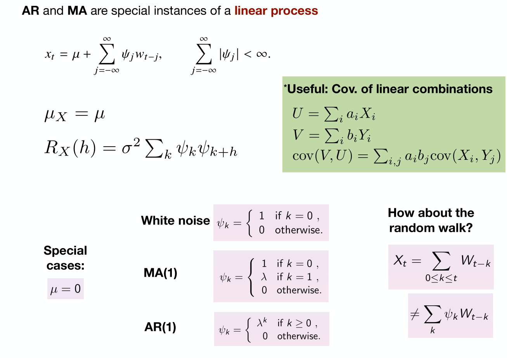

# Auto-regressive Process
## AR(1)
> [!def]
> 
> where $W_t$(i.i.d across $t$) is drawn from $\mathcal{N}(0, \sigma_{W}^2)$ and $|\phi| < 1$.
> 
> **Autoregressive:** Since each value of the random variable in our series depend on another random variable in the series.
> 
> **Causal:** $X_t$ only depends on $X_{m}$ where $m\leq t$.
> 
> **Zero Mean:** By expanding the recursion we have:
> 
> **Weakly Stationary: We prove by definition:**
> 
> 
> **Linear Process:**
> 
> 

## AR(p)
> [!def]
> 

## ACF of AR process
> [!important]

 

# Causality
## Backshift Operator
> [!important]
> 

## Causality Definition
> [!def]
> 

## AR(1) and Causality
> [!important]
> 
> But we can redefine the white noise sequence to make it causal:
> 
> 

# Moving Average
## MA(1)
> [!def]
> 

## MA(p)
> [!def]
> 

# Invertibility
## Invertibility Definition
> [!def]
> 

## MA(1) and Invertibility
> [!important]
> 

> [!summary]
> 

# AR and MA Prediction
### Linear Process
> [!important]
> A **linear stochastic process** is a type of stochastic (random) process where the future state of the process is a linear function of its past states and a random disturbance or noise term. 
> $$X_t=c+\sum_{i=1}^p \phi_i X_{t-i}+\epsilon_t$$
> where:
> - $X_t$ is the value of the process at time $t$,
> - $c$ is a constant term (intercept),
> - $\phi_i$ are the coefficients of the linear function (these represent the dependence of the current value $X_t$ on past values),
> - $X_{t-i}$ represents the past values of the process (lagged terms),
> - $\epsilon_t$ is a stochastic or random noise term (often assumed to be white noise, i.e., uncorrelated random noise with a mean of zero).
> 
> 

## Prediction

# Autoregressive Moving Average Model
## Model Definition
> [!def]
> 
> **Using Operator/Polynomial Notations we would have:**
> 
> 

## Stationarity, Causality and Invertibility
> [!important]
> 

### Casuality
> [!example]
> 

### Invertibility
> [!example]

## Parameter Redundancy
> [!example]
> 

