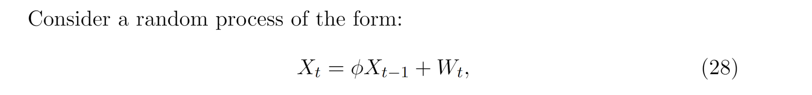

 # Auto-regressive Process
## AR(1)
> [!def]
> 
> where $W_t$(i.i.d across $t$) is drawn from $\mathcal{N}(0, \sigma_{W}^2)$ and $|\phi| < 1$.
> 
> **Autoregressive:** Since each value of the random variable in our series depend on another random variable in the series.
> 
> **Causal:** $X_t$ only depends on $X_{m}$ where $m\leq t$.
> 
> **Zero Mean:** By expanding the recursion we have:
> 
> **Weakly Stationary: We prove by definition:**
> 
> 
> **Linear Process:**
> 
> 

## AR(p)
> [!def]
> 

## ACF of AR process
> [!important]

 

# Causality
## AR Operator
> [!important]
> 

## Causality Definition
> [!def]
> 

## AR(1) and Causality
> [!important]
> 
> But we can redefine the white noise sequence to make it causal:
> 
> 

# Moving Average
## MA Operator
> [!important]
> 

## MA(1)
> [!def]
> 

## MA(p)
> [!def]
> 

# Invertibility
## Invertibility Definition
> [!def]
> 

## MA(1) and Invertibility
> [!important]
> 

> [!summary]
> 

# Autoregressive Moving Average Model
## Model Definition
> [!def]
> 
> **Using Operator/Polynomial Notations we would have:**
> 
> 

## Stationarity, Causality and Invertibility
> [!important]
> 

### Casuality
> [!example]
> 

### Invertibility
> [!example]

## Parameter Redundancy
> [!example]
> 

