# Basic Statistics of a Time Series
> [!summary]
> 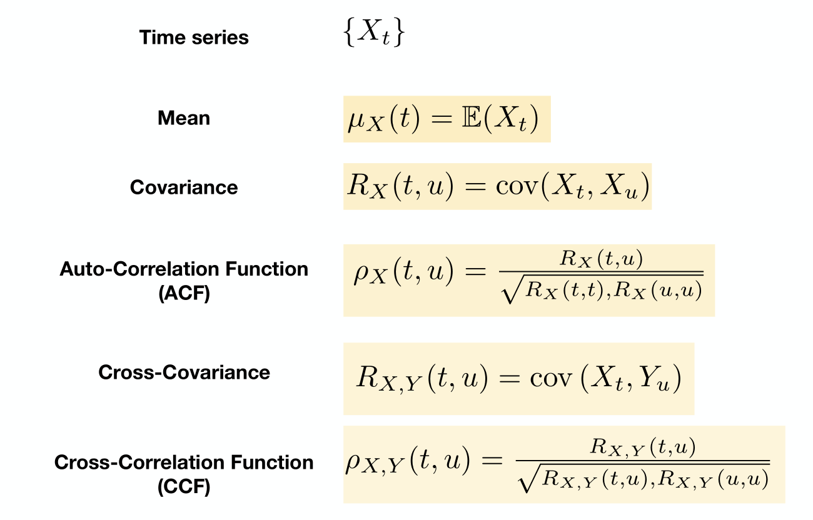
> **Remarks:**
> - **(Auto)Covariance**: Measures the linear dependence between two points on the same series.
> - **Cross-covariance**: Measures the linear dependence between two series.


## ACF
### Definitions
> [!def]
> 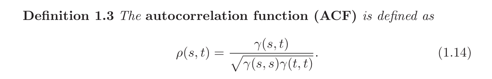
> The ACF measures the linear predictability of the series at time $t$,say $x_t$, using only the value $x_s$.
> 
> Here we can show that $-1\leq \rho(s,t)\leq 1$ using Cauchy-Schwarz inequality.
> 
> **Remarks:** 
> - If we can predict $x_t$ **perfectly from** $x_s$ through a linear relationship, $x_{t}= \beta_{0}+ \beta_1x_s$, then the correlation will be $+1$ when $\beta_{1}> 0$, and $-1$ when $\beta_{1}< 0$.
> 


### Properties
> [!property] 
> 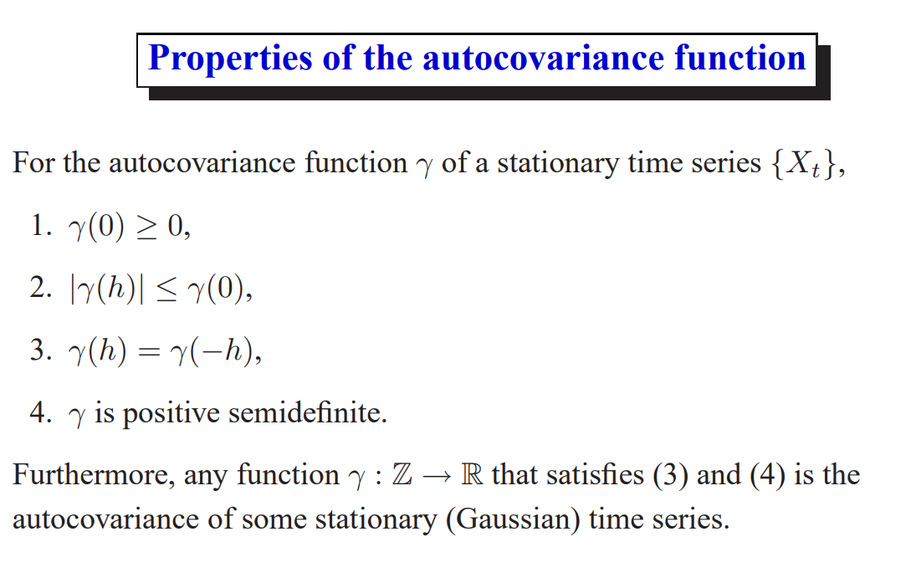


## Sample ACF
### Properties
> [!property]
> 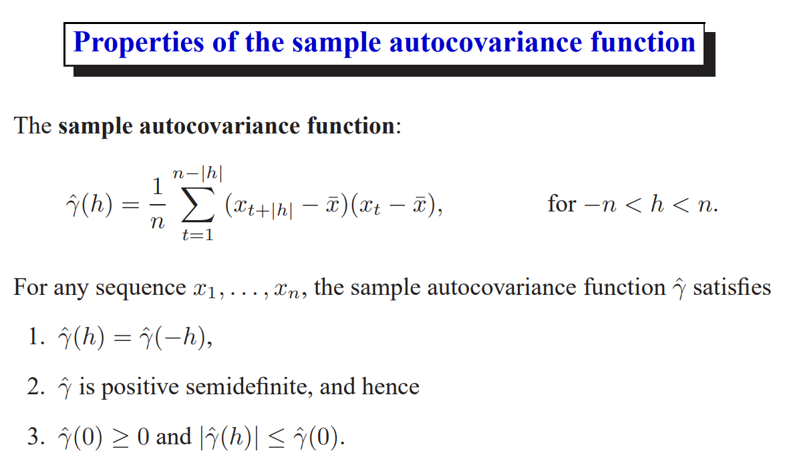


### Implementations
> [!code] Estimating the ACF
> 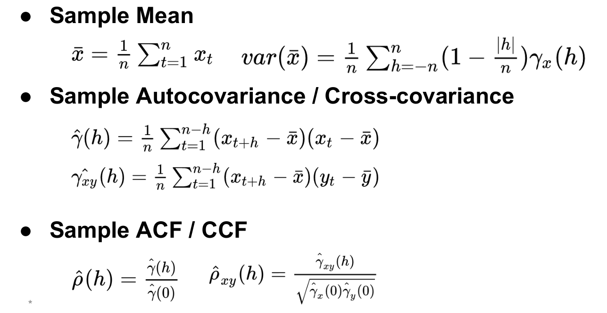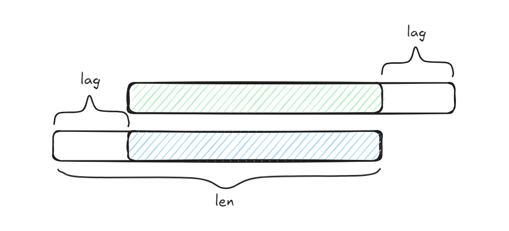
> **Derivations of std:** 
> 
> 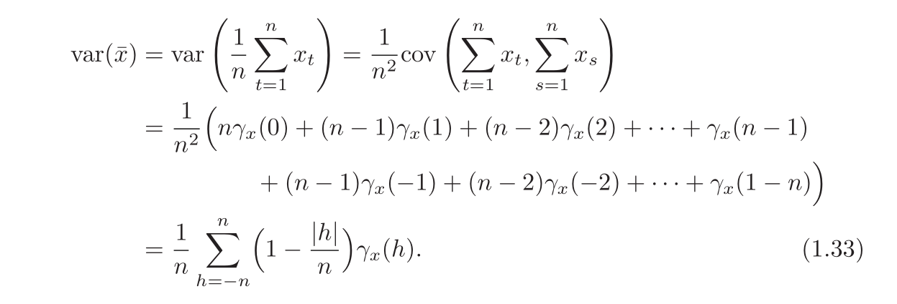
```python
def acf_impl(x, nlags):
    """
    Your implementation for the Autocorrelation Function.
    Your implementation will be checked against statsmodels.tsa.stattools.acf.
    @param x: a 1-d numpy array
    @param nlags: an integer
    @return a 1-d numpy array with (nlags+1) elements. 
    The first element denotes the acf at lag = 0 (1.0 by definition).
    """
    assert len(x) > nlags
    x_bar = np.mean(x)
    output = []
    for lag in range(nlags+1):
        top_len = len(x) - lag
        gamma = np.sum((x[lag:]-x_bar)*(x[:top_len]-x_bar))/len(x)
        output.append(gamma)
    return np.array(output)/output[0]
```


### Large-Sample Distribution of ACF
> [!important]
> 


## CCF
> [!def]
> 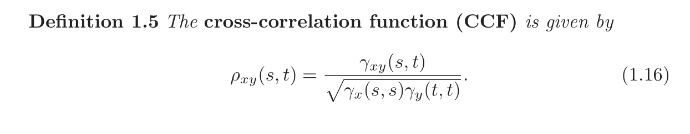


## Stationarity
### Strong Stationarity
> [!def]
> 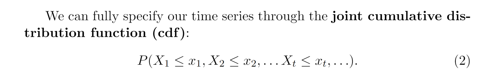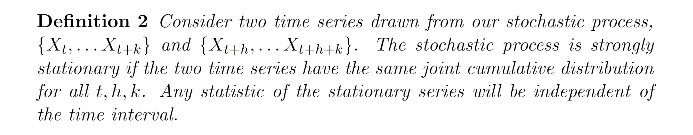


### (Weak) Stationarity
> [!def]
> 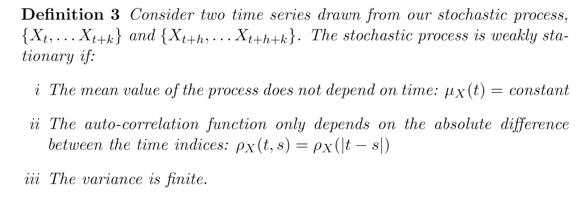
> **Some Lemmas:**
> - ACF only depends on lag
> - ACF is symmetric around the origin. $$\begin{aligned}\rho(h)&=\rho((t+h)-t)\\&=\operatorname{cov}\left(x_{t+h}, x_t\right)\\&=\operatorname{cov}\left(x_t, x_{t+h}\right)\\&=\rho(t-(t+h))\\&=\rho(-h)\end{aligned}$$


# Linear Process
## Definition
> [!def]
> 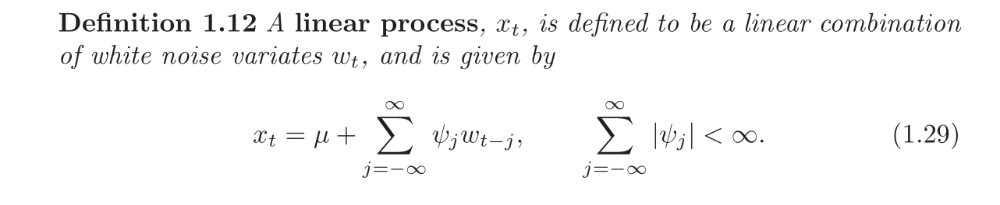
> The autocovariance function is given by:
> 
> 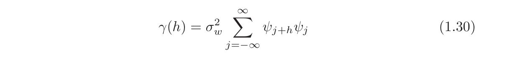


# White Noise
> [!def]
> $$X_t \sim N\left(0, \sigma^2\right)$$

> [!code] Simulation
> $$w_t \sim N\left(0, \sigma^2\right)$$
> - Set $\sigma=1$, sample $\mathrm{n}=500$ points from the process above
> - Plot the white noise
> - Plot the sample ACF with lag $=20$.
> - Calculate the analytical ACF and compare it with the sample ACF.
> - What trend/observation you can find in the ACF plot?
> - Change $n$ to 50 , compare the new ACF plot $(n=50)$ to the old ACF plot $(n=500)$. What causes the difference?
> 
> **Observations:**
> - The **autocorrelations** at most lags should ideally be close to **zero**, as white noise is, by definition, uncorrelated across time. (Think about orthogonality between vectors).
> - The **confidence interval** (usually represented by the shaded area) typically spans $\pm \frac{2}{\sqrt{n}}$, where `n` is the number of observations. For white noise, most points (lags) should fall within this confidence interval.
> - The first lag (lag 0) is always **1** because any series is perfectly correlated with itself, also given by the computing formula.
> - Occasional spikes in the autocorrelations at some lags may occur due to random variations, especially for smaller sample sizes.
> 
> **Differences:**
> - 
> 
```python

```
> [!test] Simulation Results
> 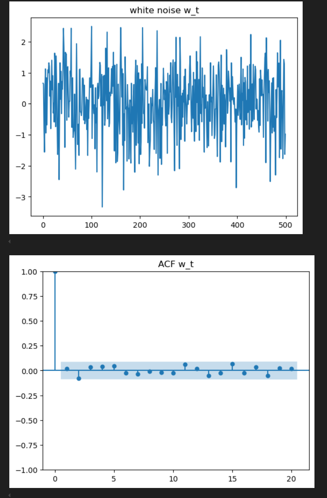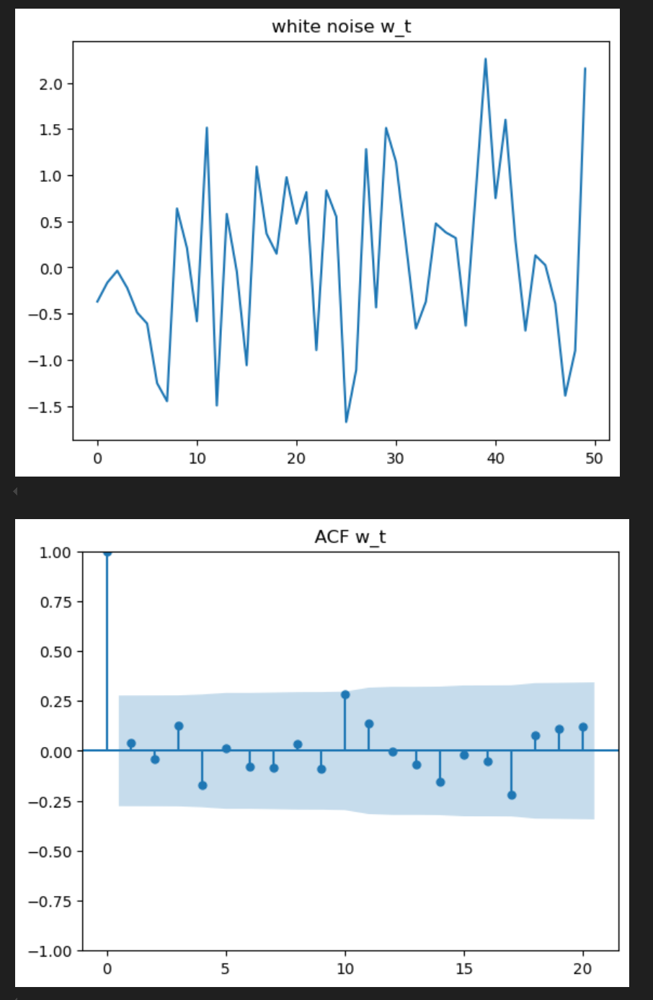

# Random Walk with Drift
> [!def]
> 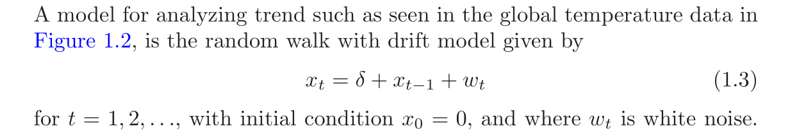
> **Remarks:**
> - The constant $\delta$ is called the drift, when $delta = 0$, it is called "random walk" process.


# Signal in Noise
