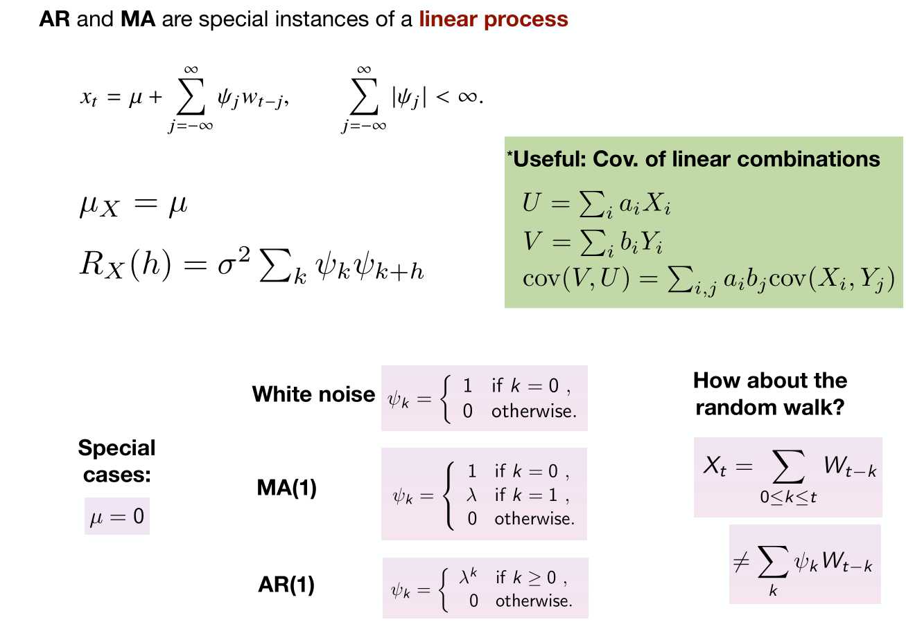
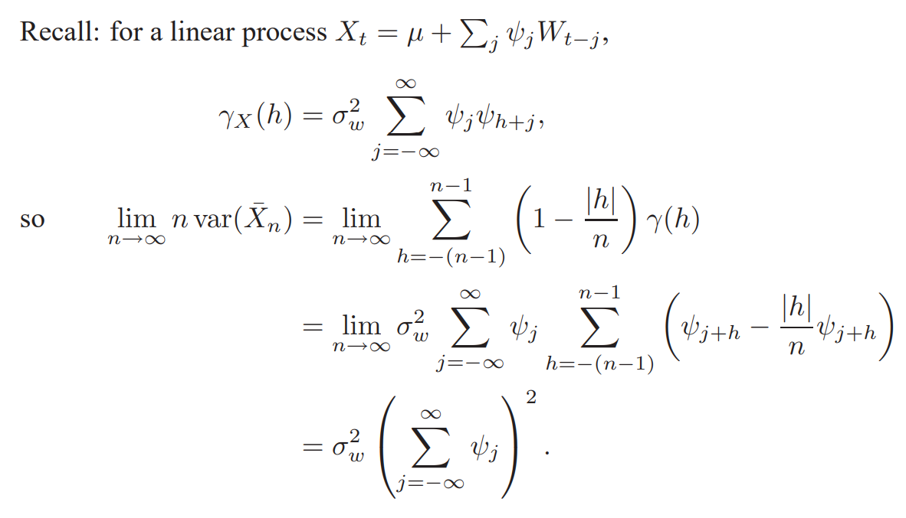

# Basic Statistics of a Time Series
> [!summary]
> 
> **Remarks:**
> - **(Auto)Covariance**: Measures the linear dependence between two points on the same series.
> - **Cross-covariance**: Measures the linear dependence between two series.


## Autocovariance Function
### Definition
> [!def]
> 


### Properties
> [!property] 
> 


## Autocorrelation Function
### Definitions
> [!def]
> 
> The ACF measures the linear predictability of the series at time $t$,say $x_t$, using only the value $x_s$.
> 
> Here we can show that $-1\leq \rho(s,t)\leq 1$ using Cauchy-Schwarz inequality.
> 
> **Remarks:** 
> - If we can predict $x_t$ **perfectly from** $x_s$ through a linear relationship, $x_{t}= \beta_{0}+ \beta_1x_s$, then the correlation will be $+1$ when $\beta_{1}> 0$, and $-1$ when $\beta_{1}< 0$.
> 


### Implementations
> [!code]
> Implementation see [Implementations](Basic_Time_Series.md#Stationary%20Estimates#Implementations)


## Cross-covariance Function
> [!def]
> 


## Cross-correlation Function
> [!def]
> 
```python
# statsmodels.graphics.tsaplots doesn't have plotting function for CCF so I have to write my own.
def plot_ccf(x, y, ax=None, lags=None, alpha=.05, use_vlines=True, unbiased=False,
             fft=False, title='Cross-correlation', zero=True, **kwargs):
    fig, ax = utils.create_mpl_ax(ax)
    lags, nlags, irregular = statsmodels.graphics.tsaplots._prepare_data_corr_plot(x, lags, zero)
    confint = None
    ccf_val = ccf(x, y)
    if lags is not None:
        ccf_val = ccf_val[:nlags+1]
    statsmodels.graphics.tsaplots._plot_corr(ax, title, ccf_val, confint, lags, irregular, use_vlines,vlines_kwargs={},**kwargs)
    return fig
```


# Stationary Series
## Stationarity
### Strong Stationarity
> [!def]
> 


### (Weak) Stationarity
> [!def]
> 
> **Some Lemmas:**
> - ACF only depends on lag
> - ACF is symmetric about y-axis. $$\begin{aligned}\rho(h)&=\rho((t+h)-t)\\&=\operatorname{cov}\left(x_{t+h}, x_t\right)\\&=\operatorname{cov}\left(x_t, x_{t+h}\right)\\&=\rho(t-(t+h))\\&=\rho(-h)\end{aligned}$$


## White Noise
> [!def]
> $$X_t =W_t\sim N\left(0, \sigma_W^2\right)$$
> **Stationarity:**
> - We know that the mean is 0, which is a constant
> - The autocovariance function:
> 
> - Thus by the stationarity criteria, white noise process is stationary.


# Stationary Estimates
## Estimating ACF
### Sample ACF Definitions
> [!def]
> 

> [!property]
> 


### Implementations
> [!code] Estimating the ACF
> 
> **Derivations of std:** 
> 
> 
```python
def acf_impl(x, nlags):
    """
    Your implementation for the Autocorrelation Function.
    Your implementation will be checked against statsmodels.tsa.stattools.acf.
    @param x: a 1-d numpy array
    @param nlags: an integer
    @return a 1-d numpy array with (nlags+1) elements. 
    The first element denotes the acf at lag = 0 (1.0 by definition).
    """
    assert len(x) > nlags
    x_bar = np.mean(x)
    output = []
    for lag in range(nlags+1):
        top_len = len(x) - lag
        gamma = np.sum((x[lag:]-x_bar)*(x[:top_len]-x_bar))/len(x)
        output.append(gamma)
    return np.array(output)/output[0]
```


## Estimating mu
> [!important]
> 


### Asymptotic Distribution
> [!motiv]
> 


# Linear Process
## Stationary Linear Process Definition
> [!def]
> 
> The autocovariance function is given by:
> 
> 
> **Remarks:**
> - Given the regularity condition $\sum\limits_{j = -\infty}^{\infty}|\phi_j|<\infty$, the variance of $\{X_t\}$ is finite.
> - With regularity condition, the linear process is guaranteed to be stationary.


## Linear Process Estimates
> [!def]
> A **linear stochastic process** is a type of stochastic (random) process where the future state of the process is a linear function of its past states and a random disturbance or noise term. 
> $$X_t=c+\sum_{i=1}^p \phi_i X_{t-i}+\epsilon_t$$
> where:
> - $X_t$ is the value of the process at time $t$,
> - $c$ is a constant term (intercept),
> - $\phi_i$ are the coefficients of the linear function (these represent the dependence of the current value $X_t$ on past values),
> - $X_{t-i}$ represents the past values of the process (lagged terms),
> - $\epsilon_t$ is a stochastic or random noise term (often assumed to be white noise, i.e., uncorrelated random noise with a mean of zero).
> 
> 


### Estimating mu
> [!important]
> 


### Estimating ACF
> [!important]
> 


# White Noise Estimates
## Estimating ACF
> [!def]
> 


# Code Implementations
## Auto-correlation Analysis
### White Noise
> [!code] Simulation
> $$w_t \sim N\left(0, \sigma^2\right)$$
> - Set $\sigma=1$, sample $\mathrm{n}=500$ points from the process above
> - Plot the white noise
> - Plot the sample ACF with lag $=20$.
> - Calculate the analytical ACF and compare it with the sample ACF.
> - What trend/observation you can find in the ACF plot?
> - Change $n$ to 50 , compare the new ACF plot $(n=50)$ to the old ACF plot $(n=500)$. What causes the difference?
> 
```python
# Question 1.20
n = 500
mean = 0
std = 1 
lag = 20

# create white noise
w_t = np.random.normal(mean, std, size=n)

# plot white noise
plt.plot(w_t)
plt.title("white noise w_t")
plt.show()

# calculate acf
acf_val = acf(x=w_t, nlags=lag)
plot_acf(x=w_t, lags=lag, title="ACF w_t")
plt.show()
```
> [!test] Simulation Results
> 
> **Observations:**
> - The **autocorrelations** at most lags should ideally be close to **zero**, as white noise is, by definition, uncorrelated across time. (Think about orthogonality between vectors).
> - The **confidence interval** (usually represented by the shaded area) typically spans $\pm \frac{2}{\sqrt{n}}$, where `n` is the number of observations. For white noise, most points (lags) should fall within this confidence interval.
> - The first lag (lag 0) is always **1** because any series is perfectly correlated with itself, also given by the computing formula.
> - Occasional spikes in the autocorrelations at some lags may occur due to random variations, especially for smaller sample sizes.
> 
> **Differences:**
> - When $n$(sample size) is small, the ACF plot will show more variability and spikes(outside of confidence interval) with higher sample noise.


### Moving Average
> [!code]
> Definition see [Moving Average](ARMA.md#Moving%20Average)
> $$v_t=\frac{1}{3}\left(w_t, w_{t+1}, w_{t+2}\right)$$
> - Sample $n+2$ white noise from $N(0,1)$
> - Add code to compute the moving average $v_t$.
> - Plot both $w_t$ and $v_t$ and compare the two time series.
> - Plot the sample ACF of $v_t$ and compare it with the analytical ACF.
> 
> 
> 
```python
# Question 1.21
n = 500
mean = 0
std = 1 
lag = 20

# create white noise
w_t = np.random.normal(mean, std, size=n+2)
# create moving average
v_t = np.mean(np.array([w_t[:n], w_t[1:n+1], w_t[2:n+2]]), 0)

# plot white noise
plt.figure(1)
plt.subplot(211)
plt.plot(w_t)
plt.title("w_t")

# plot moving average
plt.subplot(212)
plt.plot(v_t)
plt.title("v_t")

# calculate acf
acf_val = acf(x=v_t, nlags=lag)
plot_acf(x=v_t, lags=lag)
plt.show()
```
> [!test] Graph
> **Observations:**
> - **Significant First Few Lags**: In your plot, we see large autocorrelations at the first few lags, where the influence of past values shows up.
> - **Drop to Zero After qqq Lags**: After the first few lags, the autocorrelations quickly drop to nearly zero and stay within the confidence interval (the shaded region). This is typical of a moving average process, where the influence of past values disappears after a certain number of lags.


### Signal in Noise
> [!code]
> $$v_t=2 \cos \left(\frac{2 \pi t}{50}+0.6 \pi\right)+w_t$$
> - Sample n white noise from $N(0,1)$
> - Add code to compute $v_t$.
> - Plot both $w_t$ and $v_t$. Compare the two plots.
> - Plot the sample ACF of $v_t$. What's the pattern? What causes the observed pattern?
```python
# Question 1.23
n = 500
mean = 0
std = 1 
lag = 100

# create white noise
w_t = np.random.normal(mean, std, size=n)
# create signal w. noise
v_t = 2 * np.cos(2 * np.pi * np.linspace(1,n, num=n) / 50.0 + 0.6 * np.pi) + w_t

# plot white noise
plt.figure(1)
plt.subplot(211)
plt.plot(w_t)
plt.title("w_t")
# plot signal with noise
plt.subplot(212)
plt.plot(v_t)
plt.title("v_t")

# plot acf
acf_val = acf(x=v_t, nlags=lag)
plot_acf(x=v_t, lags=lag, title="ACF v_t")
plt.show()
```
> [!test] Graph
> 
> **Observations:**
> - **White Noise $w_t$​**:
> 	- Shows no discernible pattern in the time series and the ACF quickly decays to zero after lag 0, indicating no correlation between values at different lags.
> - **Cyclical Time Series $v_t$​**:
> 	- Exhibits clear periodic behavior, with peaks and troughs repeating over time.
> 	- The ACF has a sinusoidal-like structure, which is typical for time series with strong periodicity. The periodic autocorrelation indicates that the process exhibits seasonality or cyclic behavior.

### Random Walk with Drift
> [!def]
> 
> **Remarks:**
> - The constant $\delta$ is called the drift, when $delta = 0$, it is called "random walk" process.


## Cross-correlation Analysis
### Synthetic Data: Signal with Noise
> [!def]
```python
# Cross-correlation synthetic Example
n = 50
mean = 0
std = 1 
lag=40
true_h = 5

x_t = np.random.normal(mean, std, size=n+5)
# Adding x_t backward. y_0 is the latest timestep.
y_t = 2.0 * x_t[5:] + np.random.normal(mean, std, size=n)
x_t = x_t[:n]


# Note!!!!!!!
# We could also use this, but the spike won't show on CCF since the spike is at time step -5 instead of 5.
y_t = 2.0 * x_t[:n] + np.random.normal(mean, std, size=n)
x_t = x_t[5:n + 5]


# plot the original data
plt.plot(x_t)
plt.title("x_t")
plt.show()
plt.plot(y_t)
plt.title("y_t")
plt.show()

# plot acf
plot_acf(x=x_t, lags=lag, title="ACF x_t")
plot_acf(x=y_t, lags=lag, title="ACF y_t")
plt.show()

# plot ccf
ccf_val = ccf(y_t, x_t)
plot_ccf(x_t, y_t, title="CCF", lags=10)
plt.show()


```
> [!test] Graph
> 


### Real-world Dataset
> [!important]
> 
```python
soi = np.array(pd.read_csv("../../data/soi.csv")["x"])
rec = np.array(pd.read_csv("../../data/rec.csv")["x"])

lag=40

#TODO: replace the template code with your code here. This part will be graded.
# plot data
plt.plot(soi)
plt.title("soi_t")
plt.show()
plt.plot(rec)
plt.title("rec_t")
plt.show()


# plot acf
plot_acf(x=soi, lags=lag, title="ACF soi_t")
plot_acf(x=rec, lags=lag, title="ACF rec_t")
plt.show()

# plot ccf
ccf_val = ccf(soi, rec)
plot_ccf(soi, rec, title="CCF", lags=40)
plt.show()
```
> [!test] Graph
> 


