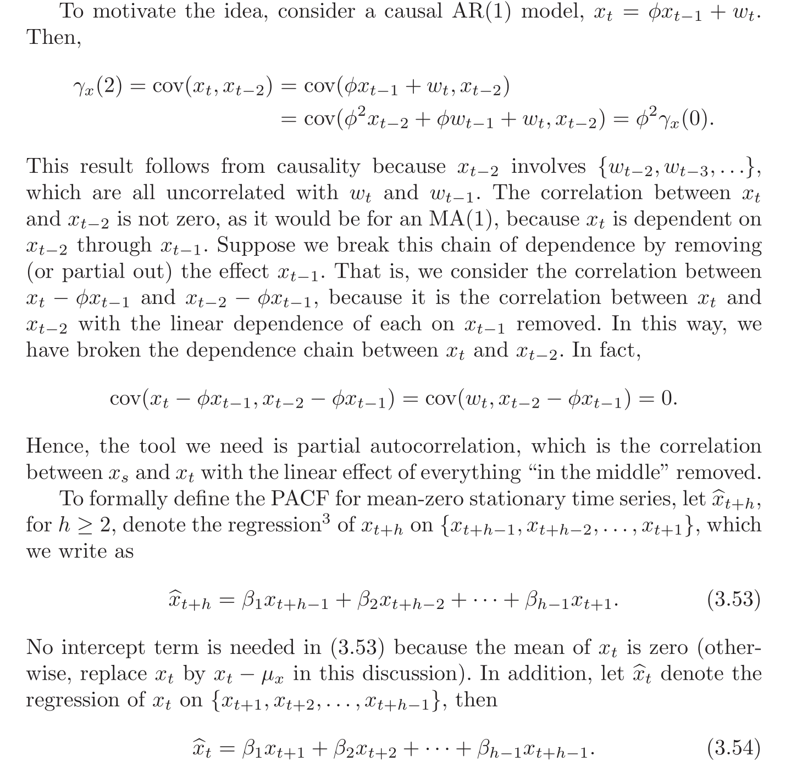
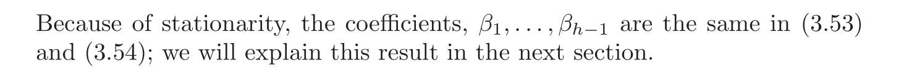
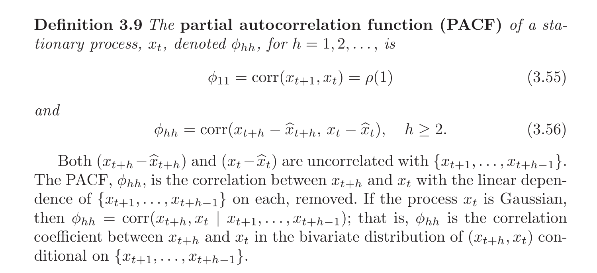
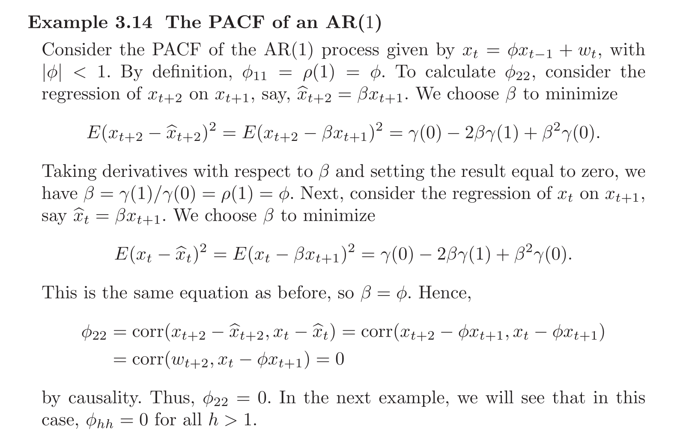
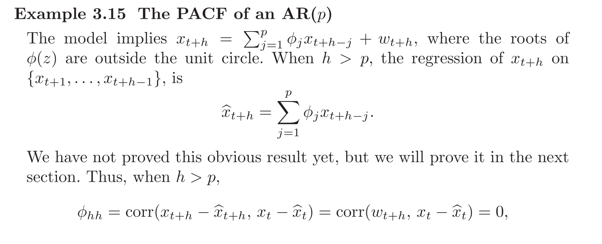
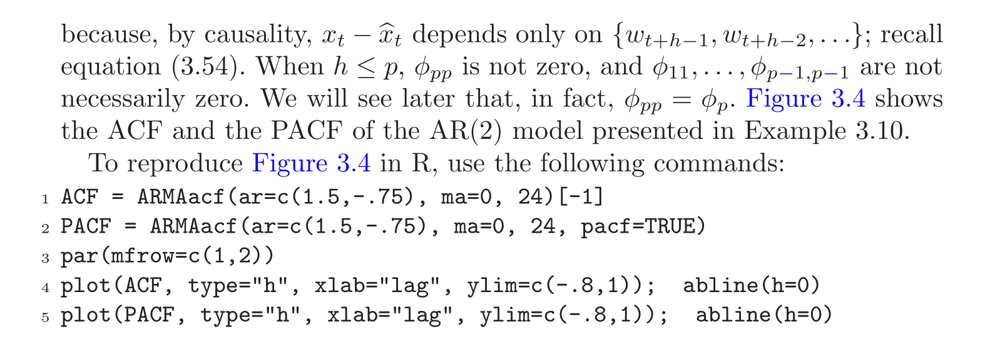
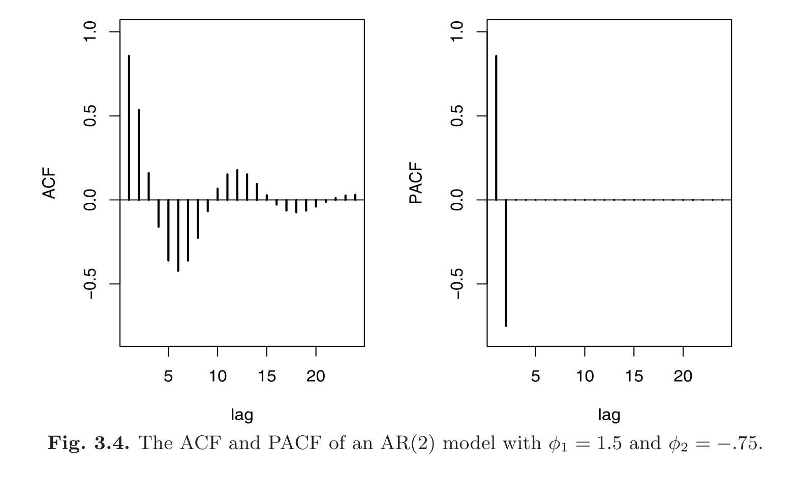
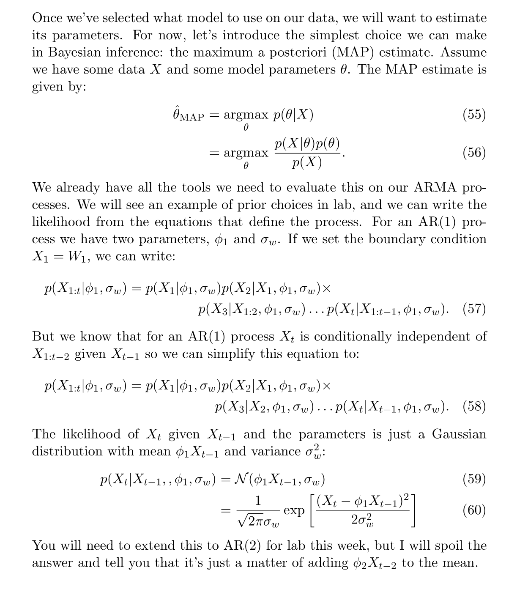

# Partial Auto-correlation Function(PACF)
## Motivation
> [!motiv]
> For an MA process, it's very easy to estimate its order by just looking at the ACF graph of it and count the number of non-zero entries. But for AR process, ACF graph doesn't provide any useful information. So we need a tool, this is why PACF comes about.
> 


## Definition
> [!def]
> 


## Examples
> [!example] PACF of AR(1)
> 

> [!example] AR(p)
> 


# Estimating AR(p) Process
## Algorithm
> [!algo]
> 


## Implementations
### AR(2) Model
> [!code]
```python
class ARTwoModel:
    """Class implementing prior, likelihood, posterior, and predictions for an AR(2) model.

    Args:
        sigma_phi: Sigma for the prior on parameters phi_1 and phi_2.
        sigma_max: Maximum value for uniform prior on sigma_w.
    """

    def __init__(self: Any, sigma_phi: float, sigma_max: float):
        """Initialization funciton. See class docstring for parameters."""
        self.sigma_phi = sigma_phi
        self.sigma_max = sigma_max

    def log_prior(self: Any, params: np.ndarray) -> float:
        """Calculate the log prior of the parameters.
        Args:
            params: Parameters in the order [phi_1, phi_2, sigma_w]

        Returns:
            Log prior of the parameters.

        Notes:
            You can use the norm and uniform functions to evaluate the log pdf. These functions come from scipy.stats.
        """
        # TODO: write your code here.
        return np.log(norm.pdf(params[0], loc=0, scale=self.sigma_phi))\
            + np.log(norm.pdf(params[1], loc=0, scale=self.sigma_phi))\
            + np.log(uniform.pdf(params[2], loc=0, scale=self.sigma_max))

    def log_likelihood(self: Any, data: np.ndarray, params: np.ndarray) -> float:
        """Calculate the log likelihood of the data given the parameters.
        Args:
            data: Observed time series.
            params: Parameters in the order [phi_1, phi_2, sigma_w]

        Returns:
            Log likelihood of the data given the parameters.

        Notes:
            You may want to vectorize this function as much as possible to improve the speed of your code.
            This is not a requirement, just a suggestion.
        """
        # TODO: write your code here
        n_samps = data.shape[0]
        [phi_1, phi_2, sigma_w] = params
        return np.log(norm.pdf(data[2:], loc=phi_1 * data[1: n_samps - 1] + phi_2 * data[: n_samps - 2], scale=sigma_w)).sum() \
                + np.log(norm.pdf(data[1], loc=phi_1 * data[0], scale=sigma_w)) + np.log(norm.pdf(data[0], loc=0, scale=sigma_w))

    def log_posterior(self: Any, params: np.ndarray, data: np.ndarray) -> float:
        """Calcualte the log posterior of the parameters given the data.
        Args:
            params: Parameters in the order [phi_1, phi_2, sigma_w]
            data: Observed time series.

        Returns:
            Log posterior of the parameters given the data.

        Notes:
            Ignore the marginal of the data (the overall normalization of the posterior).
        """
        # TODO: write your code here.
        return self.log_prior(params) + self.log_likelihood(data, params)
```


### Optimizing
> [!code]
```python
# Let's start with out first prior. Let's make it fairly broad in both parameters.
sigma_phi = 20.0
sigma_max = 50.0
a_model_wide = ARTwoModel(sigma_phi, sigma_max)

# Generate our data
n_samps_data = 10000
phi_one, phi_two = 0.7, 0.2
sigma_w = 0.3
np.random.seed(4)
x_t = ar_two(phi_one, phi_two, n_samps_data, sigma_w)

# We want the maximum but have a minimizer. So we will just minimize the negative of the log posterior (often called the
# negative log posterior). Start with an initial guess of zero for the phis and 1 for sigma_w.
params_zero = np.array([0.0, 0.0, 1.0])
data_lengths = [5, 25, 125, 625, 3125, 10000]
results_wide = []
for data_length in data_lengths:
    res = minimize(lambda params: -a_model_wide.log_posterior(params, x_t[:data_length]), params_zero, method='nelder-mead', 
                   options={'xatol': 1e-8, 'disp': False})
    results_wide.append(res.x)
results_wide = np.array(results_wide)

# Lets repeat the process for our narrow prior
sigma_phi = 0.2
sigma_max = 50.0
a_model_narrow = ARTwoModel(sigma_phi, sigma_max)
params_zero = np.array([0.0, 0.0, 1.0])
results_narrow = []
for data_length in data_lengths:
    res = minimize(lambda params: -a_model_narrow.log_posterior(params, x_t[:data_length]), params_zero, method='nelder-mead', 
                   options={'xatol': 1e-8, 'disp': False, 'maxiter': 10000})
    results_narrow.append(res.x)
results_narrow = np.array(results_narrow)

fig, (ax1, ax2, ax3) = plt.subplots(1, 3, figsize=(20, 5), dpi=100)
fontsize = 15
colors = ['#7fcdbb', '#2c7fb8']

# Plot our results
ax1.plot(data_lengths, results_wide[:,0], label='Wide Prior', color=colors[0])
ax1.plot(data_lengths, results_narrow[:,0], label='Narrow Prior', color=colors[1])
ax1.set_xscale('log')
ax1.axhline(phi_one, c='k', label='True Value')
ax1.set_title(r'$\phi_1$', fontsize=fontsize)
ax1.set_xlabel(r'Size of Dataset', fontsize=fontsize)
ax1.set_ylabel(r'$\phi_1$', fontsize=fontsize)
ax1.legend(fontsize=fontsize)

# Plot our results
ax2.plot(data_lengths, results_wide[:,1], label='Wide Prior', color=colors[0])
ax2.plot(data_lengths, results_narrow[:,1], label='Narrow Prior', color=colors[1])
ax2.set_xscale('log')
ax2.axhline(phi_two, c='k', label='True Value')
ax2.set_title(r'$\phi_2$', fontsize=fontsize)
ax2.set_xlabel(r'Size of Dataset', fontsize=fontsize)
ax2.set_ylabel(r'$\phi_2$', fontsize=fontsize)
ax2.legend(fontsize=fontsize)

# Plot our results
ax3.plot(data_lengths, results_wide[:,2], label='Wide Prior', color=colors[0])
ax3.plot(data_lengths, results_narrow[:,2], label='Narrow Prior', color=colors[1])
ax3.set_xscale('log')
ax3.axhline(sigma_w, c='k', label='True Value')
ax3.set_title(r'$\sigma_w$', fontsize=fontsize)
ax3.set_xlabel(r'Size of Dataset', fontsize=fontsize)
ax3.set_ylabel(r'$\sigma_w$', fontsize=fontsize)
ax3.legend(fontsize=fontsize)

plt.show()
```


# Estimating MA Process


