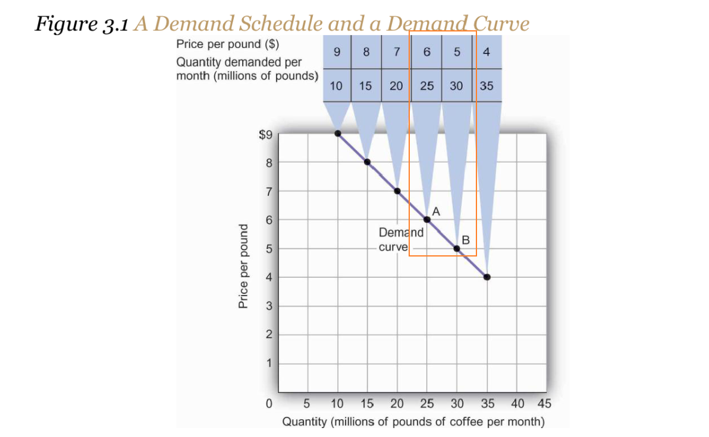
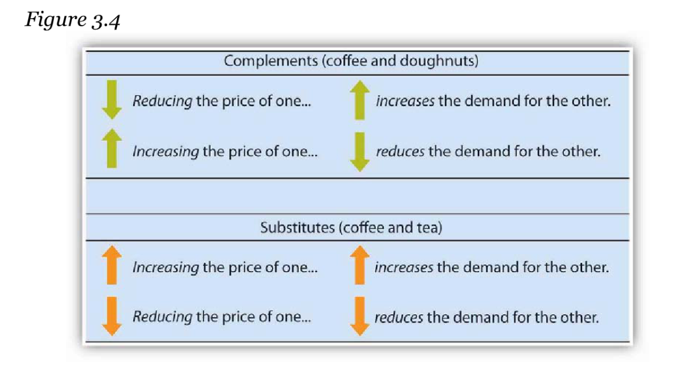
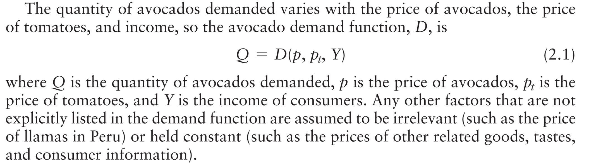
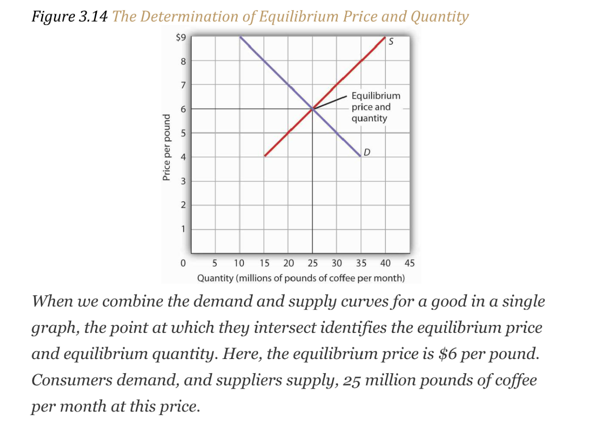
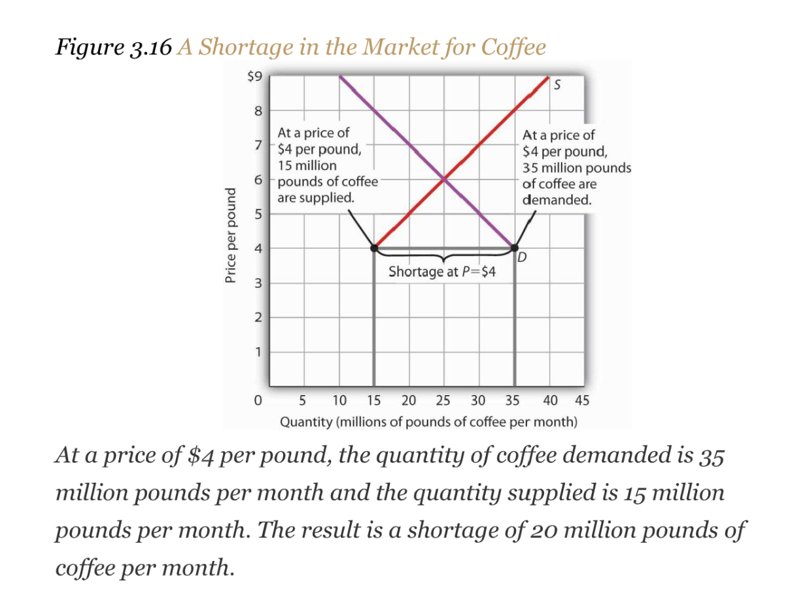

# 1 Demand
## Concepts
### Definition of Demand
> The quantity demanded of a good or service is the quantity buyers are willing and able to buy **at a particular price during a particular period**, **all other things unchanged**. 
> The quantity demanded at each price would be different if other things that might affect it, such as the population of the town, were to change. That is why we add the qualifier that other things have not changed to the definition of quantity demanded.

### Price and Demand Curve
> Demand Curve shows the quantity of demanded goods or services at given prices. As shown in the graph below, we could create a table to show such relationship between price and demand.

**Graph**

### Change in quantity demanded
> **A change in price, with no change in any of the other variables that affect demand, results in a movement along the demand curve. **
> **Movement along the curve:**
> If the price of coffee per pound falls from $6 to $5 , then the demanded quantity rises from 25 million pounds to 30 million pounds per month.
> **The negative slope of the demand curve:**
> All other things unchanged, the law of demand holds that, for virtually all goods and services, a higher price leads to a reduction in quantity demanded and a lower price leads to an increase in quantity demanded. 
> 

### Change in Demand⭐⭐⭐⭐
> Price alone does not determine the quantity of a good or service that people consume. 
> 1. **Income:** 
>    - A good for which demand increases when income increases is called a **normal good**. Normal goods include gasoline, ski trips, new cars, and jewelry.
>    - A good for which demand decreases when income increases is called an **inferior good**. Inferior goods include canned fruit.
>    - An increase in income shifts the demand curve for fresh fruit (a normal good) to the right.
>    - An increase in income shifts the demand curve for canned fruit (an inferior good) to the left.
> 2. **Population& Demographic Characteristics: **
>    -  In general, the greater the population, the greater the demand.
>    - As the share of the population over age 65 increases, the demand for medical services, ocean cruises, and motor homes increases.
>    - The birth rate in the United States fell sharply between 1955 and 1975 but has gradually increased since then. That increase has raised the demand for such things as infant supplies, elementary school teachers, soccer coaches, in-line skates, and college education. 
>    - Demand can thus shift as a result of changes in both the number and characteristics of buyers.
> 3. **Prices of other goods**
>    - _**Reduction in the price of the ****complement goods**** will increase the demand**_. People often eat doughnuts or bagels with their coffee, so a reduction in the price of doughnuts or bagels might induce people to drink. 
>    - _**Reduction in the price of the ****substitute goods**** will decrease the demand**_. An alternative to coffee is tea, so a reduction in the price of tea might result in the consumption of more tea and less coffee. 
>    - 
> 4. **Consumers' preferences: **
> 
A change in preferences that makes one good or service more popular will shift the demand curve to the right. A change that makes it less popular will shift  the demand curve to the left.
> 5. **Buyer Expectations: **
>    - The consumption of goods that can be easily stored, or whose consumption can be postponed, is strongly affected by buyer expectations. 
>    - The expectation of newer TV technologies, such as high-definition TV, could slow down sales of  regular TVs. If people expect gasoline prices to rise tomorrow, they will fill up their tanks today to try to beat the price increase. 
>    - **An expectation of higher prices in the future will lead to more purchases today**. If the price of a good is expected to fall, however, people are likely to reduce their purchases today and await tomorrow’s lower prices. The expectation that computer prices will fall, for example, can reduce current demand.
> 
**Graphical Presentation:**
> The result will be a shift in the entire demand curve rather than a movement along the demand curve. A shift in a demand curve is called a change in demand. Suppose, for example, that something happens to increase the quantity of coffee demanded at each price.

**Graph**

### Important Distinction⭐⭐⭐
> 
> **This drawing of a demand curve highlights the difference:**
> - Change in quantity demanded: Movement along the demand curve caused by a change in price.
> - Change in demand: A shift of the demand curve itself. It is caused by a change in a demand shifter. An increase in demand is a shift of the demand curve to the right. A decrease in demand is a shift in the demand curve to the left. 

### Takeaways
**Takeaways**

## Mathematical Models
### Demand Function
> 

### Summing Demand Curve
:::info
The total quantity demanded** at a given price** is the sum of the quantity each consumer demands at that price.

:::
**Example**

### Supply Function
:::info

:::

### Summing Supply Curve
:::info
The total supply curve shows the total quantity produced by all suppliers **at each possible price.**
:::
**Example****Without Government Intervention:**

**With Government Intervention:**

**Quota配额**

# 2 Supply
## Factor of production⭐⭐⭐⭐⭐
> Factors of production are the inputs that are used to produce goods and services in an economy. The four main factors of production are:
> - **Labor:** This refers to the work performed by people. It includes both physical and mental work, and it can be skilled or unskilled.
> - **Capital: **This refers to the tools, machines, and other physical assets that are used to produce goods and services. It includes both financial and physical capital.
> - **Land:** This refers to the natural resources that are used to produce goods and services, such as minerals, timber, and fertile soil.
> - **Entrepreneurship: **This refers to the ability to identify and pursue new business opportunities. Entrepreneurs are individuals who create and manage businesses, and they play a key role in the economy by bringing new ideas and innovations to market.
> 
Factors of production are **also known as inputs or resources**. They **are used in combination to produce goods and services, and they are typically owned by households or firms**. The combination of these factors determines the level of output that can be produced in an economy.

## Price and Supply Curve
> 

## Change in Supply⭐⭐⭐⭐
### Graphs
> 

### Causation
> **Prices of Factors of Production(生产成本):**
> A change in **_the price of labor or some other factor of production_** will change the cost of producing any given quantity of the good or service. This change in the cost of production will change the quantity that suppliers are willing to offer at any price. 
> - An increase in factor prices should decrease the quantity suppliers will offer at any price, shifting the supply curve to the left. 
> - A reduction in factor prices increases the quantity suppliers will offer at any price, shifting the supply curve to the right.
> - For example, coffee growers must pay a higher wage to the workers they hire to harvest coffee or must pay more for fertilizer. _**Such increases in production cost**_ will cause them to produce a smaller quantity at each price, shifting the supply curve for coffee to the left. A reduction in any of these costs increases supply, shifting the supply curve to the right.
> 
**Returns from Alternative Activities(Opportunity Cost):**
> - To produce one good or service means forgoing the production of another. The concept of opportunity cost in economics suggests that the value of the activity forgone is the opportunity cost of the activity chosen; this cost should affect supply. 
> - For example, one opportunity cost of producing eggs is not selling chickens. An increase in the price people are willing to pay for fresh chicken would make it more profitable to sell chickens and would thus increase the opportunity cost of producing eggs. It would shift the supply curve for eggs to the left, reflecting a decrease in supply.
> 
**Techonology:**
> - 科技降低生产成本，生产者更愿意生产。A change in technology alters the combinations of inputs or the types of inputs required in the production process. 
> - 科技带来的高新技术使得投入产出比更高，使得生产活动成本更低。An improvement in technology usually means that fewer and/or less costly inputs are needed. If the cost of production is lower, the profits available at a given price will increase, and producers will produce more. With more produced at every price, the supply curve will shift to the right, meaning an increase in supply.
> - 过度或者不当使用科技导致生产带来的负向环境外部性导致生产成本变高，使得生产意愿降低。Declines in production due to problems in technology are also possible. Outlawing the use of certain equipment without pollution-control devices has increased the cost of production for many goods and services, thereby reducing profits available at any price and shifting these supply curves to the left.
> 
**Seller Expectations:**
> - All supply curves are based in part on seller expectations about future market conditions. 
> - Many decisions about production and selling are typically made long before a product is ready for sale. Those decisions necessarily depend on expectations. 
> - For example, the owners of oil deposits. Oil pumped out of the ground and used today will be unavailable in the future. If a change in the international political climate leads many owners to expect that oil prices will rise in the future, they may decide to leave their oil in the ground, planning to sell it later when the price is higher. Thus, there will be a decrease in supply; the supply curve for oil will shift to the left.
> 
**Natural Events:**
>  If something destroys a substantial part of an agricultural crop, the supply curve will shift to the left. If there is an unusually good harvest, the supply curve will shift to the right.
> **The Number of Sellers:**
> - The supply curve for an industry, such as coffee, includes all the sellers in the industry. A change in the number of sellers in an industry changes the quantity available at each price and thus changes supply. 
> - An increase in the number of sellers supplying a good or service shifts the supply curve to the right; 
> - A reduction in the number of sellers shifts the supply curve to the left.
> - For example, the market for cellular phone service has been affected by an increase in the number of firms offering the service. Over the past decade, new cellular phone companies emerged, shifting the supply curve for cellular phone service to the right.
> 

## Takeaways
**Takeaways**

# 3 Demand, Supply, and Equilibrium
## Equilibrium Price
> 

## Surplus
> **Definition:**
> A surplus is the amount by which** the quantity supplied exceeds the quantity demanded** at the current price. There is, of course, no surplus at the equilibrium price; a surplus occurs only if the current price exceeds the equilibrium price. 
> **Surplus is short-lived:**
> In general, surpluses in the marketplace are short-lived. The prices of most goods and services adjust quickly, eliminating the surplus. 

**Graphical Example**
**A surplus in the market for coffee will not last long. **With unsold coffee on the market, sellers will begin to reduce their prices to clear out unsold coffee.** As the price of coffee begins to fall, the quantity of coffee supplied begins to decline. At the same time, the quantity of coffee demanded begins to rise. **Remember that the reduction in quantity supplied is a movement along the supply curve—the curve itself does not shift in response to a reduction in price. Similarly, the increase in quantity demanded is a movement along the demand curve—the demand curve does not shift in response to a reduction in price. Price will continue to fall until it reaches its** equilibrium level**, at which the demand and supply curves intersect. **At that point, there will be no tendency for price to fall further. **

## Shortages
> A shortage is the amount by which **the quantity demanded exceeds the quantity supplied **at the current price.

**Graphical Example**In the face of a shortage, sellers are likely to begin to raise their prices. As the price rises, there will be an increase in the quantity supplied (but not a change in supply) and a reduction in the quantity demanded (but not a change in demand) until the equilibrium price is achieved.

## Shifts in Demand and Supply
### Single Shift
> 

### Simultaneous Shift
> 

### Summary
> 

## Circular Flow of Economic Activity⭐⭐
> 

**Explanations**This simplified circular flow model shows flows of spending between households and firms through product and factor markets. The inner arrows show goods and services flowing from firms to households and factors of production flowing from households to firms. The outer flows show the payments for goods, services, and factors of production. These flows, in turn, represent millions of individual markets for products and factors of production.
**Our model is called a circular flow model because:**

- Households use the income they receive from their supply of factors of production(human resources) to buy goods and services from firms. 
- Firms, in turn, use the payments they receive from households to pay for their factors of production.

## Key Takeaways
**Takeaways**
> - Markets tend to move toward their equilibrium prices and quantities.
> - Surpluses and shortages of goods are short-lived as prices adjust to equate quantity demanded with quantity supplied.

# 4 Applications of Demand and Supply 
> Readings: p183 ~ p198

## Computer Market
> 

## Crude Oil& Gasoline Market
> What caused the dramatic increase in gasoline and oil prices in 2008? It appeared to be increasing worldwide demand outpacing producers' ability—or willingness—to increase production much.
> 
> Impace of higher gasoline prices on other goods or services(illustrated in figure 4.3):
> 

## Stock Market
> The circular flow model suggests that capital, like other factors of production, is supplied by households to firms. Firms, in turn, pay income to those households for the use of their capital. Generally speaking, however, capital is actually owned by firms themselves. General Motors owns its assembly plants, and Wal-Mart owns its stores; these firms therefore own their capital. But firms, in turn, are owned by people—and those people, of course, live in households. It is through their ownership of firms that households own capital.
> A firm may be owned by one individual (a sole proprietorship), by several individuals (apartnership), or by shareholders who own stock in the firm (a corporation). Although most firms in the United States are sole proprietorships or partnerships, the bulk of the nation’s total output (about 90%) is produced by corporations. Corporations also own most of the capital (machines, plants, buildings, and the like).

**Intel Example**
**What factors, then, cause the demand or supply curves for shares of stocks to shift? **

1. The most important factor is a change in the expectations of a company’s future profits. 

2. **Demographic change and rising incomes** have affected the demand for stocks in recent years. For example, with a large proportion of the U.S. population nearing retirement age and beginning to think about and plan for their lives during retirement, the demand for stocks has risen.
3. **Information on the economy as a whole** is also likely to affect stock prices. If the economy overall is doing well and people expect that to continue, they may become more optimistic about how profitable companies will be in general, and thus the prices of stocks will rise. Conversely, expectations of a sluggish economy, as happened in the fall of 2008, could cause stock prices in general to fall.

## Takeaways
**Takeaways**

# 5 Government Intervention
> In some markets, governments have been called on by groups of  citizens to intervene to keep prices of certain items higher or lower than what would result from the market finding its own equilibrium price. 

## Agricultureal Price Floors
### Price Floor
> A **minimum** allowable price **set above the equilibrium price** is a price floor. 
> **两个注意点：**
> - `Minimum`不用说，根据`Floor`的含义就可以猜出来。
> - `Set above the Equilibrium Price`是因为如果我们的`Price Floor`设置在`Equilibrium Price`之下，那么此时实际上是`Shortages`的情况(`Supply < Demand`), 于是市场的力量会使得价格逐渐往`Equilibrium Price`上靠。换句话说，将`Price Floor`设置在`Equilibrium`之下是没有任何意义的。
> - `Set above the Equilibrium Price`一定会导致`Surplus`的出现，也就是供过于求的出现。
> 

### Why Price Floor?
> Technological advancement cause the supply curve to shift to the right, reducing the price of food. While such price reductions have been celebrated in computer markets, farmers have successfully lobbied for government programs aimed at keeping their prices from falling.
> **Long-term historical trend in agriculture:**
> While the supply curve for agricultural goods has shifted to the right, the demand has increased with rising population and with rising income. But as incomes rise, people spend a smaller and smaller fraction of their incomes on food. While the demand for food has increased, that increase has not been nearly as great as the increase in supply.
> 
> **Short-term fluctuations:**
> Droughts or freezes can sharply reduce supplies of particular crops, causing sudden increases in prices. Demand for agricultural goods of one country can suddenly dry up if the government of another country imposes trade restrictions against its products, and prices can fall. Such dramatic shifts in prices and quantities make incomes of farmers unstable.

### The Great Depression
> The Great Depression affected the entire economy, which hit the agriculture very hard, causing the prices received by farmers to drop from 1930 to 1933.
> A variety of government programs try to maintain a minimum price for some types of agricultural products. These programs included government purchases of any surplus, by requirements to restrict acreage in order to limit those surpluses, by crop or production restrictions, and the like.
> **How does the policy work?**
> 
> **Price Floor Approach(Consumers pay more):**
> - At , bushels of wheat will be supplied. With that much wheat on the market, there is market pressure on the price of wheat to fall. 
> - To prevent price from falling, the government buys the surplus of () bushels of wheat, so that only  bushels are actually available to private consumers for purchase on the market. 
> - The government can **store the surpluses or find special uses for them**. For example, surpluses generated in the United States have been shipped to developing countries as grants-in-aid or distributed to local school lunch programs. 
> - As a variation on this program, the government can require farmers who want to participate in the price support program to reduce acreage in order to limit the size of the surpluses. 
> 
**Target Price Approach(Government pay more):**
> - After 1973, the government stopped buying the surpluses (with some exceptions) and simply guaranteed farmers a “target price.”
> - If the average market price for a crop fell below the crop’s target price, the government paid the difference. 
> - These restrictions sought to reduce the size of the surplus generated by the target price, which acted as a kind of price floor.

## Rental Price Ceilings
### Price Ceilings
> Rent control is an example of a price ceiling, a maximum allowable price. With a price ceiling, the government forbids a price above the maximum. A price ceiling that is set below the equilibrium price creates a shortage that will persist.

### How does it work?
> The purpose of rent control is to make rental units cheaper for tenants than they would otherwise be. Intended to help those low-incomer who cannot afford the rent units.
> It creates shortages in rent units supply.
> 
> In the end, rent controls and other price ceilings often end up hurting some of the people they are intended to help. Many people will have trouble finding apartments to rent. Ironically, some of those who do find apartments may actually end up paying more than they would have paid in the absence of rent control. And many of the people that the rent controls do help (primarily current occupants, regardless of their income, and those lucky enough to find apartments) are not those they are intended to help (the poor). There are also costs in government administration and enforcement.
> 这就是`Boomerang Effect`的典型例子。

### Takeaways
**Takeaways**

# 6 Recitation
[Recitation 01.pdf](https://www.yuque.com/attachments/yuque/0/2022/pdf/12393765/1672234548442-fbe304f6-5a1d-42a9-b6e7-25b671cbb125.pdf)
[Supply and Demand Graphs.pdf](https://www.yuque.com/attachments/yuque/0/2022/pdf/12393765/1672234548350-f85e5f55-364d-4b28-9358-2308b70c386d.pdf)

