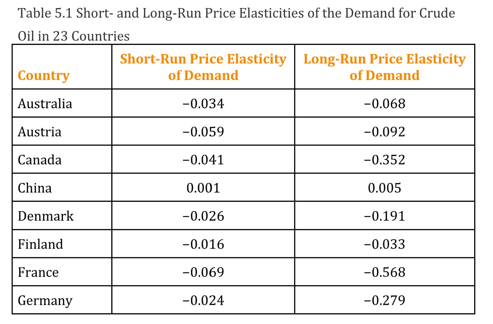
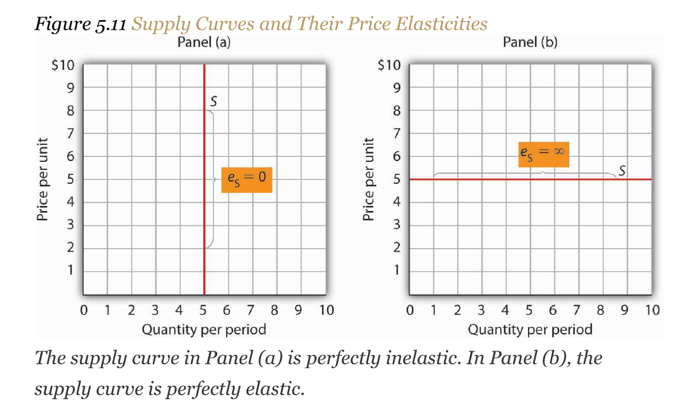

[graph03.pdf](https://www.yuque.com/attachments/yuque/0/2022/pdf/12393765/1672493845206-ab305afd-3d1e-487a-9f86-8c8363565e54.pdf)
# 1 Price Elasticity of Demand
## Defintion
:::info

**注意:**
$\epsilon<0$, 因为$\frac{\Delta Q}{\Delta p}<0$
. A positive percentage change in price implies a negative percentage change in quantity demanded, and vice versa. 
:::

## Calculation
:::info

:::
**Linear Demand Function Elasticity Formula**
**Linear Demand Function Elasticity Example**
**Interpretation:**

# 2 Elasticity Along the Demand Curve
## Downward-Sloping Linear Case
:::info
 $\epsilon=-b\frac{p}{Q}$, where $b$is constant and $\frac{p}{Q}$varies across the line, which means $\epsilon$varies.

**Perfectly Inelastic(完全非弹性):** 价格变化而需求没有任何变化。
**Inelastic(非弹性): **价格的变化的比例小于需求变化的比例。
**Unitary(单一弹性): ** 价格变化的比例等于需求变化的比例。
**Elastic(弹性): ** 价格变化的比例大于需求变化的比例。
**Perfectly Elastic(完全弹性):** 价格一有变化，需求就变成零或者正无穷。
:::

## Horizontal Demand Curve
:::info
`Demand Curve`上的所有点对应的都是`Perfect Elasticity`。

:::

## Vertical Demand Curve
:::info
`Demand Curve`上的所有点对应的都是`Perfect Inelastic`。

Demand for good won't change regardless of the price.
When there is no substitute, it doesn't matter what the price is.
:::

## Elasticity & Revenue
:::info
Is there a way to predict how a price change will affect total revenue? There is; the effect depends on the price elasticity of demand.

$R=P\cdot Q$, 于是可以将$R$看成是一个关于$P,Q$的二元函数$R(P, Q)$, 于是根据多元微分中的`Tangent Form`我们有: $\Delta R = R_Q \Delta Q + R_P \Delta P$, 其中$R_Q$就是$R$对$Q$的偏导，$R_P$就是$R$对$P$的偏导， 且$\begin{cases} R_Q = P\\R_P = Q\end{cases}$, 于是$\Delta R = P\cdot \Delta Q + Q\cdot \Delta P$, 于是我们有$\frac{\Delta R}{\Delta P}=Q+P\frac{\Delta Q}{\Delta P}\tag{1}$
同时，根据`Elasticity`的公式$\epsilon = \frac{\Delta Q\cdot P}{\Delta P\cdot Q}$, 我们有$Q\epsilon = \frac{\Delta Q\cdot P}{\Delta P}=P\frac{\Delta Q}{\Delta P}$, 于是我们代入$(1)$有:
$\frac{\Delta R}{\Delta P}=Q+P\frac{\Delta Q}{\Delta P}=Q(1+\epsilon)$
:::
**Example**

## Constant Price Elasticities Curve
:::info

:::

## Empirical Economics
> To say what elasticity is, we have to go to empirical model.
> Theoretical model only ensure that we can compare between the elasticity.
> Causation vs correlation.

# 3 Determinants of Elasticity
## Availability of Substitutes
:::info
如果一种商品或服务有许多接近的替代品，其需求的价格弹性的绝对值会更大。如果某种商品或服务有很多替代品，那么当这种商品或服务的价格上涨时，消费者很容易转向这些替代品。例如，假设福特汽车的价格上涨了。福特汽车有许多接近的替代品--雪佛兰、克莱斯勒、丰田等等。
**如果一种商品没有密切的替代品，其需求的价格弹性可能会小一些**。例如，汽油没有近似的替代品。汽油需求的价格弹性在中间阶段，例如3-9个月，一般估计约为-0.5。由于价格弹性的绝对值小于1，所以它是没有价格弹性的。不过，我们会想到，对某一品牌汽油的需求会比对一般汽油的需求有更大的价格弹性。
比如某些比较特定的药物。
:::

## Importance in Household Budgets
> 价格变化影响需求量的一个原因是它们改变了消费者可以购买的数量；一种商品或服务的价格变化影响了消费者收入的购买力，从而影响了消费者将购买的商品数量。当一种商品或服务在一个典型家庭的预算中很重要时，这种影响就更大。例如，牛仔裤价格的变化，在你的预算中可能比铅笔价格的变化更重要。假设两者的价格都翻倍。你本来计划今年买四条牛仔裤，但现在你可能决定买两条新的。相比之下，铅笔价格的变化可能会导致需求量的极少减少，因为铅笔在家庭预算中不可能占很大比重。一种物品在家庭预算中的重要性越大，需求的价格弹性的绝对值就可能越大。

## Time
> 假设明天早上的电价上涨了。需求量会发生什么变化？
> 答案在很大程度上取决于我们为反应留出多少时间。如果我们对明天下午需求量的减少感兴趣，我们可以预期反应会非常小。但如果我们给消费者一年的时间对价格变化做出反应，我们可以预期反应会更大。我们预计，当允许消费者有更多时间作出反应时，需求价格弹性的绝对值会更大。
> 考虑一下原油需求的价格弹性。经济学家`John C. B. Cooper`估计了1971-2000年期间23个工业化国家的原油需求的短期和长期价格弹性。库珀教授发现，几乎每个国家的价格弹性都是负的，而且长期价格弹性通常比短期价格弹性大得多（绝对值）。他的结果在表5.1"23个国家的原油需求的短期和长期价格弹性 "中报告。正如你所看到的，这项研究是在OPEC（石油输出国组织）出版的杂志上报告的，这个组织的成员从对其产品的无弹性需求中获得了巨大的利益。通过限制供应，占世界原油产量约45%的欧佩克能够对原油价格施加上升压力。这增加了欧佩克（和所有其他石油生产商）的总收入，并降低了总成本。

**Table**

## Takeaways
**Takeaways**

## Practice
> 

**Solution**

# 4 Responsivenes of Demand to Other Factors
## Income Elasticity
> 
> Studies show that most goods and services are normal, and thus their income elasticities are positive. Goods and services for which demand is likely to move in the same direction as income include housing, seafood, rock concerts, and medical services.
> If a good or service is inferior, then an increase in income reduces demand for the good. That implies a negative income elasticity of demand. Goods and services for which the income elasticity of demand is likely to be negative include used clothing, beans, and urban public transit. For example, the studies we have already cited concerning the demands for urban public transit in France and in Madrid found the long-run income elasticities of demand to be negative (−0.23 in France and −0.25 in Madrid). 
> 

## Cross-Price Elasticity
> Cross price elasticities of demand define whether two goods are **substitutes**, **complements**, or **unrelated**. If two goods are substitutes, an increase in the price of one will lead to an increase in the demand for the other—the cross price elasticity of demand is positive. If two goods are complements, an increase in the price of one will lead to a reduction in the demand for the other—the cross price elasticity of demand is negative. If two goods are unrelated, a change in the price of one will not affect the demand for the other—the cross price elasticity of demand is zero.
> 

## Takeaway
**Takeaway**

# 5 Price Elasticity of Supply
## Definition
> 

**Graph**

## Elasticity along the supply curve
### Horizontal/Vertical Curve
> 
> **Horizontal Curve:**
> 
> **Vertical Curve:**
> 

**Graph Explanations**

### Linear Supply Curve
> 

**Along Linear Supply Curve**

## Time's Effect on Supply Elasticity
> 时间在决定供应的价格弹性方面起着非常重要的作用。再看一下租金上涨对公寓供应的影响。假设一个城市的公寓租金上涨。
> 如果我们看的是几个月内的公寓供应曲线，那么租金上涨可能会促使公寓业主出租相对较少的额外公寓。随着租金的提高，公寓业主可能会更积极地降低其空置率，事实上，随着更多的人寻找公寓出租，这应该是相当容易实现的。阁楼和地下室很容易翻新并作为额外的单元出租。然而，在短时间内，供应反应可能是相当温和的，这意味着供应的价格弹性相当低。图`5.10` "公寓租金的增长取决于供应的反应程度 "中的供应曲线`S1`。正是在这样的时期，可能会有人呼吁进行租金控制。
> 如果考虑的时间段是几年而不是几个月，那么供应曲线可能会有更大的价格弹性。随着时间的推移，建筑物可以从其他用途中转换出来，新的公寓大楼也可以被建造出来。与较长时期相对应的供应曲线会像图`5.10`中的`S2` "公寓租金的增加取决于供应的反应程度"。

**Graph 5.10**

## Elasticity of Labor Supply
> 供应价格弹性的概念可以应用于劳动力，以显示劳动力供应数量如何对工资或薪金的变化作出反应。这种情况的有趣之处在于，有时会发现测得的弹性是负的，也就是说，工资率的提高与劳动力供给数量的减少有关。在大多数情况下，劳动供给曲线有其正常的上升斜率：较高的工资诱使人们工作更多。对他们来说，拥有更多工作带来的额外收入比拥有更多的休闲时间要好。然而，工资的增加可能导致一些从事高薪工作的人减少工作时间，因为他们的收入已经很高，他们宁愿有更多的时间进行休闲活动。在这种情况下，劳动供给曲线会有一个负的斜率。这种现象的原因将在后面的章节中得到更充分的解释。

## Takeaways
**Takeaways**

# 6 Effects of a Sales Tax
## Questions
> 在对一项新的销售税投票之前，立法者希望预测该税对`Market Price`、`Quantities`和`Tax Revenue`的影响。如果新税种会产生大量的价格上涨，投票支持该税种的立法者可能会在下次选举中失去工作。如果该税种不能提高大量的税收收入，选民的愤怒可能会更大。
> 政府使用两种类型的`Sales Taxes`。最常见的销售税被经济学家称为从价税(`ad valorem tax`)，一般人称为消费税(`sales tax`)。消费者每花一美元，政府就保留一部分，即，这就是从价税率(`ad valorem tax rate`)。日本的国家销售税是。如果一个日本消费者花日元买了一台任天堂`Wii`， 政府收取日元=日元=日元的税，而卖家收到日元=日元。联邦政府对在美国出售的每一加仑汽油征收美分。
> 在本节中，我们研究了关于销售税的影响的四个问题。
> 1. 具体的销售税对`Equilibrium Price`和`Quantities`以及`Tax Revenue`有什么影响？
> 2. `Equilibrium Price`和`Quantities`是否取决于具体税种是向供应商还是客户征收？
> 3. 是否像许多人所说的那样，对生产者征收的税款会转嫁给顾客？也就是说，消费者是否支付了全部的税收？
> 4. 可比的从价税和特定税对均衡价格和数量以及税收的影响是否相同？
> 一个税种对均衡价格和数量的影响有多大，以及有多少税款落在消费者身上，取决于供给和需求曲线的形状，这可以通过弹性来概括。仅仅知道供给和需求的弹性，我们就可以对新税种的影响做出准确的预测，并确定有多少税款落在消费者身上。

## Equilibrium Effects of specific Tax
> 我们用我们估计的玉米供需曲线来说明第一个关于特定税收的均衡效应问题的答案。我们首先假设从公司(农民)那里征收了一项新的`Specific Sales Tax`。如果`Consumer`给`Producer`支付的价格，政府拿走，所以`Producer`只保留。 
> 因此，在收税的情况下，`Producer`都只愿意生产比征收税前更少的产品，即供给曲线会发生偏移。缴税前，企业愿意以美元的价格每年供应亿蒲式耳玉米，如下图中的`Supply Curve`所示。税后，如果消费者支付美元，生产者只收到美元(=美元)，因此他们不愿意提供亿蒲式耳那么多的产品。如果`Producer`愿意提供这样的数量，消费者必须支付美元，这样企业就能在税后获得美元(= 美元)。由此可知税后供给曲线比原始供给曲线高美元。 
> 我们可以比较税前和税后的`Equilibrium Price`，以确定`Sale Taxes`的影响。面板中税前玉米供给曲线与玉米需求曲线的交点决定了税前均衡。均衡价格为美元，均衡量为。税收使供给曲线平移到，因此税后均衡为，其中消费者支付美元，农民获得美元= 美元，美元。因此，税收导致客户支付的均衡价格增加(美分)，均衡量下降()。虽然消费者和生产者因为税收而变得更糟，但政府获得的新税收为美元/蒲式耳  116亿蒲式耳/年= 亿美元/年。下图中阴影矩形的长度为亿/年，高度为美元/蒲式耳，因此**矩形的面积等于税收收入**。
> **因此，我们第一个问题的答案是: **
> 如果对`Producer`征收`Specific Sales Tax`，则顾客需支付的`Equilibrium Price`上升，`Equilibrium Quantities`下降，政府税收增加。
> 对于第二个问题, 我们有类似的推导:
> 
> 注意，征收税之后，`Equilibrium Price`实际上是税后的`Price`, 不一定就是`Demand Curve`和`Supply Curve`的交点。
> **结论就是:** 无论对`Producer`还是`Consumer`征收`Specific Taxes`, 税后的均衡状态都是一样的。且政府总能获利。

### Collected from producers
> 

### Collected from consumers
> 

## Firms and Customers Share the Burden
### Tax Incidence
> 

### Tax Effects Depend on Elasticities
> 

### Ad Valorem vd Specific Tax
> 
> 其实就是价格越低征收的税款的值就越小，所以图像会旋转。

## Subsidies
> 

