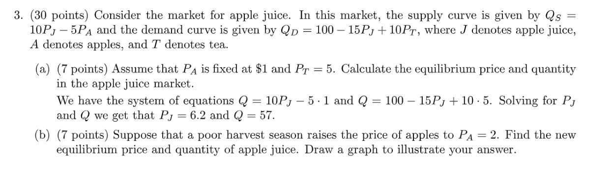
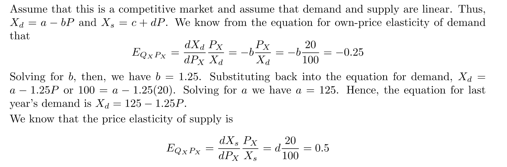

[assn01.pdf](https://www.yuque.com/attachments/yuque/0/2022/pdf/12393765/1672493620413-3ce5d358-66ec-441e-92ea-b3cd4d129a5d.pdf)
[soln01.pdf](https://www.yuque.com/attachments/yuque/0/2022/pdf/12393765/1672493620451-3a7d9519-e351-42fc-acfc-a709f67bb898.pdf)

# Q1 Supply and Demand
> 

**(a)**Heat makes people willing to eat ice cream, increasing the demand.

**(b)**从`Sales Taxes`一章中可知，如果对`Producer`征收税款的话，`Producer`的收入会降低，导致生产积极性下降，所以`Supply Curve`向左移动。

**(c)**罢工导致`Mexico`市场的`Supply`不足。

**(d)**罢工导致`Mexican textiles`的市场价格升高，由于`China`和`Mexican`存在替代关系，所以`China's textile`的需求量会增大。

**(e)**

# Q2 Elasticity
> 

# Q3 Equilibrium
> 

# Q4 Solve the equation
> 

**(a)**
**(b)**

