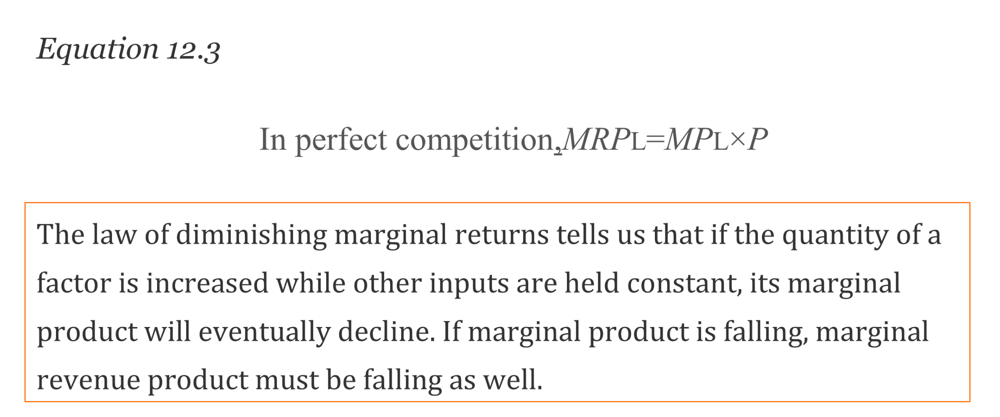
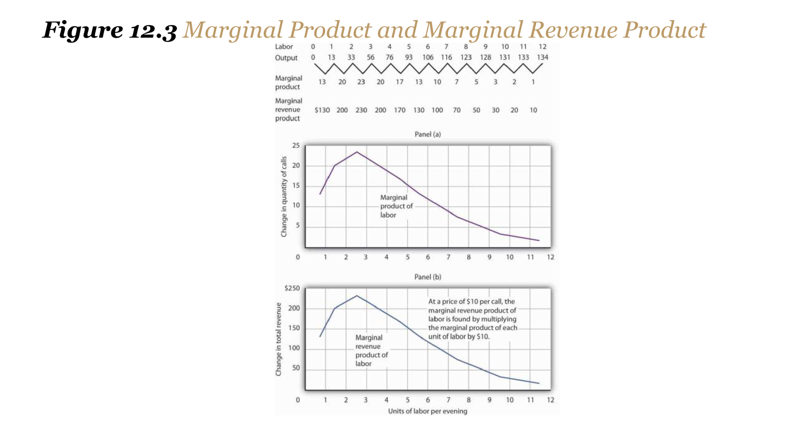
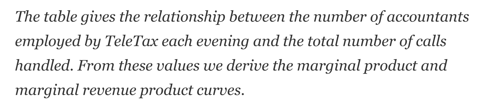
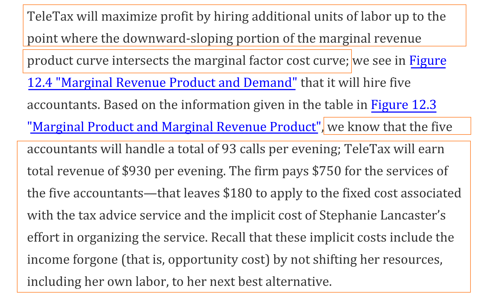
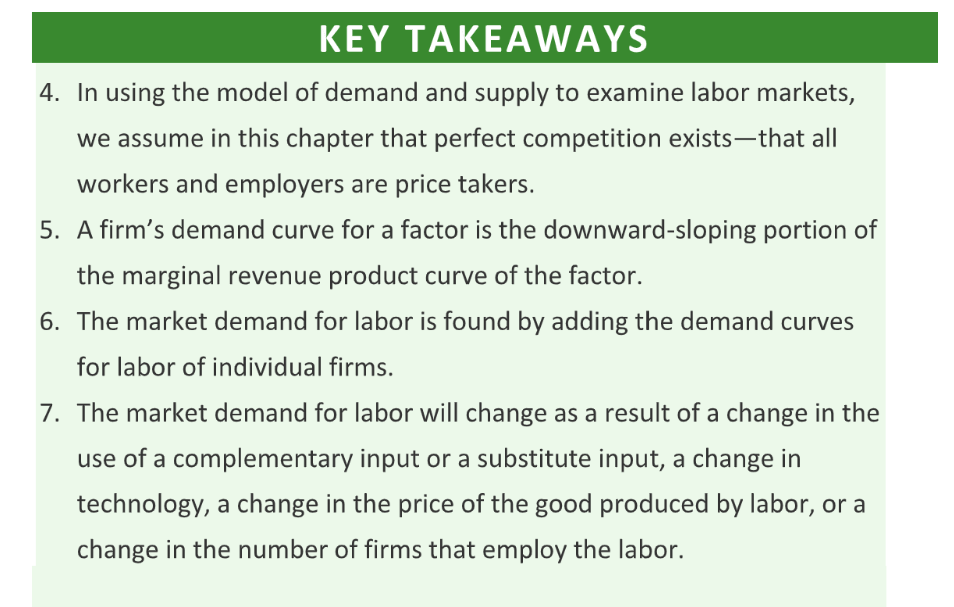

:::info
**Reading: **R&T Chapter 12
:::

# 1 The Demand for Labor
## Profit-Maximizing Firm
> A profit-maximizing firm will base its decision to hire additional units of labor on the marginal decision rule:** If the extra output that is produced by hiring one more unit of labor adds more to total revenue than it adds to total cost, the firm will increase profit by increasing its use of labor.** 
> It will continue to hire more and more labor** up to the point that the extra revenue generated by the additional labor no longer exceeds the extra cost of the labor.**
> 以下所有对于`Firm Revenue`的讨论都是基于一个假设`Perfect Competition Assumption`, 在这个假设下，所有的`Firms`都是所谓的受价者`Price Takers`，也就是他们只能对市场价格做被动的接收而不能主动干预定价过程。另外，在这个假设下，公司所能够收到的`Marginal Revenue = Market-determined price P`

## Marginal Revenue Product(MRP)
> 
> 怎么衡量一单位的生产因子(`factor of production`)在一定时期内给公司带来的收入呢, 我们有两步操作要完成:
> 1. 一单位的生产因子(`factor of production`)增加的公司的产出(`Output`)
> 2. 增加的产出会增加公司的收入。
> 
假设公司因为`additional unit of the factor of production`而产生的`marginal product`(`MP`)和`marginal revenue`(`MR`)分别是$MP$和$MR$，则`Marginal Revenue Product`是
> $MRP=MP\times MR$
> 在`Perfect Competition Assumption`下，我们有$MR=P$, 即$MRP = MP\times P$(运用了上面的假设 - **all workers and employers are price takers, 所以边际收益**`**MR**`才会由市场价`P`完全决定).
> 书中的原话是: The marginal revenue product of labor ($MRP_L$) is the marginal product of labor ($MP_L$) times the marginal revenue (which is the same as price under perfect competition) the firm obtains from additional units of output that result from hiring the additional unit of labor.
> 一个例子，假如公司雇佣了额外的劳工，这个劳工每天为公司贡献4单位的产出`4 units per day to a firm's production`，假设每单位产出在市场上定价是$\$20$(比如产出的是某些拉到市场上去卖的农产品), 则这个额外的劳工每天能为公司带来$4\times 20 = \$80$的`Revenue`。在`Perfect Competition`的假设下，市场定价就等于`Marginal Revenue`, 即$MR=P=\$20$。

## Law of diminishing marginal returns
> 

## Marginal Factor Cost(MFC)
> 现在假设有一家咨询公司，公司雇佣了很多接线员处理咨询请求，现在假设每笔业务的市场是$\$10$, 则在`Perfect Competition`的假设下，我们的`Marginal Revenue`就是$\$10$, 也就是每笔业务就能带来$\$10$的收益。现在假设公司刚刚成立，想要招人，我们从零人开始招:
> 1. 第一位接线员每天能够处理$13$个请求并完成。
> 2. 增加的第二位接线员每天能够新增处理$20$个请求并完成。(因为两位接线员可以分工处理自己最擅长的请求类型)
> 3. 增加的第三位接线员每天能够新增处理$23$个请求并完成。
> 
随着越来越多的接线员被招进公司，他们的`Margainal Returns`就会减少(`Law of diminishing marginal returns`)
> 4. 第四位接线员只能额外处理$20$个请求并完成。
> 5. 之后的接线员能够处理的请求数量递减。
> 
于是我们有了下面的`Marginal Product`和`Marginal Revenue Product`, 如下图所示:
> 
> 我们可以利用上面的图来推断这家公司最终会招多少员工。现在假设每位员工的工资是$\$150$, 这也是每额外招工的`Marginal Cost`, 也称为`Marginal Factor Cost`（**MFC**）。
> 
> 当`MRP = MFC`的时候，停止招工，最终确定在$5$名员工：
> 
> 如果员工工资更高的话，我们的`Marginal Factor Cost Curve`的$y$轴截距也会更大，从而公司招人的规模也会越小，反之越大。

**Alternative ways to explain**上面是从`MRP=MFC`的角度来分析确定公司的招人规模，而下面我们从`Marginal Benefit`和`Marginal Cost`的角度来分析。
假设第五个接线员的`Marginal Product`是$17$, 且`Marginal Benefit`是市场价$\$10$, 也就是每一笔业务的`Benefit`, 而`Marginal Cost`是每一笔业务的额外成本。而我们知道第五个接线员多接$17$笔业务的成本是$150$(工资)，则其`Marginal Cost`是$\frac{150}{17}=\$8.82$, 这比`Marginal Benefit`要低，也就是说我们完全可以招这第五个人进来。
假设第六个接线员的`Marginal Product`是$13$, 则其`Marginal Cost`是$\frac{150}{13}=\$11.54$,这比`Marginal Benefit`$\$10$要高，所以这笔买卖不值得，于是公司最多只会招$5$个人。

## Firm's Demand Curve
> `**Marginal Revenue Curve**`**的**`**downward-sloping**`**的部分蕴含着在不同的**`**Marginal Factor Cost**`**下公司会招多少员工的信息，这其实可以看做是公司的**`**Demand Curve**`**。**而我们又知道，$MRP = MP \times MR = MP \times P$(在`Perfect Competition`的假设下)。所以$MP$和$P$中任意一个变量发生了改变都会影响到`MRP Curve`的最终形状。

# 2 Changes in Production Factors
## Complementary Factors
> 当一个公司改变其使用的不同生产要素(`Factor of production`)的数量`quantities`时。劳动的边际产出`Marginal Product`可能会发生变化。拥有更多的员工参考手册`Reference Manual` 可能会使更多的会计人员的生产力提高, 这将增加他们的边际产出, 进而公司会增加对会计师的需求。
> When an** increase in the use of one factor of production(比如员工手册) increases the demand for another(会计的需求量)**, the two factors are **complementary factors of production.**
> One** important complement of labor is _human capital_**, the set of skills and abilities workers bring to the production of goods and services. When workers gain additional human capital, their marginal product rises. The demand for them by firms thus increases. **This is perhaps one reason why you have decided to pursue a college education.**

## Substitute Factors
> Other inputs may be regarded as substitutes for each other. A robot, for example, may substitute for some kinds of assembly-line labor. 机器人越多，我们对流水线工人的需求就越少。
> Two factors are **substitute factors **of production if the** increased use** of one lowers the demand for the other.

## Changes in Technology
> **Technological changes can increase the demand for some workers and reduce the demand for others.** 
> The production of a more powerful computer chip, for example, may:
> 1. Increase the demand for software engineers. 增加AI软件工程师的市场需求。
> 2. It may also allow other production processes to be computerized and thus reduce the demand for workers who had been employed in those processes. 取代一些AI就能完成的工种的招人规模，比如公务员，其需求数量会因为科技革命而减少。
> 
但不可否认，科技发展会大幅增加一个国家的经济产出。
> Technological changes have significantly increased the economy's output over the past century. The application of sophisticated technologies to production processes has boosted the marginal products of workers who have the skills these technologies require（有更多`human capital`的员工会更受青睐）. That has:
> 1. Increased the demand for** skilled workers(with human capital).** 
> 2. The same technologies have been **a substitute for less-skilled workers**, and the demand for those workers has fallen. 
> 
As the Case in Point on the impact of computer technology implies, envisioning the impact of technological change on demand for different kinds of labor may be something to keep in mind as you consider educational options.** As you consider your major, for example, you should keep in mind that some occupations may benefit from technological changes; others may not.**

## Changes in Product Demand
### Factor Demand⭐⭐⭐⭐⭐
> Demand for factors that produce a product depends on the demand for the product itself
> **Factor demand is said to be derived demand. **That is, factor demand is derived from the demand for the product that uses the factor in its production.
> Suppose, for example, that the demand for airplanes increases. The price and quantity of airplanes available will go up(需求曲线上移导致市场价格增加).** **
> **A higher price for airplanes increases the marginal revenue product of labor of airplane - assembly workers and thus increases the demand for these workers. **
> 1. **在**`**Perfect Competition Market**`**下，**`**MRP=P**`**, 和市场价一样。**
> 2. **每个**`**Assembly worker**`**的**`**MRP**`**增加了，就等于说一个企业的**`**MRP**`**曲线（前文说过**`**MRP**`**的**`**downward part**`**就好像是需求曲线，那么既然**`**MRP**`**增加了，就相当于公司对于**`**Assembly Workers**`**的需求曲线上移了，也就是**`**demand**`**增加了。）**
> 
Just as increases in the demand for particular goods or services increase the demand for the workers that produce them, so reductions in demand for particular goods or services will reduce the demand for the workers that produce them. 
> An example is the relationship between the demand for train travel and the demand for conductors. Over the years, the fall in demand for train travel has reduced the demand for railroad conductors.

### Summary
> A change in demand for a **final product(最终在市场上作为商品售出的产品，用于GDP的计算中)** changes its price, at least in the short run. 
> An increase in the demand for a product：
> 1. Increases its price
> 2. Increases the demand for factors that produce the product. 
> 
A reduction in demand for a product:
> 1. Reduces its price
> 2. Reduces the demand for the factors used in producing it. 

## Changes in the Numbers of Firms
### Aggregated demand for labor
> We can determine the demand curve for any factor by** adding the demand for that factor by each of the firms using it**. If more firms employ the factor,  the demand curve shifts to the right. A reduction in the number of firms shifts the demand curve to the left. 
> For example, if the number of restaurants in an area increases, the demand for waiters and waitresses(`waiters`和`waitresses`作为生产要素) in the area goes up. We expect to see local wages for these workers rise as a result.

# Key Takeaways
> 

