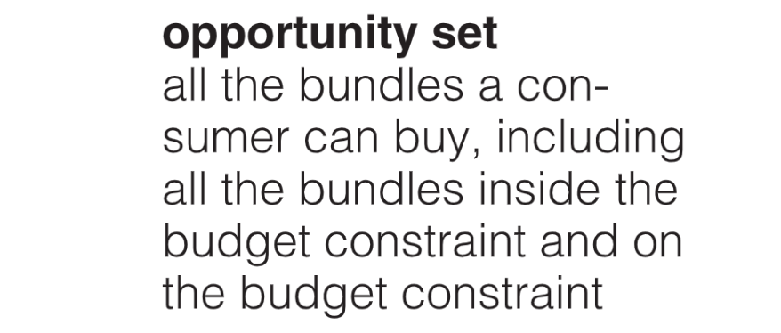
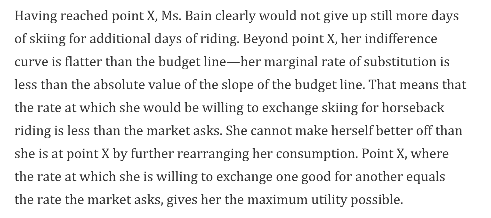

> R&T Ch 7.3
> Perloff Ch4

# 1 Budget Lines
## Definition
> 

## Explanation on the Graph
> 
> 纵轴截距(用点`D`表示), 表示的是如果`Ms.Bain`把自己所有的`Budget`都投入到`Skiing`之后的服务时间。
> 横轴截距(用点`E`表示), 表示的是如果`Ms.Bain`把自己所有的`Budget`都投入到`Horseback Riding`之后的服务时间。

## Slope - MRT
> 前文我们知道，`Budget Line of Two goods`是一根直线，我们可以计算它的斜率，上图中的斜率是$\frac{-5}{5} = -1$, 通过计算横轴和纵轴的截距之比就可以得出这个斜率的大小。
> 假设`Ms.Bain`的预算是`B`, `Skiing(纵轴)`的价格是$P_S>0$, `Horseback Riding(横轴)`的价格是$P_H$, 则我们的斜率就是`Slope=`$-\frac{\frac{B}{P_S}}{\frac{B}{P_H}}=-\frac{B}{P_S}\times \frac{P_H}{B}=-\frac{P_H}{P_S}$。
> 我们可以这样记忆，就是横轴上的商品价格除以纵轴上的商品价格再取负号即可。

:::info
下面是另一个例子，一般而言，我们会把这个斜率叫做`MRT`: `Marginal Rate of Transformation`(边际转换率)

:::

## Change the budget lines
:::info

:::

# 2 Indifference Curves
## Definition
:::info

:::

## Slope - MRS
:::info

$MRS = -\frac{\Delta Y}{\Delta X} = -\frac{MU_X}{MU_Y}$
:::

## The Utility-Maximizing Solution
:::info
在之前的章节中，我们了解到，如果我们的点在某条`Indifference Curve`上滑动的话，总效用`Total Utility`是不变的，也就是说$MU_X\Delta X=MU_Y \Delta Y$。同时，如果我们在$X$和$Y$两种商品之间做选择的话，当两种商品带来的`Marginal Benefit`相同时，即$\frac{MU_X}{P_X} = \frac{MU_Y}{P_Y}$时，消费者的效用是最大化的，也就是消费者没有任何调整消费篮子的欲望。另外，我们刚刚介绍的`Budget Line`中蕴含着一组关系: $P_X\Delta X=P_Y\Delta Y$, 即$\frac{P_X}{P_Y}=\frac{\Delta Y}{\Delta X}$。 
假设现在消费者想要花光所有的钱$B$, 即我们有三个等式同时满足: $\begin{cases} \frac{MU_X}{MU_Y}=\frac{\Delta Y}{\Delta X}\\ \frac{MU_X}{P_X}=\frac{MU_Y}{P_Y}\\ \frac{P_X}{P_Y}=\frac{\Delta Y}{\Delta X}\end{cases}$, 现在我们整理一下可以得到一组非常重要的用来求`Utility-Maximizing Solution`的等式关系:
$MRS_{X,Y} = \frac{MU_X}{MU_Y}=\frac{P_X}{P_Y}$
:::

### Interior Solution
:::info

:::

### Corner Solution
> 

## The Marginal Decision
:::info
**Marginal Decision Rule:** That rule says that additional units of an activity should be pursued, if the marginal benefit of the activity exceeds the marginal cost. The observation of that rule would lead a consumer to the highest indifference curve possible for a given budget.
**下面建议全文背诵：**

假设横轴是$X$轴，纵轴是$Y$轴。
现在我们从`S`点开始，在这一点，我们可以发现`MRS`比`MRT`要大，比如`MRS=5, MRT=2`, 则消费者愿意放弃$5$单位的$Y$换取$1$单位的$X$, 而沿着`Budget Line`往右的话，消费者只需要放弃$2$单位$Y$, 所以消费者当然乐意，于是消费者倾向于往右调整，消费更多的$X$和更少的$Y$, 最终到达`D`点。
因为过`D`点我们也可以画出一条`Indifference Curve`, 如上图所示，此时由于`MRS > MRT`，根据上面的分析，我们还会消费更多的$X$, 最终到达点$X$, 达到平衡。

:::

## Utility Maximization and Demand
:::info

:::

## Different Shapes of Indifference Curves
:::info

:::

# Key Takeaways
**Key Takeaways**

# Concept Quizzes
:::info

:::

