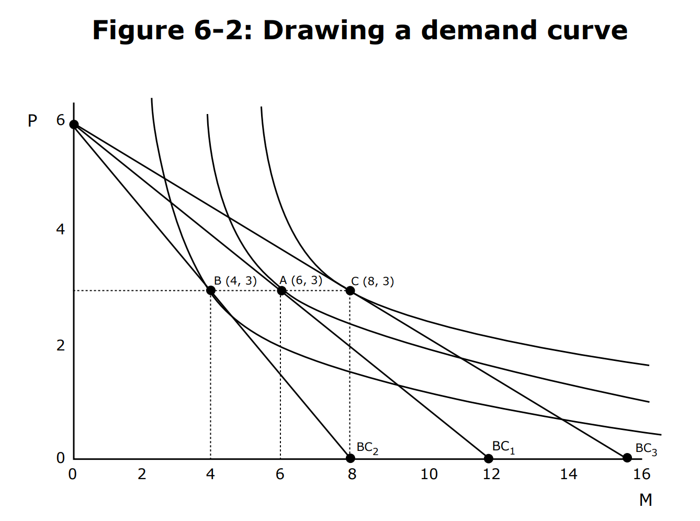
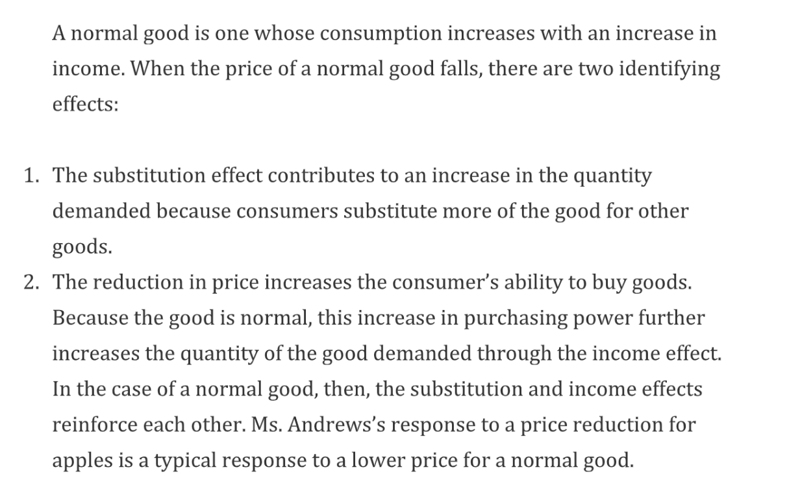
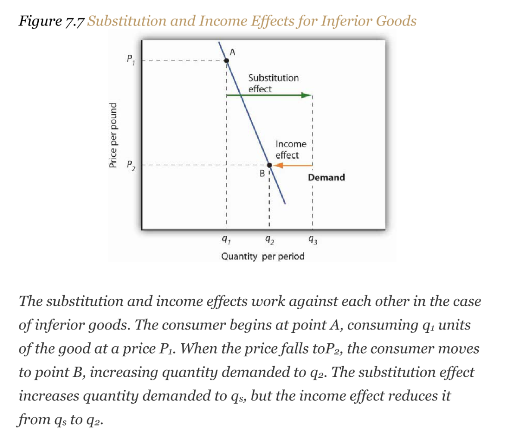

# 1 Utility Maximization and Demand
## Derive Individual Demand Curve
### Using Marginal Benefit&Cost
> 假设现在`Mary`可以从苹果$A$和橘子$O$中选择，市场价分别为$P_A$和$P_B$。假设现在市场价分别是$\begin{cases}P_A=\$2\\P_O=\$1\end{cases}$, 且她有`$20`的预算可以支配，且我们假设`Mary`会`Maximize Her Utility`, 假设现在$\frac{MU_A}{2}=\frac{MU_O}{1}$, 这表明我们在`$20`的条件下已经达到了`Utility Maximization`, 假设这时候$\begin{cases} Q_A = 5\\Q_B=10\end{cases}$。
> 现在市场行情发生了一些变化，假设现在苹果大丰收导致价格变成了$\begin{cases}P_A=1\\P_B=1 \end{cases}$, 此时由于`Mary`手中的苹果和橘子的数量还没有根据市场价格调整，所以$MU_A$和$MU_O$没有变化。然后现在价格发生了变化，我们有$\frac{MU_A}{1}>\frac{MU_O}{1}$, 此时假设`Mary`仍然遵守着`Utility Maximization`的行为逻辑，则`Mary`会去购买更多的`Apples`， 因为`Apples`的`Marginal Benefit`更大。
> 但是随着`Mary`购买越来越多的`Apples`之后，$MU_A$会逐渐下降，直到$\frac{MU_A}{1}=\frac{MU_O}{1}$。假设`Mary`仍然花完了其所有的预算，并假设此时$\begin{cases}Q_A=12\\Q_B=8 \end{cases}$, 我们就可以结合之前的条件得到一条`Mary`的价格需求曲线:
> 

**注意**

### Using Utility Maximization
:::info
$P_P = 16$, $P_M = 8$, $B = 96$, `Movie`价格的变化，消费者的`Budget Line(Budget Constraint)`发生变化，对应的`Utility Maximization Point`也会发生变化，如下图所示:

现在我们得到了三个点, $A,B,C$, 分别是消费者在不同的`Movie`价格下做出的选择（`Movie`的不同数量）。那么回忆一下`Demand Curve`的定义，就是$P_M$关于$Q_M$的函数，于是知道了`A,B,C`三点，我们就可以大概地推测出消费者的`Demand Curve`大概长什么样子，如下图所示:

总结: 如果我们想要知道一个消费者的`Demand Curve`，我们需要这个消费者的`Utility Function`, 然后在不同的`Budget Constraint`下`Maximize Utility Function`, 得到不同的价格和需求的二元组，根据这些二元组(坐标系上的点)，就可以大致推断出`Demand Curve`的走向。
注意: 上面的例子中有一个假设，就是`No **Cross-price** Elasticity(Change in the demand of other good when the price of one good changes.)`，就是`Movie`的价格变化的时候`Pizza`的需求量不会发生变化。
:::
 

## Derive Market Demand
> 

## Substituting and Income Effects ⭐⭐⭐⭐⭐
> 
> `Substitution Effect:` 固定消费者的购买力(固定我们的`Utility`)，比如商品价格下降了，消费者的购买力肯定会提升，但是我们要假定购买力(`Utility`)和原来一样，也就是我们要假定消费者仍然只购买了原来的商品数量。此时商品数量的相对增加量就是`Substitution Effect`
> `Income Effect`: 还原消费者的购买力之后导致的商品消费数量的增加就是`Income Effect`。
> `Substitution Effect`和`Income Effect`的相对大小取决于消费者对于商品的`Marginal Utilities`随着商品消费数量的变化。
> 首先来看`Substitution Effect`:
> 首先商品$A$的价格下降($P_A'<P_A$)，导致原本满足的等式$\frac{MU_A}{P_A}=\frac{MU_B}{P_B}$变成了$\frac{MU_A}{P_A'}>\frac{MU_B}{P_B}$,此时由于购买$A$带来的`Marginal Benefit`大于购买商品$B$的`Marginal Benefit`，消费者会倾向于购买更多的$A$以达到在新的价格体系下的`Utility Maximization`。
>    - 如果商品$A$数量消费增多导致`Marginal Utility`下降很快的话，也就是说如果我多买一单位商品$A$就会导致$MU_A$下降很多的话，那么我因为`Substitution Effect`而增加的商品$A$的单位数量其实就很小，因为$\frac{MU_A}{P_A}$很快就会和$\frac{MU_B}{P_B}$一致。那么`Substitution Effect`就不明显。
>    - 如果商品数量消费增多导致`Marginal Utility`下降很缓慢的话，也就是说如果我多买一单位商品$A$并不会导致$MU_A$变化很多，那么我我需要购买很多商品$A$才会使得$\frac{MU_A}{P_A}$和$\frac{MU_B}{P_B}$一致。那么`Substitution Effect`就会很明显。
>    - 所以综上, `substitution effect`的大小看的是消费者的`Marginal Utility`随着商品购买的变化情况。
>    - 同时，`Substitution Effect`永远是`Negative`的， 如果一个商品价格增加了那么`substitution effect`永远会使得在这种商品的消费量减少(`Move away from the goods with price increase`) 。
> 
然后再看`Income Effect`:
> `Income Effect`主要受`Income Elasticity`的影响。如果收入的增加会导致消费者对商品$A$的购买力大幅度增加，那么`Income Effect`就比较明显。同时如果商品$A$在消费者的消费结构中所占的比例比较大的话，那么`Income`的增加就会导致消费者对商品$A$的购买力增加，进而`Income Effect`就比较明显。
> 联系我们之前学过的`Elasticity`的概念, 我们有:
> All other things unchanged, the larger the substitution effect, the greater the absolute value of the price elasticity of demand. When the income effect moves in the same direction as the substitution effect, a greater income effect contributes to a greater price elasticity of demand as well. 
> 本质上，`substitution effect + income effect`分解了在价格变化的条件下消费者在他的`Demand Curve`上移动的不同因素(`substitution`和`income`)。
> 可以确定的是，`substitution `

**Graphical Example**⭐⭐⭐⭐⭐ **- Normal Good**
一开始我们在`BC1`, 然后$Movie$的价格发生变化，`BC1`实际上应该要变化到`BC2`, 但是我们为了探究`Substitution Effect`，我们要先假设`Utility`不变(购买力不变)， 将`BC2`平移到`BC3`的位置使得`Utility`不变。

## Generating an Engel Curve
:::info

至于为什么这里画出的`Demand Curve`是一些平行的`Curve`而不是前一小节中的仅仅一条`Demand Curve`, 是因为我们知道`Demand Curve`是可以由$(P_M, Q_M)$决定的。也就是说，`Demand Curve`是$P_M$关于$Q_M$的一元函数，但是`Income`作为外部因素，会使得`Demand Curve`发生平移，于是我们需要画出一系列平行的`Demand Curve`。

:::

## Normal/Inferior/Giffen Goods
> 上面的例子主要是`Substitution effect`和`Income Effect`是同方向的。但是,  There are cases in which thesubstitution and income effects move in opposite directions. We shall explore these ideas in this section. 在开启本章学习之前，我们先回顾一个重要的概念，就是`Income Elasticity of Demand`, 数学表达式是$\gamma= \frac{\frac{\Delta Q}{Q}}{\frac{\Delta I}{I}}$, 而这个概念在我们用于判断一种商品是`Normal Good`还是`Inferior Good`是非常高效的。
> 一般而言，如果$\gamma>0$，则这种商品是`Normal Good`，如果$\gamma < 0$, 则这种商品是`Inferior Good`。
> 而在`Normal Good`之中，如果$\gamma < 1$, 则我们称其为`Necessities`, 如果$\gamma >1$, 则我们称其为`Luxuries`

 

### Normal Goods
> 

**Graphical Example**

### Inferior Goods
> 

**Graphical Interpretation of inferior goods**

### Giffen Goods
:::info
When price goes up, you want more of it. Non-existential in real world, but exists in conceptual world.
:::

## Summary
:::info
总的来说，`substitution effect`主要和`Marginal Benefits`和`Marginal Cost`有关，而`income effect`主要和`Goods`是否是`inferior/normal`有关。
:::

# 2 Food Stamps Versus Cash
:::info

这里我们发现消费者$x$和消费者$y$的`Utility Maximization Point`是不一样的。我们来分析一下原因。
如果我们直接给每个消费者都发$500$元钱的话，那么消费者相当于收入增加了$500$，可以随心所欲的化这$500$元钱。在图中我们知道，消费者$x$在得到了$500$元之后的`Indifference Curve`从$I_2$移动到了$I_3$, 消费篮子从$(400,600)$变成了$(400, 1100)$, 因为消费者$x$在`All other good`上多花了$500$。
消费者$y$因为得到了这$500$元，消费篮子从$(900, 100)$变成了$(1200,300)$。
现在，假设我们给每个消费者发的不是$500$元可任意支配的现钞，而是$500$元的食品代金券，也就是这$500$元不能花在`All other good`上。此时对于$y_1$来说，因为他本来在`Food`上花了$900$元钱，在`All other good`上花了$100$元钱。此时$y1$可以在`Food`上少花$500$的现金而是用代金券来来购买食物，省下的$500$元可支配现金就可以去购买`All other goods`和更多的`Food`, 根据消费者自己的医院，可以达到$y_2$的状态。
但是对于$x_1$来说，他原来在`Food`上只花了$400$元钱，所以他没有办法在`Food`上少花$500$元钱，而是只能少花$400$元钱，然后使用$500$的代金券买$500$元的食物，省下的$400$元钱全部花在`All other goods`上，达到$x_3$的消费篮子。如图所示因为`Food Stamp`的政策，消费者$x$的`Maximum Utility`实际上是没有直接发$500$元钱来的高的。
**既然消费者会**`**Worse Off**`**, 为什么要给**`**Food Stamp**`**而不是直接发钱呢?**
因为`Food Stamp`限制消费者只能将$500$元钱花在食品上，这样可以限制消费者的权力，比如限制消费者购买一些非法商品(冰毒等)，从而维系社会稳定。
**但是我们怎么知道消费者是属于那种对**`**Food Stamp**`**不**`**Care**`**人群(比如消费者**$y$**), 还是属于**$x$**?**
我们可以看看（比如可以做社会实验）这个消费者是否愿意在食品上花超过$500$元钱。如果愿意，则属于消费者$y$, 如果不愿意，则属于消费者$x$。
:::

# 3 Exercises 
:::info

:::

