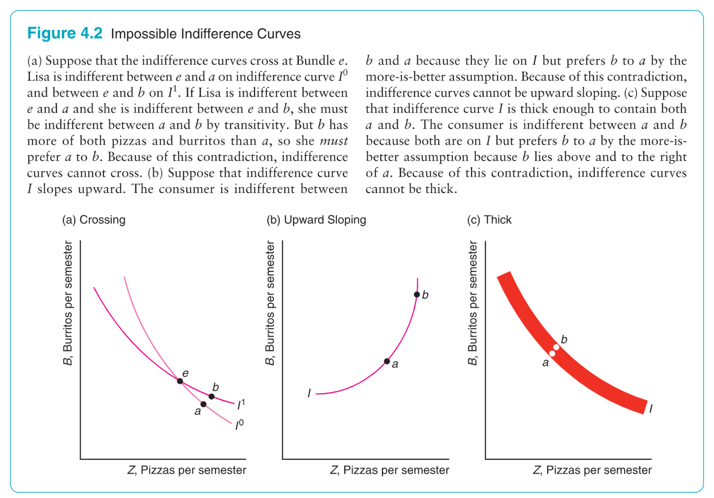
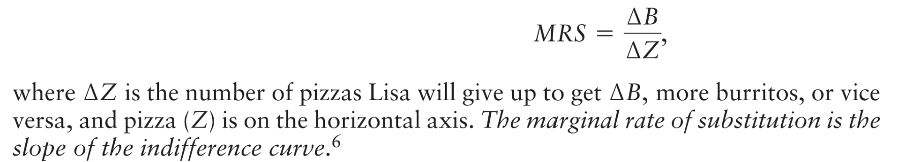
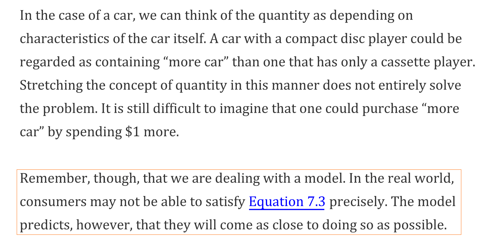

> R&T: Ch7 7.1 7.2 1~2 7.3.2
> Perloff: Ch4

[Recitation 02.pdf](https://www.yuque.com/attachments/yuque/0/2023/pdf/12393765/1673662055496-9f96de4e-d1f0-4c90-9cf0-6169012d1369.pdf)

# 1 Preferences
## Preferences Assumption
> 

## Indifference Curve
> 

## Willingness to Substitute between goods
### Marginal Rate of Substitution(MRS)
> 
> The marginal rate of substitution is the slope of the indifference curve.  Lisa’s marginal rate of substitution of burritos for pizza is:
> 
> 一样东西拥有的数量越多，我们就越倾向于那他们和其他东西交换，因为根据边际效应递减，我们对这件东西的价值评估就会越低。换句话说，假设我们可以在A和B之间进行选择，如果我们有很多A了，那么我们对A的价值估算就会下调，其实就是越不想要这个东西，这时候我们会愿意用很多的A去换哪怕是一点点B。所以我们的`Indifference Curve`就**必须**是类似像左上图一样的`Convex`的形状。
> 

### Perfect Substitutes & Complements
> 

# 2 Concept of Utility
## What is Utility
> We cannot measure utility, which is elusive. But economists assume that we can, and our satisfaction we gained when we buy goods is equivalent to the utility we get.

## Utility Function
> 

## Total Utility& Marginal Utility
> If we could measure utility, total utility would be the number of units of utility that a consumer gains from consuming a given quantity of a good, service, or activity during a particular time period. The higher a consumer's total utility, the greater that consumer's level of satisfaction.
> Marginal Utility tends to decline beyond some level of consumption, which follows the law of diminishing marginal utility.

## Marginal Benefit & Cost
> The marginal decision rule states that an activity should be expanded if its marginal benefit exceeds its marginal cost. 
> - The **_marginal benefit_** of this activity is** the utility gained by spending an additional $1 on the good.**
> - The **_marginal cost_** is** the utility lost by spending $1 less on another good.**
> 
**Marginal Benefit:**
> 对于商品$X$来说，我们可以定义`Utility gained by spending an additional dollar on good X`, 为$\frac{MU_X}{P_X}$, $MU_X$表示我以价格$P_X$多购买一单位的商品$X$获得的`Marginal Benefit`是$MU_X$。
> 假设商品$MU_X=4$且$P_X=2$, 则商品$X$的`Marginal benefit`就是$\frac{4}{2}=2$, 如果$\begin{cases} MU_X=1\\P_X=2\end{cases}$, 则其`Marginal Benefit`是$\frac{MU_X}{P_X}=\frac{1}{2}=0.5$
> **Marginal Cost:**
> 对于商品$X$来说，我们可以定义`Utility lost by spending one less dollar on good X`, 为$\frac{MU_X}{P_X}$, $MU_X$表示我以价格$P_X$少购买一单位的商品$X$获得的`Marginal Cost`是$MU_X$。
> 现在我们引入多个商品之间的比较:
> 假设消费者现在可以在两种商品$X,Y$之间选择, 如果消费者在$X$上的`Marginal Benefit`比在$Y$上的要多， 即$\frac{MU_X}{P_X}>\frac{MU_Y}{P_Y}$, 则商品$X$的`Marginal Benefit`比$Y$的`Marginal Benefit`要多。
> 综上:
> 1. 从`Benefit/Cost`角度，我们可以说: The marginal benefit of shifting $1 from good $Y$to the consumption of good$X$exceeds the marginal cost. 
> 2. 从`Marginal Utility`角度，我们可以说: The gain from spending an additional $1 on good$X$exceeds the loss in utility from spending $1 less on good $Y$. The consumer can increase utility by shifting spending from $Y$ to $X$.
> 
但是随着我们购买的$X$或者$Y$的数量越来越多，我们会发现$MU_X$和$MU_Y$也会相应的发生改变，也就是我们的`Marginal Utility`会发生相应的改变。其中:
> 1. $MU_X$会随着购买的$X$的数量的增加而逐渐减小，$MU_Y$会随着购买的$Y$的数量的减小而逐渐增加。
> 2. 结果就是在$P_X$和$P_Y$都不变的情况下(比如`Market`已经达到了`Equilibrium`的情况)，$\frac{MU_X}{P_X}$会逐渐减小，而$\frac{MU_Y}{P_Y}$会逐渐增大，最终$\frac{MU_X}{P_X}> \frac{MU_Y}{P_Y}$的关系会转变成$\frac{MU_X}{P_X}=\frac{MU_Y}{P_Y}$, 此时我们达到了`Total Utility Maximization Point`。
> 3. 此时我们可以说， `Marginal Benefit`of $X$和`Marginal Cost`of $X$达到了一致。
> 4. 如果我们在不止两个商品之间做选择的话，我们会在$\frac{MU_A}{P_A}=\frac{MU_B}{P_B}=\cdots=\frac{MU_N}{P_N}$的时候达到`Maximum Total Utility`

## The Problem of Divisibility
> 
> 前文探讨了多花一元带来的`Marginal Utility`的提升，那么多花一元能买多少单位的商品呢？半个？0.1个? 所以我们需要假设商品是可以无限分割的，也就是**商品是连续可分割**的这一假设。
> 
> 比如汽车，我们只能说一辆有更多功能的汽车会比功能少的汽车多一点点`quantity`。
> 记住，上述仅仅是一个模型，实际情况更复杂。

## Key Takeaways
> 

# 3 Concept Check
## Q1 Preferences
> 

## Q2 More is Better
> 

## Q3 Marginal Utility
> 

## Q4 MRS
> 

## Q5 Principle of Diminishing MU
> 

