[assn02.pdf](https://www.yuque.com/attachments/yuque/0/2023/pdf/12393765/1674741573360-ff49de62-dab3-4e3d-8ea4-2b1ea8cce98b.pdf)
[soln02.pdf](https://www.yuque.com/attachments/yuque/0/2023/pdf/12393765/1674741573400-a3dfb510-1e4f-49d6-9f8c-fc067ad97151.pdf)

# P1 Rational Preference
:::info
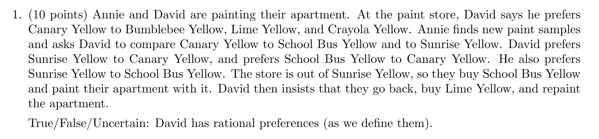
考察知识点: `Rational Preference`的三个性质, `More is better, transitivity, and Completeness(不同的市场篮子可以比较)`, 违反了任意一个就不是`Rational Preference`
:::
**Solution**
1. He prefers Canary Yellow to Bumblebee Yellow, Lime Yellow, and Crayola Yellow.
2. David prefers Sunrise Yellow to Canary Yellow, and prefers School Bus Yellow to Canary Yellow.
3. He also prefers Sunrise Yellow to School Bus Yellow.
4. David then insists that they go back, buy Lime Yellow to replace School Bus Yellow

前面三点得出: Sunrise > School Bus > Canary > Bumblebee, Lime, Crayola
第四点得出: Lime > School Bus
于是他违反了Transitivity, 所以他没有`Rational Preference`, 答案是`False`

# P2 Indifference Curve
:::info
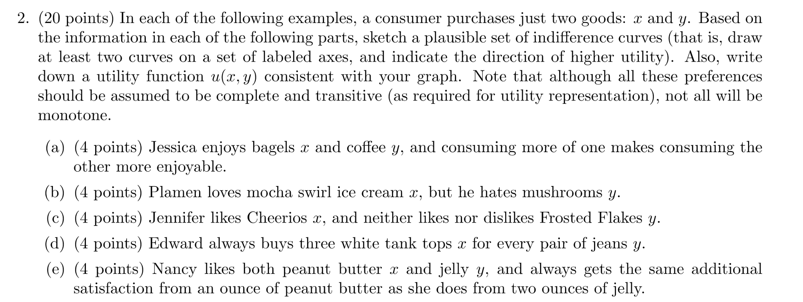**考察知识点:** `Utility Function`,$U(x,y)$
:::
**(a) **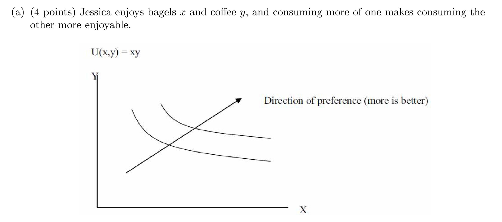
**(b)**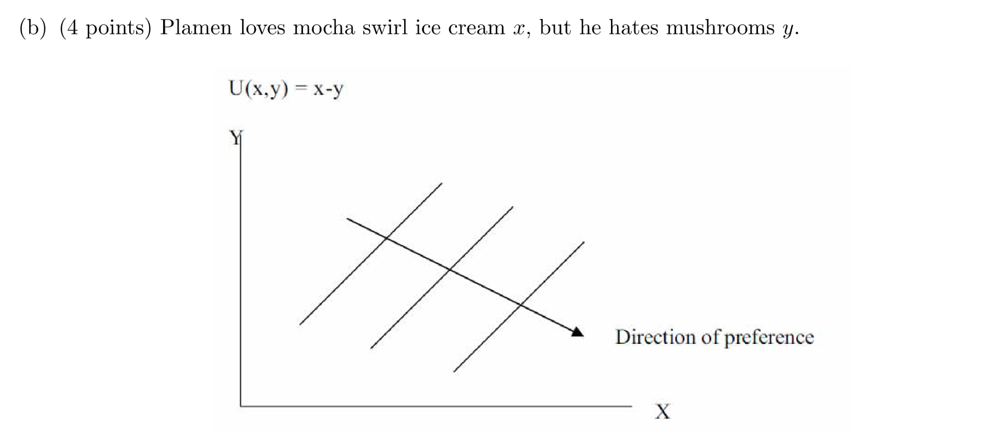
本题直接画出`Indifference Curve`不太现实，而是最好从函数表达式入手，因为题目描述告诉我们，越多$x$和越少的$y$带来的效用越大，这说明$u(x,y)$和$x$成正比，和$y$成反比。于是我们可以给出表达式$u(x,y)= x-y$, 然后画出`Indifference Curves`。
**(c)**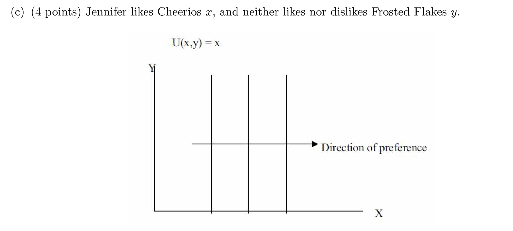
对于多元效用函数$u(x,y)$来说，题干表明$y$的增加并不会带来任何关于$u(x,y)$的变化量，这说明$\frac{\partial u}{\partial y}=0$, 于是我们可以令$u(x,y) = x$，从而画出垂直于$x$轴的`Indifference Curves`
**(d)**⭐⭐⭐⭐⭐函数表达式值得注意， **Perfect Complement**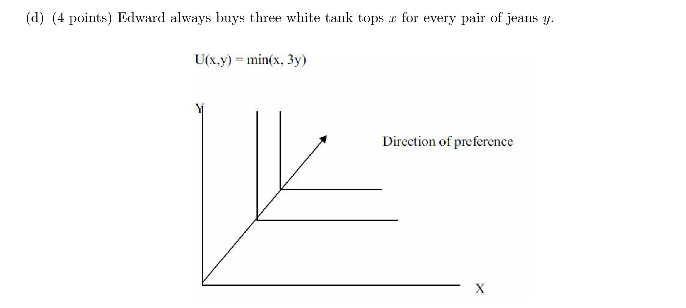
`Direction of Preference`的斜率是$\frac{1}{3}$, 至于为什么是呈$90$度的图像，是因为$x$和$y$一定要按照一定的配比消费，在此配比的基础上$x$和$y$的所有变化都无法增加和减少`Total Utility`。
**(e) Perfect Substitute**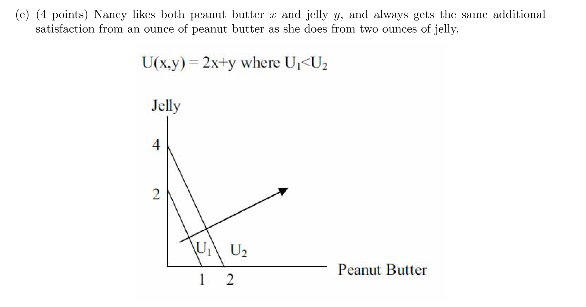

# P3 Utility Maximization I⭐⭐⭐⭐⭐
:::info
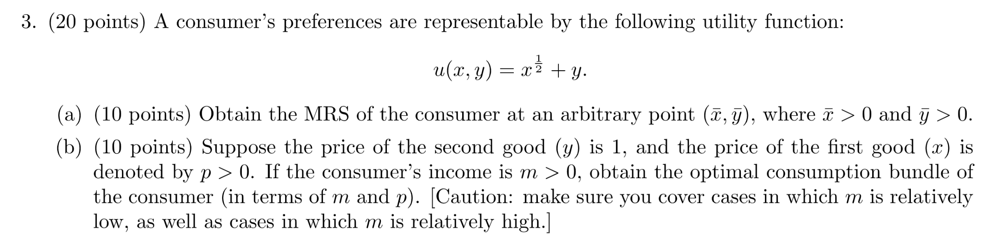
:::
**(a) 计算MRS**首先我们求偏导得到$\begin{cases}\frac{\partial u(x,y)}{\partial x}=MU_X=\frac{1}{2\sqrt{x}}\\\frac{\partial u(x,y)}{\partial y}=MU_Y=1 \end{cases}$
所以根据$MRS=-\frac{\Delta Y}{\Delta X}=-\frac{MU_X}{MU_Y}$, 我们有$-\frac{MU_X}{MU_Y}=-\frac{1}{2\sqrt{x}}$, 于是对于任意一点$(\bar{x}, \bar{y})$, $MRS_{(\bar{x},\bar{y})}=-\frac{1}{2\sqrt{\bar{x}}}$。
**(b) Utility Maximizing Bundle**我们有$\begin{cases}P_X=p\\P_Y=1\\B=m\end{cases}$, 同时有$\begin{cases} MRT = -\frac{P_X}{P_Y}=-p \\MRS = -\frac{1}{2\sqrt{x}}\\p\cdot Q_X+Q_Y=m\end{cases}$, 于是$Q_X=\frac{1}{4p^2} >0$(假设$p>0$)
此时$p\cdot \frac{1}{4p^2} +Q_Y=m$, 即$Q_Y=m - \frac{1}{4p}$，现在我们要做的就是讨论$Q_Y$的正负性来判断这个`Bundle`是否是`Interior Solution`或者是`Corner Solution`。
如果$Q_Y<0$， 即$m < \frac{1}{4p}$，即$m$特别小的时候，我们得到的是`Corner Solution`, 此时我们的`Bundle`就是$(Q_X,Q_Y)=(\frac{m}{p}, 0)$。
如果$Q_Y>0$，即$m>\frac{1}{4p}$时，即$m$较大的时候，我们得到的是`Interior Solution`, 此时我们的`Bundle`就是$(Q_X,Q_Y)=(\frac{1}{4p^2}, m-\frac{1}{4p})$。
如果我们将这个问题变形成最优化问题（拉格朗日乘子法，详见`18.02SC多元微分`中的讲解），就有下面的一般化解法，值得学习:
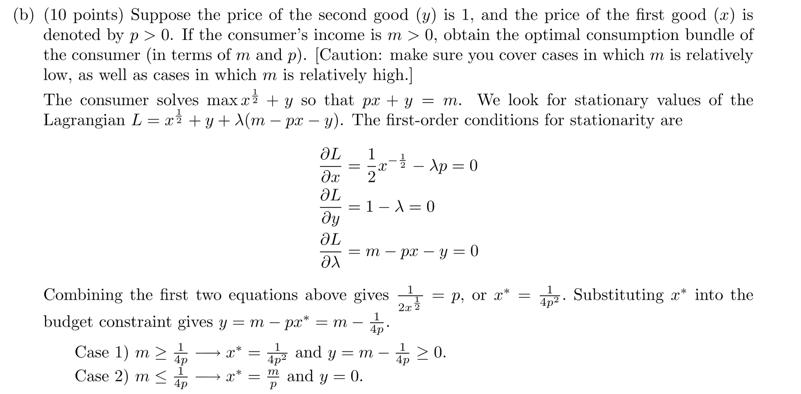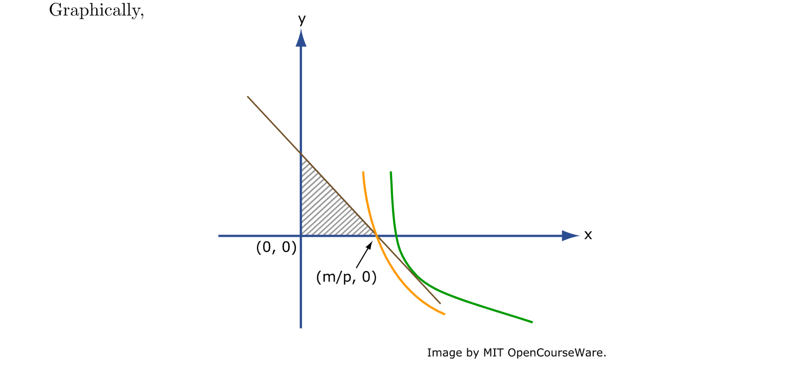

# P4 Utility Maximization II⭐⭐⭐⭐⭐
:::info
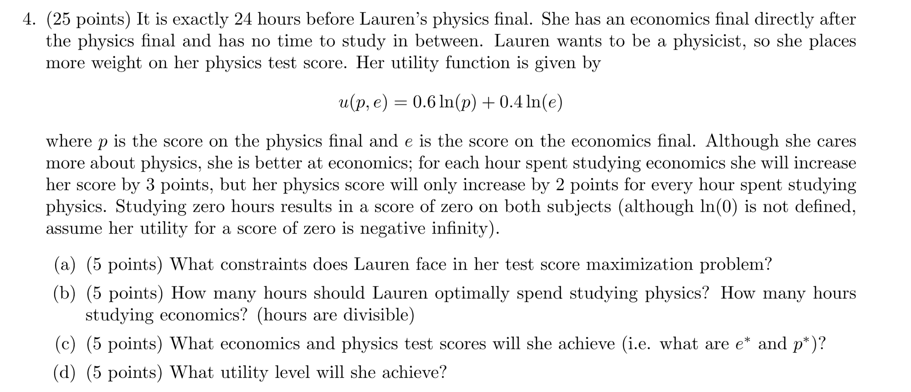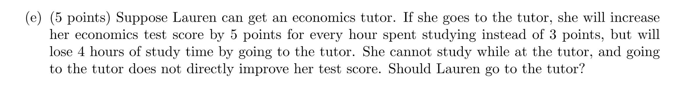
:::
**(a) Constraint**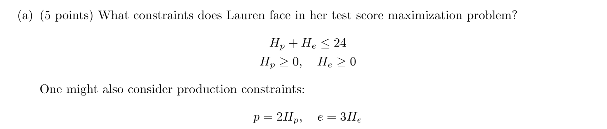
**(b) Utility Maximization**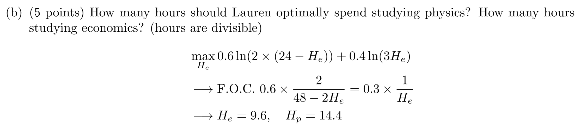
**(c) Scores**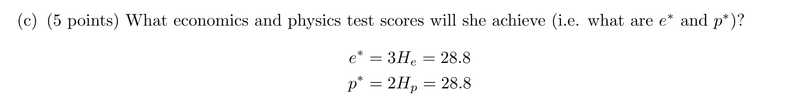
**(d) Utility Level**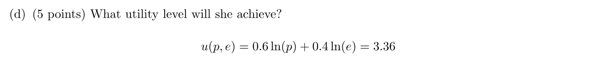
**(e) Utility Maximization**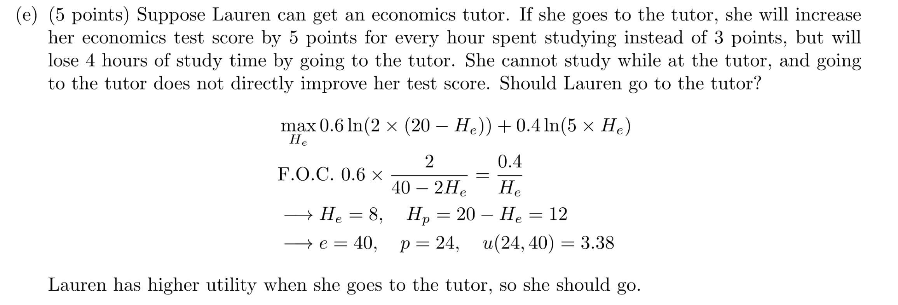
