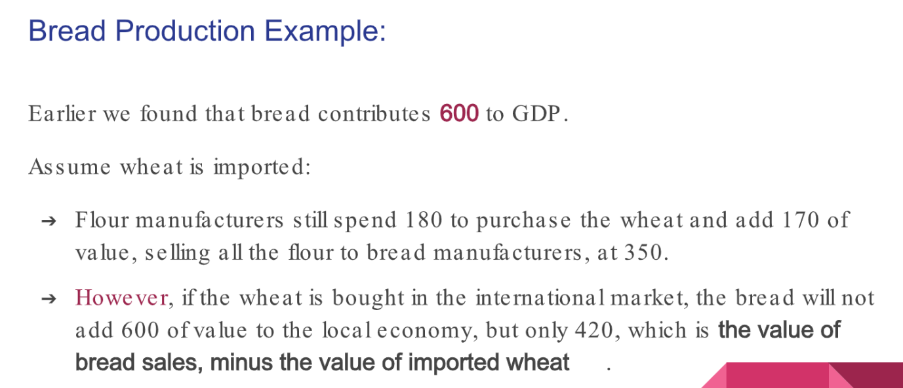
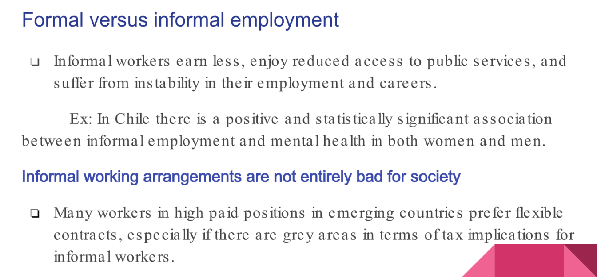
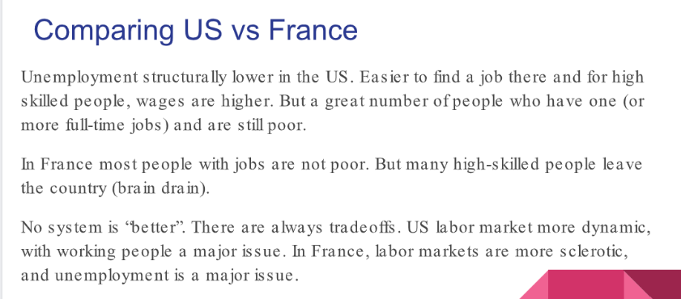

# 1 GDP Basics
## GDP
> 

**Drawback of GDP**
- GDP is **not a good measure of social cohesion, life satisfaction, or anything else. It is simply a measure of how much a country produces that is measurable at market prices. 
- GDP measurements **miss many other dimensions of life**, which is why some people favor the creation of new measures. What counts in favor of GDP is the fact that we know what it measures, so we can compare it across countries and over time. 
- The focus on GDP may cause some important unintended consequences, such as **growth policies that cause significant harm to the environment**. At the same time, economic growth in poor countries is relevant to alleviating poverty. GDP is not a perfect measure, but it is still the major goal of macroeconomic policy around the planet. We need to understand how it is measured.

## GDP per capita
> 

## Calculate GDP - 3 ways
> 

### Production(Supply of Domestic Goods)
> 

### Expenditure(Composition)
> 

### Income(Demand)
#### Formula
> 

#### Consumption - C
> 
> From a macroeconomic point of view, families have only two possible choices regarding their incomes—either consume them or save them.

#### Investment - I
> 
> When companies first plan expansion, they are consuming resources from society to be able to buy machinery, expand headquarters, hire workers, and so on. Supply does not increase immediately.
> Although the two-stage process of today's investment increasing tomorrow's production is usually clear-cut occasionally higher investment will not actually lead to capital accumulation.

**Example**

#### Government Investment - G
> 

#### Exports(X) and Imports(IM)
> 

**Import's Negative Effect on Aggregated Demand**

### Is net exporter good?
> 

### How is GDP actually measured?
> 

### Summary on GDP
> 

## Nominal vs Real GDP
> When arguing about the strength of the economy, analysts and pundits use the real GDP growth rate, and the real growth rate of economic output is the most important macroeconomic variable to track the basic standards of living in a country over time. **Statistical agencies calculate it by taking away the effect of changing prices. **To do that, agencies use a measure of inflation called the** GDP deflator.**
> 
> **We just compare between real GDPs.**

**Distinction between Nominal and Real GDP - Numerical Example**

## Potential vs Actual GDP
### Growth Gap
> Potential output is the amount of goods and services that the economy should be producing at full employment. The actual GDP is the output that agents currently are producing and consuming.
> 

### Overheated Economy
> 

## Limits of GDP
> 

# 2 Unemployment&Labor Market Basics
## Definition
> 
> In fact, economists **consider an economy at full employment if the unemployment rate is around 4% to 5%** because not every unemployed person results in social harm. 
> This is partly due to** frictional unemployment**, which results mainly from people switching jobs. When people leave a job for another one, technically they remain unemployed for the period during which they receive no income, but this does not cause any social harm.

## How to Calculate it?
> **Unemployment** is defined as **the ratio between persons who cannot find a job(excluding those who don't want to find a job) and the entire labor force.**
> **就是那些暂时找不到工作的(想找工作却暂时找不着的)人数/有能力进入职场的人**

## NAIRU
> 

## Structural Unemployment
> 

## Minimum Wage
> 

## Hysteresis
> 

## Labor Markets Outcomes
> 
> 有以下几个因素和`Labor Market Outcomes`能带来的社会福祉有关。

### Underemployment
> **Underemployment**:
> 1. Situations in which** the employment of an individual is incomplete**, either **in terms of the hours worked** or his or her **skills not being fully matched**. 就是没有完全利用工人的技能。雇了但没完全雇。
> 2. Those who work full-time but live below the poverty level—the working poor(Figure below). 出力不讨好，挣的钱少。挣的钱和付出不成正比。
> 3. Discouraged Workers. 泄气的员工，不想找工作了。
> 
**Discouraged workers**:
> 1. Individuals who stop looking for work and drop out of the labor force. 不想找工作，不算在`total labor force`中。
> 2. If somebody cannot find a good enough job and simply stops looking for one, the unemployment rate is unchanged because it counts only the people who are actively looking for a job.
> 3. A higher number of discouraged workers **has a significant impact on social welfare**, even as the unemployment rate is steady. 就像日本的低欲望社会。
> 

### Informal Employment
> Developing countries are frequently characterised by the co-existence of formal and informal employment.
> W**hat is the meaning of informal employment?**
> Informal workers are those who do not have:
> 1. Secure employment contracts
> 2. Workers' benefits 
> 3. Social protection 
> 4. Workers' representation.
> 
就是有点像非法运营。
> 
> There is a negative correlation between informality and health.
> **The size of the informal sector depends on many variables, including:**
> 1. The relative costs of formal and informal workers。如果非法途径雇佣的员工能够接受的薪资水平比较低，或者员工对公司要求不高，那么公司会非常愿意雇佣这样的员工，比较省心。
> 2. The strength of institutions（监管机构 surveillance sectors） meant to enforce the rule of law and curb corruption. 
> 3. Constitutional reforms(体制化改革) can influence the flow of people from and to informal sectors.

### Regional Patterns
> Regional patterns also can make it more difficult to define the social welfare effect of labor-market outcomes.
> 
> 1. **Regional disparities should not affect social welfare if people are willing to move freely from areas with an excess supply of labor to those with a lack of workers. **
> 
Although some citizens are truly mobile and even global in their attitudes, others prefer being able to build a stable life with a guaranteed income. 
> 2. **If families do not really want to move but have to follow the developments in labor markets, they are experiencing social harm.**
> 3. **Regional disparities are another source of discontent even if on average the national economy is at full employment.**

### Temporary vs Permanent Employment
> 
> When labor markets are not functioning well, however, people may be stuck in part-time occupations even when they would prefer full-time jobs.

## Reasons for unemployment
> 

## Unemployment around the world
> 

## Labor Laws in the US vs France
> 

# 3 Inflation Basics
## Definition
> **Inflation is an increase in the prices of goods and services. **
> Statistical agencies measure it as the weighted average price of a basket of goods and services that is representative for the typical consumer.
> 

## CPI&PPI
> CPI: Consumer Price Index
> PPI: Producer Price Index
> 

**Calculating CPI**
**Textbook Example**The price of imported machinery, for instance, will affect disproportionately the PPI and will result in CPI changes only if the producers are able to pass on their higher costs to consumers. The price of fruits, however, will affect consumers more than producers and thus result in a higher CPI but not necessarily a higher PPI.

## Core vs Non-core goods and services
> 

## Techonology, quality and cost of living
> 

## Perceived vs Real Inflation
> 

# 4 Income Inequality
> 

# 5 Model 1: Market for Goods and Services
> Chapter 2

## Terminology Recap
### National Accounts
> National accounts refer to a set of systematic and standardized statistical methods used to compile and analyze data about a country's economic activity, including its production, consumption, investment, and trade. 
> National accounts是指一套系统化和标准化的统计方法，用于分析一个国家的经济活动数据，包括其生产、消费、投资和贸易。
> The most commonly known form of national accounts is the System of National Accounts (SNA), which provides a comprehensive framework for organizing and analyzing a country's economic information. National accounts help to inform policy-making and decision-making related to economic development and growth.
> 最常见的national accounts 是国民账户体系（SNA），它为组织和分析一个国家的经济信息提供了一个综合框架。国民账户有助于为与经济发展和增长有关的政策制定和决策提供信息。

### GDP
> GDP growth generates prosperity and that rising inflation and unemployment destroy social welfare. 
> For a poor nation, growth is important because it helps take people out of poverty, and inflation is undesirable because people value the predictability of prices.

### 

### Tradeoff between GDP and Inflation
> **The tradeoff between growth and inflation **informs most of the economic policies in developing and rich countries alike. 
> 1. Whenever a country is mired in a recession, governments try to rekindle economic growth but are always afraid of increasing the rate of inflation. 经济衰退的时候政府需要重新点燃经济但是又不能使其增长过快导致恶性通货膨胀。
> 2. If prices are rising fast, authorities try to keep them in check but are mindful of the potential effects on economic growth. 如果价格上升的太快，政府需要实施一定程度的价格管制但是又不能管的太紧导致通货紧缩。
> 3. The ideal scenario would be that of an economy that expands continuously with an inflation rate of around 2% a year, leading to** increased and sustained material prosperity**. (GDP增长的同时保持稳定的通胀率). **Unfortunately, this rarely happens.**

## Definition
> **In the market for goods and services, two of the most important economic variables:**
> 1. GDP growth 
> 2. The rate of inflation
> 
are determined. 
> **The market for goods and services is:**
> 1. A representation of **consumption and production of all goods and services(就是买卖的商品和服务) in a country**.
> 2. **Presents the main tradeoff that policymakers face**—that between economic growth and inflation.

## AD/AS Curve
### Market Equilibrium
> The dynamics of aggregate demand and supply allow us to represent growth gaps, persistent inflation, stagflation, high unemployment, and many other possible scenarios that happen all around the world.
> **Market Clearing:
**A dance between consumers and producers in which agents try to maximize their own welfare byeither buying low or selling high. Eventually, a price is “agreed” on, and an equilibrium isreached whereby each produced unit finds its consumer.
> 

### Aggregate Demand
> 

### Macro vs Micro
> In microeconomics, we focus on simple market while for macroeconomics we focus on aggregated market.
> We have to take cheaper goods into consideration when computing the inflation.
> One of the main differences between micro- and macro-markets is in **the composition of demand and supply**. 
> - In micromodels,** individual demand functions** depend on **preferences, income, and the prices of other goods**.
> - In macromodels,** aggregate demand** is a function of** the behavior of consumers, government, and businesses**. In its most simple form, for the closed economy.
> 
**In closed economy model, aggregate demand is a function of the behavior of consumers, **the government, and business: AD = C + I + G, 也可以写成$AD=f(C,I,G)$:
> - C: Consumption by households (normal people, private individuals)
> - I: Investments by companies in expanded capacity. (Investments in building, facilities, consuming woods and cements.)
> - G: Government expenditures. (Government consumption, consue final goods if the government is building roads.)
> 
**The market for goods and services(商品服务市场) refers to:**
> - The place where buyers and sellers interact to exchange goods and services for money.
> - A representation of the decisions of all economic agents regarding consumption and production of goods and services.

## Comparative Statics
### Basic Steps
> **Requires understanding how markets change over time, comparative statics follows the steps:**
> 1. **Describe the initial Equilibrium**
> 

> 2. **Apply Economic Shock**
> 

> 3. **Show how government and other agents react. **Like public authorities: who we assume are rational, take action to bring GDP close to its initial leevel through the use of fiscal/monetary regulations.
> 

> 4. **Arrive at the final equilibrium**, which will depend on the size of the shock, the correct identification of the issue, and an appropriate (or not) response.
> 

### Four Possible Economic Shock
> 

### Things to remember
> 

# 6 Model 2: Labor Market
## Definition
> **The rate of unemployment is determined in this market**, which is a representation of the negotiation between individuals and companies regarding employment and wages.

## Perfectly Competitive Labor Market
> **A competitive labor market requires only one skill from the population. Such market has the following properties:**
> 1. The demanded quantity of labor ($Q_{DL}$, 表示公司方的招人规模) is equal to the quantity supplied ($Q_{SL}$，表示`Labor Force`, 就是潜在的员工) at the prevailing average nominal wage (w)
> 2. Everybody who wants a job at the market wage is able to get one.
> 3. There is no **involuntary unemployment. **Some people might choose not to work, but economists are concerned mostly with people who are not able to find employment.
> 4. Flexible Nominal Wages.
> 

## Nominal Wages&Real Wages
> Nominal wage, or money wage, is the literal amount of money you get paid per hour or by salary. For example, if your employer pays you $12.00 an hour for your work, your nominal wage is $12.00. Similarly, if your employer pays you a salary of $48,000 a year, then your nominal wage would be $48,000.
> Real wage, or adjusted wages, is the amount of pay a person can expect to receive after factoring in the current inflation rate. For example, if a person's nominal wage is $12.00, their real wage is above or below that amount depending on the current inflation rate. In this situation, a low inflation rate would mean that a person's $12.00 per hour wage could get them more than if they had a $12.00 pay rate during a high inflation period. 低通胀表明收到的工资更值钱。

## Involuntary Unemployment
### Definition
> 
> Market wage is $w$, can choose to work at this wage. Without social problem.
> The welfare of a society is lower if an individual cannot find a job at the market wage but not necessarily if people choose not to enter the job market. 
> People who are unwilling to work at the market wage are voluntarily unemployed. 想找工作但是找不到。

### Why?
> **When wages are rigid:**
> 1. **Nominal wages are not fully flexible**, as a perfectly competitive market would require. Because of labor laws, trade unions, and the minimum wage (for different categories of labor), nominal wages cannot rise and fall freely. For instance, in many countries, it is illegal to reduce nominal wages. Because of that, many businesses have a lower incentive to increase wages during a boom. In a recession, companies face a tough choice—to lay off their workers or to accept lower productivity.
> 

> **When wages are flexible:**
> 2. **The costs for asymmetric information, indivisible contracting, and searching and matching generate unemployment even if wages are fully flexible**. Given that it is costly to match the skills of people with the jobs requiring such skills and that individuals usually have more information about their skills than companies do, we cannot expect the labor market to clear immediately after any supply or demand shock. 
> 3. **Labor contracts are not fully renegotiable at every single moment in time, resulting in frictions that delay market clearing.** More important, if it is costly to hire (and lay off) people, then businesses delay hiring (and firing), leading to more unemployment. Another way to look at this is that companies keep the same number of employees because the quantity of labor in a company cannot be freely adjusted after economic shocks.
> 4. **Nontransference of skills: **People are not goods or services. They have unique skill sets. **In the short run as people who are trained in one task may find that businesses need other skills. **In addition, people may not want to move to places where their skills are more in demand. Not every engineer is willing to work in a mine in the middle of an Australian desert. In reality, regional, national, and international labor markets are extremely fragmented and do not clear easily, which is seen in the large variations in unemployment around the world.
> 

### Comparative Statics
> 

## Unemployment around the world
> 
> Unemployment in the US and eurozone remained above the 10% threshold by the end of 2017 **due to differences in labor laws,** mismatch between skills and needs, and lack of job mobility.
> Although the US economy is considered to be at full employment when the unemployment rate is around 4% , the French economy is considered to be at full employment when it is at 6%. One reason for** the difference in full employment rates between the US and France is the difference in labor laws**, which are much stricter in France than in America. Structural unemployment can be a result of labor laws, a mismatch between the skills of workers and the needs of companies, or a lack of job mobility, among other factors.

### Labor Laws in the US
> 
> 
> In the United States, one of the major tenets of labor laws is the **“employment at will”doctrine.** US companies can lay off theoir workers at any time without justification. There are some exceptions. Businesses are barred from terminating employees due to discrimination based on certain characteristics, the exercise of their legal rights, or whistleblowing, for example. 
> But US companies and employees can negotiate most terms in their employment contracts, and this kind of flexibility leads to a dynamic labor market in which businesses are relatively free to adjust their employment policy to the business cycle. The US labor market is not as free as a pure employment-at-will doctrine would entail,  and many states restrict this doctrine in some fashion. **Even so, the US labor market is one of the most flexible in the world.**

### Labor Laws in France
> In France, the minimum wage is around $12. It appears that the US is lagging behind the rest of the world, right? In fact, in most of Western Europe, people face much longer spells of joblessness than they do in the United States (figure 2.9).
> 
> Companies in France are not free to terminate employees. Labor contracts can be either fixed-term or indefinite. 
> **Fixed-term contracts:**
> After a probationary period, most fixed-term contracts cannot be terminated. 
> **Indefinite-term contracts:**
> With indefinite-term employment contracts, companies can terminate the contract at any time, **but they must be able to justify the termination with a real and serious cause, and they must comply with the applicable dismissal procedure.**
> **The two major categories of dismissals are based on real and serious cause**:
> 1. Dismissals based on the **employee’s behavior **such as a poor performance, the employee’s negligence, or the employee’s inability to work.
> 2. Dismissals based on **economic reasons.** Dismissals for economic reasons can be either individual or collective, depending on whether one or more positions are to be eliminated or significantly modified. Indefinite contracts practically guarantee tenure to French employees who have them, generating strong incentives for companies to be cautious about hiring new staff, even during economic booms.

### Comparison between US and France
> 
> There are many consequences of the differences in the structure of labor markets in the United States and France. 
> **In the US, workers are more mobile, highly skilled workers earn more, and unemployment is structurally lower than in France.** It does not mean that the American system is preferable, however. French workers enjoy more stability, their quality-of-life indicators are better, and French companies tend to pay higher wages, on average, to low-skilled workers, at the cost of higher unemployment. 
> **In France, unemployment is a major issue, but the existence of working poor much less so than in the United States.** Wage flexibility is an important factor in the distinct dynamics of the US and French labor markets, but different labor laws also play a major role in creating specific patterns of structural unemployment. 

# 7 Business Cycles&Policies
## Business Cycle
> Economies move in cycles. Recessions are followed by expansions that eventually are replaced by contraction. The technical jargon for this process is the business cycle.
> 
> **The world economy is composed of trillions of individual transactions, and the aggregate patterns of these transactions determine whether the economy grows or contracts. **
> **There is no linear path to prosperity.** **No economy ever grows constantly over time, like clockwork.**
> World income has increased thirtyfold since 1800, but that growth has not been smooth. Instead, national economies grow over periods of expansion and recessions. For simplicity, let’s assume that the really long-term growth trend is linear. Over time, economies grow, but this takes place in fits of booms and busts in the business cycle. 

## Reasons
> There are many reasons for booms and busts in economic activity. 
> 1. The way economic agents adjust their decisions to expectations of future market situations. Let’s assume that, for one reason or another, entrepreneurs and consumers expect the economy to do worse in the future. When consumers delay consumption and companies delay investments , these actions start pushing up the unemployment rate. Rising unemployment reduces consumer purchasing power, reduces economic activity even more, and culminates in a contracting economy. As the economy shrinks, the workers lose bargaining power, and the price of capital goods (necessary for investment) decreases. Businesses that think the economy is at rock bottom use this opportunity to contract cheaper investment, and the economy eventually rebounds.

## Long-term Trend
> 

# 8 Economic Policies
## Government Economic Tools
> 
> Their main goal is the smoothing of business cycles, particularly by shortening recessions. These economic policies would be countercyclical. 
> Ideally, governments would like the economy to grow with low volatility, relatively stable prices, and full employment.** The canonical economic goals are growth, full employment, and price stability**. So the direct goals of economic policy are the smoothing of the business cycle and the increasing of long-term trends.
> 

## 
## Economic Indicators
> 

## 

