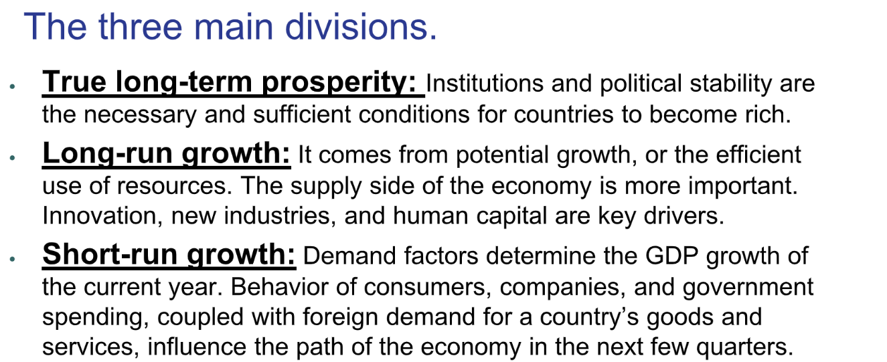

# Readings

# Three types of growth
> 

# Ch3.1 Growth in the long run
## Actual Output&Potential Output
> When economists talk about long-run growth, they mean a process by which the economy returns to its natural path and when the actual production of goods and services of a country meets its potential. 
> In technical terms, it is the convergence of actual output to potential output. 
> - Actual output is measured by the current GDP. It shows how much a country is actually producing. 
> - Potential output is the amount of goods and services that the economy would be producing if it were using all its resources (capital, labor, and natural resources).

## Short/Long run growth
> 

## Myths about economics
> We can dispel some myths regarding market economies. 
> 1. **The most common one is that economics is a zero-sum game: **for some countries to prosper, others have to fail. It is understandable that many people might feel this way because Western imperialism in the nineteenth and early twentieth centuries molded the modern world. The Opium War helped keep China poor, and the apartheid regime(种族隔离) in South Africa was tied directly to the country’s colonial roots. 
> 
	Fortunately, the world has changed and is now interdependent. It can provide space for every country to grow and prosper. The major constraint is the impact on the environment, not on another country’s income status. 
> 1. Another myth is that economic growth is unsustainable**. Countries can grow forever, although perhaps at lower rates. 
>    1. **Demography** is one reason that the pattern likely changes: it is harder for nations to grow when their populations shrink. 
>    2. The tacit agreement between a government and its citizens is to provide **material wealth**. This is especially true in developing countries and most people in the rich world They are looking for **pure economic prosperity**, which translates to higher GDP per capita. Escaping poverty is the main economic dream in most corners of the globe. Everything is easier when economies are growing. Poor countries want to converge, and rich countries look for sustained prosperity. 

## Divergence in growth
> Consider Japan, South Korea, and Singapore in the context of true long-term prosperity, long-run growth and short-run dynamics. All these countries left abject poverty behind relatively quickly: they rapidly went from poverty in the 1940s to developed status. They now face first-world problems like aging populations, soaring healthcare costs, and short-run obstacles to more accumulation of income and wealth. Why have they been able to make the jump but other countries—like Congo, Bolivia, and Indonesia—have not? 
> Here is a condensed version of the **virtuous cycle** that led to industrial and economic development in these three Asian countries. 
> 1. **Improved institutions allowed investment that made their economies grow**. This bolstered educational opportunities outcomes that further improved institutions and created incentives for further investment. 
> 2. **Social norms evolved, and corruption declined from endemic to exceptional**. Any form of social organization that generates efficient use of resources and creates incentives for innovation can work. Capitalism is not required. 
> 3. **Economic shocks—such as aging populations, global financial meltdowns, and international conflicts—can create obstacles to sustained prosperity. **The main lesson is that it is relatively easy to point to the conditions of a successful economic environment and much harder to implement policies that make a country improve its institutions persistently.
> 

## Middle-Income Trap
> The middle-income trap is caused by instability of norms, justice, institutions, and rights. These are the main obstacles facing countries like Russia and Turkey. And because the United States has succeeded in achieving stability in these areas, it is the richest country in the planet and still has its most dynamic economy. 

> Poor countries can take two main economic paths—to middle-income status and then, overcoming the middle-income trap, they can achieve sustained prosperity. 
> **贫穷国家可以走两条主要的经济道路——达到中等收入水平，然后克服中等收入陷阱，才能实现持续繁荣。**
> 19世纪中叶，美国和现在中国的发展路径差不多. 1800年，美国主要是农业经济。它并不贫穷，但还远未达到中上收入水平。在19世纪早期，第一次工业革命传播了以机器为基础的制造业，从19世纪30年代开始，美国的工业化由铁路建设推动，这是一项资本密集型活动。到1860年南北战争开始时，北方比南方工业化程度更高，但仍不是一个工业经济体。只有26%的人口居住在城市中心。然而，在美国内战开始时，北方的工业化程度比南方高，但仍不是一个工业经济体。只有26%的人口居住在城市中心。然而，在美国内战之后，加强了制度，进行了市场改革，产生了一波延续至今的繁荣浪潮。到20世纪最后三分之一时，第二次工业革命见证了技术的快速发展，进一步扩大了经济。移民有助于增加劳动力供应，人们涌向城市中心。美国的许多现代机构，如反垄断机构（antitrust agencies ）和美联储(Federal Reserve Bank)，都出现在19世纪末和20世纪初。
> 

## Summary
> 

# Ch3.2 Solow Model
## Intro
> The dynamics of economic growth arise from interactions between the aggregate supply and the aggregate demand in the market for goods and services. 
> And decades of economic modeling in the subject of long-run growth have shown that for the economy to grow in the long run, aggregate supply factors are more important than aggregate demand.  Conversely, short-run fluctuations are the consequence of changes in aggregate demand. 
> **To put it simply, long-run economic growth isa supply story, and short-run growth is a demand feature.**

## Solow Model Definition
### Definition
> The Solow model is a powerful model of **how countries prosper in the long run.**
> Our version of the Solow model determines a country’s **potential level of GDP **(at which the economy uses all its production factors efficiently) and **not the actual level of GDP** over time. 
> **Economic growth in the long run is about potential.**

### Model Parameters
> 
> K,L,N 都有`dinimishing marginal benefits`
> 

## Industrialization
> Until 1800, most US economic growth came from agriculture. As industrialization took place, capital went from being almost zero to being the major driver for economic growth.
> Another phase of development started in the early 1900s, and since the mid-twentieth century, economic prosperity has come from technological advancements.
> 

## Human Capital
> Human capital includes the many human dimensions that translate into the production of economic value. 就是一个人的价值(一个人所能为社会带来的产出贡献)。
> Higher human capital results in more innovation, higher productivity, and a lower probability of rent-seeking (manipulating public policies and economic conditions as a strategy to increase profits).
> Countries accumulate human capital at different rates.In Asia, the quality of education is high, and families invest significant amounts of time and money in it.
> 不同国家`Human Capital`积累的速度是不同的。

# Ch 3.3 Beyond Solow Model
## Theory&Actuality
> 

# Ch3.4 Sustain Productivity&Long-Run Growth
## Driver of accumulation&innovation
> Long-run growth comes from the accumulation of factors of production, exploitation of natural resources, and increased productivity in the form of technological advancements. But what drives the pursuit of accumulation and innovation? - **Aggregate Investments**
> 
> **The legal environment** - The emergence of limited liability company. Because the cost of failure is lower, companies can innovate more. Limited liability allows for more creative destruction.
> **Strong institutions are a necessary condition** - A particularly good insight comes from dividing governments into extractive and nonextractive.
> 1. Extractive governments extract resources of society to serve only the elite. Many dictators held on to power by massacring their people, have died rich and left their own countries poorer than they were before they came into power. But extractivism happens in both authoritarian and democratic regimes. In many democratic countries, authorities design policies to benefit themselves first and foremost. Throughout the twentieth century, Latin Americans elected many governments that destroyed social value for their own benefit.
> 

> **Corruption is a major obstacle for development** - Because it impedes the efficient allocation of resources by limiting innovation and taking away resources that could be used to increase production. A corrupt environment also creates moral hazard. For instance, if most public employees are promoted because of personal contacts instead of merit, others are discouraged and do not give their best efforts.
> 

## Aggregate Supply
> 

# Ch3.5 Levels of Development
## Classification of development
> Economic development takes time. To compare short-run and long-run growth, we create a two-dimensional classification system. 
> - The first dimension includes the **actual level of development**, divided in three categories of poor, middle-income, and rich. 
> - The second dimension includes the **position of the economy in the business cycle**—recession, stagnant, or dynamic. 
> 
Countries experiencing recessions face short-run headwinds that usually are not enough to make a country take a step down on the development ladder. Over the last two hundred years, many countries climbed up the ladder, but few dropped.
> 

# Ch3.6 Financial Systems&Climate Change
> 

## Endogenous Growth Theory
> 

## Differences From the Solow Model
> 

