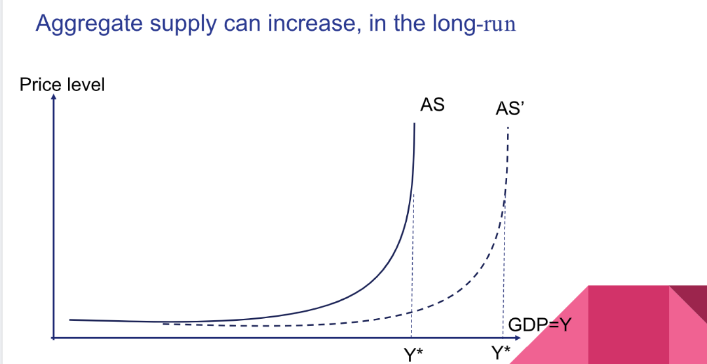
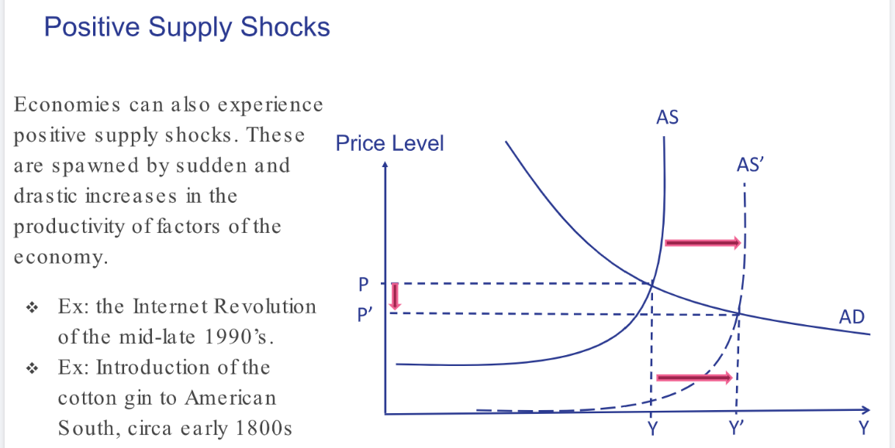
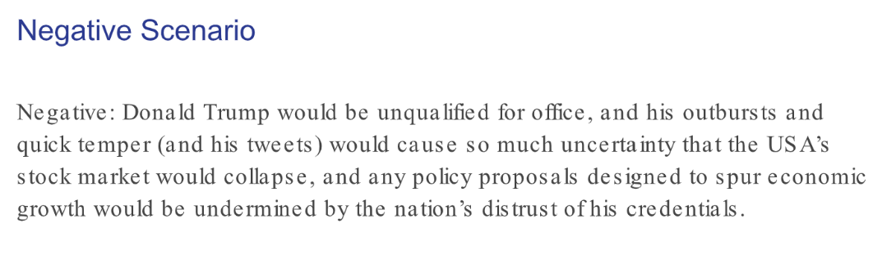

# Ch4.1 Commodities Supercycle
> 
> Example: Latin America and Australia.
> 

# Ch4.2 From long-run to Short-run Growth
## Long/short-run growth
> **Long-run growth is a supply-side story.** 
> **Aggregate supply** is a function of **capital(K)**, **labor(L)**, **natural resources(N)** and **total factor productivity(A)** (the technology component).
> In the short run, however, aggregate demand rules. 
> **The difference between the short run and the long run is the adjustment time that the economy takes to reach full (natural) employment of production factors. **
> The main** hypothesis **for analyzing short-run fluctuations is that **aggregate supply is fixed in the short run.**

## Why AD rules short-run growth?
> In normal times, aggregate demand is the determinant of short-run economic fluctuations for two reasons. 
> 1. **The first** relates to **expectations of consumers and companies**. When they consume or invest more, sales increase, and this sends signals for more investment. As companies expand their capacity, they hire more people, and more wages means more consumption. The economic machine plods along.
> 2. **The second reason** that aggregate demand determines short-run economic fluctuations is that **supply usually is fixed in the short run. **and a country’s productive capacity is hard to change in the short run:
>    1. **Aggregate supply factors accumulate over time**, and often require successful investment that can take years to show returns. **Investment turns into capital slowly.** Technological development and increased labor supply also accrue gradually.
>    2. **Second, prices and wages are “sticky.”** In economic jargon, a variable is sticky if it is slow to respond to changes in other variables that should have an impact on it. Sticky wages mean that workers’ remuneration does not change as often as it should to reflect variations. **Wages for unionized workers are renegotiated at a predetermined timeframe (such as yearly), employee contracts may stipulate that salaries are fixed for a determined period, and transaction costs make wage renegotiations costly and thus less likely to happen with a high frequency.**

## AS in short run
> When aggregate supply changes in the short run, we call it a supply shock, but such situations are the exception. For now, let’s assume that changes in aggregate demand cause short-run fluctuations due to inelastic supply factors.
> 
> In the first part, because of stickiness, AS is relatively flat and responds little to price and wage signals. In the second, as the actual output gets closer to potential output, supply becomes more vertical because the economy cannot produce more than potential output. If the economy is producing at potential output, it is using (almost) all its resources. Everybody willing to work at market wages is employed, and companies are using their full capacity. For a short while, if the economy is overheating, it may produce more than its capacity by a wide use of overtime, yet such instances are rare.

## AS in long run
> In the long run, AS shifts to the right as the economy accumulates capital and labor, exploit
> natural resources, or increases productivity (figure 4.4). Potential output expands, and the
> economy can grow without inflationary pressure. As aggregate supply (AS) moves to AS′,
> potential output goes from Y* to Y′*. Chapter 3 described our version of the Solow model.
> Long-run growth is a supply-side story as is shown in figure 4.4. Aggregate supply increases
> only if, over time, there is an expansion on the production possibilities due to more
> production factors or technology.
> 

# Ch4.3 Aggregate Demand Shifts
## Aggregate Demand Recap
> 
>  In a closed economy, aggregate demand is composed of aggregate consumption, investment, and government expenditure. Changes in these variables are mostly responsible for fluctuations in growth and inflation.
> **Demand is for final products instead of all goods**, since final goods include all the intermediate products during the manufacturing process.

## Short-run Dynamics
### Growth Gap
> Short-run dynamics are the domain of aggregate demand shifts. 
> More important, at any given time, **the difference between actual and potential output determines the path of the economy. **
> Our model of the tradeoff between growth and inflation depends on two things：
> 1. the difference between actual and potential output
> 2. Shifts in aggregate demand (AD). 
> 
For instance, let’s assume a fixed aggregate supply curve (AS), and a situation of growth gap, in which actual output falls short of potential output (figure 4.5). In this situation, output Y is below potential output Y*, and the price level of the economy is P. 
> 

### Fixing Growth Gap
> Let's assume that aggregate consumption rises, moving demand AD to the right to AD′. As aggregate demand (AD) shifts to AD′ due to more consumption, output and price levels increase. The growth gap becomes smaller. Because AD = C + I + G, aggregate demand likewise could shift due to an expansion in consumption, aggregate investment and/or government expenditure.
> 

### Economic Recovery/Overheating
> 

## Case Study: ECB vs Krugman's View
> 
> Unfortunately, designing economic policy is not this simple. 
> (Feature engineering is difficult)First, policymakers **must correctly identify the position of the national economy in the business cycle. **To do this:
> 1. **officials rely on the available data about current economic activity.** 
> 2. **Leading indicators** are particularly useful for this purpose because they point to **future market dynamics**. **Lagging indicators,** which are the result of **past economic activity. **
>    1. One example of a **leading indicator** is the _Consumer Confidence Index (CCI)_, which surveys consumers about their _perceptions and attitudes regarding present and future consumption_. A declining CCI indicates potential weakness in economic activity and thus the possibility of a present or future growth gap. 
>    2. Conversely, one example of a** lagging indicator **is the _rate of unemployment_, which is _highly dependent on previous decisions by companies and individuals in the labor market. _The unemployment rate is slow to adjust to economic conditions.
> 
(Data is miscellaneous)A second difficulty is that **data for economic indicators, both lagging and leading ones, are not clear-cut. **Some may point to weakereconomic activity, and others hint at strong performance. In addition, they are not measured continuously. Some (like nominal GDP) are measured quarterly, and others (such as inflation forecasts) are measured monthly or even weekly. 
> **Economic data are built by surveyed samples and are subject to respondent biases or revisions after more accurate information is incorporated. **
> **In short, economic data are not granular enough for perfect forecasts of the economic cycle, and authorities can never be certain at which point of the business cycle the national economy happens to be.**
> 

# Ch4.4 Stagflation&Aggregate Supply Shifts
## Definition
> 
> Stagflation is recession accompanied by high inflation. It cannot be modeled through shifts in aggregate demand because those shifts lead to positively related growth and inflation. 
> **Stagflation is the result of adverse short-run supply shocks.**
> Such shocks are rare, but when they happen, they plunge national economies into the worst possible macroeconomic scenario, one in which policymakers are faced with rising inflation amid weak economic activity.
> For instance, the labor force—the people of working age who are willing to work—does not grow or shrink quickly. The same applies to the size of industries. Total productive capacity gradually changes over time. For stagflation to exist, supply shocks need to be strong enough to affect the productive capacity of the economy in a very short period.
> Usually, a supply shock effect is temporary. As the economy adjusts, aggregate supply should go back to normal, leading to higher growth and lower inflation.

## Case Study: Oil Crisis
> 

## Positive Supply Shock
> 

## Case Study: Internet Revolution
> 

# Ch4.5 Components of Aggregated Demand
> 

## Consumption
### Definition
> 

### Propensities to Save and Consume
> 

### Case Study: China
> 

## Investments
### Definition
> 

### Interest Rates
> 

### Case Study: BRICS
> 

# Ch4.6 Expectations
## Expectations and Aggregate Demand
> 

## Negative Expectation Shocks
> 

## Self-fulfilling Prophecies
> 

## Role of Expectations
### Negative Scenario
> 

### Positive Scenario
> 

## Comparison
> 

## Expectation in Economics
> 

# Ch4.7 Preparing for econonmic policy
## Sustained Economic Growth
> 

# Summary
## Concepts
> 

## GDP
> 

