# Chapter 5.1 Quantitative Easing

# Chapter 5.2 Money and Its Role
## Money 
> - Communicate Prices. 用于计量单位unit of account。 高通胀的时候，货币的价值一直在走高，此时货币不能有效的作为unit of account。这个性质要求货币的价值相对稳定。 
> - A financial asset that stores value. 货币的价值。高通胀使其货币价值贬值，促使人们快速消费，拿在手里不值钱。
> - Universal medium of exchange. Has maximum liquidity。由于货币是普遍的交换媒介，它具有最大的流动性。
> 	- Most liquid asset
> 	- `Doesn't generate cash flow`. Other financial assets generate cash flows.

# Chapter 5.3 Money Market
## Definition
> - The money market `defines the price of money`, which is the `interest rate`. Interest rate is the price to borrow money.
> - Demand for money: The reasons that people borrow or acquire money (their precautionary, transaction, and speculative motives). 
> - Understanding the money market requires understanding the banking system.
> ⭐: The market in which economic agents buy and sell money.

## Characteristics
> - The price of money is the `nominal interest rate`.
> - Economic agents demand money to make transactions, in a broad sense;
> - The central bank is a monopolist supplier of money.

## Nominal/Real Interest
> The real interest rate is the difference between the nominal interest rate and the rate of inflation. 第六章会详细讲。

## Central Bank
> - The `central bank determines the supply of money` in the money market.
> - The demand for money comes from society
> 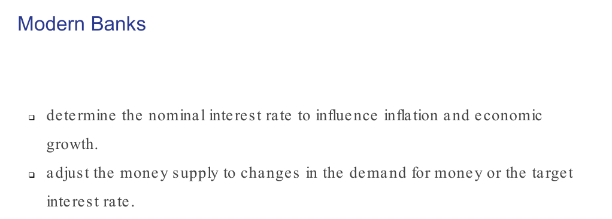
> 🔔: Central Bank is a monoplist. It has to react to any changes in the money demand in order to control the target interest rate.
> 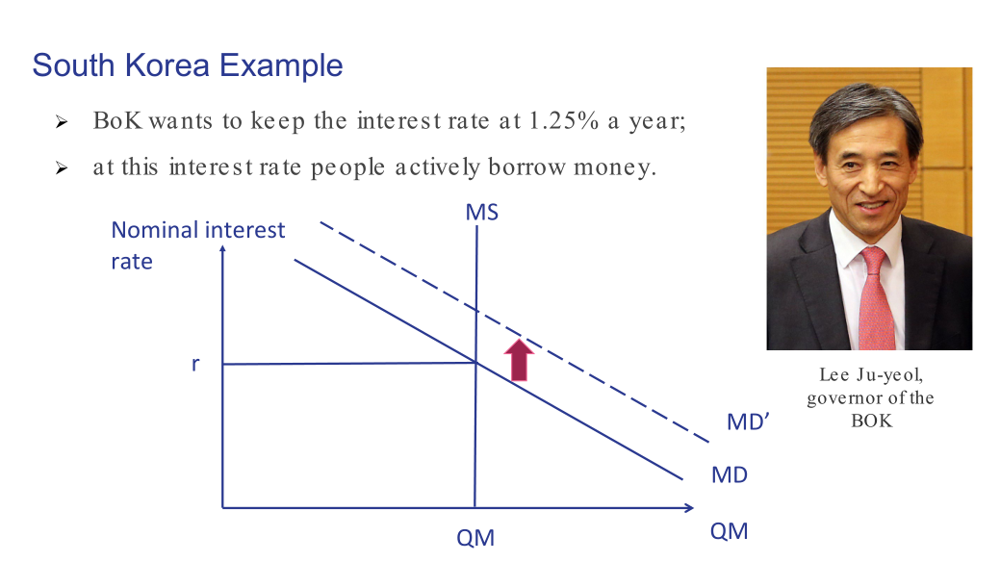
> 🔔: The central bank can always change the supply money to reach the target interest rate range. 就是市场需求变了，中央银行可以马上灵活调整货币供应量使得名义利率保持不变。

## Demand of Money
> There are three motives for demanding money:
> - `The precaution motive` leads people to have cash on hand to pay for unexpected expenses (such as medical bills and car repair bills). 留保命钱在身上。
> - `The transaction motive` (the largest one) leads people to have money to buy stuff. 用钱买东西。
> - `The speculative motive` leads people to use cash to buy financial assets that bring more money in the future (such as shares in a listed company, gold, or any other financial product). 用钱投资。

# Chapter 5.4 Simple Bank System
## Types of Banks
> - `Commercial banks` take deposits from the public and make loans to companies and households(`Can create credit`). 
> - `Investment banks` provide households, corporations, and governments with advice and assistance in raising financial capital or investing in financial assets. 投资银行帮助个体户投资。(不能借贷, 只能让投资银行把钱投资在某个股票内。Just an mediator.)
> - `Universal banks` combine commercial and investment banking in a single institution.

## Commercial Bank⭐⭐⭐
> Commercial banks can:
> - `Transform maturity of financial assets`. If we have money in our bank account in ICBC. ICBC will lend the money to someone else, we have the right to withdraw the money at any time. But that guy will only pay his loan 5 years. In that sense, ICBC is transforming the maturity is getting a loan from you in which it should repay you. But it is creating a loan.
> - `Reallocate risks` throughout the economic system.
> - `Create credit`.
> How does commercial bank create credit?
> 🔆Assumption:
> - Have to obey a reserve rate to meet short-term obligations so that it can survive the financial crisis
> - Only one commercial bank in the economy. So that the money that are lent out will eventually goes back to the bank.
> 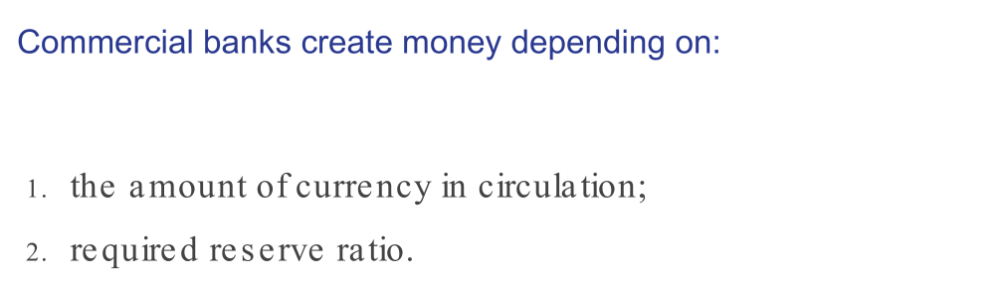

## Money Multiplier
> 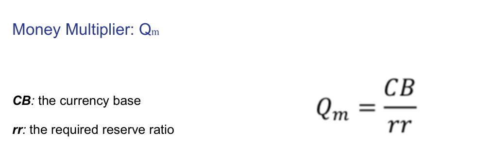

# Chapter 5.5 Financial Events
> - Financial crisis are likely the toughest financial events that we could experience.
> - Need to understand it through the balance sheet of a bank.
	- Maturity of the liabilities is instantanous.(Like the deposit, can be withdrawn at any time).

## Bank Runs
> 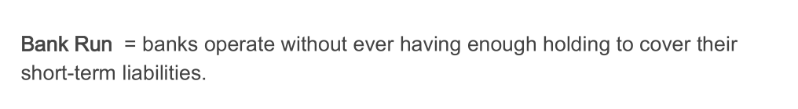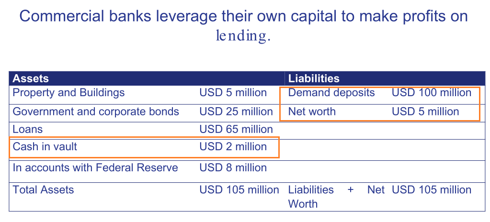
> 🔔: 注意到这家公司现金流甚至都不够偿还`Liability`, 所以会有`Bank Run`的情况发生。

## "Too big to fail"
> 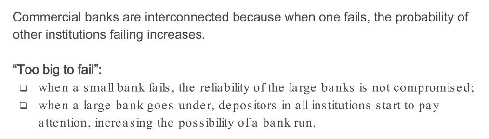
> Because commercial banks are interconnected and the probability of other institutions failing increases when one fails, `some banks are considered too big to fail by virtue of their relative size in the financial system`. When a small bank fails, the reliability of the large banks is not compromised. When a large bank goes under, depositors in all institutions pay attention, increasing the possibility of a bank run.
> 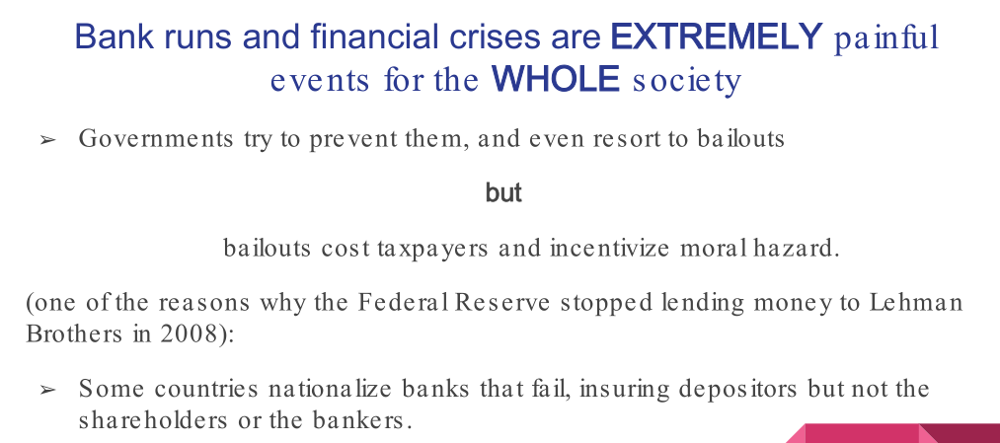
>  The Federal Reserve(a supervisor of money market) had to intervene in financial markets and guarantee funds for institutions to settle funds redemptions.

## Financial Crisis Around the World
> 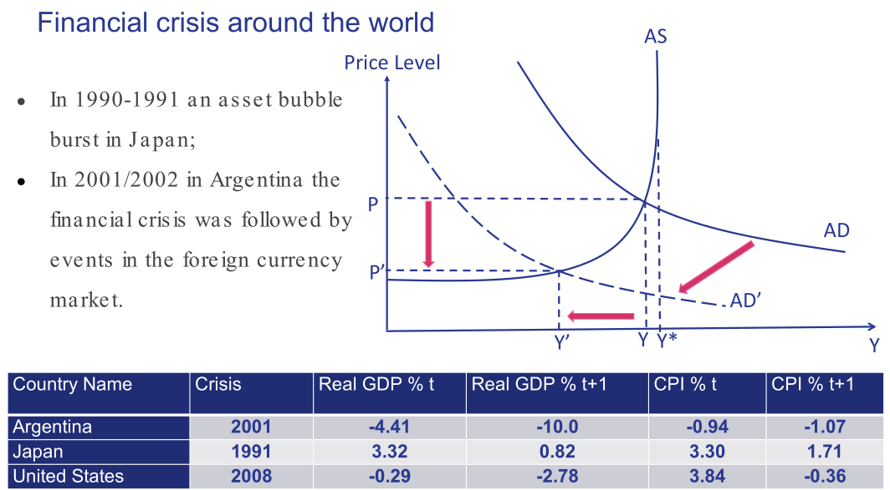
> 🔔: 下面的表格诠释了上面的关系。`CPI`对应`AD=C+I+G`中的`I`。

## Credit Losses - Sweden
> 🔔: A bank run squeezes the liquidity of commercial banks and, in turn, reduces credit to nonfinancial institutions. 就是商业银行连自己的短期债务都还不起了，就不可能放出更多的债务给到Non-financial Institutions了。
> 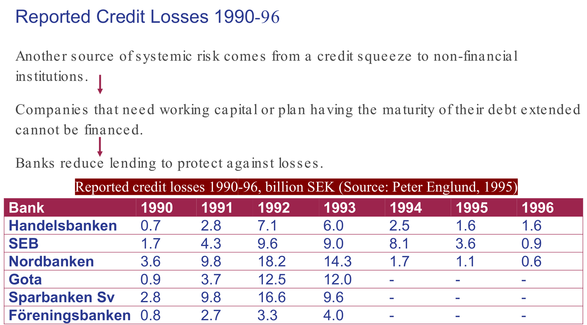
> - Financial crises arise only when problems in one part of the financial system become widespread. In Sweden, losses increased sharply across the banking sector in 1991 and 1992. 
> - The macroeconomic effect was that Sweden experienced three consecutive years of negative real economic growth. Intervention by the Sveriges Riksbank, the Swedish central bank, was untimely.
> - Eventually, the regulatory authority nationalized the most distressed bank, Gota, and provided comprehensive guarantees to stave off the bank run.

# Chapter 5.6 Instruments of Monetary Policy
## Central Bank⭐⭐⭐
> `Central Bank` controls the `money market` by changing the changing the `currency base`.
> 
> - `Modify the required reserves ratio` to induce commercial banks to provide more or less lending to customers. 
> - ⭐Central banks can `perform open-market operations`, which are the most common instrument of monetary policy. 
> 	- `Mostly used`. Selling or buying government bonds. If the central bank want to increase nominal interest, it has to sell the bonds and decrease the money circulating in the market.
> 	- If the central bank want to decrease nominal interest, it has to buy the government bonds and increase the money circulating in the market.
> - Central banks can `use discount window` lending to provide short-term loans to commercial banks to meet temporary shortages.
> - They can use unusual measures, such as `quantitative easing`, negative interest rates and other tools for injecting liquidity into financial markets.

## Central Bank Balance Sheet
> Changes in money supply relate to investment and consumption decisions through four major channels—credit, the balance sheet, expectations, and the exchange rate.
> 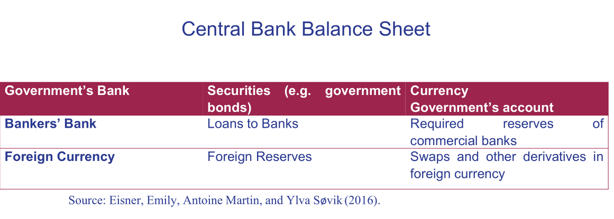

# Chapter 5.7 Transmission Mechanisms 
## How central bank takes effect?
> 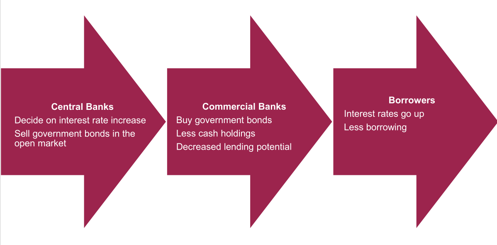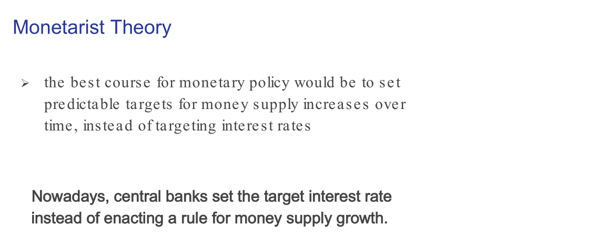

## Major channels to change money supply
> 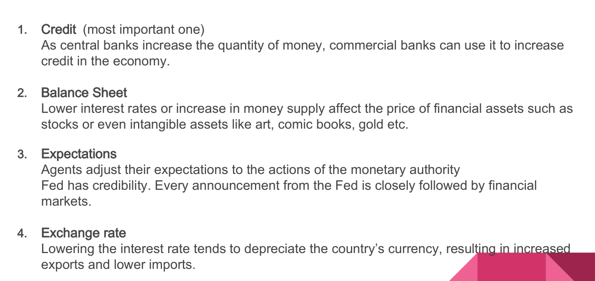

## Transmission Mechanism⭐⭐⭐⭐⭐
> 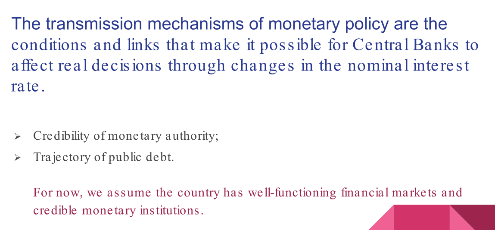

## Independece of Central Banks
> 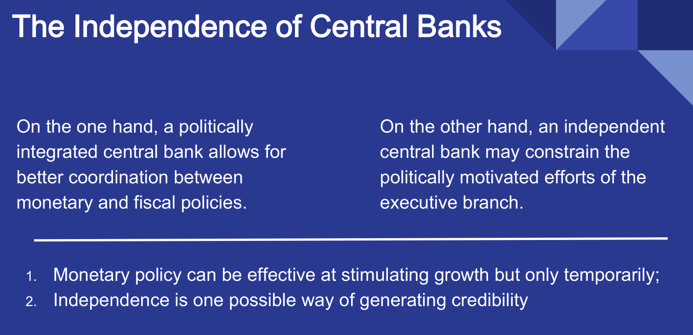
> - If Interest rate is low, speed up the building construction.
> - If Interest rate is high, slow down the building construction.

## The Quantity Theory of Money
> 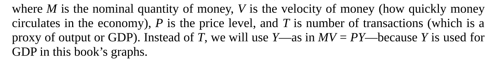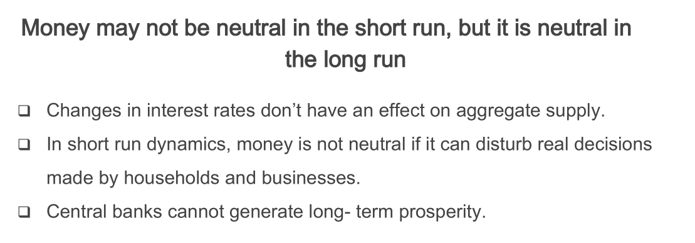
>  - `Money is netrual in the long run`. We assume that interest rate is the central bank cannot influence economic actvitiy in the long run.
> - `The central bank can only affect the ecconomic activity in the short run`.

## Liquidity Trap
> During a financial crisis, the banking system may suffer from a liquidity trap, where extra cash is not turned into lending because banks hoard whatever money comes their way to protect themselves against the possibility of bankruptcy.
> - `Any money that goes into the financial system is trapped` if V=0, then $\Delta P$  and $\Delta T$ doesn't matter. We can change the price level at will. Can  print the money at will. Inflation will not go up. 
> - When V is small, the effectiveness of the monetary policies is lower.
> - In poorer countries, very hard to access credit. So we need solid financial markets. Financial market in China is relatively strong, so that the credit in China is strong.
> 🔔: Is the market liquid? Yes.
> 🔔: Why people put money in financial system? Since people trust them.
> 🔔: Why is it strong? Institution. 
> 🔔: Can families borrow money to buy property? Yes

## Quantitative Easing
> - Central banks invented quantitative easing (buying securities to` lower interest rates and increase the money supply and foster economic activity`.
> - Quantitative easing is unconventional because its aim is to `jumpstart a sluggish financial system` when `the traditional transmission mechanisms of monetary policy fail`. 
> - Quantitative easing is usually implemented as a response to a recession or economic slowdown when traditional monetary policy tools, such as adjusting interest rates, are no longer effective. However, it is also a controversial policy, as it can lead to inflation and create other economic risks if not managed carefully.