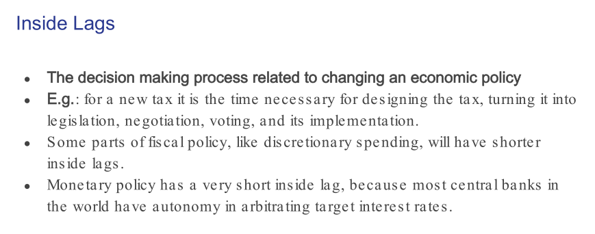
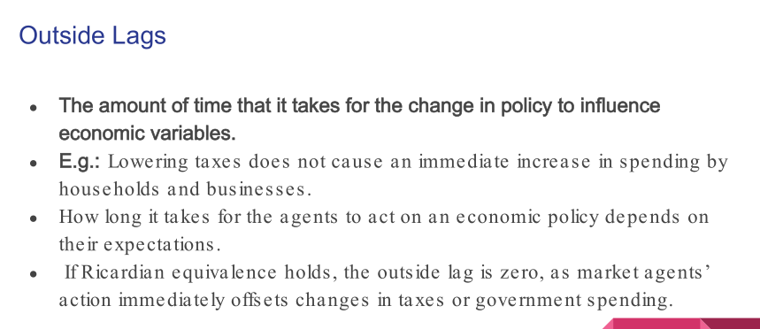
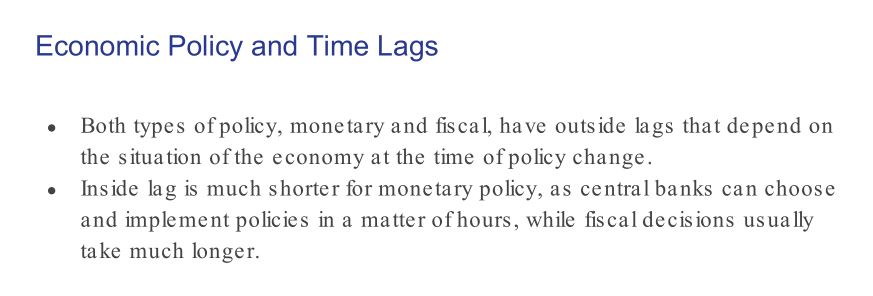
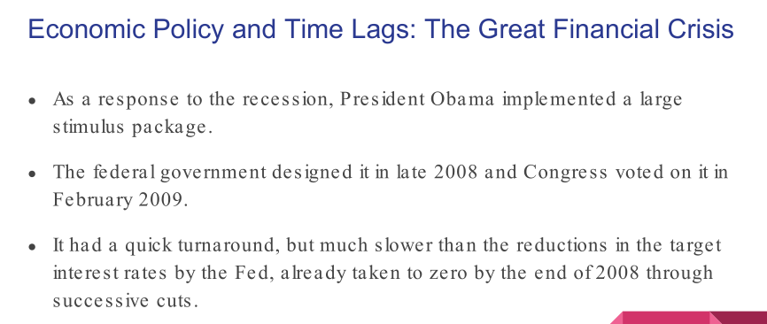
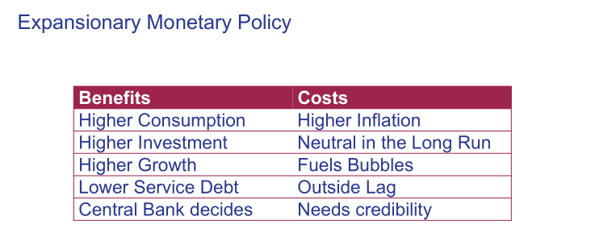
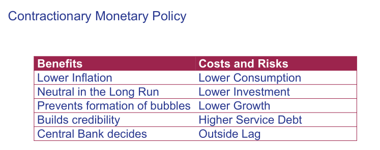
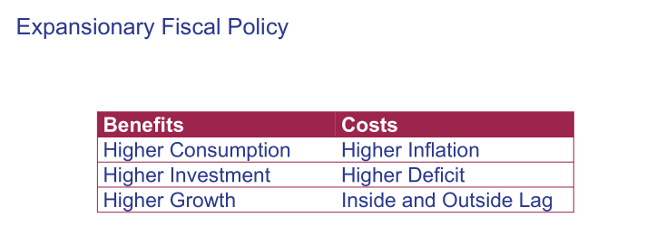
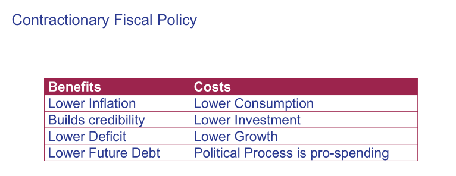
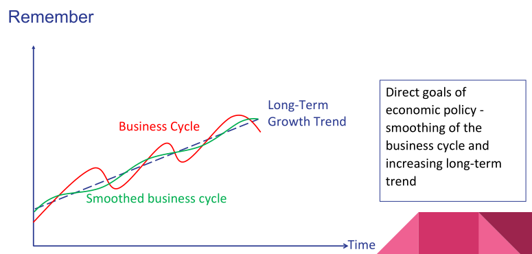

# Chapter 7.1 Economic Policy and Time Lags
## Inside Lags
> 
> - Time to design a new policy. Voting. 
> - Decision-making process. 
> - Time it takes to create the policy that is likely to be implemented.

## Outside Lags
> 
> - Amount of time it takes for the policy that has been implemented to take effect.

## Time Lags in general
> 

# Chapter 7.2 Monetary Policy
> 

# Chapter 7.3 Fiscal Policy
## Definition&Basics
> 

## Discretion versus Rules
### Rule 1: Inflation Targeting
> - Inflation targeting is an example of a rule that makes part of monetary policy fixed and minimizes discretion. 
> - The idea behind inflation targeting is simple: the central bank should pursue a predetermined value for inflation that is socially acceptable, and it should pursue it automatically. 
> - If expected inflation is above its target, then interest rates should rise until inflation is brought back down to that required level. Interest rates can fall only if the expected inflation is below the target, with some confidence interval that allows a little room for discretion.
> - Inflation targeting is also `a way to deal with time inconsistency`. The central bank may announce that it does not accept a high rate of inflation, but if there is inflationary pressure, it may find it costly to lift interest rates and restrain aggregate demand. It is easy to imagine a situation in which the political cycle may impede interest rate hikes in election years, for example.

### Rule2: Balanced Budget
> 

### Summary
> - `The tradeoff between discretion and rules` is clear: 
> 	- When rules are followed strictly, the government accumulates credibility.
> 	- When the government has less discretion, authorities have less power to stimulate or constrain aggregate demand during the business cycle.
> -  `The lower the quality of institutions, the more rules need to be designed for an economy`. 
> - As institutions evolve, more discretion should be in the hands of policymakers.

# Chapter 7.4 Which policy is better-Fiscal or Monetary?
## When to choose what?
> - During `Recession`, should use expansionary montary policy. This ensures low government deficit and debt trajectory.
> - Under `Inflationary Pressure`, should use contractionary fiscal policy(austerity). This ensures low deficit.
> - In real world, `monetary policy` is preferred due to `short inside lag` and more discretion of the monetary authority. But for central banks in the country other than US, discretion is not very strong and they are subordinated to other institutions.
> - Even though the economy suffered from a severe contraction, inaction may have led to a confidence crisis. 

## Limits of economic Policy
> - There are tradeoffs between the `extant policy and the effects on public debt`. In the United States after the great financial crisis, it was clear that monetary stimulus had hit a plateau. 
> - The largest part of the expansionary fiscal policy `tradeoff is between growth and deficit`, in addition to the usual tradeoff between growth and inflation that all economic policies experience.

## Nature of economic policy
> - `Economic Policies should be countercyclical`. 
> - In the `long run`, `growth in productivity` determines the rate of increase of potential output.
> - In the` short run` there could be a space for `active policy`, and it follows from the dynamics of business cycles.
> - For example: Under recessions, the growth gap widens until prices and wages fall and prospects change so businesses restart capital expenditure. During an expansion, there are inflationary pressures, and unemployment decreases until the labor market is squeezed and businesses start cutting jobs.
> 

# Chapter 7.5 Income Inequality
