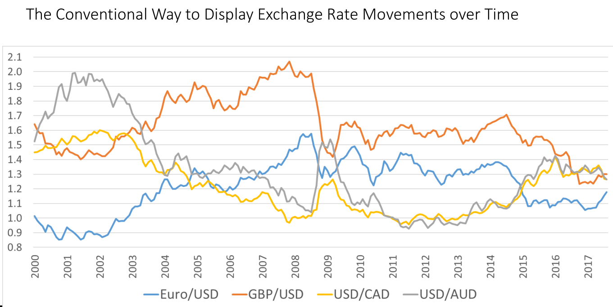
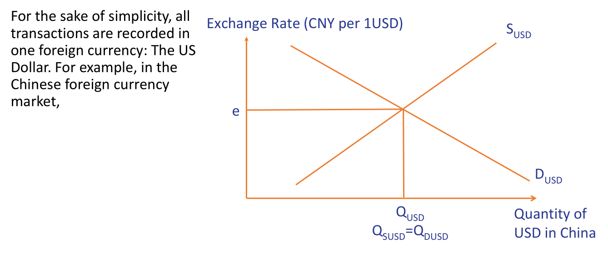
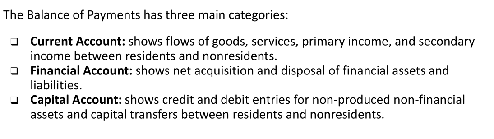

what is exchange rate in export and import?

role::assistant

`Exchange rate` in export and import refers to the value of one currency in relation to another currency. It is the rate at which one currency can be exchanged for another currency. In international trade, exchange rates play a crucial role as they determine the cost of goods and services being imported or exported. A favorable exchange rate can make exports cheaper and more competitive, while an unfavorable exchange rate can make imports more expensive and reduce the competitiveness of exports. Therefore, exchange rates are closely monitored by businesses engaged in international trade.

Here we notice that the USD appreciates during 2008~2009.

role::user
What is stronger currencies?

role::assistant

A stronger currency refers to a currency that has a higher value relative to other currencies. This means that it can buy more goods and services in other countries. A strong currency is usually a sign of a stable and growing economy, with low inflation and high interest rates. It can also make imports cheaper and reduce the cost of living for consumers. However, a strong currency can also make exports more expensive and less competitive, which can lead to a decrease in demand for the country's products and services. Therefore, the strength of a currency is a balance between the benefits and drawbacks of a strong currency.

role::user

Why can a stronger currencies make import cheaper?

role::assistant

A stronger currency can make imports cheaper because it increases the purchasing power of the currency in relation to other currencies. When a currency is strong, it can buy more units of other currencies, which means that the cost of importing goods and services from other countries decreases. For example, if the exchange rate between the US dollar and the Japanese yen is 1 USD = 100 JPY, and the exchange rate changes to 1 USD = 110 JPY, then the US dollar has become stronger relative to the Japanese yen. This means that US importers can now buy more Japanese yen with their dollars, making Japanese goods and services cheaper for them to import. As a result, a stronger currency can lead to increased imports, which can benefit consumers by providing them with access to cheaper goods and services.

role::user

Why can a stronger currencies make local price of exports cheaper?

role::assistant

A stronger currency can make the local price of exports cheaper because it reduces the cost of production for exporters. When a currency is strong, it can buy more units of other currencies, which means that the cost of importing raw materials and other inputs needed for production decreases. This can lead to lower production costs for exporters, which in turn can lead to lower prices for their exports. For example, if a US company exports goods to Japan, and the exchange rate between the US dollar and the Japanese yen changes from 1 USD = 100 JPY to 1 USD = 110 JPY, then the US dollar has become stronger relative to the Japanese yen. This means that the US company can now buy more Japanese yen with their dollars, which can reduce the cost of importing raw materials and other inputs needed for production. As a result, the company can lower the price of their exports to Japan, making them more competitive in the Japanese market.

role::user

What is the demand of USD?

role::assistant

The demand for USD (United States Dollar) is the desire of individuals, businesses, and governments to hold USD for various purposes. The demand for USD is influenced by several factors, including:

1. International trade: USD is the most widely used currency for international trade, so the demand for USD increases when there is an increase in international trade.

2. Investment: USD is considered a safe-haven currency, so investors tend to hold USD during times of economic uncertainty or market volatility.

3. Interest rates: Higher interest rates in the US can attract foreign investors, increasing the demand for USD.

4. Political stability: The political stability of the US can also influence the demand for USD, as investors tend to prefer stable and predictable political environments.

5. Reserve currency status: USD is the world's primary reserve currency, meaning that many central banks hold USD as a reserve asset, which can increase the demand for USD.

Overall, the demand for USD is influenced by a variety of economic, political, and financial factors, and it can fluctuate over time depending on changes in these factors.

role::user

What determines the supply of USD?

role::assistant

The supply of USD (United States Dollar) is determined by several factors, including:

1. Monetary policy: The Federal Reserve, the central bank of the US, is responsible for setting monetary policy, which can influence the supply of USD. For example, if the Federal Reserve increases the money supply by buying government bonds, this can increase the supply of USD in circulation.

2. Trade deficits: The US has had a trade deficit for many years, meaning that it imports more goods and services than it exports. This can increase the supply of USD in foreign countries, as they need USD to pay for US imports.

3. Capital inflows: When foreign investors invest in the US, they need to exchange their currency for USD, which can increase the supply of USD in circulation.

4. Foreign exchange reserves: Many central banks hold USD as a reserve asset, which can increase the supply of USD in circulation.

5. Political stability: The political stability of the US can also influence the supply of USD, as investors tend to prefer stable and predictable political environments.

Overall, the supply of USD is influenced by a variety of economic, financial, and political factors, and it can fluctuate over time depending on changes in these factors.

role::user

What determines the exchange rate?

role::assistant

The exchange rate between two currencies is determined by the forces of supply and demand in the foreign exchange market. The exchange rate is the price at which one currency can be exchanged for another currency. The factors that influence the supply and demand of currencies in the foreign exchange market include:

1. Interest rates: Higher interest rates in a country can attract foreign investment and increase demand for that country's currency, which can lead to an appreciation of the currency.

2. Inflation: Higher inflation in a country can decrease the value of its currency, as it reduces the purchasing power of the currency.

3. Political stability: Political instability or uncertainty can decrease the demand for a country's currency, as investors tend to prefer stable and predictable political environments.

4. Economic performance: A country with a strong economy and positive economic indicators, such as low unemployment and high GDP growth, can increase demand for its currency.

5. Trade balance: A country with a trade surplus (exports exceed imports) can increase demand for its currency, as foreign buyers need to exchange their currency for the country's currency to purchase its exports.

6. Central bank intervention: Central banks can intervene in the foreign exchange market to influence the exchange rate by buying or selling their own currency.

Overall, the exchange rate is determined by the interaction of these factors in the foreign exchange market, and it can fluctuate over time depending on changes in these factors.

role::user

What is the balanace of payment?

role::assistant

# BOP

`The balance of payments (BOP)` is a record of all financial transactions made between a country and the rest of the world over a specific period of time, typically a year. The BOP is divided into three main categories:

1. `Current account`: This includes all transactions related to the import and export of goods and services, as well as income received from investments and transfers between countries.

2. `Capital account`: This includes all transactions related to the purchase and sale of assets, such as stocks, bonds, and real estate, between countries.

3. `Financial account`: This includes all transactions related to the purchase and sale of financial assets, such as currency, bank deposits, and loans, between countries.

The balance of payments is used to measure a country's economic performance in relation to the rest of the world. If a country has a surplus in its current account, it means that it is exporting more goods and services than it is importing, which can be a sign of a strong economy. Conversely, if a country has a deficit in its current account, it means that it is importing more goods and services than it is exporting, which can be a sign of a weak economy.

Overall, the balance of payments is an important tool for understanding a country's economic relationships with the rest of the world and can provide insights into its economic strengths and weaknesses.

role::user

What is the differences between stock and flow?

role::assistant

Stock and flow are two concepts used in economics to describe different types of variables.

`Stock` refers to a quantity that is measured at a specific point in time. It represents the total amount of a particular asset or liability that exists at a given moment. Examples of stocks include the amount of money in a bank account, the number of shares of a company's stock that an investor owns, or the total amount of debt that a country owes.

`Flow`, on the other hand, refers to a quantity that is measured over a period of time. It represents the rate at which something is changing or moving. Examples of flows include income, expenses, production, consumption, and investment.

The main difference between stock and flow is that stock is a quantity that is measured at a specific point in time, while flow is a quantity that is measured over a period of time. Stocks can change over time as a result of flows, such as when income is saved and added to a bank account, or when a company issues new shares of stock. Flows can also affect other flows, such as when income is used to pay for expenses or when investment leads to increased production.

In summary, stocks and flows are both important concepts in economics, and understanding the differences between them is essential for analyzing economic data and making informed decisions.

role::assistant

Reserve Assets

`Reserve assets` are financial assets held by central banks and other monetary authorities to support the value of their currencies and to provide a means of payment for international transactions. Reserve assets typically include foreign currencies, gold, and special drawing rights (SDRs), which are a type of international reserve asset created by the International Monetary Fund (IMF).

Central banks hold reserve assets to ensure that they have sufficient resources to intervene in the foreign exchange market if necessary to support the value of their currency. For example, if a country's currency is depreciating rapidly, the central bank may use its reserve assets to buy its own currency in the foreign exchange market, which can help to stabilize the currency's value.

Reserve assets also provide a means of payment for international transactions, such as imports and exports. When a country imports goods or services, it needs to pay for them in a foreign currency, which it can do by using its reserve assets. Similarly, when a country exports goods or services, it receives payment in a foreign currency, which it can then convert into its own currency using its reserve assets.

Overall, reserve assets play an important role in supporting the stability of the international monetary system and in facilitating international trade and investment.

role::user

