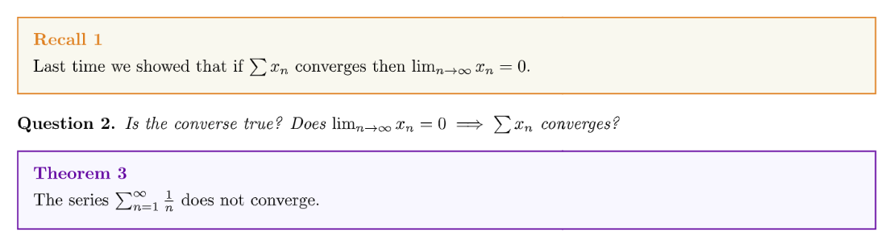
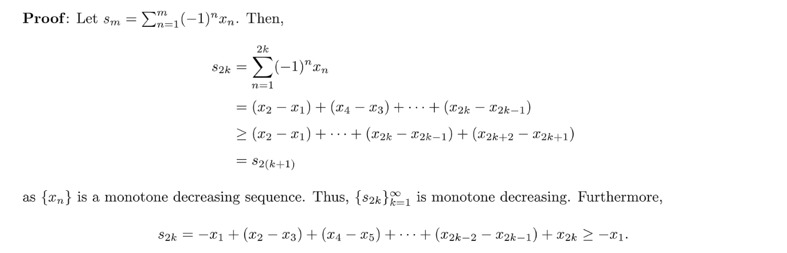

[Lecture Note 11.pdf](https://www.yuque.com/attachments/yuque/0/2022/pdf/12393765/1668689052486-006cf003-3b5c-4262-bf42-fcafccfe2359.pdf)
[Lecture Note 12.pdf](https://www.yuque.com/attachments/yuque/0/2022/pdf/12393765/1668689052525-14da82b5-068f-4923-9a90-aebf2678594b.pdf)

# 1 Convergence Series Recap
## 1.1 证明调和级数发散
> 
> 对于`Theorem 3`来说，我们知道如果一个`Sequence`是`Convergent`的，则其所有的`Subsequence`都是`Convergent`的, 而任何`Convergent`的`Sequence`都是`Bounded`的。于是我们可以构建一个逻辑链条;
> 数列收敛=>所有子数列收敛=>所有子数列有界。
> 类比到级数上，我们也可以构建一个逻辑链条:
> 级数收敛=>部分和构成的数列收敛=>部分和构成的数列的所有子数列收敛=>....有界
> 顺着上面的逻辑链条反向走。我们想要证明如果级数数列$\{s_m\}_{m=1}^{\infty}$发散，则我们只需要证明存在一个子数列无界，就可以说明原级数发散。

**Proof of Theorem 3(Medium)**

## 1.2 收敛级数的和也收敛
> 

**Proof of Theorem 5(Easy)**

## 1.3 正项级数,收敛(发散)=有界(无界)
> 
> 这个结论也很直观，因为正项数列的部分和组成的数列是单调的，而对于单调的数列，有界就意味着收敛，即级数收敛。
> **证明逻辑链:** $x_n\geq 0 \implies \{s_m\}_{i=1}^{\infty} is~~monotonically~~increasing\\\implies \{s_m\}~~converges\iff\{s_m\}~~ is~~ bounded\\\implies \sum x_n~~converges\iff\{s_m\}~~ is~~ bounded$

**Proof of Theorem 6(Medium)**我们可以类比[对于一个单调的数列，收敛=有界](https://www.yuque.com/alexman/cbermo/whd7gt#E09OQ)中的证明方法。

# 2 Absolute Convergence
## 2.1 级数绝对收敛=>级数收敛**⭐⭐⭐⭐⭐**
> 
> **证明逻辑链: **$\sum |x_n|~~converges \implies \sum |x_n|~~is~~Cauchy\implies |\sum_{n=m+1}^l |x_n||<\epsilon\\\stackrel{\Delta ~~inequality }\implies |\sum_{n=m+1}^l x_n|<\epsilon\implies \sum x_n~~is~~Cauchy\implies \sum x_n~~converges$.

**Proof of Theorem 8(Hard)⭐⭐⭐**

## 2.2 级数收敛 不意味 级数绝对收敛
> 

# 3 Series Convergence Tests
## 3.1 Comparison Test(正向级数)
### Finite Form
> 
> **证明逻辑链(以**$1$**为例)：**$\sum y_n~~converges \stackrel{正项级数}\implies \{\sum_{i=1}^m y_n\}_{i=1}^{\infty} ~~is~~bounded\implies \{\sum_{i=1}^m x_n\}_{i=1}^{\infty} ~~is~~bounded\\\stackrel{正项级数}\implies \sum x_n~~converges$
> **证明逻辑链(以**$2$**为例)：**
> $\sum x_n~~diverges \stackrel{正项级数}\implies \{\sum_{i=1}^m x_n\}_{i=1}^{\infty} ~~is~~unbounded\implies \{\sum_{i=1}^m y_n\}_{i=1}^{\infty} ~~is~~bounded\\\stackrel{正项级数}\implies \sum x_n~~diverges$

**Proof of Comparison Test(Easy, Using Theorem 11.6)⭐⭐⭐**

### Limit Form
> 

**Examples**

## 3.2 P Test（重点看证明）⭐⭐
> 

**Proof of P Test(Hard)**
**Examples(Easy)**$\sum_{n=1}^{\infty}\frac{1}{n^2+2020n}$
因为$\forall n\in \mathbb{N},0\leq \frac{1}{n^2+2020n}\leq \frac{1}{n^2}$且根据定理`12`,$\sum_{i=1}^\infty\frac{1}{n^2}$收敛, 再根据`Comparison Test`, 我们知道$\sum_{i=1}^{\infty}\frac{1}{n^2+2020n}$收敛。
我们可能会想$\forall n\in \mathbb{N},0\leq \frac{1}{n^2+2020n}\leq \frac{1}{n}$, 而根据定理`12`,$\frac{1}{n}$发散, 是不是$\frac{1}{n^2+2020n}$也发散呢? 不是的，因为我们的不等式方向使用错了。

## 3.3 Ratio Test（重点看证明）⭐⭐
> 
> 注意，**在**$L=1$**的时候**`**Ratio Test**`**不能告诉我们任何有用的信息**，设想一下：
> - $x_n=1,\forall n\in \mathbb{N}$, $\sum_{i=1}^n 1$是发散的。
> - $x_n=\frac{1}{n^2}$, $L=\lim_{n\to \infty}\frac{(n+1)^2}{n^2}=\lim_{n\to \infty}(1+\frac{1}{n})^2=1$, 此时$\{x_n\}$又是收敛的。

**Proof of Ratio Test(Hard)****我们先证明第二个结论: **
当$L>1$时，因为$\lim_{n\to \infty}\frac{|x_{n+1}|}{|x_n|}=L$, 所以根据极限的定义，我们有:$\forall \epsilon>0, \exists M_0\in\mathbb{N},~~s.t.~~\forall n\geq M_0, |\frac{|x_{n+1}|}{|x_n|}-L|<\epsilon$, 不妨令$\epsilon=L-1$(因为$L>1$), 所以$\lim_{n\to \infty}\frac{|x_{n+1}|}{|x_n|} \in (L-(L-1),L+L-1)=(1,2L-1)$, 换句话说$\forall n\geq M_0,\frac{|x_{n+1}|}{|x_n|}>1$, 所以$\{|x_n|\}$在$n\geq M_0$时是单调递增的，所以我们知道$\lim_{n\to \infty} |x_n|\neq 0$。而我们知道$\lim_{n\to \infty}x_n=0\iff\lim_{n\to \infty} |x_n-0|=0$, 于是$\lim_{n\to \infty}x_n\neq 0$, 这意味着$\sum x_n$不可能收敛。
**然后我们证明第一个结论:**

**Examples**

## 3.4 Root Test
> 
> 和`Ratio Test`一样，$L=1$不能提供任何信息。

**Proof of Root Test（Medium）**
1. $L<1$

因为$\lim_{n\to \infty} |x_n|^{\frac{1}{n}}=L$, 令$L<r<1$所以$\exists M,~~s.t.~~\forall n\geq M, |x_n|^{\frac{1}{n}}\in(L-(r-L),L+(r-L))=(2L-r,r)$, 即$|x_n|^{\frac{1}{n}}<r$, 所以我们有$0\leq |x_n|<r^n$, 所以$\forall m\in \mathbb{N}$, 我们有:

2. $L>1$

## 3.5 Alternating Series Test
> 

**Proof of Alternating Series Test (Hard)**
**Example：级数不绝对收敛，并不意味着级数发散。**
这个结论通过上面的定理`Alternating Series`定理可以直接得出。

## 3.6 幂级数收敛的条件
> 

## 3.7 Other Theorems
> 

**Proof(Hard)**

# 4 总结数列&级数

# 5 Assignment
[hw6.pdf](https://www.yuque.com/attachments/yuque/0/2022/pdf/12393765/1668693117444-03250f62-b910-426d-82f9-70e096d19e9b.pdf)
[hw7.pdf](https://www.yuque.com/attachments/yuque/0/2022/pdf/12393765/1669447032292-3a71ab43-2bba-48e5-999e-8b6ebc4553c3.pdf)

## P1 Series Test 1
> 

**(a) Limit Comparison Test**我们使用`Limit Form of Comparison Test`, 因为$\lim_{n\to \infty} \frac{\frac{3}{9n+1}}{\frac{1}{n}}=\frac{1}{3}$, 因为$\sum \frac{1}{n}$发散，所以原级数发散。
**(b) Limit Comparison Test**我们使用`Limit Form of Comparison Test`, 因为$\lim_{n\to \infty} \frac{\frac{1}{2n-1}}{\frac{1}{n}}=\frac{1}{2}$, 因为$\sum \frac{1}{n}$发散，所以原级数发散。
**(c) Limit Comparison Test**因为$\sum |\frac{(-1)^n}{n^2}|=\sum \frac{1}{n^2}$是收敛的，这等同于说，$\sum \frac{(-1)^n}{n^2}$是绝对收敛的，于是根据`2.1`原级数收敛。
**(d) Finite Comparison Test**因为$0<\frac{1}{n(n+1)}< \frac{1}{n^2},\forall n\in \mathbb{N}$
因为$\sum \frac{1}{n^2}$收敛是根据`Comparison Test`, $\sum \frac{1}{n(n+1)}$收敛。
**(e) Root Test/Ratio Test**因为$ne^{-n^2}\geq 0,\forall n\in \mathbb{N}$,$(ne^{-n^2})^{\frac{1}{n}}=n^{\frac{1}{n}}e^{-n}$, 因为$\lim_{n\to \infty} n^{\frac{1}{n}}e^{-n}=1\cdot 0=0$, 于是`By Root Test`, 原级数收敛。
另外, $\frac{\frac{n+1}{e^{-(n+1)^2}}}{\frac{n}{e^{-n^2}}}=\frac{n+1}{n}\cdot e^{2n+1}$, 因为$\lim_{n\to \infty} \frac{n+1}{n}\cdot e^{2n+1}=1\cdot 0=0<1$, 于是`By Ratio Test`, 原级数收敛。

## P2 级数收敛
> 

**(a) 级数收敛=级数尾部收敛**如果$\sum_{n=1}^{\infty}x_n$收敛，则$\sum_{n=2}^{\infty} x_n$收敛。
因为$\sum_{n=2}^{\infty} x_n=\sum_{n=1}^{\infty}x_{2n}+\sum_{n=1}^{\infty}x_{2n+1}=\sum_{n=1}^{\infty}(x_{2n}+x_{2n+1})$, 证毕。
**(b) 构造级数****我们取**$x_n=(-1)^n$**即可。此时**$\sum_{n=1}^{\infty}(x_{2n}+x_{2n+1})=0$**, 而**$\sum_{n=1}^{\infty}x_n$**发散。**

## P3 无穷级数的三角不等式
> 

**Proof**因为我们有$|\sum_{n=1}^{m}x_n|\leq \sum_{n=1}^m |x_n|\leq \sum_{n=1}^{\infty}|x_n|,\forall m\in \mathbb{N}$, 因为$\sum{x_n}$绝对收敛，即$\sum |x_n|$收敛。于是根据`Comparison Test`我们知道$|\sum_{n=1}^m x_n|$收敛。且因为$|\sum_{n=1}^m x_n|\in [0, \sum_{n=1}^{\infty}|x_n|]$。于是$\lim_{m\to \infty}|\sum_{n=1}^m x_n|\in [0, \sum_{n=1}^{\infty}|x_n|]$, 于是根据夹逼原理，$|\sum_{n=1}^{\infty}x_n|\leq \sum_{n=1}^{\infty}|x_n|$, 证毕。

## P4 Series Test 2
> 

**(a) Root Test**$\lim_{n\to \infty}(\frac{1}{2^{2n+1}})^{\frac{1}{n}}=\lim_{n\to \infty}\frac{1}{2^{2+\frac{1}{n}}}=\frac{1}{4}<1$, 这表明$\sum_{n=1}^{\infty} \frac{1}{2^{2n+1}}$绝对收敛，也就是收敛(By triangle inequality)。 
**(b) 数列发散=>级数发散**首先$x_n=\frac{(-1)^n(n-1)}{n}$是发散的数列，在之前的作业中已经证明过，因为$\limsup x_n\neq \liminf x_n$, 所以$\lim_{n\to \infty} x_n\neq 0$, 于是$\sum_{n=1}^{\infty} \frac{(-1)^n(n-1)}{n}$发散。
**(c) Alternating Series Test**因为$x_n=\frac{1}{n^{\frac{1}{10}}}$单调递减，于是`By Alternating Series Test`, $\sum \frac{(-1)^n}{n^{\frac{1}{10}}}$是收敛的。
**(d) Root Test**$\lim_{n\to \infty} (\frac{n^n}{(n+1)^{2n}})^{\frac{1}{n}}=\lim_{n\to \infty} \frac{n}{(n+1)^2}=0<1$, 于是`By Root Test`, $\sum \frac{n^n}{(n+1)^{2n}}$是收敛的。

## P5 正向级数, 收敛=>平方收敛
> 

**Proof(Medium)**因为$\sum x_n$是收敛的，于是根据级数收敛的定义，我们知道$\forall \epsilon>0,\exists M_0\in\mathbb{N}, ~~s.t.~~l,m\geq M_0,|\sum_{n=m+1}^{l}x_n|<\epsilon$
而因为$\sum x_n$是收敛的，所以$\lim_{n\to \infty}x_n=0$, 即$\forall \epsilon>0, \exists M_1\in \mathbb{N},~~s.t.~~|x_n-0|<\epsilon$, 即$0\leq x_n<\epsilon$(因为$x_n\geq 0,\forall n \in \mathbb{N}$)。既然是对于$\forall \epsilon$, 那么我们也一定有$0\leq x_n<1,\forall n\geq M_1$, 于是我们有$0\leq x_n^2<x_n<1$。
所以在$n$足够大的时候，我们是有上述的关系成立的，于是我们取$M_2=\max\{M_0,M_1\}$, 使得$\forall m,l>M_2,~~s.t.~~|\sum_{n=m+1}^l x_n^2|<|\sum_{n=m+1}^l x_n|<\epsilon$, 于是$\sum x_n^2$是有界的，因为$\{x_n^2\}_n$是正向数列，所以$\sum x_n^2$收敛, 证毕。

## P6 构造级数
> 

**Key(Easy, by alternating series test)**令$x_n=\frac{(-1)^{n+1}}{\sqrt{n}}$, 此时根据`Alternating Series Test`, 我们知道$\sum x_n$收敛，但是$x_n^2=\frac{1}{n}$, $\sum \frac{1}{n}$发散。

## P7 Cauchy Product Series⭐⭐⭐
> 

**Proof(Medium, 放缩法)**
于是我们知道$\sum_{n=0}^m |c_n|$(部分和组成的数列)是有界的，且因为$\sum_{n=0}^{\infty} |c_n|$是正项级数，于是$\sum_{n=0}^{\infty} |c_n|$是收敛的, 证毕。

## P8 Radius of Convergence⭐⭐⭐
> 

**(a) 幂级数**$|2x|<1$, 解得$x\in (-\frac{1}{2},\frac{1}{2})$
**(b) Ratio Test**$\lim_{n\to \infty} |\frac{(n+1)x^{n+1}}{nx^n}|=\lim_{n\to \infty}|\frac{n+1}{n}||x|=|x|<1$
于是$x\in (-1,1)$
**(c) Ratio Test**$\lim_{n\to \infty}|\frac{\frac{1}{(2n+2)!}(x-10)^{n+1}}{\frac{1}{(2n)!}(x-10)^n}|=\lim_{n\to \infty}|\frac{1}{(2n+1)(2n+2)}||x-10|<1$, 则$x\in \mathbb{R}$
**(d) Ratio Test**$\lim_{n\to \infty}|\frac{(n+1)!x^{n+1}}{n!x^n}|=\lim_{n\to \infty}|(n+1)||x|=\begin{cases} 0&x=0\\\infty&x\neq 0 \end{cases}$
所以当$x=0$时，级数收敛。

## P9 Cauchy-Inequality
> 

**Proof(Medium)**因为$\sum_{n=1}^m |x_ny_n|=\sum_{n=1}^m |x_n|\cdot|y_n|\leq \sqrt{(\sum_{n=1}^m |x_n|^2)(\sum_{n=1}^m|y_n|^2)}$
根据我们在`P3`中建立的结论，我们有:
$0\leq |\sum_{n=1}^m x_ny_n|\leq \sum_{n=1}^m |x_ny_n|\leq  \sqrt{(\sum_{n=1}^m |x_n|^2)(\sum_{n=1}^m|y_n|^2)}\leq  \sqrt{(\sum_{n=1}^{\infty} |x_n|^2)(\sum_{n=1}^{\infty}|y_n|^2)}$
我们知道$(\sum_{n=1}^{\infty} |x_n|^2)(\sum_{n=1}^{\infty}|y_n|^2)$是收敛的，可以看成是一个定值。
于是$0\leq \sum_{n=1}^m |x_ny_n|\leq   \sqrt{(\sum_{n=1}^{\infty} |x_n|^2)(\sum_{n=1}^{\infty}|y_n|^2)},\forall m\in \mathbb{N}$
于是级数$\sum_{n=1}^m |x_ny_n|$有界，于是$\sum_{n=1}^m |x_ny_n|$收敛(正向级数)， 即$\sum_{n=1}^m x_ny_n$绝对收敛。

## 

