[Lecture Note 13.pdf](https://www.yuque.com/attachments/yuque/0/2022/pdf/12393765/1668998268321-9c52030e-244c-4d0b-9d32-b2a0f80e12bc.pdf)
[Lecture Note 14.pdf](https://www.yuque.com/attachments/yuque/0/2022/pdf/12393765/1668998268336-1bcf0846-f7ca-48c3-abbc-3028629f160a.pdf)
[Lecture Note 15.pdf](https://www.yuque.com/attachments/yuque/0/2022/pdf/12393765/1668998328302-aa8f409e-1677-4231-ac0a-afd0c592f697.pdf)

# 1 Topology Basics
## Cluster Points⭐⭐⭐⭐⭐
> [!def]
> 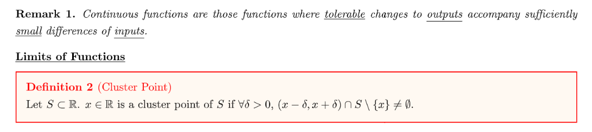
> Another way of phrasing the definition is to say that $x$ is a cluster point of $S$ if for every $ε > 0$, there exists a $y ∈ S$ such that $0<|x−y| < ε$. 
> **Note that a cluster point of **$S$** need not lie in **$S$**.**
> 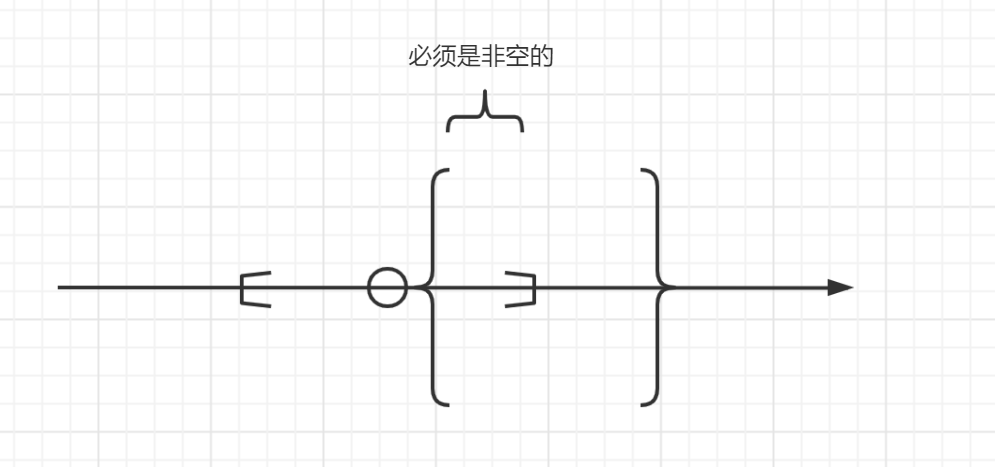

>[!proof]
>**Examples and Proofs**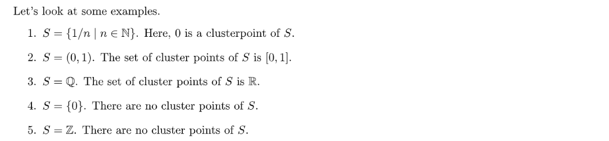
>1. Using convergence 
>2. Using precise definition of sup and inf
>3. Using density of the rational numbers.
>4. 一些孤立的点组成的集合都是没有cluster points的。
>5. 和上面一样。

## Theorem
> [!thm]
> 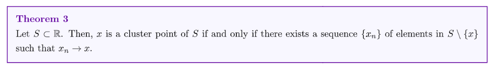

> [!proof]
> **Proof of Theorem 3(Easy)**($\Longrightarrow$): If $x$ is a cluster point of $S$, then according to the definition, we have $\forall \epsilon>0, (x-\epsilon,x+\epsilon)\cap S\backslash \{x\}\neq \emptyset$, which means $\exists y\neq x\in (x-\epsilon,x+\epsilon)\cap S$. Thus we have, $y\in (x-\epsilon,x+\epsilon)$and $y\in S$. If we take enough number of elements like $y$and form a sequence, we are sure that $\exists \{x_n\}$of elements in $S\backslash \{x\}$such that $\lim_{n\to \infty}x_n=x$。($\Longleftarrow$): If there exists a sequence $\{x_n\}$of elements in $S\backslash\{x\}$such that $\lim_{n\to \infty} x_n=x$, we will have $\forall \epsilon>0, \exists M_0\in \mathbb{N}, ~~s.t~~\forall n\geq M_0, |x_n-x|<\epsilon$, which means $\exists y\in \{x_n\},~~s.t.~~|y-x|<\epsilon$. Also since $\{x_n\} \subset S\backslash\{x\}$, which implies $\exists y\neq x\in (x-\epsilon,x+\epsilon)\cap S$, which ends our proof

# 2 Function Convergence - Definition
## Definition⭐⭐
> [!def]
> 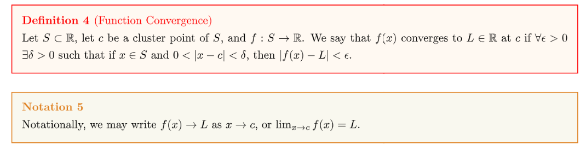
> 至于为什么会要求$c$是`Cluster Point`, 是因为我们想要$(c-\delta,c+\delta)\cap S\neq \emptyset$, 也就是上面的$0<|x-c|<\delta$条件的来源。同时$|x-c|>0$的条件也在一定程度上限制了$x\neq c$这一事实。

## Unique Convergence Theorems⭐⭐⭐⭐⭐
> [!thm]
> 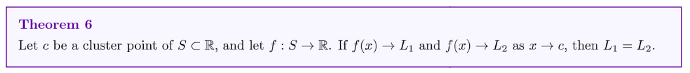

> [!proof]
> **Proof of Theorem 6(Medium)**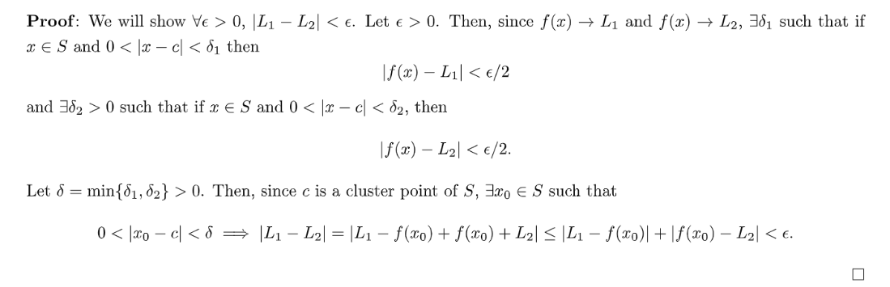

## Important Examples - How to choose delta
> [!example]
> 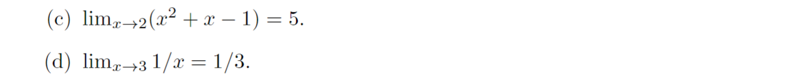

> [!proof]
> 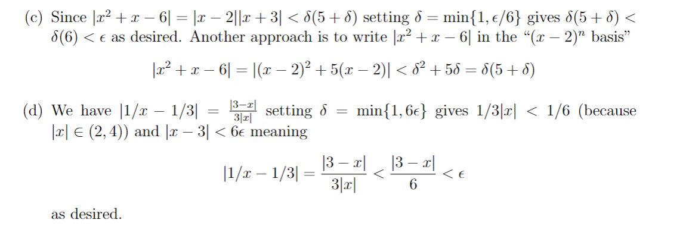

> [!example]
> 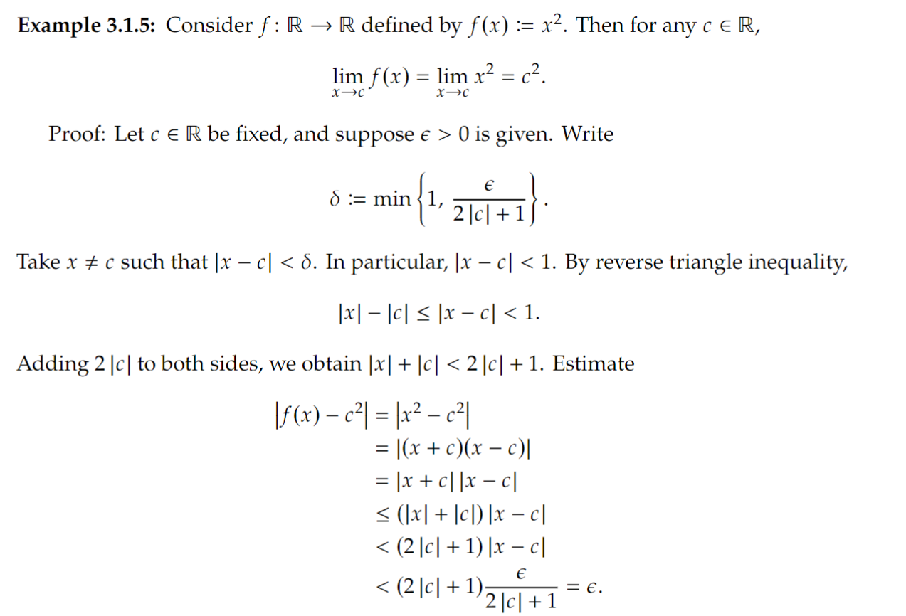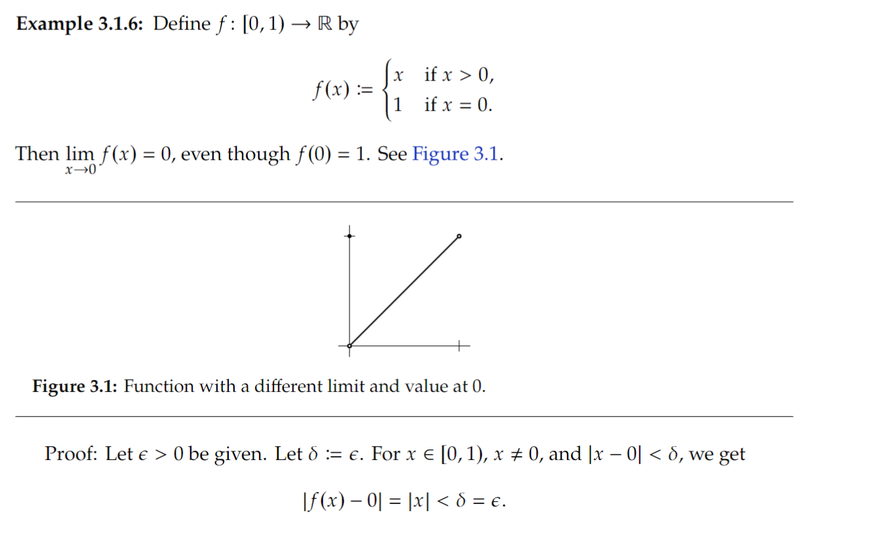

# 3 Function Convergence - Sequence
## Limit&Sequence⭐⭐⭐⭐⭐
### Theorem 
> [!def]
> 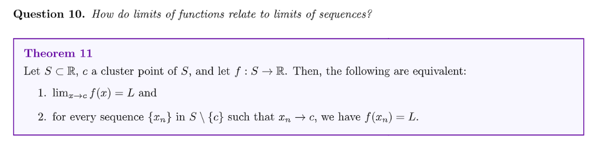
> **注意: 这里**$c$**不一定要在**$S$**中，因为极限研究的是函数在**$c$**附近的行为，如果**$c$**不在函数的定义域**$S$**内(**$S$**的 **`Cluster Point`**完全有可能不在**$S$**中，因为我们没有要求**$S$**是一个闭区间或者**`Closed Set`**)，也不影响函数在**$c$**处的极限值的取值。**
> 

> [!proof]
> **Proof of Theorem 11(Medium)**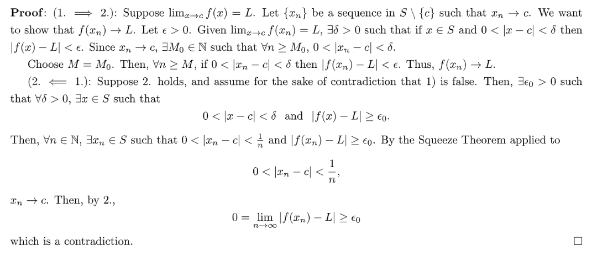

### Examples 
> [!example]
> 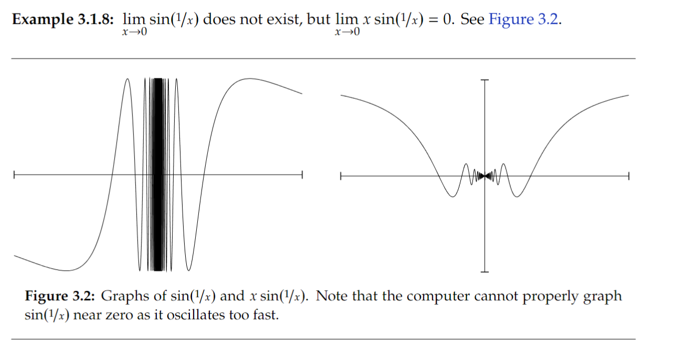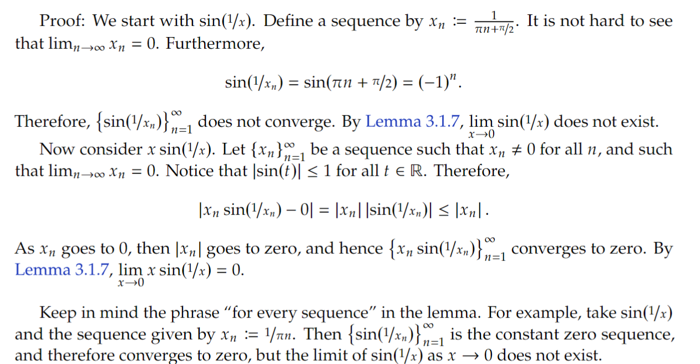

## Function Limit
### Squeeze Theorem For Functions
> [!thm]
> 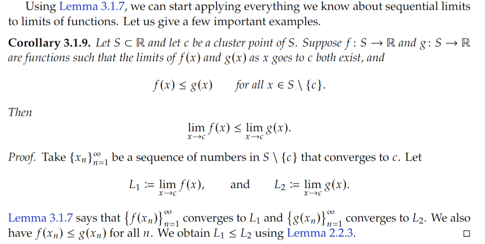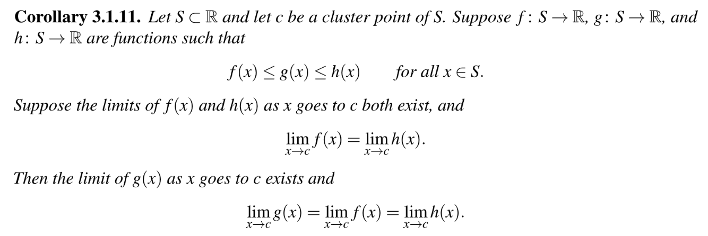

> [!proof] Proof of Corollary 3.1.10
> Since. $\lim _{x \rightarrow c} f(x)$ exists, let's denote $\lim _{x \rightarrow c} f(x)=L$ 
> By lemma 3:1.7 (Theorem 11), suppose $\left\{x_n\right\}_{n=1}^{\infty}$ is a sequence in $S \backslash\{c\}$ and $X_n \rightarrow C$, we have
> $$\begin{aligned}& \left\{f\left(x_n\right)\right\}_{n=1}^{\infty} \rightarrow L \\& \because a \leqslant f\left(x_n\right) \leqslant b \quad \forall\left\{x_n\right\}_{n=1}^{\infty}\end{aligned}$$
> By the basic property of limit:$$\begin{aligned}\lim _{n \rightarrow \infty} a & \leqslant \lim _{n \rightarrow \infty}\left\{f\left(x_n\right)\right\}_{n=1}^{\infty} \leqslant \lim _{n \rightarrow \infty} b \\a & \leqslant L \leqslant b \\a & \leqslant \lim _{x \rightarrow c} f(x) \leqslant b\end{aligned}$$

> [!proof] Proof of Corollary 3.1.11
> Since limits of $f(x), g(x), h(x)$ exists at $c$, we have:
> $$\lim _{x \rightarrow c} f(x)=L_1, \lim _{x \rightarrow c} g(x)=L_2, \lim _{x \rightarrow c} h(x)=L_3 \text {. }$$
> By Lemma 3.1.7 (Theorem 11) we have.
> $\exists\left\{x_n\right\}_{n=1}^{\infty}$ in $S \backslash\{c\}$ and $x_n \rightarrow C$, such that
> $$\left\{f\left(x_n\right)\right\}_{n=1}^{\infty} \rightarrow L_1,\left\{g\left(x_n\right)\right\}_{n=1}^{\infty} \rightarrow L_2,\left\{h\left(x_n\right)\right\}_{n=1}^{\infty} \rightarrow L_3 \text {. }$$
> $$\because f(x) \leqslant g(x) \leq h(x) \quad \forall x \in S$$
> $\therefore f\left(x_n\right) \leqslant g\left(x_n\right) \leqslant h\left(x_n\right) \quad \forall\left\{x_n\right\}_{n=1}^{\infty}$
> $\therefore \lim _{h \rightarrow \infty} f\left(x_n\right) \leqslant \lim _{n \rightarrow \infty} g\left(x_n\right) \leqslant \lim _{n \rightarrow \infty} h\left(x_n\right)$
> $\because \lim _{x \rightarrow c} f(x)=\lim _{x \rightarrow c} h(x)$
> $$
> \therefore \lim _{n \rightarrow \infty} f\left(x_n\right)=\lim _{n \rightarrow \infty} h\left(x_n\right)$$
> By squeeze theorem:$$
> \begin{aligned}
> & \lim _{n \rightarrow \infty} f\left(x_n\right)=\lim _{n \rightarrow \infty} g\left(x_n\right)=\lim _{n \rightarrow \infty} h\left(x_n\right) \\
> \therefore & \lim _{x \rightarrow c} f(x)=\lim _{x \rightarrow c} g(x)=\lim _{x \rightarrow c} h(x) .
> \end{aligned}$$

### Limit Operations
> [!corollary]
> 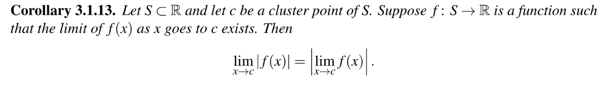
> 这些性质都可以使用Theorem 10(Lemma 3.1.17)转化成数列，然后通过数列极限的性质进行证明。

## Algebraic Operations⭐⭐
### Linear Operations
> [!example]
> 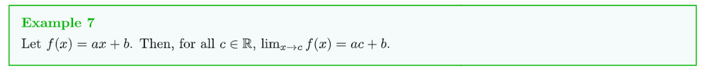

> [!proof]
> **Proof(Easy)**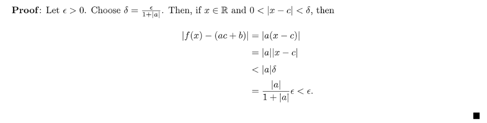

### Roots
> [!example]
> 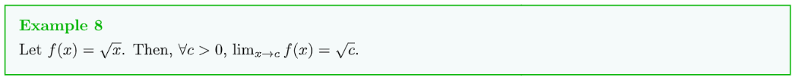

> [!proof]
> **Proof(Easy)**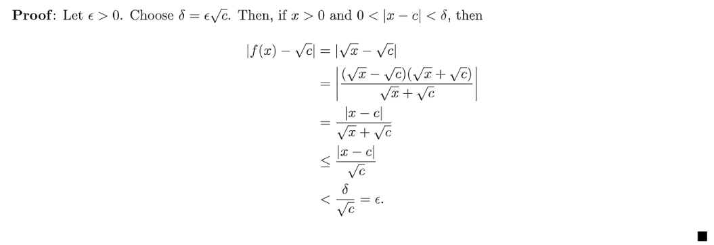

### Power
> [!thm]
> 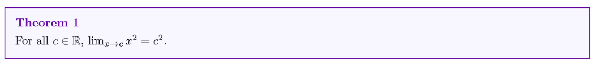

> [!proof] Proof of Theorem 1(Easy)
> 参考: 
> [数列收敛的基本运算操作](https://www.yuque.com/alexman/cbermo/whd7gt#hBMmJ)
> 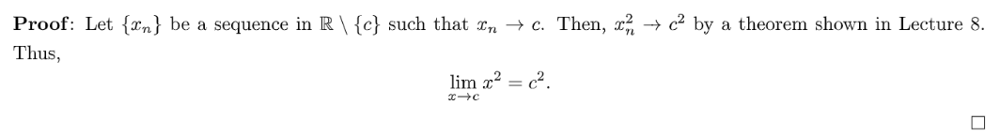

### Trignometric Function⭐⭐
> [!def]
> 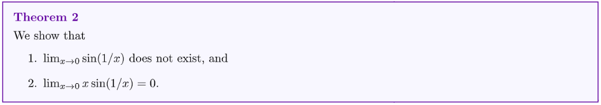

> [!example]
> **Graphs**$sin(\frac{1}{x})$的图像: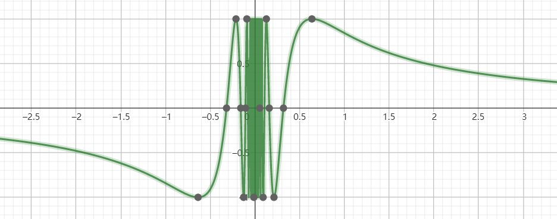$xsin(\frac{1}{x})$的图像: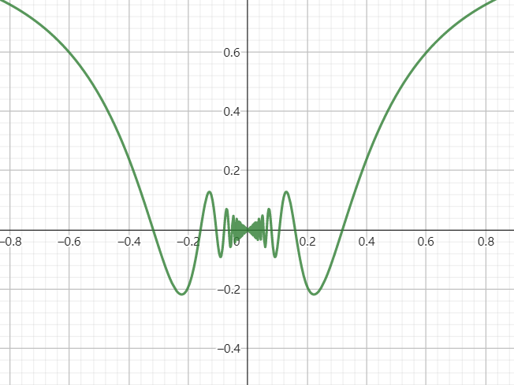

> [!proof] **Proof of Theorem 2（Medium）**
>为了证明第一个结论，我们需要对`Sequence Theorem`做一个`Negation`, 也就是: $\lim_{x\to c}f(x)\neq L\iff\exists \{x_n\}_{n=1}^{\infty} \in S\backslash \{c\}, \lim_{n\to \infty}f(x_n)\neq L$。换句话说，我们只要找到一个符合条件的数列使得$\lim_{n\to \infty} f(x_n)\neq L$(或者更一般的，$\lim_{n\to \infty}f(x_n)$根本不存在。)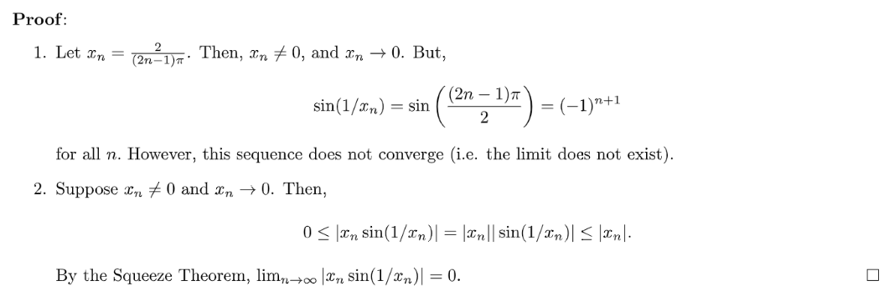

### Piecewise Function⭐⭐
> 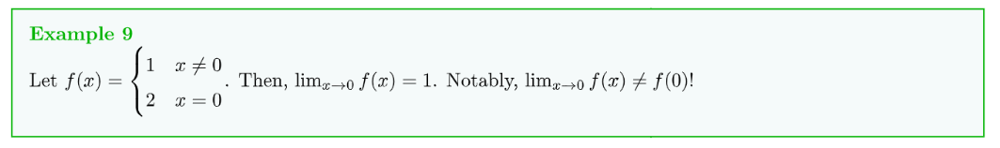

**Proof(Easy)**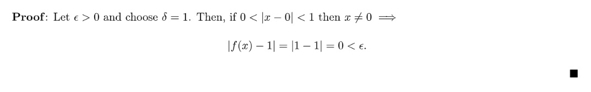

## Inequality⭐⭐⭐
> 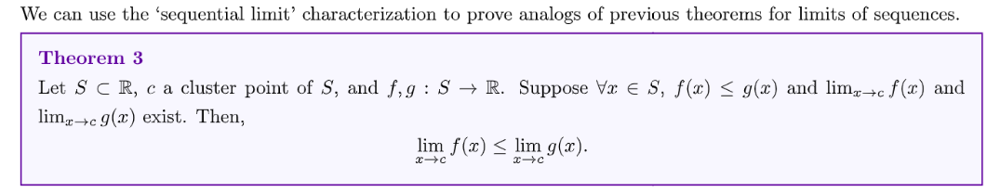

**Proof of Theorem 3(Easy)**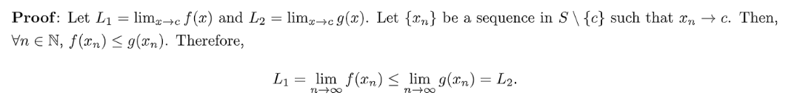

# 4 Supremum/Infimum of Functions
## Boundedness of Functions
> [!def]
> 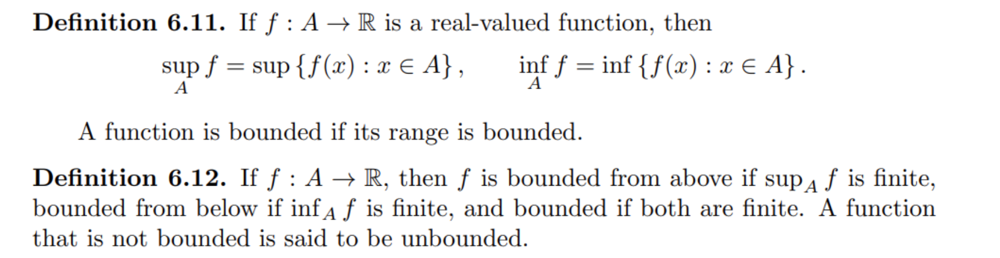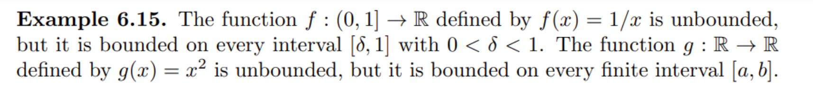

> [!example]
> 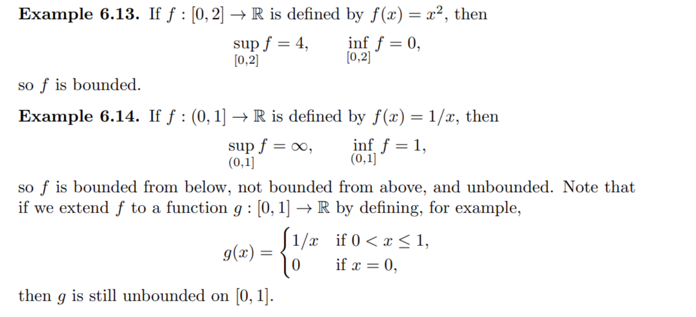

## Local Boundedness
> [!def]
> 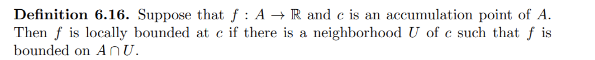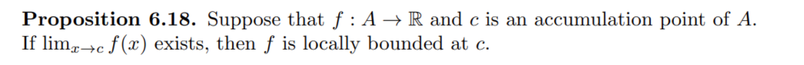

> [!proof]
> 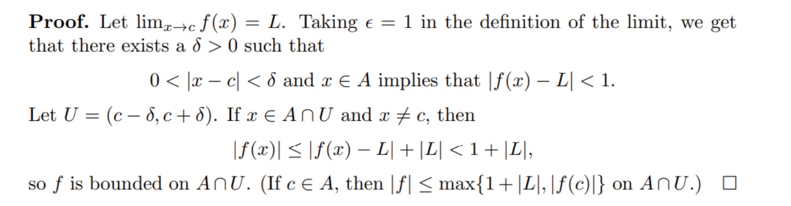

> [!example]
> 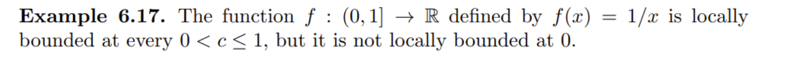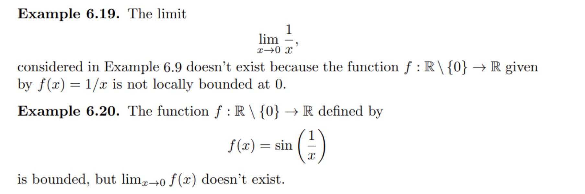

 

# 5 Left&Right Limit&Infinite Limit
## Left/Right Limit
### Left Limit
> [!def]
> 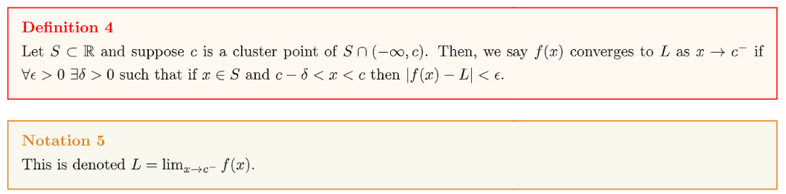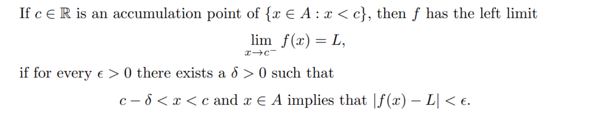

### Right Limit
> [!def]
> 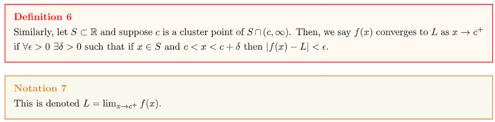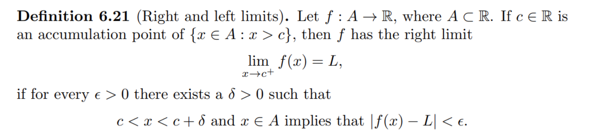

### Examples
> [!example]
> 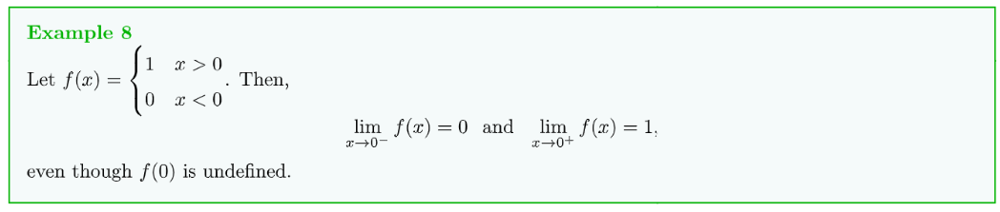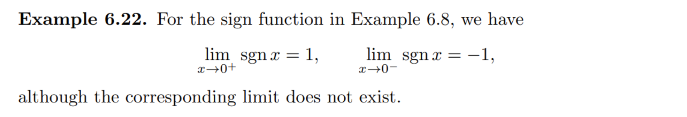

## Left Limit=Right Limit=Limit
> [!thm]
> 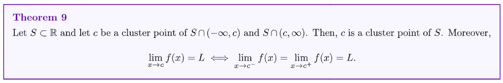

> [!proof]
> **Proof of Theorem 9(Easy)**
> ($\Longrightarrow$):  因为$\lim_{x\to c}x_n=L$, 所以$\forall \epsilon>0, \exists\delta >0,~~我们有, 如果x\in S且0<|x-c|<\delta$, 则$|f(x)-L|<\epsilon$。则无论我们从左还是从右接近$c$, 都会有$|f(x)-L|<\epsilon$成立。
> ($\Longleftarrow$): 因为$\lim_{x\to c^-}x_n=L$, 所以$\forall \epsilon>0, \exists\delta_1 >0, c-\delta_1<x<c, ~~s.t.~~ |f(x)-L|<\epsilon$。因为$\lim_{x\to c^+}x_n=L$, 所以$\forall \epsilon>0, \exists\delta_2 >0, c<x<c+\delta_2, ~~s.t.~~ |f(x)-L|<\epsilon$， 于是我们可以选择$\delta=\min\{\delta_1,\delta_2\}$, 然后证明$\lim_{x\to c}x_n=L$
> 如果$0<|x-c|<\delta$, 则$x\in (c-\delta,c)\subset (c-\delta_1,c)$或者$x\in (c,c+\delta)\subset (c+\delta_2)$成立，在两种情况下，$|f(x)-L|<\epsilon$, 证毕。

## Infinite Limit
### Convergence Definition
> [!def]
> 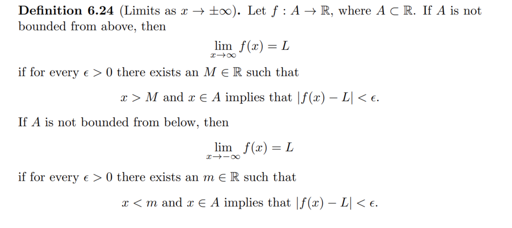

### Divergence Definition
> [!def]
> 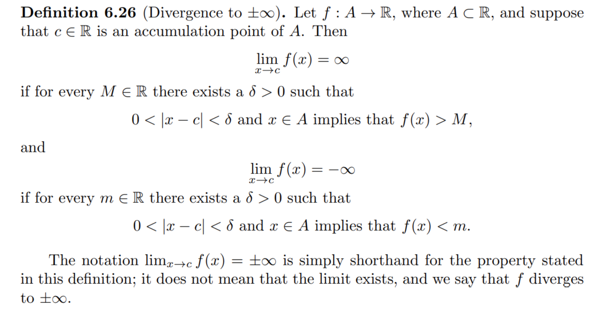

### Useful Tricks
> [!important]
> 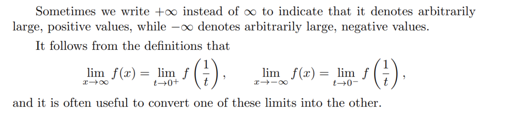

### Examples
> [!example]
> 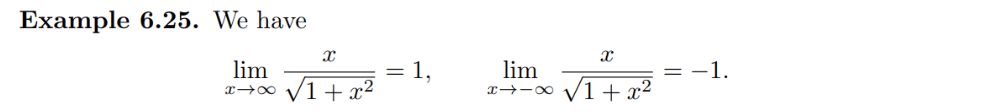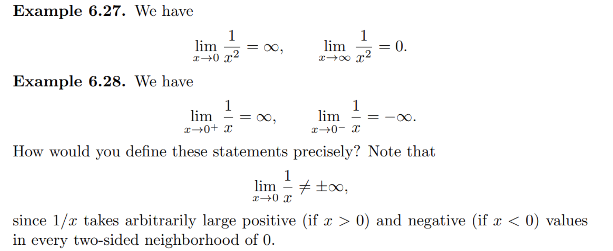

## Exercises
> [!example]
> 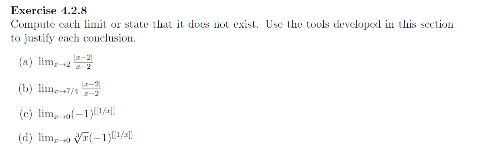

> [!proof]
> 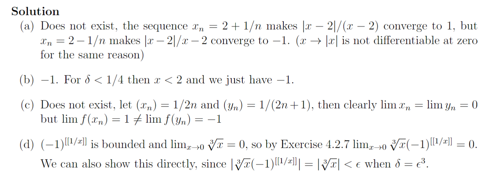

# 6 Continuous Functions
## Definition&Negation
> 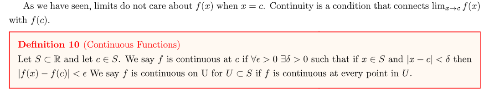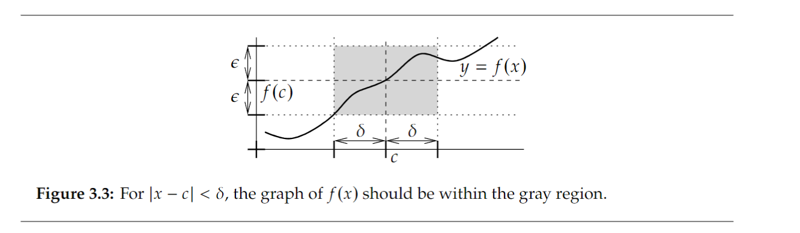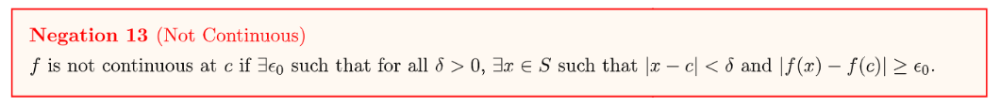
> 但是使用定义证明`Discontinuity`不是很方便，后面我们会介绍通过数列的方法来证明，那样证明更直观方便。
> **需要特别注意两点：**
> 1. 这里的$|x-c|<\delta$, 和前面的$0<|x-c|<\delta$是不一样的， 因为函数连续研究的不是在$c$点附近的行为而一般是研究在$c$点处的行为。所以不要求$x\neq c$, 后面的`Continuity Theorem`中会有所介绍。
> 2. $c\in S$, 也就是$c$作为$S$的`Cluster Point`，如果函数在$c$点处是连续的，则$f(x)$在$c$处一定有定义，换句话说，$c$一定在$f$的定义域中，也就是$c\in S$, 需要特别注意。

**Example**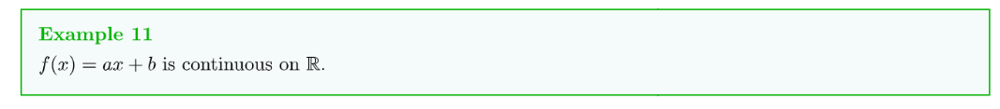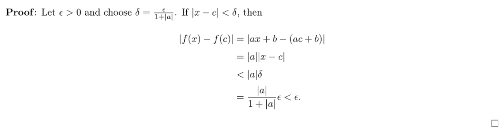
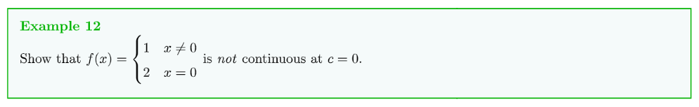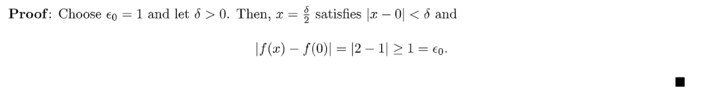

## Continuity Theorem⭐⭐⭐⭐⭐
> [!motiv] Motivation
> 在介绍`Continuity Theorem`之前，我们如果要证明一个函数是否连续，就必须从定义出发，有时候非常的繁琐。

### Proving Continuity

> [!thm]
> 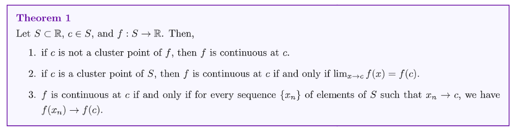
> 这里命题$3$的证明和之前的`Convergence`中的证明一致。
> 其中命题$3$的否定形式在我们证明`Discontinuity`的时候特别有用，我们写出其表述:
> $f$ **is discontinuous at $c$ if there exists a sequence $\{x_n\}$of elements of $S$ such that $x_n\to c$ but $f(x_n)$does not converge to $f(c)$**(**$\lim_{n\to \infty}x_n \neq f(c)$**)
> **Remarks:**
> 这个定理的强大之处在于，他使得我们能够将函数连续的问题转化为一个数列极限的问题，这样我们就可以套用很多极限的性质，简化证明过程。

> [!proof]
> **Proof of Theorem 15.1.1(Easy)**本质上，如果$c$不是$S$(函数$f$的定义域)，则临近$c$的点只有$c$本身，此时$f(x)=f(c)=c$。下面我们详细证明:
> 根据定义，如果$c$不是$f$的一个`Cluster Point`, 则$\exists \delta_0>0,~~s.t.~~(c-\delta_0,c+\delta_0)\cap S=\{c\}\tag{1}$
> 然后根据我们上面的函数连续的定义我们有: $\forall \epsilon>0,\exists \delta_0>0,~~s.t.~~$如果$x\in S$且$|x-c|<\delta_0$, 则我们有$x=c$(根据$(1)$)，此时$|f(x)-f(c)|=|f(c)-f(c)|=0<\epsilon$。证毕。
> 
> **Proof of Theorem 15.1.2(Medium)**假设$c$是$S$的一个`Cluster Point`, 则我们根据定义有: $\forall \delta>0, (c-\delta,c+\delta)\cap S\backslash\{c\}\neq \emptyset$。同时因为
> ($\Longleftarrow$): 如果$\lim_{x\to c}f(x)=f(c)$, 则根据定义，$\forall \epsilon>0, \exists \delta>0,~s.t. ~~if~~x\in S~~ and ~~0<|x-c|<\delta, ~|f(x)-f(c)|<\epsilon$。
> 此时我们选取$\delta=\delta_0$, 则如果$x\in S$且$|x-c|<\delta_0$，我们分两种情况讨论：
> 1. $x=c$(我们可以这么做，因为$c\in S$)，则此时$|f(x)-f(c)|=|f(c)-f(c)|=0<\epsilon$
> 2. $x\neq c$，则根据极限的条件，我们有$|f(x)-f(c)|<\epsilon$
> 
> ($\Longrightarrow$): 如果$f(x)$在$c\in S$处连续, 则根据定义，$\forall \epsilon>0, \exists \delta>0,~s.t. ~~if~~x\in S~~ and ~~|x-c|<\delta, ~|f(x)-f(c)|<\epsilon$, 我们也分两种情况讨论:
> 1. 如果$x\neq c$，则$\exists\delta>0 ,0<|x-c|<\delta$, 满足$|f(x)-f(c)|<\epsilon$
> 2. 如果$x=c$, 则$\exists \delta >0, |c-c|=0<\delta$, 满足$|f(c)-f(c)|=0<\epsilon$。
> 综上所述，证毕。
> 
> **Proof of Theorem 15.1.3(Medium, 类比Convergence Theorem)**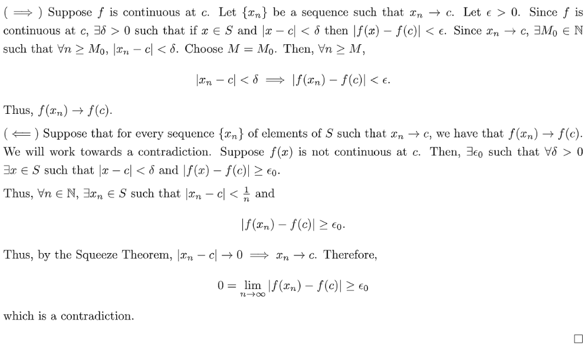
> 你可能会疑惑，为什么$\exists x\in S,~~s.t.~~ |x-c|<\delta$, 就能得到$\forall n\in \mathbb{N}, |x_n-c|<\frac{1}{n}$, 其实我们可以这样想:$\exists x_1\in S, ~~s.t.~~, |x_1-c|<1$,$\exists x_2\in S, ~~s.t.~~, |x_2-c|<\frac{1}{2}$
> 所以自然而然我们有:$\exists x_n\in S, ~~s.t.~~, |x_n-c|<\frac{1}{n}$。我们所做的这些努力最终是为了能够套用我们的假设: 如果$x_n\to c$, 则$f(x_n)\to f(c)$, 进而推出矛盾。

### Proving Discontinuity
> [!thm]
> 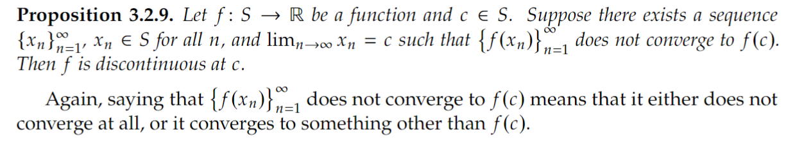

## Continuity Proposition
### Corollaries
> [!corollary] 
> 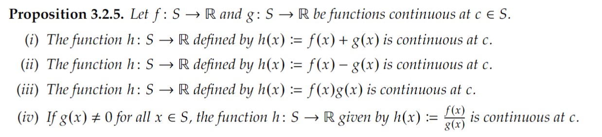
> 使用`Continuity Theorem`证明即可。

### Algebraic Operations
> 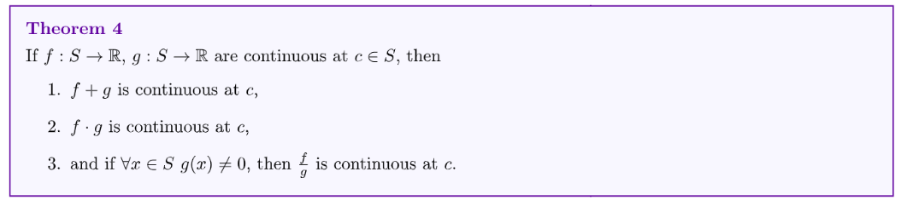

**Proof of Theorem 4(Easy)**
1. 因为$c\in S$, 所以$\exists x_n\to c$, 因为$f,g$都在$c$处连续，所以$f(x_n)\to f(c)$且$g(x_n)\to g(c)$, 所以$f(x_n)+g(x_n)=(f+g)(x_n)\to f(c)+g(c)$, 也就是$(f+g)(x)$在$c$处连续。
2. 和极限乘积证明类似。
3. 和极限比值证明类似。
**Examples**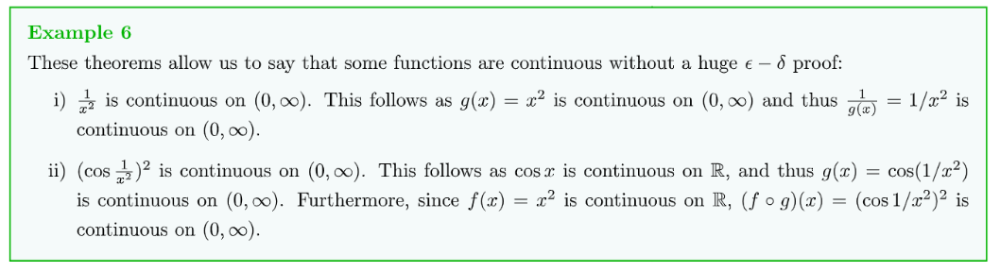

### Composition of continuous function
> 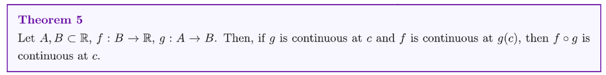

> [!proof]
> **Proof of Theorem 5**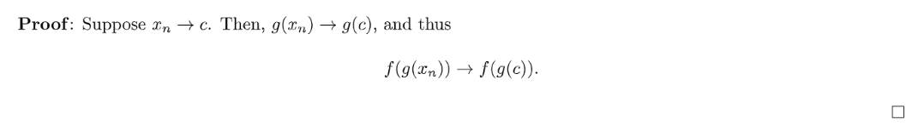

> [!example]
> 假设**$f(x)=\frac{1}{3+(sinx)^4}$** is continuous:
> - By composition: $sin^4(x)$ is continuous
> - By algebraic operation: $3+(sinx)^4$is continuous
> - By algebraic operation: $\frac{1}{3+(sinx)^4}$is continuous.
> 
> 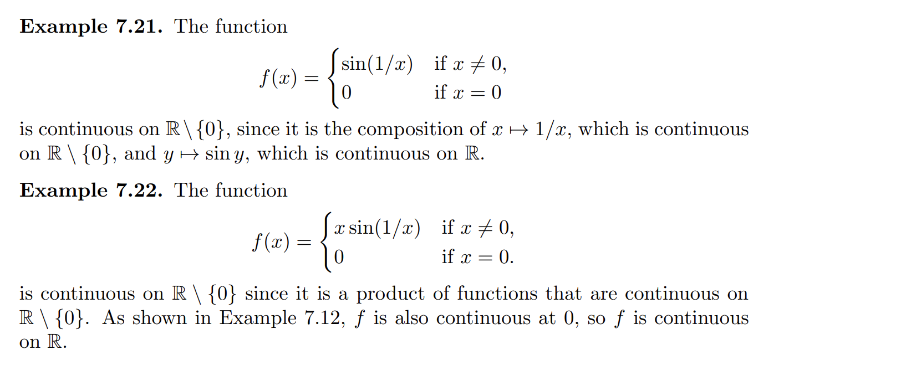

## Continuous Examples
### Trignometric Functions
> [!example]
> 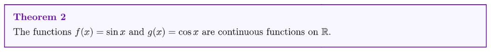

> [!proof]
> **Proof of Theorem 2(Medium, have to recall some trignometric properties)**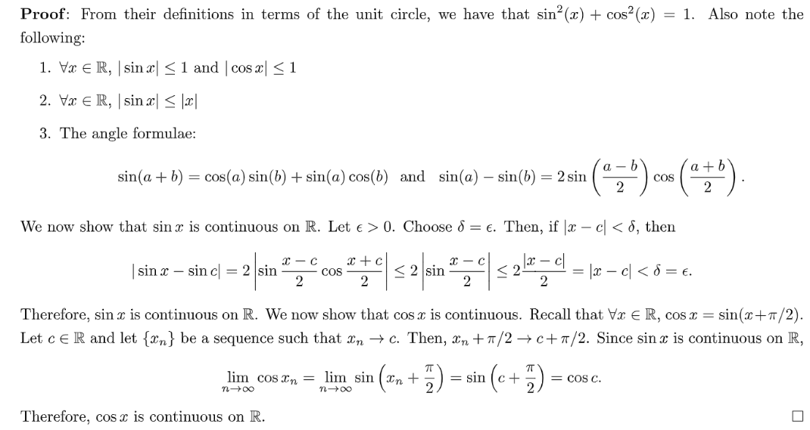

### Polynomials
> [!example]
> 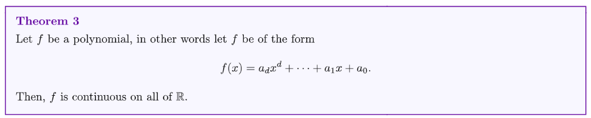

> [!proof]
> **Proof of Theorem 3(Easy)**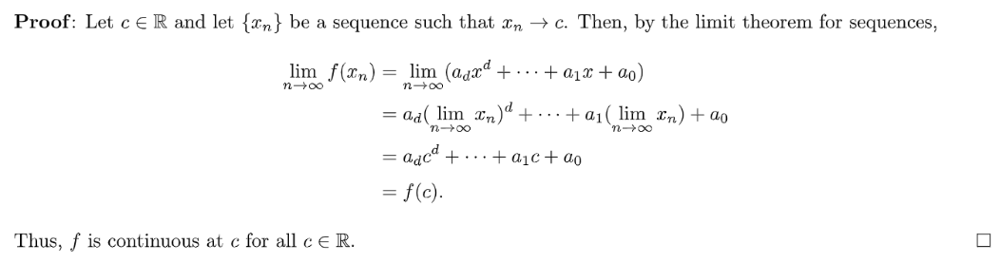

### Reciprocal Function
> [!example]
> 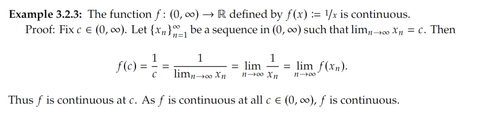

## Discontinuous Examples
### Binary Example
> [!example] 
> 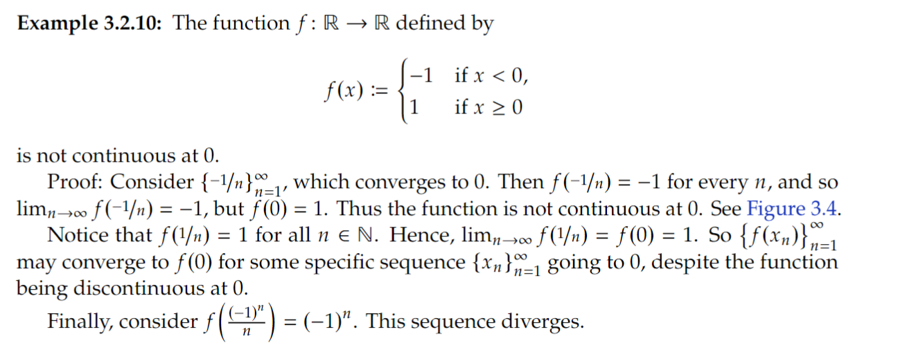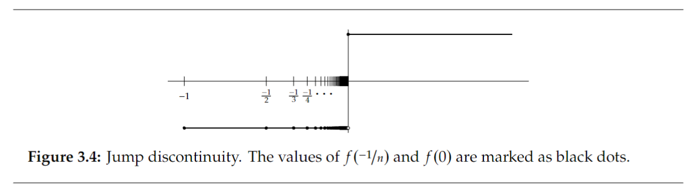

### Dirichlet Function
> [!important]
> 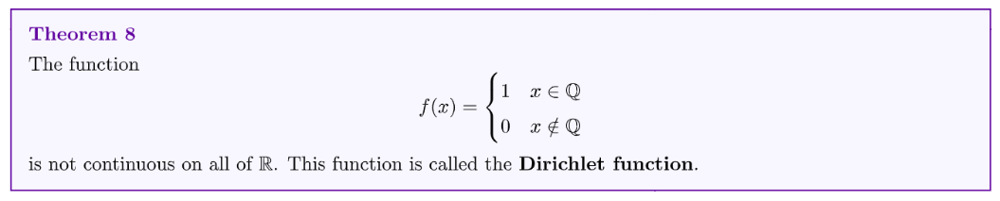

> [!proof] Proof Method 1
> 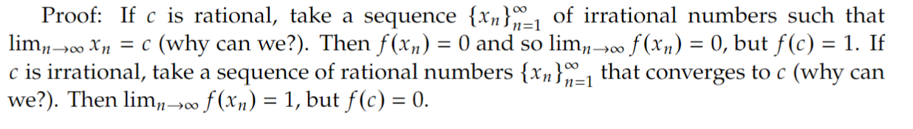

> [!proof] Proof Method 2
> 我们将使用上述的 Continuity Theorem 的 Negation，即 $\exists\left\{x_n\right\} \subset S$, s.t. if $x_n \rightarrow c, f(x)$ doesn't converge to $f(c)$ 。
> 既然题目要求我们证明对于所有的 $c \in \mathbb{R}$ 都有 $f$ 在 $c$ 处不连续，我们完全可以分类讨论所有的情况:
> 1. $c \in \mathbb{Q}$ ，因为我们知道任意的两个有理数之间都会有无理数的存在，于是我们可以构造出一个满足下列条件的数列:
> $\forall n \in \mathbb{N}, c<x_n<c+\frac{1}{n}$ ，所以根据 Squeeze Theorem，我们有 $\lim _{n \rightarrow \infty} x_n=c$ ，即 $x_n \rightarrow c$ 注意 $x_n \in \mathbb{Q}^c$ ，但是此时， $\lim _{n \rightarrow \infty} f\left(x_n\right)=0 \neq 1=f(c)$ 。
> 2. $c \in \mathbb{Q}^c$ ，因为我们知道任意的两个无理数之间都会有有理数的存在，于是我们可以构造出一个满足下列条件的数列$\forall n \in \mathbb{N}, c<x_n<c+\frac{1}{n}$ ，所以根据 Squeeze Theorem，我们有 $\lim _{n \rightarrow \infty} x_n=c$ ，即 $x_n \rightarrow c$ 注意 $x_n \in \mathbb{Q}$ ，但是此时， $\lim _{n \rightarrow \infty} f\left(x_n\right)=1 \neq 0=f(c)$ 。证毕。

### Popcorn Function
> [!example]
> 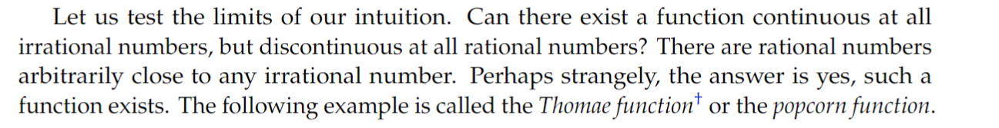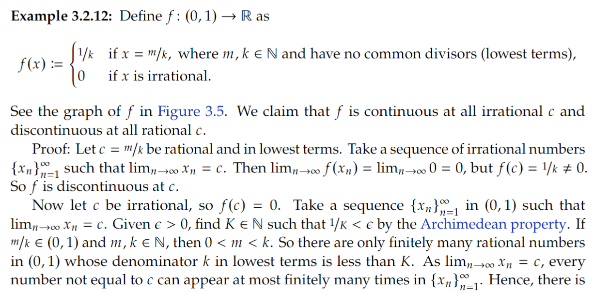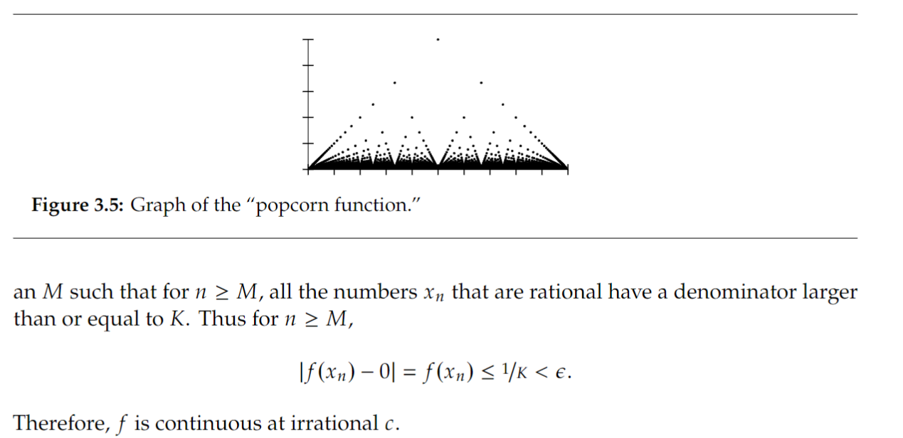

### Sign Function
> [!example]
> 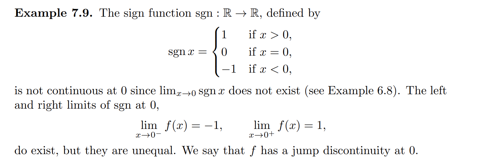

### Highly Oscillating Functions
> [!example]
> 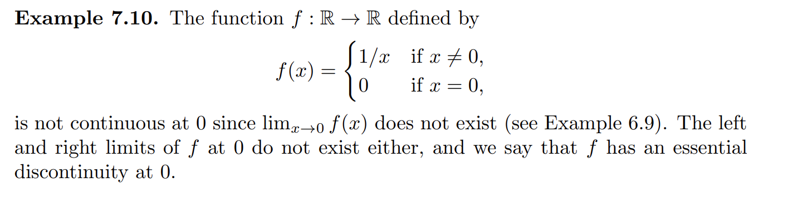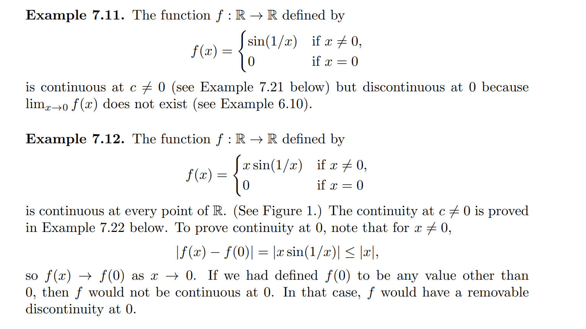

### Removable Discontinuity
> [!example]
> 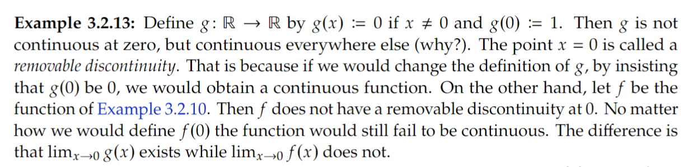

# 7 Types of Discontinuity
> [!def]
> 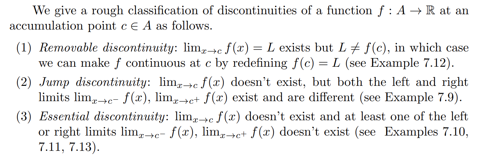

# 8 Assignment
[hw7.pdf](https://www.yuque.com/attachments/yuque/0/2022/pdf/12393765/1669194193583-2b28bd12-c9d8-4587-813d-47d4fbac3921.pdf)
[hw8.pdf](https://www.yuque.com/attachments/yuque/0/2022/pdf/12393765/1669453710485-86b5b6dd-054b-4796-86fe-30873718682c.pdf)

## P1 Cluster Point
> 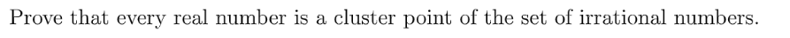

> [!proof]
> **Proof(Easy)**
> 对于一个实数**$x$**来说，它要么是有理数，要么是无理数，所以我们分类讨论:
> 1. $x\in \mathbb{Q}$, 即$x$是有理数，因为对于任意两个实数($x+\epsilon$和$x-\epsilon$)之间都会有一个无理数，于是$\forall \epsilon>0$, 我们有$\exists y\neq x\in (x-\epsilon,x+\epsilon)\cap\mathbb{R}\backslash\mathbb{Q}$, 于是$x$是$\mathbb{R}\backslash\mathbb{Q}$的一个`Cluster Point`。
> 2. $x\in \mathbb{R}\backslash \mathbb{Q}$，即$x$是无理数，因为对于任意两个实数($x+\epsilon$和$x-\epsilon$)之间都会有一个无理数，于是$\forall \epsilon>0$, 我们有$\exists y\neq x\in (x-\epsilon,x+\epsilon)\cap\mathbb{R}\backslash\mathbb{Q}$, 于是$x$是$\mathbb{R}\backslash\mathbb{Q}$的一个`Cluster Point`。

## P2 Function&Subsequence
> 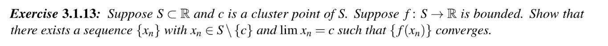

**Proof(Easy, BW Theorem)
假设$c$是$S$的一个`Cluster Point`, 则$\forall \epsilon>0, \exists y\neq c \in (c-\epsilon,c+\epsilon)\cap S$。
则$\forall n\in \mathbb{N}, \exists x_n\neq c\in (c-\frac{1}{n},c+\frac{1}{n})$， 即存在数列$\{x_n\}\subset S\backslash\{c\}$满足$\lim_{n\to \infty}x_n=c$
因为$f:S\to \mathbb{R}$是有界的，换句话说就是$\forall x\in S, |f(x)|\leq B$。
于是对于刚刚构造的$\{x_n\}\subset S\backslash\{c\}$来说，$\{f(x_n)\}_n$是有界的。
根据`BW-Theorem`, 我们有子序列$\{f(x_{n_k})\}_k$是收敛的，且因为$\lim_{n\to \infty}x_n=c$($\{x_n\}$收敛)，则$x_{n_k}$收敛(所有子数列收敛)，所以存在性证明完毕。

## P3 Cluster Point&Boundedness
> 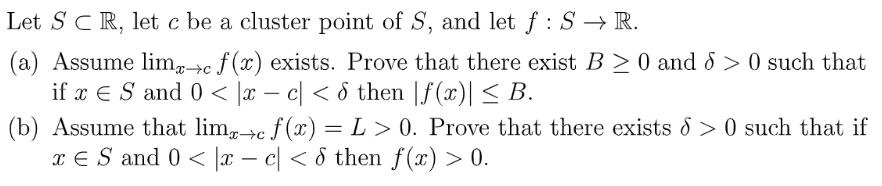

**(a) Convergence=>Boundedness**假设$\lim_{x\to c}f(x)=L$, 则$\forall \epsilon>0, \exists\delta>0, if~~x\in S~~and~~0<|x-c|<\delta,~~s.t.~~|f(x)-L|<\epsilon$
我们使用三角不等式得到: $|f(x)|=|f(x)-L+L|\leq |f(x)-L|+|L|<\epsilon+|L|$,令$B=\epsilon+|L|$，证毕。
本质上就是从`Convergence`推导`Boundedness`。
**(b) 假设$\lim_{x\to c}f(x)=L$, 则$\forall \epsilon>0, \exists\delta>0, if~~x\in S~~and~~0<|x-c|<\delta,~~s.t.~~|f(x)-L|<\epsilon$。所以$\exists \delta>0$使得$\epsilon=L$，得到$0<f(x)<2L$, 证毕。

## P4 Squeeze Theorem for Function Limit
> **证明下面的结论:**
> 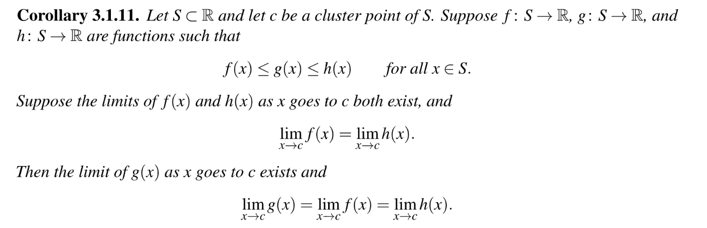

**Proof(Easy, by analogy to squeeze theorem)**因为$\lim_{x\to c}f(x)=\lim_{x\to c}h(x)=L$, 于是$\forall \epsilon>0, \exists\delta>0,~~then~~if~~0<|x-c|<\delta,~~we~~have$$\begin{cases}|f(x)-L|<\epsilon \\|h(x)-L|<\epsilon \end{cases}$
则$\begin{cases}f(x)<L+\epsilon\\L-\epsilon<h(x) \end{cases}$。因为$f(x)\leq g(x)\leq h(x), \forall x\in S$, 则:
$L-\epsilon< f(x)\leq g(x)\leq h(x)<L+\epsilon$, 于是$|g(x)-L|<\epsilon$, 所以$\lim_{x\to c}g(x)=L$, 证毕。

## P5 Dirichlet Function
> 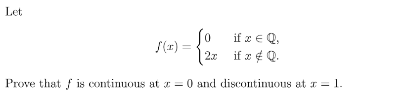

**Proof(Easy)**
1. 假设我们要研究$f$在$x=0$处的连续性，则我们令$c=0$, 因为我们知道任意的两个有理数之间都会有无理数的存在，于是我们可以构造出一个满足下列条件的数列:

$\forall n\in \mathbb{N}, c<x_n<c+\frac{1}{n}$，所以根据`Squeeze Theorem`, 我们有$\lim_{n\to \infty} x_n=c$, 即$x_n\to c$注意$x_n\in \mathbb{Q^c}$, 但是此时，$\lim_{n\to \infty}f(x_n)=0=f(c)$。

2. 假设我们要研究$f$在$x=1$处的连续性，则我们令$c=1$, 因为我们知道任意的两个有理数之间都会有无理数的存在，于是我们可以构造出一个满足下列条件的数列:

$\forall n\in \mathbb{N}, c<x_n<c+\frac{1}{n}$，所以根据`Squeeze Theorem`, 我们有$\lim_{n\to \infty} x_n=c$, 即$x_n\to c$注意$x_n\in \mathbb{Q^c}$, 但是此时，$\lim_{n\to \infty}f(x_n)=2\neq 0= f(1)=f(c)$。
证毕。

