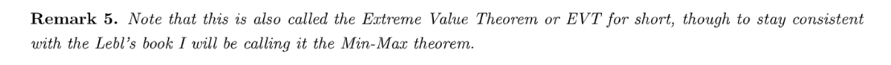
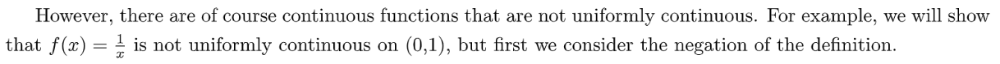

[Lecture Note 16.pdf](https://www.yuque.com/attachments/yuque/0/2022/pdf/12393765/1669344118527-dbd2b01d-5dc5-48a1-8711-ab4995dcd401.pdf)
[Lecture Note 17.pdf](https://www.yuque.com/attachments/yuque/0/2022/pdf/12393765/1669344118496-0228cf54-96b0-4a6b-a369-db95c4eed273.pdf)
[Supplementals_Continuous_Function.pdf](https://www.yuque.com/attachments/yuque/0/2022/pdf/12393765/1669469216427-3dab6a62-9827-493f-b9e2-d35e4fd225e8.pdf)

# 1 Min/Max Theorem
## Close+Continuous=>Bounded⭐⭐⭐⭐⭐
> 
> **Unbounded(Negation of Definition):**
> A function $f:S\to \mathbb{R}$is unbounded if $\forall B\geq 0,\exists x\in S, ~~s.t.~~|f(x)|\geq  B$

**Proof of Theorem 2(Medium, Using BW Theorem and Contradiction)**⭐⭐我们使用反证法证明，首先假设$f:[a,b]\to \mathbb{R}$是连续的，但$f$是`Unbounded`的。
所以根据定义，我们有$\forall B\geq 0, \exists x\in [a,b],~~s.t.~~|f(x)|\geq B$
如果我们知道了$\exists x\in [a,b]$, 则我们可以由此构建出一个数列$\{x_n\}$，即$\exists \{x_n\}\subset [a,b]$(这个数列中的元素都是来自于$[a,b]$中的)， 使得$\forall B\geq 0,~~s.t.~~|f(x_n)|\geq B$。
**因为这里是**$\forall B\geq 0$**, 于是我们可以写出: **$\forall n\in \mathbb{N},~~s.t.~~|f(x_n)|\geq n \tag{1}$
而$\{x_n\}\subset [a,b]$, 意味着$\{x_n\}$是`Bounded`的，根据`BW-Theorem`, 我们知道$\exists \{x_{n_k}\}$($\{x_n\}$的子序列)$\subset \{x_n\}$是收敛的。
因为$f$是连续的(假设在$c$点处连续)，所以对于所有的$\{x_n\}\subset [a,b]$，都满足: 如果$x_n\to c$($c\in [a,b]$and is a cluster point of $[a,b]$), 则$f(x_n)\to f(c)$。
因为我们刚刚找到的$\{x_{n_k}\}$就满足这个条件，即$x_{n_k}\to c$且$\lim_{k\to \infty} f(x_{n_k})=f(c)$。
而根据`L13&L14&L15`中的`Corollary 3.1.13`, 我们有$\lim_{k\to \infty} |f(x_{n_k})|=|f(c)|$, 而这表明$|f(x_{n_k})|$收敛，这也意味着$|f({x_{n_k}})|$有界。
于是根据$(1)$式, 我们知道$|f({x_{n_k}})|\geq n_k$, 而从之前的章节中，我们通过数学归纳法已经证明了$n_k\geq k$的结论，于是$|f({x_{n_k}})|\geq k$, 这和$|f({x_{n_k}})|$有界是矛盾的，证毕。
**Examples**
1. 对于连续函数$f(x)=3x+1$, $D_f=[0,1]$, 则我们要证明函数$f(x)$有界。

根据三角不等式我们有: $|f(x)|=|3x+1|=3|x|+1\leq 3+1=4$, 于是函数有界。

2. 对于分段函数: $f(x)=\begin{cases} 0&x=0\\ \frac{1}{x}&x\neq 0 \end{cases}$

$\forall B\geq 0, \exists 0<x<\frac{1}{B+1}<1, ~~s.t. |f(x)|>|f(\frac{1}{B+1})|=B+1>B$, 证毕。

## Close+Continuous=>Absolute Min/Max
> 
> 注意，$f$可能不在端点处取到极值，如上图所示。
> 写成数学语言就是: $\exists c,d \in [a,b],~~s.t.~~ f([a,b])\subset [f(c),f(d)]$。
> 

**Proof of Theorem 4(Medium)**
1. 首先我们证明， 如果$f$是定义在$[a,b]$上的连续函数，则$f$能在$[a,b]$上的某一点取到最大值，假设这一点为$d$。

首先$f$在$[a,b]$上是连续函数，于是$f$在每一点上都有定义，且根据之前的定理，函数是有界的。所以如果我们将$f$在$[a,b]$上的值域组合起来形成一个集合, 那么这个集合一定有一个最大值，不妨设为$L$, 则记为$L=\sup\{f(x):x\in [a,b]\}$, 于是根据之前证明过的一个结论，如果$a_0=\sup\{a_n:n\in \mathbb{N}\}$, 则$\exists s\in \{a_n:n\in \mathbb{N}\}, a_0-\epsilon<s<a_0$, 如果我们把这样的$s$收集起来组成一个数列，则我们可以得到$\forall n\in \mathbb{N}, a_0-\frac{1}{n}<a_n<a_0$, 且根据夹逼定理，$\lim_{n\to \infty}a_n=a_0$。
应用到本题中，我们可以构造一个由函数的值域组成的数列，记为$\{f(x_n)\}_n$($x_n\subset [a,b]$), 满足$L-\frac{1}{n}<f(x_n)<L$，即$\lim_{n\to \infty} f(x_n)=L$。
因为$\{x_n\}\subset [a,b]$, 所以$\{x_n\}$实际上是`Bounded`的。于是根据`Bolzano-Weierstress Theorem`, 我们知道$\exists \{x_{n_k}\}\subset [a,b]$且$x_{n_k}\to d$, 因为$f$是连续的，所以$f(x_{n_k})\to f(d)$, 即$\lim_{k\to \infty} f(x_{n_k})=f(d)$。
那么，怎么将$f(d)$和$L$建立关系呢？注意到$\{f(x_{n_k})\}_k$是$\{f(x_n)\}_n$的一个子序列，而且我们证明了$\{f(x_n)\}_n$收敛于$L$, 所以其所有子序列也都收敛于$L$, 即$\{f(x_{n_k})\}_k\to L$, 所以$f(d)=L$, 因为$\forall x\in [a,b], f(x)\leq f(d)$, 所以$f$在$d$处取到最大值。

2. 首先我们证明， 如果$f$是定义在$[a,b]$上的连续函数，则$f$能在$[a,b]$上的某一点取到最小值，假设这一点为$c$。证明过程和上面类似，无非就是将$\sup$替换成$\inf$的情景，这里略去证明过程。

 

## Cases Min/Max doesn't apply
> 

# 2 Intermediate Value Theorem
> 本小节我们介绍一些**连续函数**的特殊性质。

## Bisection Technique(Examine Root)
> 
> **注意:**
> 如果$f:[a,b]\to \mathbb{R}$不是连续函数，则如果$f(a)<0$其$f(b)>0$, 那么$\exists c\in [a,b], ~~s.t.~~f(c)=0$还成立吗? (**不一定**)
> 取$f(x)=\begin{cases}x-1&x\neq 1\\\frac{1}{2}&x=1 \end{cases}$,则$f(0)=-1,f(2)=1$, 但是不存在$c\in [a,b],~~s.t.~~f(c)=0$。
> 这个性质依赖于函数是连续的，因为只有函数是连续的，才能在定义域上取到所有的值。

**Proof of Theorem 8(Hard, Bisection Method)**
**Example**

## Bolzano IVT
> 
> **这个定理也可以写成集合形式, 也是一个非常重要的推论:**
> 对于一个`Continuous Function`$f:[m,n]\to \mathbb{R}$来说(假设$f(m)<f(n)$), 我们有$[f(m),f(n)]\subset f([m,n])$
> **我们可以想象一个这样的函数, 就不难说明上面的结论是正确的了:**
> 

**Proof of Bolzano IVT(Easy, using Bisection Technique)**

## Range
> 

**Proof of Theorem 11(Medium)**

# 3 Continuity Types
## Continuity
> [!thm]
> 
> **Remarks:**
> 注意，这里的`Continuous`是针对每一个`Cluster Point`而言的，也就是在每一个`Cluster Point`$c$的周围都能找到一个$c$使得if $\forall\delta>0,|x-c|<\delta$, then $|f(x)-f(c)|<\epsilon$。

> [!example]
> **Example**

## Uniform Continuity
### Definition
> [!def]
> 

> [!example] $f(x)=x^2$ is uniformly continuous on $[0,1]$
> 

### Non-Uniform Continuity
> [!def]
> 
> **Sequence Perspective(Non Uniform Criteria):**
> 

> [!proof]
> **Proof for the criteria ( 2=3 )**

> [!example] Example 1: $f(x)=\frac{1}{x}$ is not uniformly continuous on $(0,1)$
> **Examples(Proof for non-uniform continuity)**

> [!example] Example 2: $f(x)=x^2$is not uniformly continuous on  $\mathbb{R}$
> Choose $\epsilon_0=1$, but $\delta>0$. Choose $c=\frac{1}{\delta}$, $x=\frac{1}{\delta}+\frac{\delta}{2}$, 则$|x-c|=\frac{\delta}{2}<\delta$。 $|x^2-c^2|=|(x+c)(x-c)|=(\frac{2}{\delta}+\frac{\delta}{2})\frac{\delta }{2}=1+\frac{\delta^2}{4}\geq 1=\epsilon_0$

> [!example] Example 3: $f(x)=e^x$ is not uniformly continous on $\mathbb{R}$
> We could start from choosing $\epsilon_0=1,~x=c+\frac{\delta}{2}$, where $|x-c|=\frac{\delta}{2}<\delta$. Then $|e^x-e^c|=|e^c(e^{\frac{\delta}{2}}-1)|=|e^c||e^{\frac{\delta}{2}}-1|$. Here since $\lim_{c\to \infty}e^c=\infty$, we know that there always exists such $c\in \mathbb{R}$ so that $|e^c||e^{\frac{\delta}{2}}-1|>1=\epsilon_0$ and the proof is finished.

## Continuity vs Uniform Continuity
### Difference
> [!important]
> 对于函数$f:S\to \mathbb{R}$
> - 在`Continuity`中，我们的条件是$\forall \epsilon>0, \forall c\in S, \exists \delta(\epsilon,c)>0, \forall x\in S~~and~~ x\in (c-\delta, c+\delta),|f(x)-f(c)|<\epsilon$
> $\delta$是一个多元函数，也就是会依赖于$\epsilon$和$c$的取值。 可以想象一个`box`在函数上移动，这个`box`的横轴长度就是$|x-c|=\delta$, 这个`box`的纵轴宽度就是$|f(x)-f(c)|=\epsilon$, 这个`box`在函数上滑动时`box`的横轴长度可以改变，从而使得纵轴宽度不超过$\epsilon$。
> - 在`Uniform Continuity`中，我们的条件是$\forall \epsilon>0,\exists \delta(\epsilon)>0, \forall x,c\in S~~that~~satisfies~~|x-c|<\delta,|f(x)-f(c)|<\epsilon$
> $\delta$有且仅能依赖于$\epsilon$的值，是一个比`Continuity`更强的连续性质, 可以想象一个`box`在函数上移动，这个`box`的横轴长度就是$|x-c|=\delta$, 这个`box`的纵轴宽度就是$|f(x)-f(c)|=\epsilon$, 我们要保证这个`box`无论滑动到哪里函数的值都不会超过`box`的纵轴宽度。
> 辅助视频: [https://www.youtube.com/watch?v=nquj643mU1o](https://www.youtube.com/watch?v=nquj643mU1o)

### 在闭合定义域下, Cont. = Uniform Cont.
> [!thm]
> 
> 注意: 这个结论成立的条件是当函数$f$被定义在$[a,b]$(`Close and Bounded Interval`)上时才成立。

> [!proof]
> **Proof of Theorem 7（Hard, BW-Theorem）**
> ($\Longleftarrow$): 这个结论很显然，因为如果$f$是`Uniformly Continuous`的，则$\forall \epsilon>0, \exists \delta=\delta(\epsilon)>0, ~~s.t.~~\forall x,c\in S, 只要|x-c|<\delta ,则|f(x)-f(c)|<\epsilon$, 这其实就是一个比`Continuous`更强的条件。

## Lipschitz Continuity
### Definition
> 

**Geometric Interpretation**
**Examples**

**Counterexample**

### Theorem
> 

**Proof**

## Summary
> **对于一个**$f:S\to \mathbb{R}$**, 我们有:**
>  `Lipschitz Continuity` $\implies$`Uniformly Continuous` $\implies$`Continuous`
> **在**$S$**是一个**`**Closed Interval**`** 时:**
> `Uniformly Continuous` $\iff$`Continuous`

# 4 Assignment
[hw8.pdf](https://www.yuque.com/attachments/yuque/0/2022/pdf/12393765/1669461278622-7804b900-a697-4a4b-ae57-c670aac1d0e0.pdf)
[hw9.pdf](https://www.yuque.com/attachments/yuque/0/2022/pdf/12393765/1669455681797-7ca86ce0-79dd-47e7-9e4b-f1123e256b55.pdf)

## P1 Continuous Function
> 

**Proof(Easy)**

## P2 Piecewise Function
> 

**Proof(Medium)**我们知道$h(x)=\begin{cases} f(x)&x\leq 0\\g(x)&x>0\end{cases}$, 且当$x>0$或者$x<0$时，$h(x)$都是`Continuous`的，因此我们只需要聚焦于$x=0$时，$h(x)$是否连续即可。
首先如果$h(x)$在$c$处连续，则根据定义，$\forall \epsilon>0,\exists \delta>0, |x-c|<\delta, ~~s.t.~~|h(x)-h(c)|<\epsilon$。
所以当$c=0$时，如果$h(x)$在$0$处连续，则根据定义, $\forall \epsilon>0, \exists \delta>0, |x|<\delta, ~~s.t. |h(x)-h(0)|<\epsilon$
**下面我们开始证明:**

- 因为$g(x)$在$[0,1]$上连续，所以$\forall \epsilon_1>0, \exists \delta_1>0, \forall x\in(0,\delta_1), |h(x)-h(0)|=|g(x)-g(0)|<\epsilon_1$
- 因为$f(x)$在$[-1,0]$上连续，所以$\forall \epsilon_2>0, \exists \delta_2>0, \forall x\in(-\delta_2,0), |h(x)-h(0)|=|f(x)-f(0)|<\epsilon_2$
- 于是我们取$\delta=\min\{\delta_1,\delta_2\}$, 则$\begin{cases}|h(x)-h(0)|=|g(x)-g(0)|<\epsilon_1\\|h(x)-h(0)|=|f(x)-f(0)|<\epsilon_2 \end{cases}$成立。令$\epsilon=\min\{\epsilon_1,\epsilon_2\}$, 则$\forall \epsilon>0, \exists \delta>0, ~~s.t.~~,\forall x\in (-\delta,\delta), |h(x)-f(0)|<\epsilon$, 这意味着$h(x)$在$x=0$处也连续。

证毕。

## P3 Inverse Image
> 

**Proof(Medium)**

## P4 Cases Min/Max Thm fails
> 

**Key(Easy)**比如$f(x)=arctan(x), x\in \mathbb{R}$, $|f(x)|\leq \frac{\pi}{2}$, 且这个函数在$\mathbb{R}$上没有最大值/最小值。

## P5 Lipschitz Continuity 
> 

**Proof(Easy)**$|\frac{\frac{1}{x}-\frac{1}{y}}{x-y}|=|-\frac{1}{xy}|=|\frac{1}{xy}|$。
因为$x>c,y>c$, 所以$\frac{1}{xy}<\frac{1}{c^2}$。于是$|\frac{1}{xy}|<\frac{1}{c^2}=K$, 证毕。

## P6 Not Unif. Cont.
> 

**Proof(Medium)**我们要证明$\exists \epsilon_0, \forall \delta=\delta(\epsilon_0), \exists x,y\in (0,\infty),~~if~~|x-y|<\delta, |f(x)-f(y)|\geq\epsilon_0$
我们的目的就是要找到这样的$x,y\in (0,\infty)$, 如果$|x-y|<\delta$,使得$|sin(\frac{1}{x})-sin(\frac{1}{y})|\geq \epsilon_0$。我们可以这样想，函数$sin(x)$在$[-1,1]$之间波动，那么能不能找到两个足够近的$x$和$y$使得$sin(\frac{1}{x})$和$sin(\frac{1}{y})$的差的绝对值是$2$呢，这样我们就可以取$0<\epsilon_0<2$来完成论证了。
所以，我们可以利用`Non-uniform Continuity Criteria`来进行论证，比如，我们可以取$x_n=\frac{1}{n\pi}$, $y_n=\frac{1}{(n+1)\pi},\forall n\in \mathbb{N}$, 且$\lim|x_n-y_n|\leq \lim (\frac{1}{n\pi}+\frac{1}{(n+1)\pi})=0$, 于是根据夹逼定理我们有$\lim|x_n-y_n|=0$, 但是此时$f(x_n)-f(y_n)=2>\epsilon_0$, 证毕。

## P7 Lipschitz=>Uniform
> 

**Proof(Medium)**

## P8 Proof for (Dis)continuity
> 

**(a) Proof(Easy, using trignometric Identity)**
**(b) *Proof(Medium)**根据定义$\forall \epsilon>0, \exists \delta<\epsilon, \forall x,c\in [0,1]~~and ~~|x-c|<\delta<\epsilon$。
我们有:
$\begin{aligned}|f(x)-f(c)|^3=|x^{\frac{1}{3}}-c^{\frac{1}{3}}|^3&=|x-3x^{\frac{2}{3}}c^{\frac{1}{3}}+3x^{\frac{1}{3}}c^{\frac{2}{3}}-c| \end{aligned}$
同时因为$x,c\in [0,1]$, $|x-3x^{\frac{2}{3}}c^{\frac{1}{3}}+3x^{\frac{1}{3}}c^{\frac{2}{3}}-c|<|x-c+3|<|x-c|+3$, 所以$f(x)=x^{\frac{1}{3}}$**是**`Uniformly Continuous`的。
$|x^{\frac{1}{3}}-c^{\frac{1}{3}}|=|\frac{x-c}{x^{\frac{2}{3}}+x^{\frac{1}{3}}c^{\frac{1}{3}}+c^{\frac{2}{3}}}|\implies |\frac{x^{\frac{1}{3}}-c^{\frac{1}{3}}}{x-c}|=|\frac{1}{x^{\frac{2}{3}}+x^{\frac{1}{3}}c^{\frac{1}{3}}+c^{\frac{2}{3}}}|$, 而随着$x,c\to 0$, $|\frac{1}{x^{\frac{2}{3}}+x^{\frac{1}{3}}c^{\frac{1}{3}}+c^{\frac{2}{3}}}|\to \infty$, 于是找不到$K$, $\forall x,c\in S$, $|\frac{1}{x^{\frac{2}{3}}+x^{\frac{1}{3}}c^{\frac{1}{3}}+c^{\frac{2}{3}}}|\leq K$。
所以$f(x)=x^{\frac{1}{3}}$**不是**`Lipschitz Continuous`的。
 

## P9 Infinite Convergence
> 

**(a) Proof(Easy, From Definition)**$\forall \epsilon>0, \exists M>\sqrt{\frac{1}{\epsilon}-1}~~s.t.~~\forall x\geq M, ~~we~~ have$
$|\frac{x^2}{x^2+1}-1|=|-\frac{1}{x^2+1}|=\frac{1}{x^2+1}<\frac{1}{M^2+1}<\epsilon$
证明完毕。
**(b) Proof(Medium)**要证明$\lim_{x\to \infty}sin x$DNE, 只需要证明:
$\forall L \in \mathbb{R}, \exists \epsilon_0>0, \forall M\geq R,\exists x\geq M,~~s.t.~~|sinx-L|\geq \epsilon_0$
因为$sinx\in [-1,1]$, 所以我们可以分类讨论:

1. 如果$L=1$, $\exists \epsilon_0=1$, $\forall M\geq R, \exists x\in[2k\pi+\pi,2k\pi+\frac{3\pi}{2}],~~s.t.~~|sinx-1|\geq 1$
2. 如果$L=-1$,  $\exists \epsilon_0=1$, $\forall M\geq R, \exists x\in[2k\pi,2k\pi+\frac{\pi}{2}],~~s.t.~~|sinx+1|\geq 1$
3. 如果$L\in  (0,1)$,  $\exists \epsilon_0=1$, $\forall M\geq R, \exists x=2k\pi+\frac{3\pi}{2},~~s.t.~~|sinx-L|> 1$
4. 如果$L\in (-1,0)$,  $\exists \epsilon_0=1$, $\forall M\geq R, \exists x=2k\pi+\frac{\pi}{2},~~s.t.~~|sinx-L|> 1$

证毕。
 
