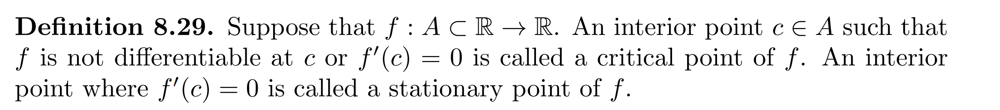
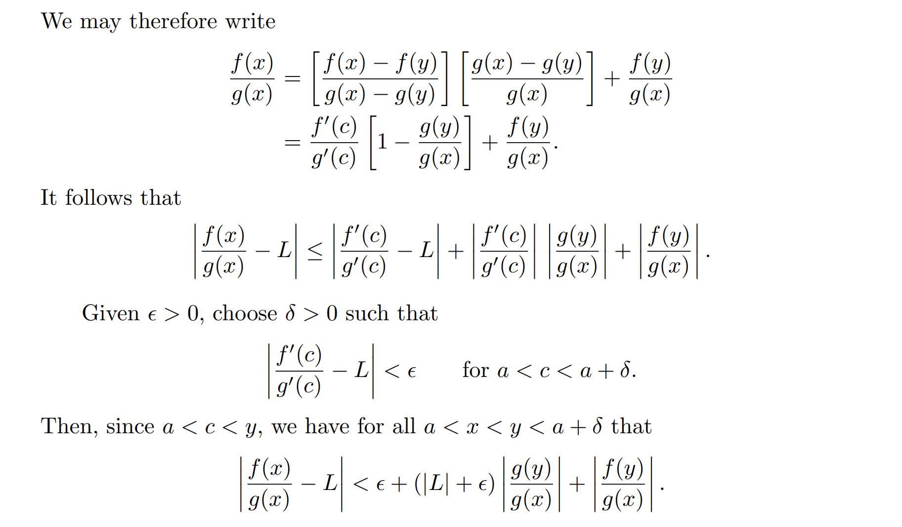

[Lecture Note 18.pdf](https://www.yuque.com/attachments/yuque/0/2022/pdf/12393765/1669469364520-6956bab9-fae2-4e95-812f-f329c3dc89b9.pdf)
[Lecture Note 19.pdf](https://www.yuque.com/attachments/yuque/0/2022/pdf/12393765/1669469364540-f0162772-1c69-4440-ba4b-6aa2b8936cd2.pdf)

# 1 Derivative
## Canonical Definition
> 
> **受到我们在**`Continuity Theorem`**中的启发，我们可以引入**`Sequence`**的描述，于是上述极限的描述可以变成: 
> $\lim_{x\to c}\frac{f(x)-f(c)}{x-c}=L\iff \forall\{x_n\}, 如果x_n\to c, \lim_{n\to \infty}\frac{f(x_n)-f(c)}{x_n-c} =L$

## Important Examples
### Affine Functions
> [!example] Examples
> 
> 

### Power Functions
> [!example]
> 

### Reciprocal Functions
> [!example]
> 

### Absolute Value Functions
> [!example]
> 

### Highly Oscillatory Functions
> [!example]
> 

## Derivatives as Linear Approximation
> [!def]
> 

> [!example]
> 

 

## Left and Right Derivatives
> [!def]
>  

> [!example]
> 

# 2 Properties of the derivative

## Differentiable=>Continuous

> [!thm]
> 
> 很显然，这个定理的逆命题不成立。连续不意味着可导。
> 

> [!proof]
> **Proof of Theorem 1** - Method 1
> **Method 2:**
> 

## Continuous Differentiable Function
> [!important]
> 

## Continuous&Nowhere Differentiable
### Lemma 1
> [!lemma]
> 

> [!thm]
> **Proof of Theorem 6(Medium)**
> 可以画图辅助思考

### Lemma 2
> [!lemma]
> 

> [!proof]
> **Proof of Theorem 7(Easy)**我们使用三角不等式证明:$|a|=|a+b+c+(-b)+(-c)|\leq |a+b+c|+|b+c|\leq |a+b+c|+|b|+|c|$

### Lemma 3
> [!lemma]
> 

> [!proof]
> **Proof of Theorem 8(Hard)**

### Proof of nowhere differentiable
>[!thm]
>

> [!proof]
> **Proof of Theorem 9(Hard)**

# 3 Differential Rules
## Main Theorem
> [!thm]
> 

> [!proof]
> **Proof(Easy)**
> **Proof of Quotient Rules：**$\begin{aligned}\lim_{x\to c}\frac{\frac{f(x)}{g(x)}-\frac{f(c)}{g(c)}}{x-c}&=\lim_{x\to c}\frac{f(x)g(c)-g(x)f(c)}{g(x)g(c)(x-c)}=\lim_{x\to c}\frac{g(c)(f(x)-f(c))-f(c)(g(x)-g(c))}{g(x)g(c)(x-c)} \\&=\lim_{x\to c}\frac{f(x)-f(c)}{g(x)(x-c)}-\lim_{x\to c}\frac{g(x)-g(c)}{g(x)(x-c)}\cdot \frac{f(c)}{g(c)}\\&=\frac{1}{g(c)}\lim_{x\to c}\frac{f(x)-f(c)}{(x-c)}-\frac{1}{g(c)}\lim_{x\to c}\frac{g(x)-g(c)}{(x-c)}\cdot \frac{f(c)}{g(c)}\\&=\frac{g(c)f'(c)}{g^2(c)}-\frac{g'(c)f(c)}{g^2(c)}\\&=\frac{f'(c)g(c)-g'(c)f(c)}{g^2(c)}\end{aligned}$证毕。

## Chain Rules
> [!thm]
> 

> [!proof]
> **Proof(Medium)**

# 4 Local Max/Min
## Relative Max/Min - Interior Points
> [!thm]
> 

> [!proof] Proof by definition
> 

> [!proof] Proof by sequence
> **Proof of Theorem 4(Medium)Proof of relative maximum:**
> 
> **Proof of relative minimum:**
> Let $f$has relative minimum at $c\in (a,b)$then $\exists \delta>0$such that $(c-\delta,c+\delta)\subset (a,b)$and $\forall x\in (c-\delta, c+\delta)$, $f(x)\geq f(c)$. 
> Let:
> $x_n = c-\frac{\delta}{2n}\in (c-\delta,c)$
> $f'(c)=\lim_{n\to \infty}\frac{f(x_n)-f(c)}{x_n-c}\leq 0$
> Now let 
> $y_n=c+\frac{\delta}{2n}\in (c,c+\delta)$
> Then $f'(c)=\lim_{n\to \infty}\frac{f(y_n)-f(c)}{y_n-c}\geq 0$
> Therefore $f'(c)=0$with $\begin{cases}f'(x)> 0&x<c \\ f'(x)<0&x>c\end{cases}$, which indicates that $c\in (a,b)$is the relative minimum.
> These finishes our proof.

## Relative Max/Min - Endpoints
> [!thm]
> 

> [!proof]
> 

## Critical Points
> [!def]
> 

> [!example]
> 

# 5 MVT
## Rolle Theorem
> [!thm]
> 

> [!proof]
> **Proof of Rolle Theorem(Medium)**
> 论证思路: 利用函数在$[a,b]$上连续，所以`Min-max theorem`成立的特性来论证。
> 

## Mean Value Theorem(MVT)
> [!thm]
> 
> 本质上这是`Rolle Theorem` 的 一个`Extension`

> [!proof]
> **Proof of MVT(Medium)**

## Proof of Constant Function
> [!thm]
> 

> [!proof]
> **Proof of theorem 9(Easy)**
> **Alternative Proof**
> 

> [!corollary]
> 

## Mean Value Theorem for Integrals
> [!important]
> 

> [!proof]
> 

## Monotonicity
> [!thm]
> 

> [!proof]
> **Proof of Theorem 10(Medium)**
> **Alternative Proof**
> 

## Strict Monotonicity
> [!important]
> 

# 6 Inverse Function Theorem
> 

# 7 Three L'Hospital Theorems
[L'Hopital.pdf](https://www.yuque.com/attachments/yuque/0/2022/pdf/12393765/1670914698603-a8f7d439-e683-4654-8695-3a8973865d81.pdf)

## Lemma: Cauchy Mean Value
> [!lemma]
> 
> 

## 0/0 Version
> [!thm]
> 

> [!example] Examples
> 

## infty/infty Version
> [!thm]
> 

> [!example] Examples
> 

# 6 Assignment
[hw10.pdf](https://www.yuque.com/attachments/yuque/0/2022/pdf/12393765/1670462953326-c2c9fa17-ed8e-4f3e-800f-8ded55c349be.pdf)
## P1 Holder Condition
> 

**(a) Holder Condition => LipSchitz Continuous => Uniformly Continous (alpha<=1)**If $f:I\to \mathbb{R}$满足`Holder Condition`, 则$\forall x,c\in I$, $|f(x)-f(c)|\leq C|x-c|^{\alpha}$  
$\forall \epsilon>0,\exists 0<\delta<(\frac{\epsilon}{C})^{\frac{1}{\alpha}}, ~~s.t.~~\forall x,c\in I~~and~~|x-c|<\delta$, 我们有:
$|f(x)-f(c)|\leq C|x-c|^{\alpha}<C\delta^{\alpha}<\epsilon$
于是$f$是`Uniformly Continuous`的。
或者我们可以先证明`Lipschitz Continuous`， 因为$0<\alpha\leq 1$, 所以$C|x-c|^{\alpha}\leq C|x-c|$
于是$|f(x)-f(c)|\leq C|x-c|^{\alpha}\leq C|x-c|$, 于是$\exists C$使得$|\frac{f(x)-f(c)}{x-c}|\leq C$ , 于是$f$是`Lipschitz Continuous`的，于是$f$肯定也是`Uniformly Continuous`的。
**(b) Holder Condition => Constant Function (alpha>1)**因为$\alpha>1$, 所以我们有$\alpha=1+\epsilon, \epsilon>0$
因为函数$f$满足$|f(x)-f(y)|\leq C|x-y|^{1+\epsilon}$, 于是$|\frac{f(x)-f(y)}{x-y}|\leq C|x-y|^{\epsilon}$
所以$0\leq \lim_{x\to y}|\frac{f(x)-f(y)}{x-y}|\leq \lim_{x\to y}C|x-y|^{\epsilon}$
于是根据`Squeeze Theorem`, 我们有: $\lim_{x\to y}|\frac{f(x)-f(y)}{x-y}|=0, \forall x,y\in I$成立，即$f'(y)=0, \forall y\in I$。 换句话说$f'(x)$存在且为零$\forall x\in I$, 于是$f(x)$`is constant`on $I$。

## P2 Differentiable Functions
> 

**Proof(Medium)**We can examine whether $\lim_{x\to c}\frac{h(x)-h(c)}{x-c}$exists. 
$\begin{aligned} \lim_{x\to c}\frac{h(x)-h(c)}{x-c}&= \lim_{x\to c} \frac{f(x)g(x)-f(c)g(c)}{x-c}\\&=\lim_{x\to c}\frac{f(x)(g(x)-g(c))+g(c)(f(x)-f(c))}{x-c}\\&=f(x)g'(c)+\lim_{x\to c}g(c)\frac{f(x)-f(c)}{x-c}\\&=g(c)\lim_{x\to c}\frac{f(x)-f(c)}{x-c}\\&=0\end{aligned}$
于是$h'(c)=0$, 所以$h(x)$在$c$处可导。

## P3 Lipschitz Continuity& Boundedness
> 

**Proof(Medium, MVT)**($\Longrightarrow$): 假设$\forall x,y\in \mathbb{R}$, $\exists K\in \mathbb{R}, |\frac{f(x)-f(y)}{x-y}|\leq K$, $|f'|=|\lim_{x\to y}\frac{f(x)-f(y)}{x-y}|\leq K$
($\Longleftarrow$): 假设$|f'|=|\lim_{x\to y}\frac{f(x)-f(y)}{x-y}|\leq K,\forall x, y\in \mathbb{R}~~and~~x\to y$. 现在我们假设$f$不是`Lipschitz Continuous`的，则$\exists x,y\in \mathbb{R} ~~s.t.~~|\frac{f(x)-f(y)}{x-y}|\geq B,\forall B\in \mathbb{R}$ 。因为是$\forall B$, 则$\exists x,y\in \mathbb{R},~~s.t.~~|\frac{f(x)-f(y)}{x-y}|\geq K$, 假设$f(x)<f(y)$。
因为$f$是`Differentiable`的，则根据`Mean Value Theorem`可知，$\exists c\in (x,y),~~s.t.~~f'(c)=\frac{f(x)-f(y)}{x-y}$, 即$|f'(c)|\geq K$, 这和上面的$|f'|=|\lim_{x\to y}\frac{f(x)-f(y)}{x-y}|\leq K,\forall x, y\in \mathbb{R}~~and~~x\to y$矛盾，于是$f$一定是`Lipschitz Continuous`的。

## P4 Endpoint Differentiability
> 

**(a) Proof of Proposition 4.2.10(Medium By L'Hospital Law)****(i): **$f'(a)=\lim_{x\to a}\frac{f(x)-f(a)}{x-a}=\lim_{x\to a}\frac{f'(x)-f'(a)}{1}=\lim_{x\to a}f'(x)=L\tag{Using L'Hospital Law}$
**(ii):**
$f'(b)=\lim_{x\to b}\frac{f(x)-f(b)}{x-b}=\lim_{x\to a}\frac{f'(x)-f'(b)}{1}=\lim_{x\to a}f'(x)=L\tag{Using L'Hospital Law}$
**(b) Proof of 4.2.13(Easy Using 4.2.10)**Using Prosition 4.2.10, we consider two sub intervals $(a,c]$and $[c,b)$where $f$is continuous and differentiable.
Thus we immediately get $f'(c)=L$

## 
