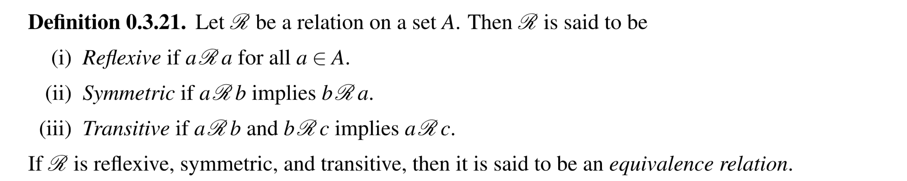
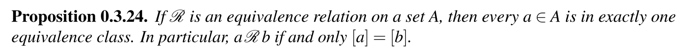
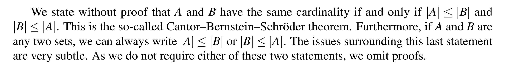

# 1 集合基础和数学归纳
[Lecture Note 1.pdf](https://www.yuque.com/attachments/yuque/0/2022/pdf/12393765/1658670811127-ddb2a51b-cd35-4cdc-9158-47b0894ca57e.pdf)
> 讲义中给出了详细的解释，这里不再过多赘述

# 2 Functions
[Lecture Note 2.pdf](https://www.yuque.com/attachments/yuque/0/2022/pdf/12393765/1660373837283-3c46f356-a605-4efe-9338-2d31d97d765b.pdf)
## 2.1 Catesian Product
> 集合的笛卡尔积就是两个集合中所有元素的组合(`Combinatories`), 从概率论基础我们知道，$(x,y)$中的$x$必须来自集合$A$, 有$|A|$种选择, $y$必须来自集合$B$,有$|B|$种选择, 通过乘积法则，我们知道$(x,y)$有$|A|\times |B|$中选择
> 

## 2.2 函数的域和像
### 2.2.1 函数三大域
> 在线性代数中我们了解了矩阵的四个空间: 列空间，行空间，零空间和左零空间
> 在函数中我们也可以类比这个概念。

> 对于一个单元函数$f(x)$来说，$x$是自变量，$y=f(x)$是因变量
> $\forall x\in domain$, $f(x)\in Range$
> 其中几个概念需要辨析:
> 1. `Domain`是函数的定义域，是$x$的所有可能的取值
> 2. `Codomain`是函数的陪域，是函数所有可能的取值
> 3. `Range`是函数的值域，是定义域中的元素在陪域中的映射。**值域是陪域的真子集**。
> 

> 

### 2.2.2 函数的像
> 理解函数的另一个维度是通过像。我们可能会想，域和像有什么区别呢
> 域是描述函数本身的要素的概念，往往侧重点在于域的元素构成。
> 像是从函数的映射角度描述函数的性质，侧重点在于建立函数的定义域和值域之间的关系。
> 
> - 函数的**像**是**定义域的任意子集中**的所有元素映射得到的结果集
> - 函数的**原像**是**值域的任意子集中**的所有元素逆映射得到的结果集
> 

> 

## 2.3 推论
> 
> 
> **证明:**
> 1. 如果$x\in f^{-1}(C\cup D)$, 则因为$C\cup D$中的元素都是函数$f$值域中的元素，而值域就是从函数定义域映射过来的集合，所以$f^{-1}(C\cup D)$实际上代表的就是函数定义域中最终映射到$C\cup D$这个集合中的所有元素$x$，所以$f(x)\in C\cup D$, 而根据集合的并集的性质，$f(x)\in C$或者$f(x)\in D$。而因为$f(x)\in C$, 所以$x\in f^{-1}(C)$(既然有$x$能够生成$C$中的元素，那么$f^{-1}(C)$也一定能够反向查询到$x$), 同理$x\in f^{-1}(D)$, 所以$x\in f^{-1}(C)$或者$x\in f^{-1}(D)$, 因此$x\in f^{-1}(C\cup D)$。因此我们有$\forall x\in f(C\cup D),x\in f^{-1}(C)\space or\space x\in f^{-1}(D)$,也就是证明了$\forall x\in f(C\cup D),x\in f^{-1}(C)\space \cup f^{-1}(D)$,也就是$f(C\cup D)\subset f^{-1}(C)\space \cup f^{-1}(D)$。反方向也可以同理证明。
> 2. 我们直接给出数学逻辑，$\forall x\in f^{-1}(C\cap D),f(x)\in C\cap D$, $\therefore f(x)\in C\space and \space f(x)\in D$。$\because x\in f^{-1}(C)\space and \space x\in f^{-1}(D),\therefore x\in f^{-1}(C)\cap f^{-1}(D)$$\therefore f^{-1}(C\cap D)\subset f^{-1}(C)\cap f^{-1}(D)$, 反向证明类似
> 3. $\forall x\in f^{-1}(B
\setminus C), f(x)\in B\setminus C$, $\therefore f(x)\in B\space and\space f(x)\notin C$, $\therefore x\in f^{-1}(B)\space and\space x\notin f^{-1}(C)$ , 由于$(f^{-1}(C))^c=A\setminus (f^{-1}(C))$, $\therefore x\in f^{-1}(B) \space and\space x\in (f^{-1}(C))^c$, 所以$x\in (f^{-1}(C))^c$, 反方向类似。

 
## 2.4 映射类型
> 
> **单射(**`**Injection**`**): **定义域里面所有的元素都被映射到值域中，陪域中某些元素没有`inverse image`
> **满射(**`**Surjection**`**): **陪域中的所有元素都有一个或者多个`inverse image`存在于定义域中，定义域中某些元素没有`image`。也就是说，此时陪域等于值域
> **双射(**`**bijection**`**): **定义域中的元素和陪域中的元素一一对应。
> 
> 
> 

## 2.5 函数组合
### 2.5.1 定义
> 

### 2.5.2 定理
> 令$h:A\to C$是函数$h(x)=(g\circ f)(x)$
> 其中$f:A\to B$和$g:B\to C$都是双射函数，我们要证明$h$也是双射函数
> **证明步骤:**
> 1. **先证明**$h$**是**`**Injection**`, 如果$h(x_1)=h(x_2)$, 根据定义$g(f(x_1))=g(f(x_2))$, 因为$g$是双射，所以$f(x_1)=f(x_2)$,因为$f$是双射，所以$x_1=x_2$, 所以$h(x_1)=h(x_2)\to x_1=x_2$, 这说明$h$是`Injection`。
> 2. **然后证明**$h$**是**`**Surjection**`, 也就是证明$h(A)=C$。
> 
也就是$\forall z\in C,\exist x\in A,s.t\space h(x)=z$。 
> 因为$g$是双射，所以$\forall z\in C,\exist y\in B,s.t\space g(y)=z$
> 因为$f$是双射，所以$\exist x\in A,s.t\space f(x)=y$
> 所以$\forall z\in C,\exist x\in A,s.t\space h(x)=z$, 证毕, 如果$f,g$是双射，则$h$也是双射

# 3 Relations and Equivalence Classes
## 3.1 集合的二元关系(Binary Relation)
> 我们在定义集合之间的操作的时候，常用的有$A\cap B,A\cup B, A\times B$等，**本质操作的都是集合内的元素**，或者对集合内的元素进行一定形式的组合，得到的是一个新的**集合**
> **但是上述的三个关系只描述了集合的操作，即如何组合集合内的元素成为新的集合**, 我们想，能不能和在实数代数中一样，比较集合的**大小关系**呢?
> 我们可能会联想高中时就接触过的比较符$\subset$，$A\subset B$表示$\forall x\in A,x\in B$。但是这种集合关系似乎比较的不是集合内元素本身的大小关系，而是元素的包含关系，最终得到的也不是一个新的集合，而是一个布尔值`True/False`。所以怎么将我们在代数领域的加减乘除用到集合中去呢? 下面我们引入`Binary Relations`的概念来完成该定义:
> 如果我们想要定义：集合内满足某个大小关系($>,<,=$)的任意两个元素对，将这些元素对组成一个新的集合，就可以使用如下的称为`Binary Relation`的集合定义法。
> 
> **我们来分析这个定义的含义: **
> 1. 我们要得到的某个特定集合内任意的满足某个特定代数关系的两个元素组成的二元组，将他们构成一个新的集合
> 2. 这个集合一定是$A\times A$的子集，因为$A\times A$包括了所有集合$A$中元素两两组合形成的可能的二元组。
> 3. $\mathcal{R}$是我们得到的目标集合，里面包括了所有满足特定代数关系的两个元素的二元组。
> 4. 如果我们要描述满足二元关系$\mathcal{R}$的二元组$(a,b)$,一般我们不会写$(a,b)\in \mathcal{R}$, 而是用$a\mathcal{R}b$代替。
> 

## 3.2 二元关系三大性质
> 
> **这样定义对于初学者来说比较拗口，我们说人话:**
> 1. $\mathcal{R}$是一个集合，是$A\times A$的子集，牢记
> 2. 如果$\forall a\in A, (a,a)\in \mathcal{R}$则$\mathcal{R}$是`Reflexive`的
> 3. 如果对于$\forall (a,b)\in \mathcal{R}$, 都有$(b,a)\in \mathcal{R}$,则$\mathcal{R}$是`Symmetric`的
> 4. 如果对于$\forall (a,b)\in \mathcal{R},(b,c)\in \mathcal{R}$, 都有$(a,c)\in \mathcal{R}$,则$\mathcal{R}$是`Transitive`的
> 
更常用的记号是:
> 
> 

## 3.3 Equivalence Classes
> 
> **这鬼话说的是啥意思呢?**
> 如果一个$\mathcal{R}$满足`Binary Relations`的所有三大关系，则对于某个集合$A$中的元素$a$, 他的`Equivalence Classes`说的是，$a$想要在集合$A$中找个伴$x$($x\in A$,也就是说可以是$a$和自己孤独终老)，使得他俩组成的二元组$(a,x)$满足$(a,x)\in \mathcal{R}$时的所有$x$的元素值组成的集合。
> 
> **对于元素**$a$**来说：**
> - `Reflexity`保证了$a\in [a]$。
> - `Symmetry`保证了$(a,x)\in \mathcal{R}$时，$(x,a)\in \mathcal{R}$，换而言之就是如果$b\in [a]$,则$a\in [b]$
> - `Transitivity`保证了如果$a\in [b], b\in [c]$则$a\in [c]$

## 3.4 另一个性质
> 
> **我们尝试证明:**
> 我们从两个方向证明, 
> 1. 首先是$(a,b)\in \mathcal{R}\to [a]=[b]$, 因为$\mathcal{R}$是`Equivalence Relation`, 
> 
`Reflexity`意味着$a\in [a],b\in [b]$
> `Symmetry`意味着$a\in [b],b\in [a]$, 所以$\forall a\in [a],a\in [b]$, 所以$[a]\subset [b]$。由对称性$[b]\subset [a]$, 所以$[a]=[b]$
> 2. **然后是另一个方向:**
> 
$[a]=[b]\to (a,b)\in \mathcal{R}$, 由$[a]=[b]$, 我们分别写出标准定义, $[a]=\{{x\in A:(a,x)\in R}\}$,$[b]=\{{x\in A:(b,x)\in R}\}$, 
> 对于$\forall x\in [a]$, 有$(a,x)\in \mathcal{R}$, 因为$\forall x \in [a],x\in [b]$, 所以$(b,x)\in \mathcal{R}$, 因此$\forall x$,如果$(a,x)\in \mathcal{R}$则$(b,x)\in \mathcal{R}$。
> 根据$\mathcal{R}$的对称性，我们有: 如果$(b,x)\in \mathcal{R}$，则$(x,b)\in \mathcal{R}$
> 根据$\mathcal{R}$的传递性，因为$(a,x)\in \mathcal{R}, (x,b)\in \mathcal{R}$, 得到$(a,b)\in \mathcal{R}$
> 证毕
> 

# 4 Set Cardinality
## 4.1 Cardinality
> 
> 两个集合$A,B$有相同的`Cardinality`(等势)当且仅当集合$A,B$之间存在一个双射$f:A\to B$。
> 
> 集合之间的双射实际上就是集合二元关系中的`Equivalence Relation`
> 

## 4.2 (Un)countable/Finite/Infinite
> 
> $X\approx N$也可以用$|X|=|\mathbb{N}|$表示，更常见。

## 4.3 Ordering the Cardinality
> 有了上述的$|A|:=n$的记号，我们可以借此对任意两个集合进行大小的排序。
> 
> 

## 4.4 Countably Infinite Set
### Definition
> 
> 也就是存在从$\mathbb{N}$到$\bf A$的双射。

### Theorems and Properties
#### Countable
> ## 

**Proof**

#### Cartesian Products
> 

**Proof**

#### Countable Union
> 

**Proof**

### Examples
#### 偶数集
> $|\{2n,n\in \mathbb{N}\}|=|\mathbb{N}|$
> 
> 我们假设存在这样一个双射$f:N\to\{2n:n\in \mathbb{N}\},f(n)=2n,n\in \mathbb{N}$
> **我们先证明**$f$**是单射:**
> 如果$f(n_1)=f(n_2)$, 则$2n_1=2n_2, n_1=n_2$, 所以$f$是`Injective`
> **再证明**$f$**是满射: **$\forall z\in \{2n:n\in \mathbb{N}\},\exist n,s.t\space f(n)=z$
> 假设$z\in \{2k:k\in \mathbb{N}\}$, $2n=z$所以$\exist n=\frac{z}{2}\in \mathbb{N},s.t\space f(\frac{z}{2})=z$, 所以$f$是`Surjective`
> 综上，$f$是`Bijective`,证毕。

#### 奇数集
> $|\{2n-1,n\in \mathbb{N}\}|=|\mathbb{N}|$
> 我们假设存在这样一个双射$f:N\to\{2n-1:n\in \mathbb{N}\},f(n)=2n-1,n\in \mathbb{N}$
> **我们先证明**$f$**是单射:**
> 如果$f(n_1)=f(n_2)$, 则$2n_1-1=2n_2-1, n_1=n_2$, 所以$f$是`Injective`
> **再证明**$f$**是满射: **$\forall z\in \{2n-1:n\in \mathbb{N}\},\exist n,s.t\space f(n)=z$
> 假设$z\in \{2k-1:k\in \mathbb{N}\}$, $2n-1=z$所以$\exist n=\frac{z+1}{2}\in \mathbb{N},s.t\space f(\frac{z+1}{2})=z$, 所以$f$是`Surjective`
> 综上，$f$是`Bijective`,证毕。

#### 自然数集的笛卡尔积集
> 
> 

#### 有理数集
> **定理1: **$|\{  q\in \mathbb{Q},q>0 \}|=|\mathbb{N}|$
> **在作业**`**P6**`**中证明**
> 

> **定理2: **$|\mathbb{Q}|=|\mathbb{N}|$**, **$\mathbb{Q}$**是可数集合**
> 
> **证明: **
> 我们有$Q_1=|\{q\in \mathbb{Q}:q>0\}|=|\{r\in \mathbb{Q}:r<0\}|=Q_2$, 因为$f:Q_1\to Q_2,f(q)=-q$是一个双射
> 对于$Q_2=\{r\in \mathbb{Q}:r<0\}$, 由定理$1$,得到$|Q_2|=|\mathbb{N}|$
> 所以存在双射$f,g$,$f:Q_1\longleftrightarrow \mathbb{N},g:Q_2\longleftrightarrow\mathbb{N}$
> 我们定义一个双射$h:\mathbb{Q}\longleftrightarrow \mathbb{Z}$, $h(x)=\begin{cases} 0&x=0\\f(x)&x>0\\-g(x)&x<0\end{cases}$. 
> 所以$|\mathbb{Q}|=|\mathbb{Z}|=|\mathbb{N}|$

#### 整数集
> **证明:**$|\mathbb{Z}|=|\mathbb{N}|$
> **证明过程:**
> 可以选取一个双射，使得所有的$\mathbb{Z}$中的正数映射到$\mathbb{N}$中的奇数，所有的负数映射到偶数。
> 

## 
## 4.5 Infinite Set
> $\mathbb{R}\backslash \mathbb{Q}$是`Uncountable`的，证明详见作业$3$(`L5&L6`)

# 5 Power Set/Cantor Theorem
## 5.1 Theorem
> 
> 定义: 如果$A$是一个集合，我们定义$A$的`Power Set`为$\mathcal{P}(A)=\{B:B\subset A\}$
> 

## 5.2 Cantor's Remarkable Theorem
> 

:::success

:::
**Proof**
1. 首先我们要证明$|A|\leq |\mathcal{P}(A)|$

假设$f:A\to \mathcal{P}(A)$为$f(x)=\{x\}$。
则如果$f(x)=f(y)\Rightarrow \{x\}=\{y\}\Rightarrow x=y$， 这说明$f$是`One-to-one`, 所以$|A|\leq |\mathcal{P}(A)|$

2. 现在我们要证明$|A|\neq |\mathcal{P}(A)|$

我们使用反证法。假设$|A|=|\mathcal{P}(A)|$, 则存在一个**双射**函数$g:A\to \mathcal{P}(A)$	我们可以定义一个集合$B\subset A, B=\{x\in A,x\notin g(x)\}$($B$理解为是$A$的一个特殊子集, 这样构造的目的是为了后面能推出矛盾)，所以$B\in \mathcal{P}(A)$。
因为$g$是`Surjective`, 所以对于$B\in \mathcal{P}(A)$，都存在$b\in A$使得$g(b)=B$(因为任何在$\mathcal{P}(A)$中的元素($A$的子集)，都能找到一个来自$A$的`Pre-image`与其对应)。
此时$b\in A$实际上有两种情况，我们需要对$b$的情况进行讨论。

   - 如果$b\in g(b)$, 则$b\in g(b)=B\Rightarrow b\in B\stackrel{by~B's~definition}\implies b\notin g(b)$, 矛盾。
   - 如果$b\notin g(b)$，因为$b\in A$, 且$A\subset B$, 所以$b\in B\implies b\in g(b)$矛盾。

所以原假设$|A|=|\mathcal{P}(A)|$不成立。
证毕。
上面分类讨论的核心思想就是`I am a liar <- True or False?`
`If I am a liar, then I am not a liar.`

# 6 函数和Cardinality
## 6.1 势的对称性
> **如果**$|A|=|B|$**,则**$|B|=|A|$
> **证明:**
> 假设$|A|=|B|$，则存在一个双射$f: A\to B$。因为双射的逆函数也是双射, 即$f^{-1}: B\to A$也是一个双射，所以$|B|=|A|$

## 6.2 势的传递性
> 如果$|A|=|B|和|B|=|C|$, 则$|A|=|C|$
> **证明：**
> 假设$|A|=|B|$且$|B|=|C|$, 则存在双射$f:A\to B$,$g:B\to C$
> 所以我们有函数组合$g\circ f:A\to C$是双射$(2.5.2)$，所以$|A|=|C|$

## 6.3 Cantor-Schrider-Bernstein
> 

## 6.4 函数映射影响势的大小
> 如果$f:A\to B$, 则:
> - 如果$f$是`Injective`, 则$|A|\leq|B|$
> - 如果$f$为`Surjective`, 则$|A|\geq |B|$
> - 如果$f$是`Bijective`, 则$|A|=|B|$
> 

# 7 Problem Set 1
[hw1.pdf](https://www.yuque.com/attachments/yuque/0/2022/pdf/12393765/1660363760376-ea8144e0-515c-405a-8e3b-c192029ecab6.pdf)
## P1 证明集合关系
> 

**(a)**
1. **首先证明**$\forall x\in A\cap(B\cup C), x\in(A\cap B)\cup(A\cap C)$

因为根据集合性质我们有:  $x\in A\space and \space A\in B\cup C$

   - `Case 1`: $x\in A\space and \space x\in B$, 所以$x\in A\cap B$
   - `Case 2`: $x\in A\space and \space x\in C$, 所以$x\in A\cap C$

`Case 1`和`Case 2`是或的关系，所以$x\in (A\cap B)\cup (A\cap C)$

2. **然后证明**$\forall  x\in(A\cap B)\cup(A\cap C),x\in A\cap(B\cup C)$

`Case 1`: $\because x\in A\cap B,\therefore x\in A\cap (B\cup C)$,  可以通过韦恩图证明
`Case 2`:  $\because x\in A\cap C,\therefore x\in A\cap (B\cup C)$, 可以通过韦恩图证明
于是证明完毕
**(b)**
1. **首先证明**$\forall x\in A\cup(B\cap C), x\in(A\cup B)\cap(A\cup C)$

因为根据集合性质我们有:  $x\in A\space or\space A\in B\cap C$

   - `Case 1`: $x\in A$, 所以$x\in A\cup B$,且$x\in A\cup C$,所以$x\in (A\cup B)\cap (A\cup C)$
   - `Case 2`: $x\in B\cap C$, 所以$x\in B \space and\space x\in C$, 所以$x\in A\cup B\space and \space x\in A\cup C$, 于是$x\in (A\cup B)\cap(A\cup C)$
2. **然后证明**$\forall  x\in(A\cup B)\cap(A\cup C),x\in A\cup(B\cap C),$

$\because x\in(A\cup B)\cap(A\cup C),\therefore x\in A\cup B,\therefore x\in A\cup (B\cap C)$
于是证明完毕

## P2 数学归纳法
> 

**Key**Let $P(n)$be: $n<2^n,\forall n\in \mathbb{N}$

1. `Basic Step`: $n=1$时，$2^n=1$, $0<1$成立
2. `Inductive Step`：Suppose when$n=k>1$,$P(k)$holds so that $k<2^k$. Then when $n=k+1, k+1<2^k+1<2^k+2^k=2^{k+1}$
3. 所以$P(n)$is true for all $n$

## P3 归纳法证明集合的势
> 

**Key**Let $P(n)$be `If A finite set A of cardinality n, the cardinality of`$\mathcal{P}(A)$is $2^n$

1. `Basic Step`: 如果$A$的势为$1$, 则其`Power Set`为$\{\emptyset,A\}$, 即$\mathcal{P}(A)=2^1$, 所以$P(1)$成立
2. `Inductive Step`: 如果$P(k)$成立，则如果$|A|=k$,则 $|\mathcal{P}(A)|=2^k$的
3. 对于$P(k+1)$, 如果$|A|=k+1$, 则取$a=A_{k+1}\setminus A_k$，则这个元素和$A_k$集合中的每个元素都形成一个新的集合，总共新形成$2^k$个，所以$\mathcal{P}(k+1)=2^k+2^k=2^{k+1}$.证毕。

## P4 数学归纳法
> 

**Key**Let $P(n)$be: $6|n^3+5n,\forall n\in \mathbb{N}$

1. `Basic Step`: $n=1$时，$1^3+5*1=6$, $6|6$成立
2. `Inductive Step`：Suppose when$n=k>1$,$P(k)$holds so that $6|k^3+5k$. Then when $n=k+1, (k+1)^3+5(k+1)=\newline k^3+3k^2+8k+6=k^3+5k+3k^2+3k+6$
3. 所以我们还需要证明$2|3n^2+3n$

Let $Q(n)$be: $2|n^2+n,\forall n\in \mathbb{N}$

1. `Basic Step`: $n=1$时，$6|3+3$，成立
2. `Inductive Step`: Suppose $n=k$, $P(k)$ holds, then we have $2|k^2+k$
3. Then $P(k+1)=k^2+3k+2=k^2+k+2(k+1)$。So $P(k+1)$holds.

回到上面的过程，我们已经完成了证明
 

## P5 无限可数集
> 

**Key**假设这个满足条件的集合是$A=\{\{1\},\{2\},\{3\},\cdots\}$， 因为我们可以证明，存在一个从$\mathbb{N}\to A$的双射。
因为假设$A$中的每个元素满足$A_1=\{1\},A_2=\{2\},\cdots, A_i=\{i\},\cdots$, 此时每个自然数$i$对应一个集合$A_i$。
现在我们对$A_i$求并集，即$\cup_{i=1}^n A_i=\{1,2,3,\cdots\}$, 而我们很容易看出$|\mathbb{N}|=|\cup_{i=1}^n A_i|$, 于是$\cup_{i=1}^n A_i$是一个`Countably Infinite`的集合，不是有限的。

## P6 综合题
> 

**(a)****第一部分**，因为$q\in \mathbb{Q}\backslash \mathbb{N}$, 于是$\frac{4}{15}=\frac{2^2}{3^1\times 5^1}$, 所以$p_1=2,q_1=3,q_2=5,r_1=2,s_1=1,s_2=1$, 所以根据函数$f$的定义，我们有$f(\frac{4}{15})=p_1^{2r_1}\times q_1^{2s_1-1}\times q_2^{2s_2-1}=2^{2\times 2}\times 3^1\times 5^1=240$
**第二部分**，我们可以先对$108$进行因式分解，得到$f(q)=108=2^2\times 3^3$。因为我们出现了偶数次方，所以$q\in \mathbb{Q}\backslash \mathbb{N}$, 则$p_1=2, r_1=1,q_1=3,s_1=2$, 于是$q=\frac{2^1}{3^2}=\frac{2}{9}$
**(b)****首先证明**`**Injection**`, 对于$f(q_1)=f(q_2)\in \mathbb{N}$, 假设$q_1,q_2\in \mathbb{N}\backslash \{1\}$,  我们知道$p_{11}^{2\times r_{11}}p_{12}^{2\times r_{12}}\cdots p_{1N}^{2\times r_{1N}}=p_{21}^{2\times r_{21}}p_{22}^{2\times r_{22}}\cdots p_{2N}^{2\times r_{2N}}....................................(1)$其中$p_{i1}<p_{i2}<\cdots<p_{iN}是质数, 且r_{i1},\cdots,r_{iM}\in \mathbb{N}$
$(1)$式可以变形成$(p_{11}^{r_{11}}p_{12}^{r_{12}}\cdots p_{1N}^{r_{1N}})^2=(p_{21}^{r_{21}}p_{22}^{ r_{22}}\cdots p_{2N}^{ r_{2N}})^2$, 由于括号中一定是大于$1$的自然数，于是我们得到$p_{11}^{r_{11}}p_{12}^{r_{12}}\cdots p_{1N}^{r_{1N}}=p_{21}^{r_{21}}p_{22}^{ r_{22}}\cdots p_{2N}^{ r_{2N}}$,即$q_1=q_2$
同理可证明当$q_1,q_2$不是自然数的情况。
**然后证明**`**Surjection**`， 对于$t\in \mathbb{N}$, 我们总是能够对$t$进行因式分解，得到$t=p_1^{r_1}p_2^{r_2}\cdots p_N^{r_N}$, 此时，如果$q\in\mathbb{N}\backslash \{1\}$那么不存在$q\in\{q\in \mathbb{Q},q>0\}$, 使得$f(q)=t$成立。但是如果$q$不是自然数，则存在$q=q_1^{\frac{r_1+1}{2}}q_2^{\frac{r_2+1}{2}}\cdots q_N^{\frac{r_N+1}{2}},且q_i=p_i$成立，于是$f$是`Surjection`
综上，$f$是`Bijection`
