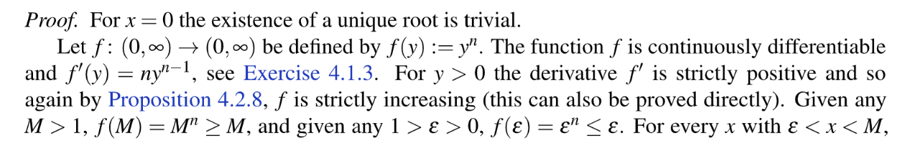
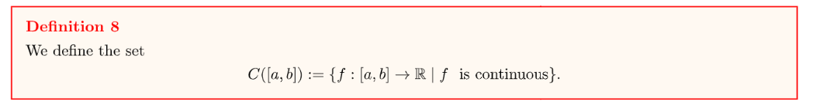

[Lecture Note 20.pdf](https://www.yuque.com/attachments/yuque/0/2022/pdf/12393765/1670315089413-5c826f87-3495-4c8a-a487-cad49fb80c3c.pdf)
[Lecture Note 21.pdf](https://www.yuque.com/attachments/yuque/0/2022/pdf/12393765/1670315089370-2601f77d-6bee-4ec9-ad55-5a7508d44d34.pdf)

# 1 Taylor's Theorem
## Relationship to MVT
> 

## n-times derivatiable
> 

## Taylor Expansion
> 
> **可以发现:**
> - $P_n(x)$就是我们用来`Approximate`的
> - $R_n(x)$就是我们的`Error Term`, 也就是`MVT`的一个`Generalization`
> 

**Proof(Very Hard)**

## Second Derivative Test
> 

**Proof of Theorem 6(Medium)**

# 2 *Inverse Function Theorem
## Monotone Lemma
> 

**Proof of Lemma 4.4.1(Medium)**

## Inverse Function Theorem
> 

**Proof of Theorem 4.4.2**

## Corollary
> 

**Proof of Corollary(Medium)**

# 3 Riemann Sum&Integral
## Introduction
> 

## Partitions&Tag
> 
> 

## Riemann Sum
> 

# 4 Riemann Integral
## Riemann Theorem 
> 
> Let $f$be a** continuous function** on $[a,b]$, then there exists a unique real number $\int_a^b f(x)dx$, with the following properties:
> For every sequence of partitions, $\{x^{(r)},\xi^{(r)} \}_r$, $||x^{(r)}||\stackrel{r\to \infty}\to 0$(就是每一个分段都很小), $\lim_{r\to \infty} S_f(x^{(r)},\xi^{(r)})=\int_{a}^b f(x)dx$, 所以`Riemann Sum`最终`Convergent to`的对象就是我们熟悉的积分符号。

**Proof of Riemann Theorem(Hard, utilizing Theorems of Modulus)**

## Modulus of Continuity
> 
> 比如, $f(x)=ax+b$, 则$|f(x)-f(y)|=|a(x-y)|=|a||x-y|$, 如果$|x-y|\leq \eta$, 则$|f(x)-f(y)|\leq |a|\eta$。于是$w_f(\eta)=\sup\{|f(x)-f(y)|\}=|a|\eta$。当$\eta\to 0$, $w_f(\eta)\to 0$
> 其实这个概念并不新鲜，我们在介绍`Lipschitz Continuity`和`Holder Condition`的时候实际上已经渗透了这个概念，对于一个连续函数$f:[a,b]\in \mathbb{R}$, $\forall x,y\in \mathbb{R}$ $|f(x)-f(y)|\leq w_f|x-y|$, 这里$w_f$就起到了控制$f$的`Continuity Types`的作用。

## Theorems of Modulus
### Theorem 1
> 
> 这其实就是函数$w_f(\eta)$收敛于$0$的定义。

**Proof of Theorem I(Easy)**如果$f\in C([a,b])$且定义域是一个闭区间的话，则`Continuous=Uniformly Continuous`

### Theorem 2
> 

**Proof of Theorem II(Hard but interesting)**本质上就是在相邻两个切割点$x_k$和$x_{k-1}$中塞入更多的切割点来达成`Refinement`的目的。

其中，$\begin{cases}S_f(\underline{x},\underline{\xi})=\sum_{k=1}^m f(\xi_k)(x_k-x_{k-1})\\S_f(\underline{x'},\underline{\xi^{'}})=\sum_{k=1}^m S_f(y(k),\eta(k)) \end{cases}$

### Theorem 3
> 

**Proof of Theorem III(Easy, Using Theorem 2 and Triangle Inequality)**

# 5 Assignment
[hw11.pdf](https://www.yuque.com/attachments/yuque/0/2022/pdf/12393765/1670463236570-025f7310-fd6c-487a-9b41-fbb5043337c8.pdf)

## P1 Prove the polynomial roots
> 

**Proof(Easy)**Denote $f(x)=\frac{x^{1121}}{1121}+\frac{x^{2021}}{2021}+x+1$, and it is continous on $\mathbb{R}$.
First we compute the derivative of $f(x)$, which is $f'(x)=x^{1120}+x^{2020}+1>0, \forall x\in \mathbb{R}$
Thus by the bisection method we know since $f(-1)<0, f(1)>0$, and that $f(x)$is monotonically increasing, we know $f(x)=0$has exactly one real root.

## P2 Compute Taylor Expansion
> 

**(a) **$\begin{aligned}P_4(x)&=f(0)+f^{(1)}(0)(x-0)+\frac{f^{(2)}(0)(x-0)^2}{2!}+\frac{f^{(3)}(0)(x-0)^3}{3!}+\frac{f^{(4)}(0)(x-0)^2}{4!}\\&=x-\frac{x^3}{3!}\end{aligned}$
**(b)**$P_4(x)=1+\frac{1}{4}(x+1)+\frac{1}{32}(x+1)^2+\frac{1}{576}(x+1)^3+\frac{1}{24\times 16\times 24}(x+1)^4$

## P3 Using L'Hospital Law
> 

**(a) **$\lim_{x\to 0}\frac{x-sinx}{x^3}=\lim_{x\to 0}\frac{1-cosx}{x^2}=\lim_{x\to 0}\frac{sinx}{2x}=\frac{1}{2}$
**(b)**$\lim_{x\to \frac{\pi}{2}}\frac{1-sinx}{(x-\frac{\pi}{2})^2}=\lim_{h\to 0}\frac{1-sin(h+\frac{\pi}{2})}{h^2}=\lim_{h\to 0}\frac{1-cos(h)}{h^2}=\frac{1}{2}$

## P4 Taylor Expansion
> 

**Proof**$f(x)=f(c)+\frac{f'''(t)(x-c)^4}{4!}$. 如果$x\neq x_0$则因为$f'''(c)>0$, 所以$f(x)>f(x_0)$

## P5 Partitions&Tags
> 

**(a) 计算Norm**$||\underline{x}^{(r)}||=\max\{\frac{b-a}{r},\frac{b-a}{r},\cdots, \frac{b-a}{r}\}=\frac{b-a}{r}$
**(b) 计算Riemann Sum**根据定义，我们有$\begin{aligned}\lim_{r\to \infty}S_f(x^{(r)},\epsilon^{(r)})&=\lim_{r\to \infty}\sum_{k=1}^nf(\epsilon_k)(x_k-x_{k-1})\\&=\lim_{r\to \infty}\sum_{k=1}^n  f(a+(b-a)\frac{k}{r})(b-a)\frac{1}{r}\\&= \lim_{r\to \infty}\sum_{k=1}^n (\alpha(a+(b-a)\frac{k}{r})+\beta)(b-a)\frac{1}{r}\\&= \lim_{r\to \infty}\{\sum_{k=1}^n \}\end{aligned}$
