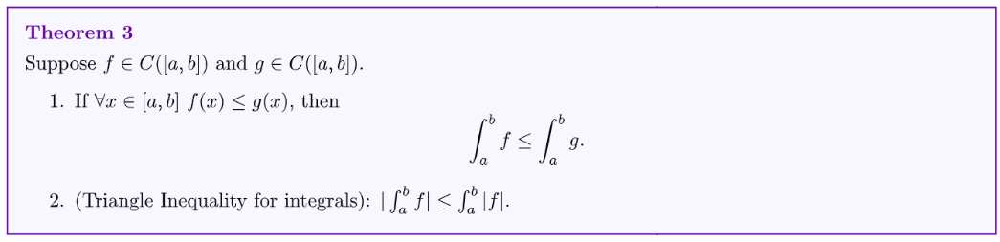
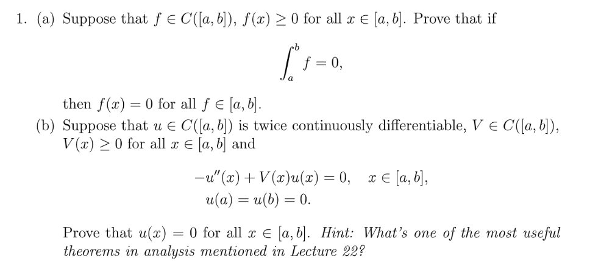
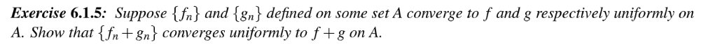

[Lecture Note 22.pdf](https://www.yuque.com/attachments/yuque/0/2022/pdf/12393765/1670315259596-fb668a01-cfa5-4eab-ad4d-857be08e3693.pdf)
[Lecture Note 23.pdf](https://www.yuque.com/attachments/yuque/0/2022/pdf/12393765/1670315259456-bc1604c5-f87a-451c-95ea-d4277dafc37c.pdf)
# 1 Proproties of Riemann Integrals
## Linearity
> 

## Additivity
> 

**Proof of Theorem 1(Easy, Using the definition of Riemann Sum)**

## Inf and Sup
> 

**Proof of Theorem 2(Easy)**

## Triangle Inequality
> 

**Proof of Theorem 3(Easy)**

# 2 Foundamental Theorem of Calculus
> 
> 第一部分实际上是为了计算积分，第二部分实际上是为了求解微分方程。

**Proof of Theorem 5(Medium)**

# 3 Integrating Techniques
## Integral by Parts(IBP)
> 

**Proof of Theorem 7(Medium)**

## Change of Variables
> 

**Proof of Theorem 11(Easy)**

# 4 Sequence of Functions
## Power Series
> 

## Radius of Convergence
> 

**Proof of Theorem 3(Easy, by root test)**
> 

**Examples**比如$a_j=\frac{1}{j!},x_0=0$, 则$f_n(x)=\sum_{j=0}^n a_j(x-x_0)^j$, 此时$R=\lim_{j\to \infty}|a_j|^{\frac{1}{j}}=0$, 所以`Radius of Convergence`$p=\infty$, 此时我们定义$e^x=\sum_{n=1}^{\infty} \frac{x^n}{n!}$。

> 

## Fourier Series
> 

**Proof of Lemma 9(Easy)**

# 5 Pointwise/Uniform Convergence
## Pointwise Convergence
> 

**Examples**
**Graphical Explanations**

## Uniform Convergence
> 

**Proof of Theorem 9(Easy)**
**Graphical Explanations(Distance)**

## Difference between them
> $f_n\to f$`is pointwise convergent if` $\forall \epsilon>0, \forall x\in E, \exists N\in \mathbb{Z}^{+}， s.t. |f_n(x)-f(x)|<\epsilon$
> $f_n\to f$`is uniformly convergent if` $\forall \epsilon>0, \exists N\in \mathbb{Z}^{+}~~s.t.~~\forall n>N,~\forall x\in E，  |f_n(x)-f(x)|<\epsilon$
> 二者的区别就在于`Pointwise Convergence`中$f_n(x)$收敛于$f(x)$的速度会受到$x$取值的具体影响， 而`Uniform Convergence`中$f_n(x)$收敛于$f(x)$的速度对所有$x$都一样，是一个更为苛刻的条件。
> **所以: **`Uniform Convergence`**意味着**`**Pointwise Convergence**`**。**

# 6 Assignment
[hw12.pdf](https://www.yuque.com/attachments/yuque/0/2022/pdf/12393765/1670463515411-96ac64b7-fe65-4cea-b53d-471a899dcd26.pdf)

## P1
> 

## P2
> 

## P3
> 

## P4
> 

## P5
> 

