[Lecture Note 24.pdf](https://www.yuque.com/attachments/yuque/0/2022/pdf/12393765/1670315386475-fce1f6d7-145d-4d66-9a52-8f32a137d17b.pdf)
[Lecture Note 25.pdf](https://www.yuque.com/attachments/yuque/0/2022/pdf/12393765/1670315386560-6310565d-4c40-476a-a0c3-d271257e1418.pdf)

# 1 Uniform Convergence(Negation)
> 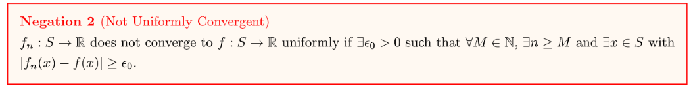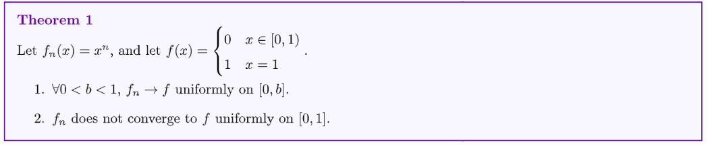

**Proof of Theorem 1(Easy)**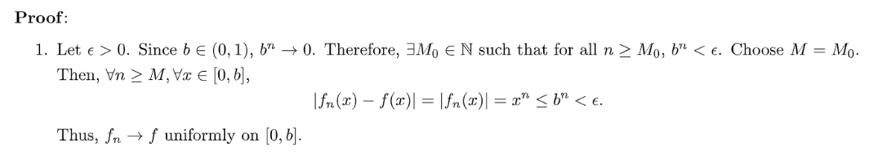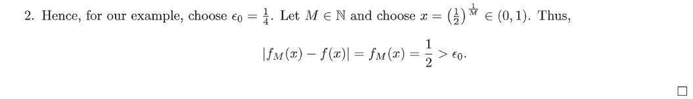

# 2 Interchange of Limits
## Questions
> 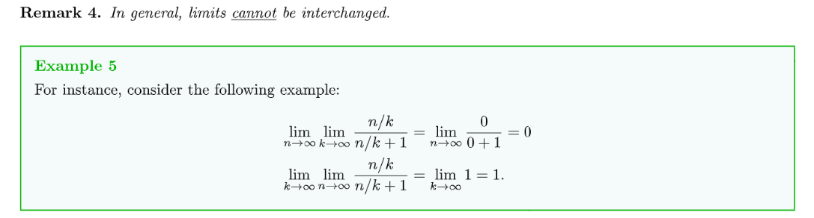
> 我们知道`summation can be interchanged`($\sum_{i=1}^n \sum_{j=1}^m a_{ij}=\sum_{j=1}^m \sum_{i=1}^n a_{ij}$), 但是$\lim$不一定。
> 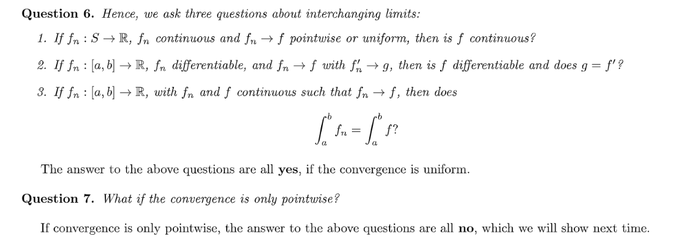
> 本质上这些问题是在询问如果对于一个函数数列$f_n$, 他$f_n\to f$(`Pointwise`或者`Uniform`), 则如果$f_n$具有某些性质(比如`Continuous`或者`Differentiable`)，那么$f$是否也具有和$f_n$一样的性质(`Continous`或者`Differentiable`)。
> 下面我们给出几个例子，说明为什么`Question 6`中的三个性质传导在$f_n$`Unform Convergence`的时候都成立，而在`Pointwise Convergence`的时候都不成立。其中一个重要的原因就是`Limits are not interchangeable`。
> 对于`Question 6`中的第一条，假设我们要证明$f$是连续的，也就等价于要证明$\forall \{x_k\}\subset S$, 如果$x_k\to x$, 则$\lim_{k\to \infty}f(x_k)=f(x)$。
> 假设`Limit is interchangeable`, 则$\begin{aligned}\lim_{k\to \infty} f(x_k)&=\lim_{k\to \infty}[\lim_{n\to \infty}f_n(x_k)]\\&=\lim_{n\to \infty}[\lim_{k\to \infty}f_n(x_k)]\\&=\lim_{n\to \infty}f_n(x)\\&=f(x)\end{aligned}$, 这似乎证明了如果$f_n$是连续的，则$f$也是连续的结论，但是我们要注意，上文的`Limit is interchangeable`当且仅当$f_n$`Uniform Convergence to` $f$的时候才成立，而如果$f_n\to f$仅仅是`Pointwise Convergence`，则上述转换不一定成立。

**Examples(Pointwise Convergence doesn't ensure all the statements in question 6)**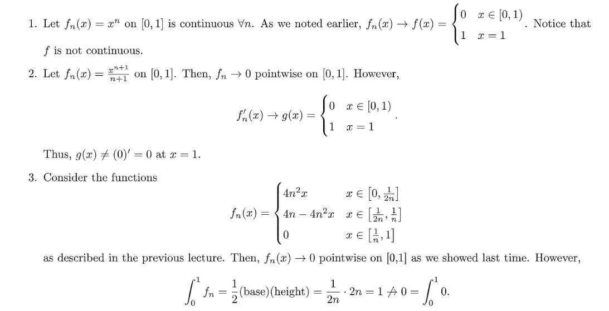

## Theorems
> 下面我们证明如果$f_n\to f$是`Uniform Convergence`, 则`Questions`中的三个`statements`全都成立。

### Q1
> 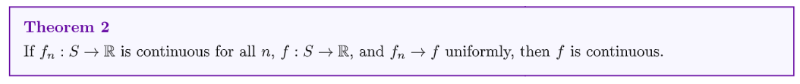

**Proof of Theorem 2(Easy, by definition)**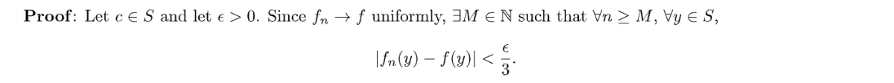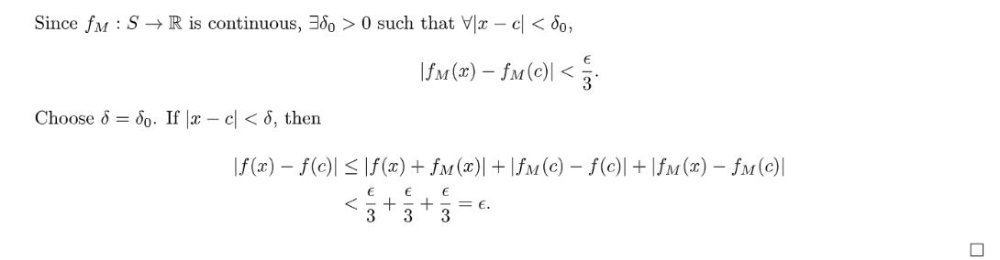

### Q2
> 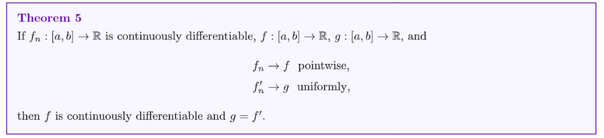

**Proof of Theorem 5(Medium)**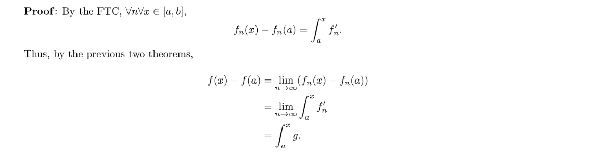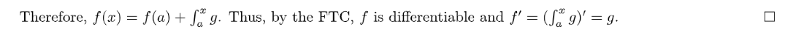

### Q3
> 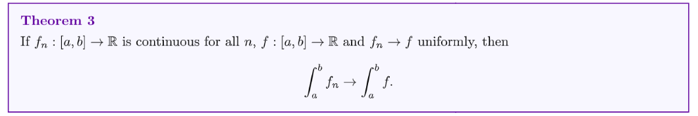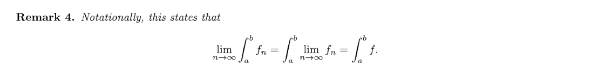

**Proof of Theorem 3(Easy, using triangle inequality)**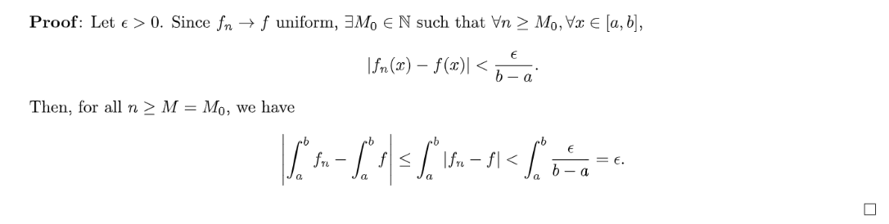

# 3 Weierstrass M-test
> 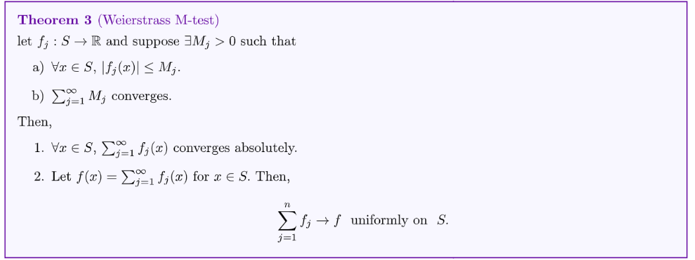

**Proof of Theorem 3（Medium）**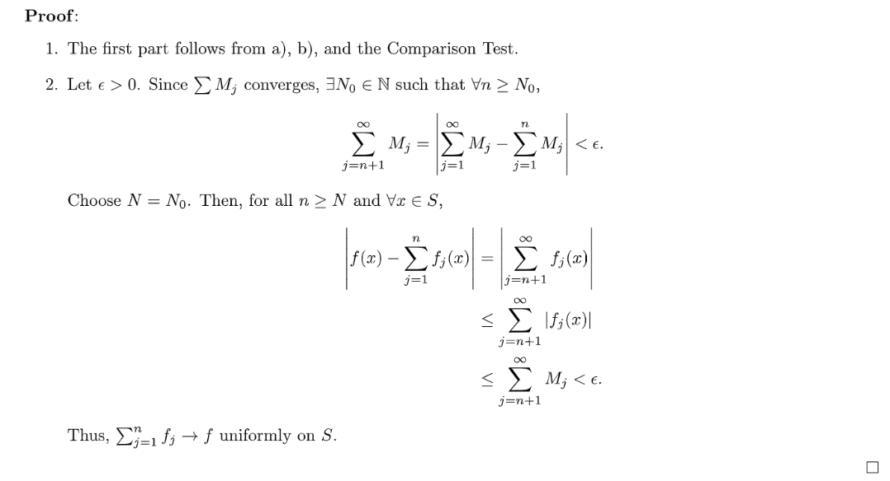
**Example**我们之前介绍过一个`Continuous But nowhere differentiable function`:
$f(x)=\sum_{i=1}^n\frac{sin(40^jx)}{2^j}$
因为$\exists M_j=\frac{1}{2^j},~~s.t.~~|\frac{sin(40^jx)}{2^j}|\leq M_j=\frac{1}{2^j}$, 且$\sum_{j=1}^{\infty} \frac{1}{2^j}$是一个几何级数且收敛于$\frac{\frac{1}{2}}{1-\frac{1}{2}}=1$。所以`Weierstrass Theorem`定理的两个使用条件都成立。
因为$\forall j, \frac{sin(40^jx)}{2^j}$`are continuous functions`, 所以$\sum_{j=n}^{\infty}\frac{sin(40^jx)}{2^j}$`are continuous function`。
因为$\sum_{j=1}^{n}\frac{sin(40^jx)}{2^j}\to f=\sum_{j=n}^{\infty}\frac{sin(40^jx)}{2^j}$`uniformly`, 所以$\sum_{j=n}^{\infty}\frac{sin(40^jx)}{2^j}$是`Continuous`的。

# 4 Power Series
## Convergence Theorem
> 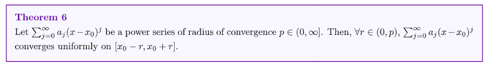

**Proof of Theorem 6(Medium, by Weierstrass Theorem)**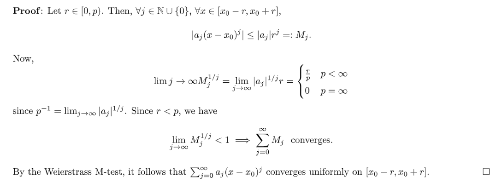

## Differentiability Theorem
> 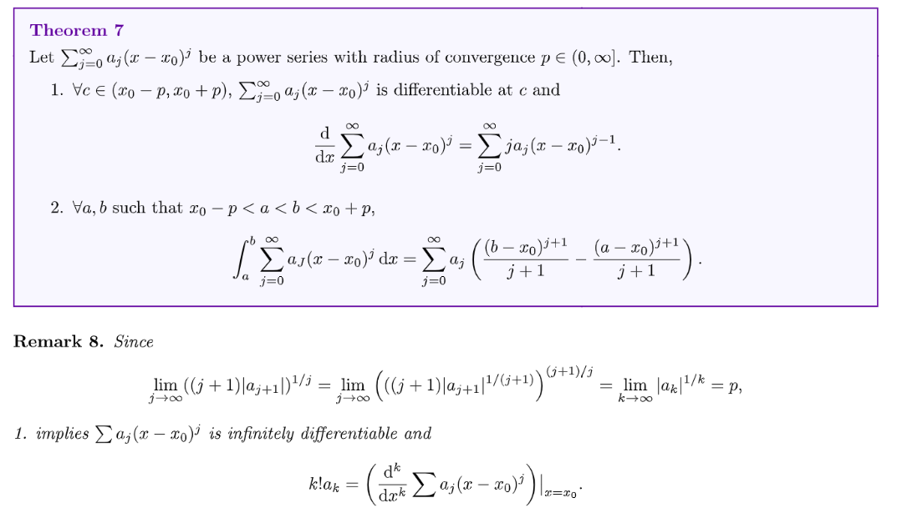
> **本质上这个定理有两个部分:**
> 1. 第一部分说的是对于任意在`Radius of Convergence`中的点$c$, 我们无穷级数在$c$处是可微的。
> 2. 第二部分说的是只要积分上下限$a,b$在`Radius of Convergence`之内的话，对于无穷级数来说我们的积分符号和求和符号可以互换。

**Proof of Theorem 7(Easy, follows from the Remark 8)**第一部分:

第二部分:

# 5 Weierstrass Approximation 
## Convergence Theorem
> 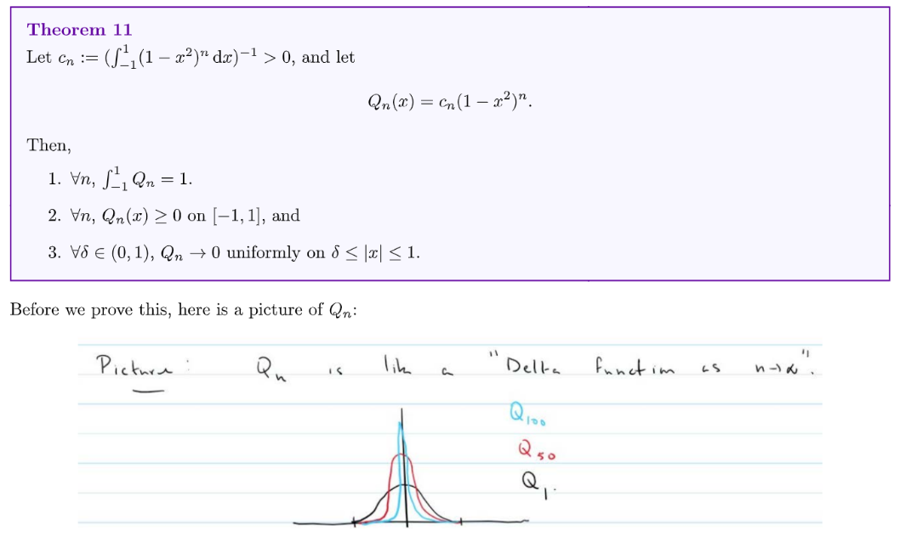

**Proof of Theorem 11(Easy)**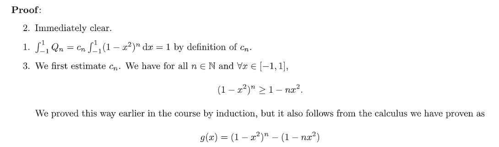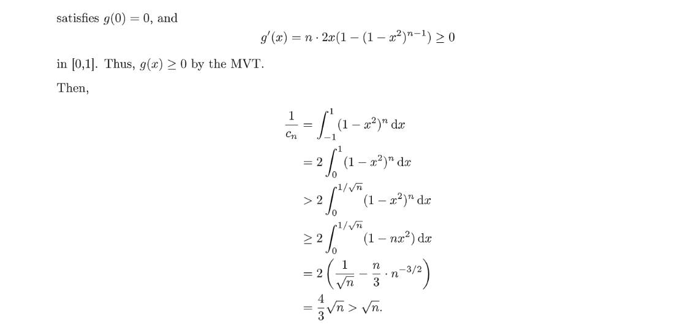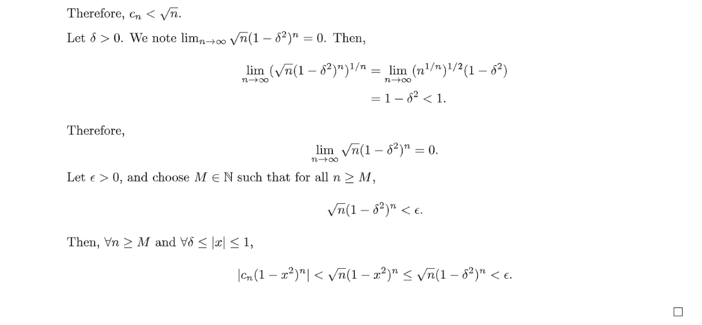

## Theorem
> 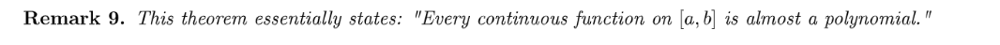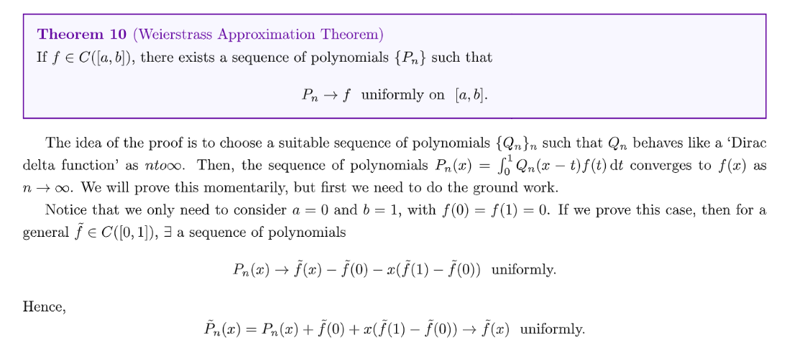

**Proof of Weierstrass Approximation Theorem**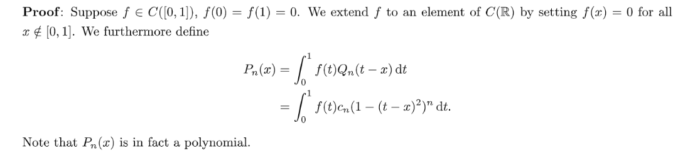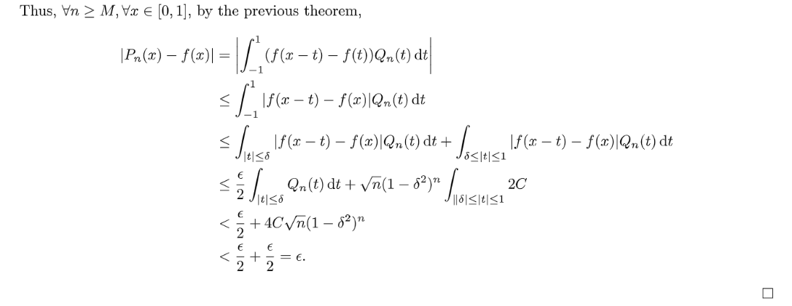

