[Lecture Note 3.pdf](https://www.yuque.com/attachments/yuque/0/2022/pdf/12393765/1662729962635-2540a918-91b5-4669-ab2d-fec1cc672a96.pdf)
# 
# 1 Ordered Set and Bound
## 1.1 Ordered Set
:::info
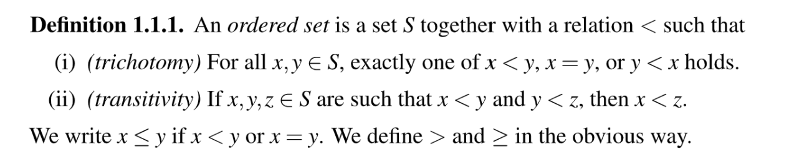
常见的`Ordered Set`:
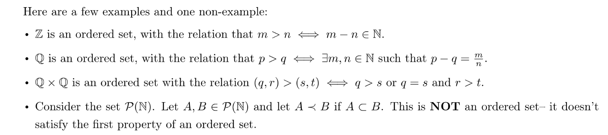

- 导数第二个例子中，我们回顾一下笛卡尔积的定义:
- 最后一个例子中，我们说不是一个`Ordered Set`, 因为我们知道如果一个集合是一个有序集的话，必须满足`trichotomy`和`transitivity`两个性质，而对于, 我们知道, 于是我们期望有或者的关系存在，但是我们没有定义过这样的比较关系，所以不是`Order Set`。
:::

## 1.2 (Least) Upper/Lower Bound
:::info
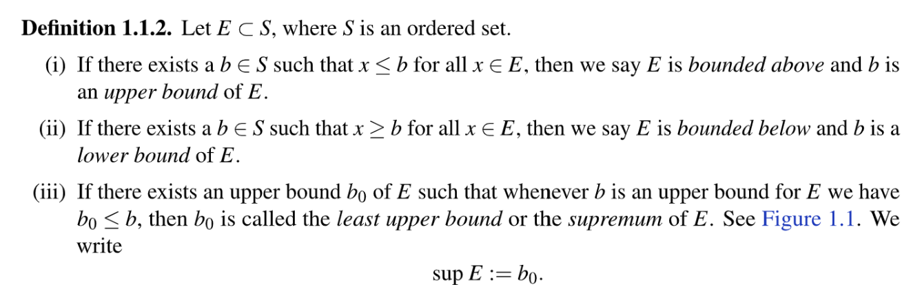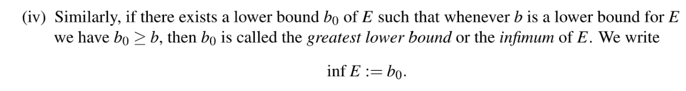
注意，`upper bound`的定义只有在`ordered set`上才有意义。因为这时候不等式才有数学意义。
一个简单的例子就是$S:=\{a,b,c,d,e\}$, 且$E:=\{a,c\}$。
此时$c,d,e$都是$E$的`Upper Bounds`, 且$c$是$E$的`Least Upper Bound`, 也记作$sup E$(`Supremum of E`)
值得注意的是，**一个集合**$E$**的**$sup$**或者**$inf$**不一定要在集合**$E$**本身中，但是一定要在集合**规定的定义域中, 也就是集合中:

- 对于$E:=\{x\in \mathbb{Q}:x<1\}$, 此时的定义域是有理数集(因为)，那么此时$sup E=1$, 但是$1$不在集合$E$中，但在定义域中。
- 对于$G:=\{x\in \mathbb{Q}:x\leq 1\}$来说，此时$sup G=1$, 且$1$在集合$G$中。

**一个集合**$E$**可能没有**$sup$**存在**，造成这种现象的原因有很多，比如

- $P:=\{x\in \mathbb{Q}:x\geq 0\}$没有`Least Upper Bound`, 因为首先, 而且对于$\forall y\in Q,\exists x\in P, s.t. x>y$(而不是小于等于)。此时$P$是一个`Countably Infinite Set`。但幸运的是$P$有$inf P=0$。
- 也有可能这个上界不在我们的定义域内，比如集合$T=\{x\in Q:x^2<2\}$, $T\subset \mathbb{Q}$, 我们知道如果最小上界存在，那一定是$\sqrt{2}$, 但是很不幸，$\sqrt{2}\notin \mathbb{Q}$, 因此$T$没有最小上界。
:::
**Least Upper Bound Figure 1.1**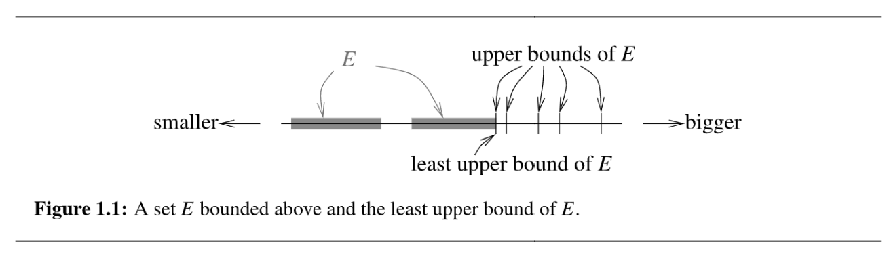

## 1.3 Well-Ordering Property of N
> 对于一个自然数集来说，其`Well-Ordering Property`说的是，, 都存在一个`Least Element`。
> 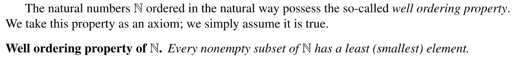

## 1.4 Least Upper Bound Property
:::info
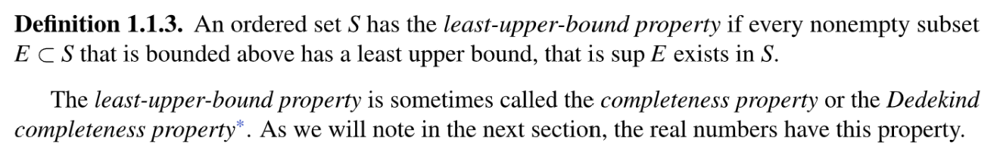
这个定理说的是对于一个有序集合, 如果它有`Lease-Upper-Bound Property`, 则对于其任何非空子集，如果有上界，则一定有一个最小上界存在。
几个例子:

1. 假设, 则对于的非空子集，

,
, 
, 所以有`Least Upper Bound Property`

2. 假设, 我们知道, 的上界是, 所以所有的非空子集都是`Bounded above by`。下面我们将证明所有的非空子集都有其最小上界:

对于, 构造(bijection from to ), 所以根据自然数集的`Well-Ordering Property`, , 使得, 所以and, 所以。所以具有`LUBP`

3. 有`LUBP`
4. $\mathbb{Q}$没有`Least-upper-bound property`这个事实也是我们喜欢在$\mathbb{R}$上做实数分析的原因。这个性质的缺失导致很多的代数性质不能够被使用。
:::
> 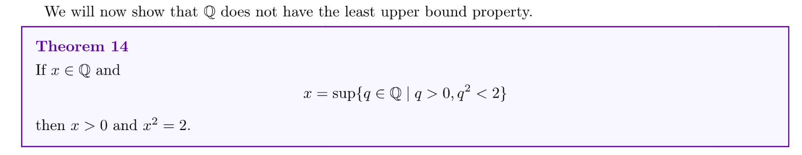
> 这个定理的意思是: 如果集合存在一个最小上界, 则这个最小上界一定满足: 
> 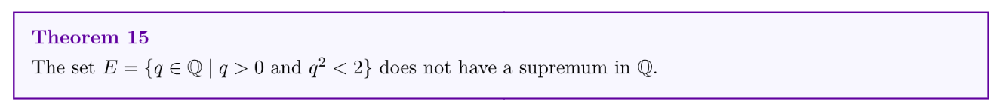

**Proof of Theorem 14**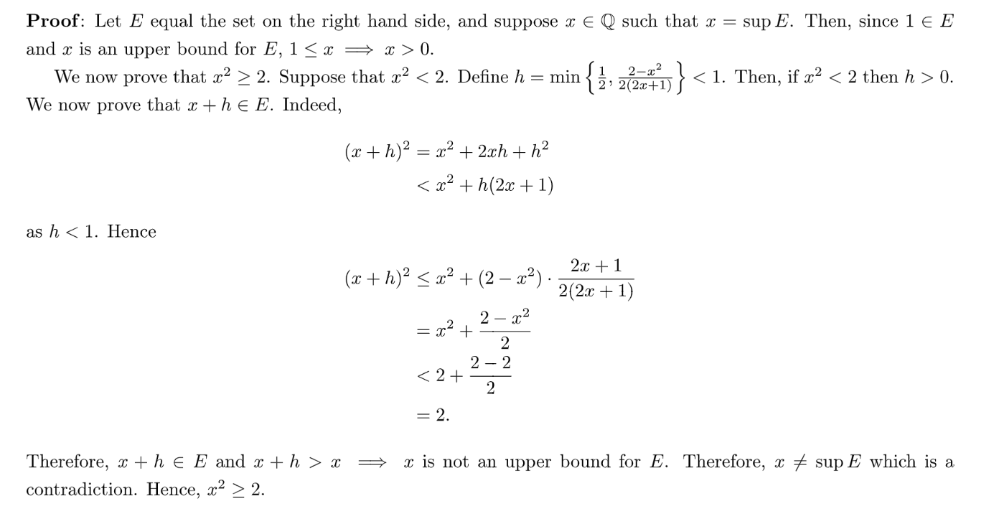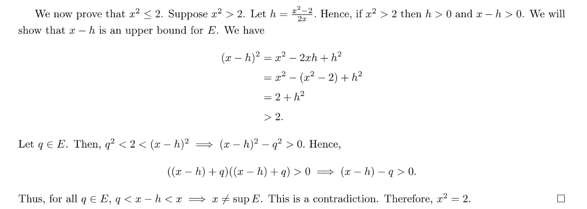
**Proof of Theorem 15**先证明是`Bounded Above`的，因为, 所以, 于是是`Bounded Above`的。
然后证明`Least Upper Bound`不存在。
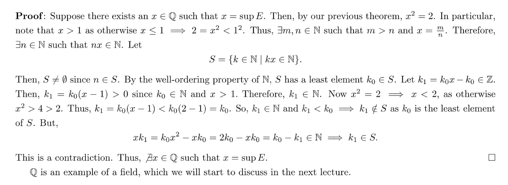

# 2 域和实数集
[Lecture Note 4.pdf](https://www.yuque.com/attachments/yuque/0/2022/pdf/12393765/1667013485653-5ecee2ad-4465-4e56-8cd9-fbaf7675ad67.pdf)
## 2.1 Field
### 2.1.1 Definitions 
:::info
我们喜欢在实数集上做分析的原因之一是实数集是因为一个`Field`，换句话说，实数集加法和数乘封闭。在线性代数线性算子视角下我们研究过这个问题: [multiplicative inverse](https://www.yuque.com/alexman/so5y8g/wal3n1#YWbtI)
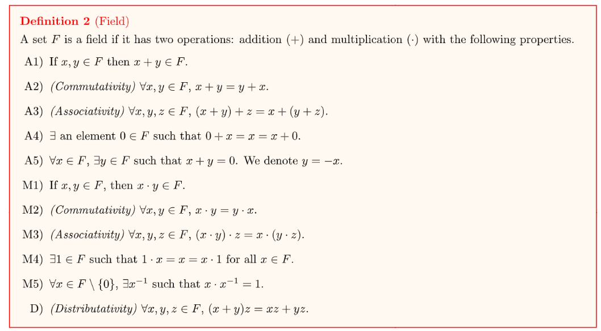
是`Zero Indentity`, 是`Additive Inverse`
使用这些公理就可以用证明`Field`的很多其他运算性质。
:::
**整数集不是Field**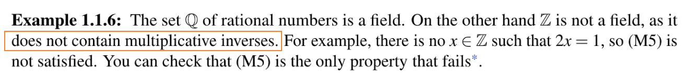
> 有些集合在加上一些外置条件之后也可以成为`Field`, 比如下面的两个例子:
> 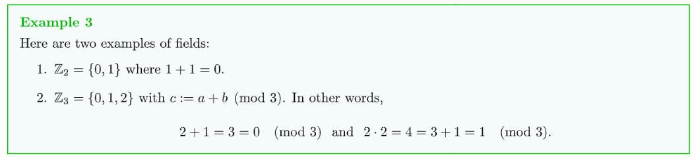

### 2.1.2 Properties
> 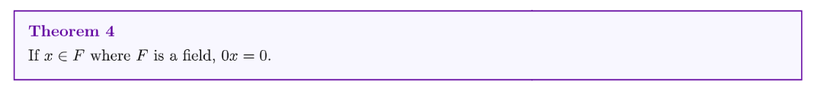
> **证明:** 

## 2.2 Ordered Field
### 2.2.1 Definition
> 一个`Field`$F$称为`Ordered Field`如果$F$是一个满足下列条件的`Ordered Set`:
> 1. $\forall x,y,z\in F, x<y\Rightarrow x+z<y+z$
> 2. $\forall x,y\in F, x>0\space and\space y>0\Rightarrow xy>0$
> 
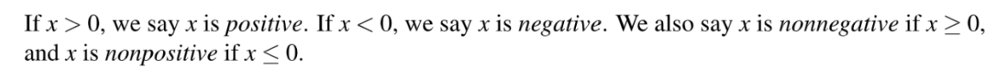

**有理数集是Ordered Field**
**复数集不是Ordered Field**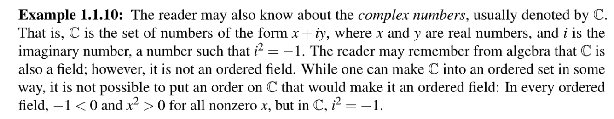
**Z={0,1}不是Ordered Field**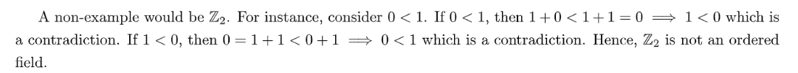

### 2.2.2 Ordered Field 的性质
> 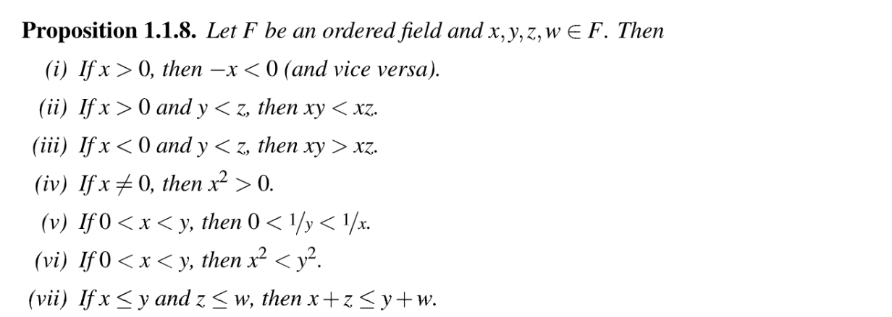

**Proof**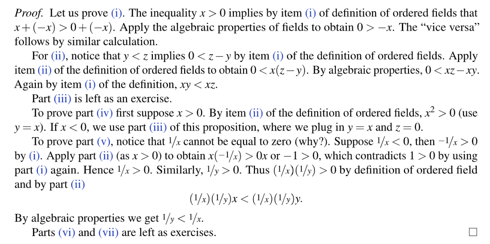
**对于的证明:**

**对于的证明:**

**对于的证明:**
可以拆分成四种情况来看:

1. , 则, 所以, 于是
2. , 则
3. , 则
4. , 则

所以
:::info
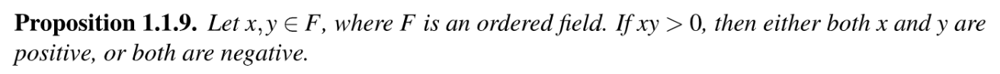
**我们可以从其逆否命题入手证明:**
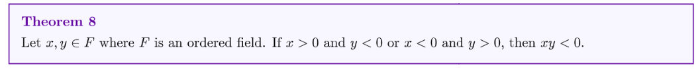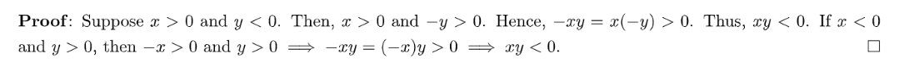
:::

## 2.3 Greatest Lower Bound Property
> 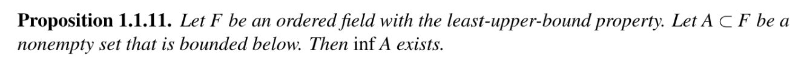
> 对于一个`Ordered Field`而言，他不仅仅有`Least Upper Bound Property`也有`Greatest Lower Bound Property`

**Proof**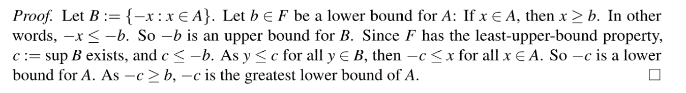

## 2.4 Uniqueness of Ordered Field
> 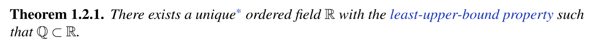
> 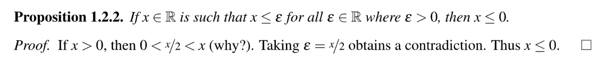

**Insights**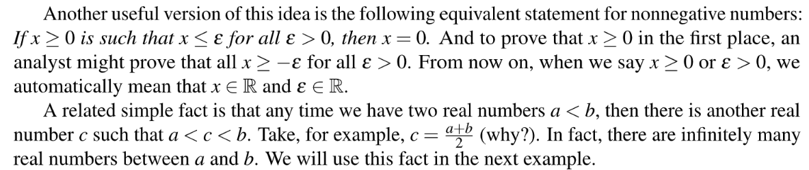
> 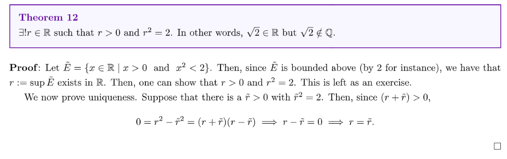

# 3 Assignment/Recitations
[hw2.pdf](https://www.yuque.com/attachments/yuque/0/2022/pdf/12393765/1667285380014-ec73a985-b4e5-4c99-ba06-e6aa9e8cc604.pdf)
[Recitation 1.pdf](https://www.yuque.com/attachments/yuque/0/2022/pdf/12393765/1667527191762-027ad8fc-2caf-4b08-96a1-30c8011dcd5d.pdf)

## P1 Ordered Field Property
> 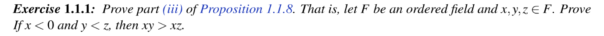

**Proof**

## P2 Ordered Set
> 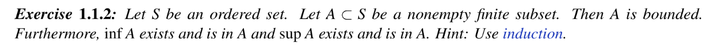

**Proof**Suppose we have a set  of size , and we use the induction to prove the proposition:

1. When , the set has exactly one element, and let's denote it by , in this case the set is bounded by and 
2. Suppose when , the proposition is true such that is bounded and that 
3. Then when , we will introduce a new element called to the set , and we know that adding a single element to the set doesn't change the boundedness of  and there are three cases for :
   1. , then , 
   2. , then , 
   3. , then , 

Thus we can conclude the proof by induction.

## P3 Supremium
> 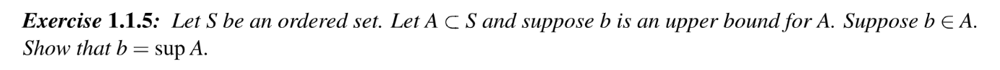

**Proof**Since is an upper bound for , so , we have . Also, by the definition of the upper bound and the least upper bound, we know that .
Suppose , since the relationship always holds. Since , this simply contradicts the definition of . Thus . The proof is finished.

## P4 Countability 
> 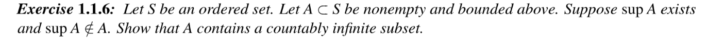

**Proof**Suppose the largest element in is , then . However, . So isn't the largest element in , which means there exists such that . 
With this fact in mind, we can construct a set which is countably infinite.

## P5 AM-GM Inequality
> 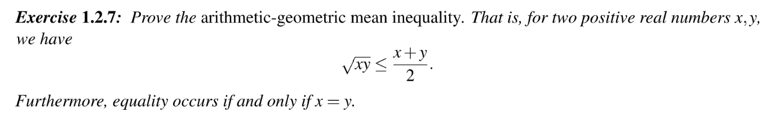

**Proof**因为, 欲证明, 我们只要证明。当时，, 所以。当时，, 此时。证毕。
:::info
**Prove the Generalized Version:**
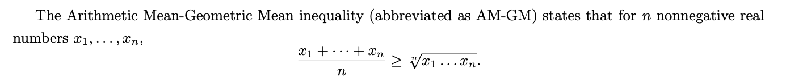
**Methodology:**
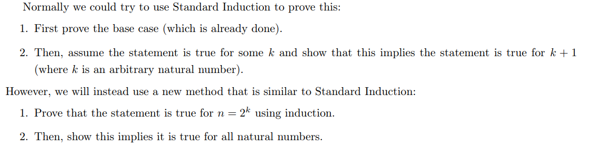
:::
**Proof**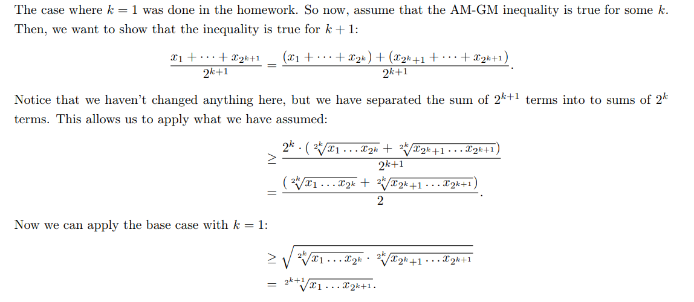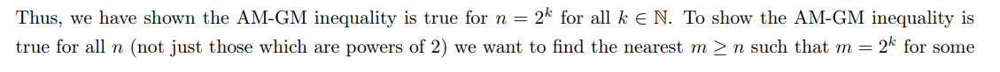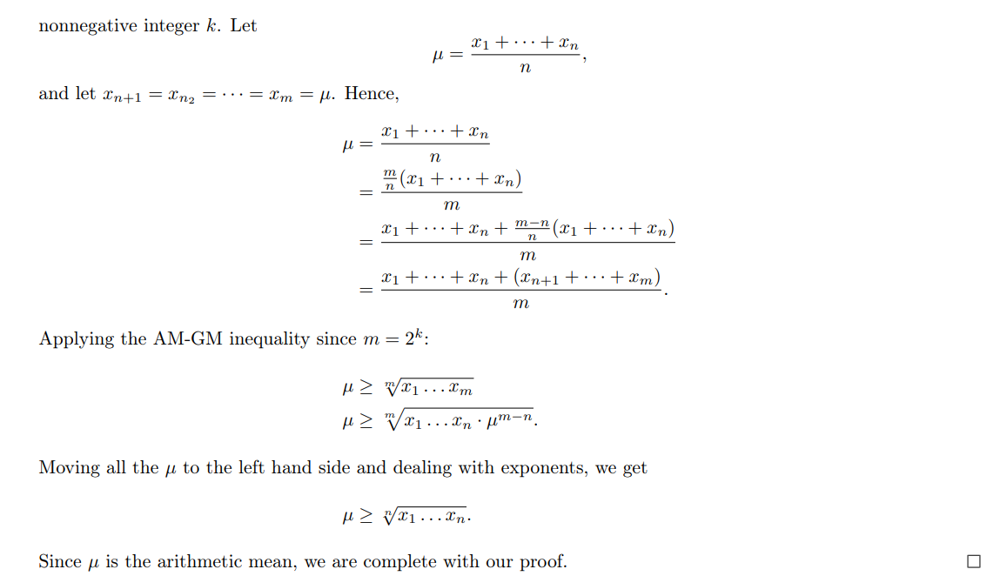

## P6 Addition of Sup/Inf
> 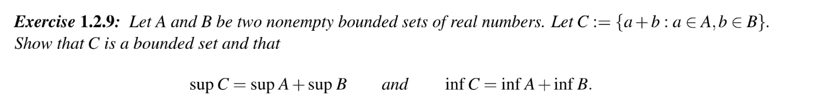

**Proof of the first part**
1. 证明存在性: 因为都是有界的，所以, 所以, 所以是集合的上界。因为且具有`LUBP`, 所以存在。
2. 证明相等性: 首先证明, 因为, 有, 所以, 于是是的上界，于是, 于是, 于是时的上界，于是, 所以。

然后证明, 这个结论显然。
综上
**Proof of the second part**
1. **证明存在性:**

因为都是有界的，于是和均存在，于是, 所以, 所以是的`Lower Bound`, 因为且具有`LUBP`, 所以存在。

2. **证明相等性:**

首先证明, 因为
然后证明, 这个结论显然。
综上, 证毕。

## P7 Multiplication of Sup/Inf
### Positive Real Numbers
> 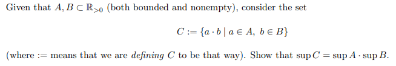

**Proof**
1. **证明存在性:**

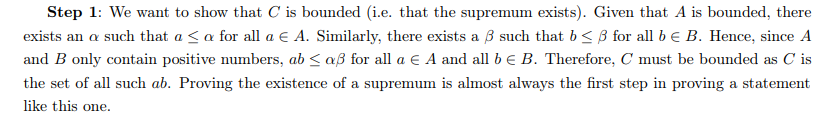

2. **证明相等性:**

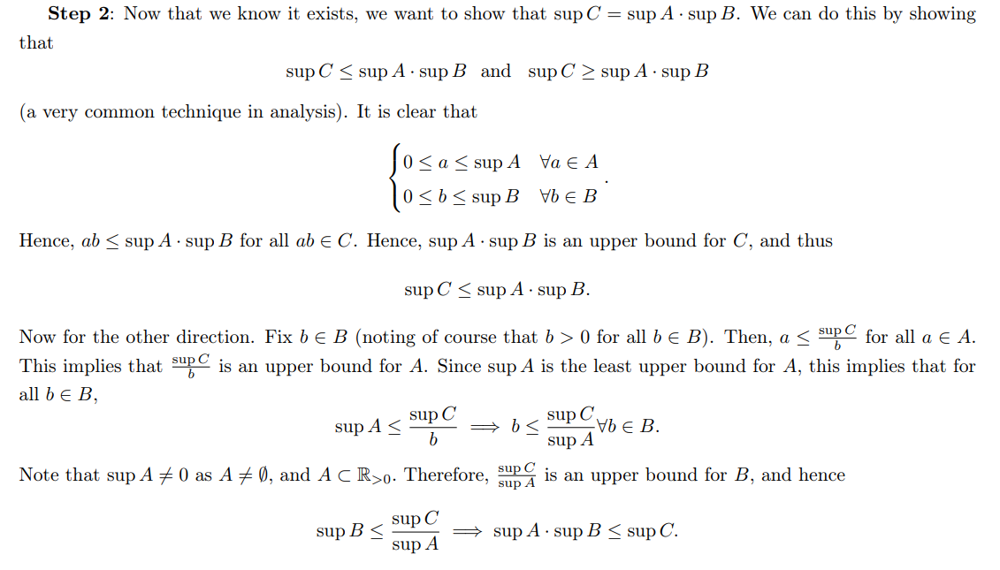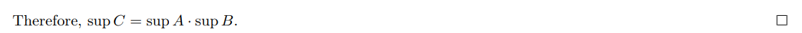

### Nonnegative Real Numbers
:::info
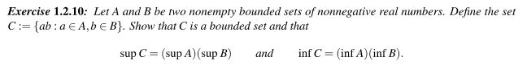
:::
 **Proof of the first part**
1. 首先证明有上界。因为都是非空且有界的集合，且, 因为具有`Least Upper Bound Property`, 所以和存在，且满足且, 因为均为非负实数，即, 所以, 所以, 因为,于是是的上界。因为, 且具有`LUBP`, 所以存在。
2. 证明是的最小上界。即。如果我们要证明等式的话其实等价于证明和同时成立。
   1. 首先证明, 此时我们知道。
      1. 如果或者, 则, 此时成立。
      2. 否则，, 我们按照`Positive Real Numbers`中的思路证明就能得到成立(只要取那些即可)
   2. 然后证明, 这个结论显然。

综上, 
**Proof of the second part**
1. **首先证明存在性:**

首先因为都是`Bounded Set`, 所以且, 于是对于, 于是是集合的`Lower Bound`, 因为且具有`Least Upper Bound Property/Ordered Field`，所以存在。

2. **然后证明相等性:**
   1. 证明,  
      1. 如果, 则, 此时成立。
      2. 因为, 所以我们取任意的使得, 于是
   2. 证明，这个结论显然。

综上，

## P8 Construction Methods
> 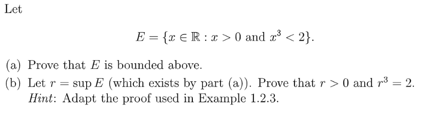

**(a)**因为, 所以, 于是is bounded above, 证毕。
**(b)**
1. 因为, 所以存在，因为, 因为, 则, 所以, 于是
2. 假设, 我们现在要证明, 于是我们可以转而证明和同时成立:
   1. 证明，使用反证法，假设, 我们想要找到矛盾点使得, 于是我们考虑构造一个, 使得, 这样就不是的`Upper Bound`了。怎么构造呢，我们可以反推。

因为, 我们令, 而且很显然我们有:, 并且这个不等式恒成立，所以。
于是
于是且, 于是, 矛盾。所以。

   2. 证明。还是一样使用反证法，假设, 我们想要构造出一个矛盾使得, 这样。怎么构造呢? 注意到要想成立(即)，需要是的一个上界。因为, 于是至少得大于, 于是我们得选取一个同时的使得。于是我们观察。换句话说，我们只需要找到使得且同时成立的即可。

于是，我们可以选取，这样根据假设， 所以, 		另外，我们可以验证，而这个不等式恒成立。所以:
, 所以。
所以, 于是, 矛盾，于是成立。
综上，我们有成立。证毕。
