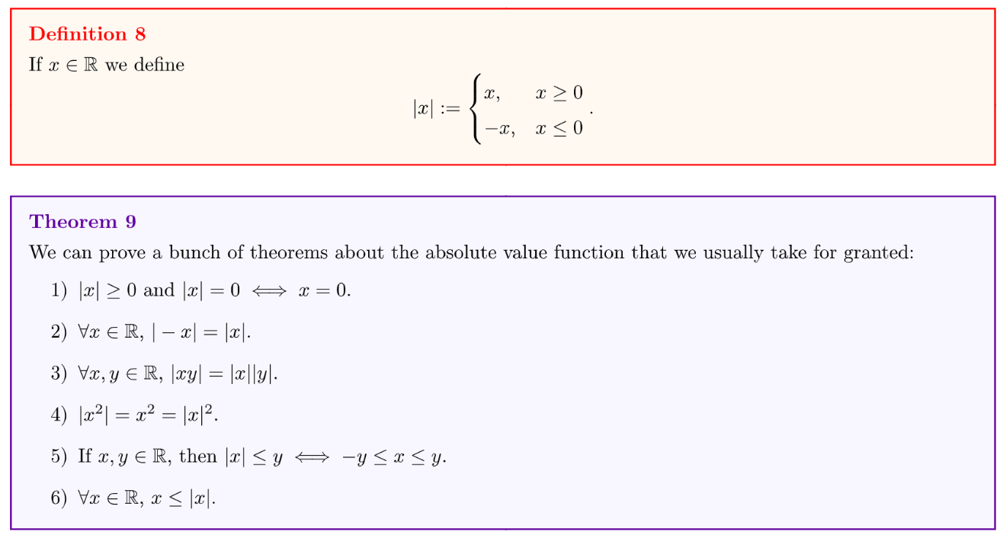
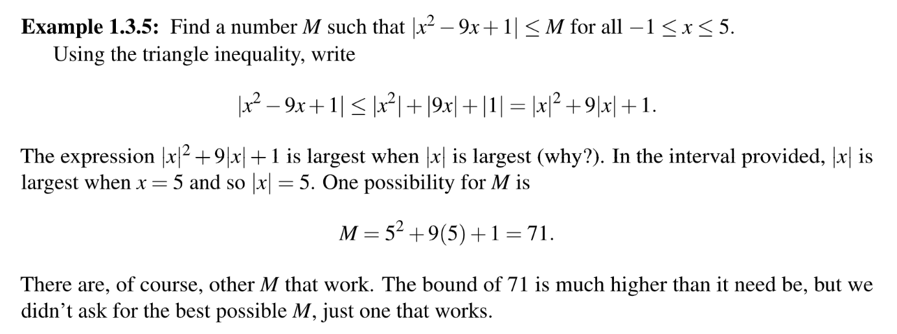
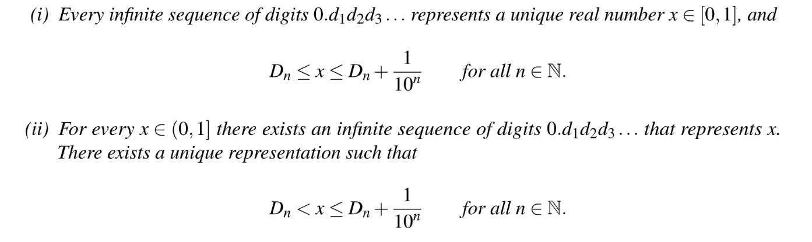
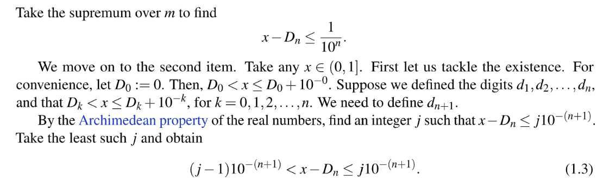
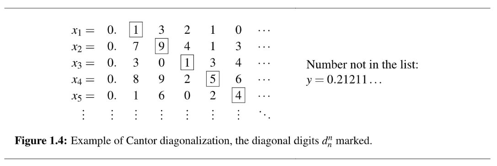
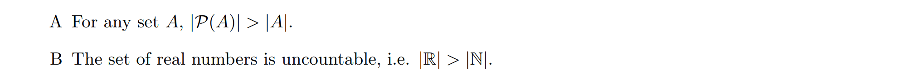
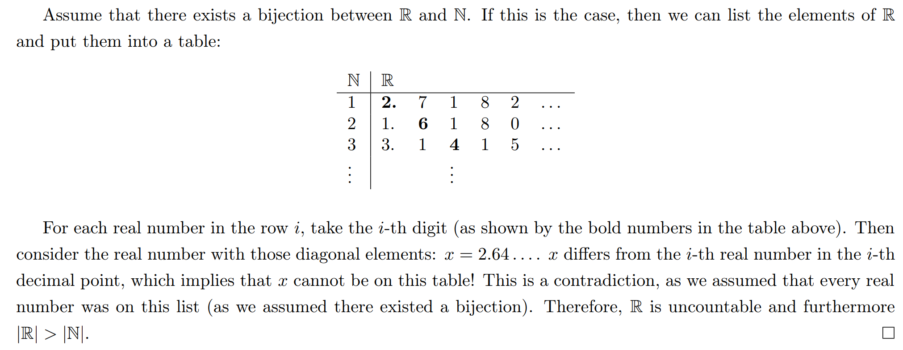
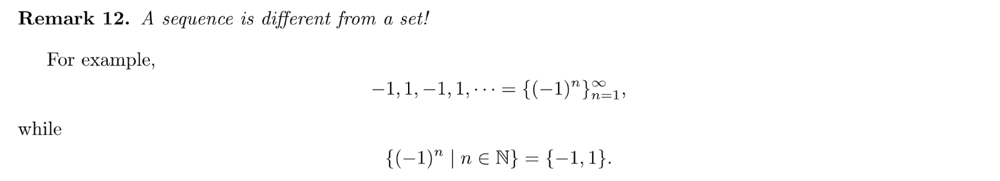

[Lecture Note 5.pdf](https://www.yuque.com/attachments/yuque/0/2022/pdf/12393765/1667017436190-c24ec24b-ec86-4aa5-90de-57e8b1dddc8b.pdf)
# 1 Archimedian Property&Density
## 1.1 AP/Density Theorem
> 

**Intuition behind Archimedian Property**`Archimedian Property`可以这样来理解。可以类比为货币累加。

**Proof of i**
**Proof of ii**这里介绍了一个重要的证明方法，也就是如果我们看到$x<y$, 则我们会有三种不同的情况:

1. $0\leq x<y$
   - 因为$1>0且1\in \mathbb{R}$, 并且根据$\mathbb{R}$的加法数乘封闭性，因为$n\in \mathbb{N}\subset \mathbb{R}, x\in \mathbb{R},\therefore nx\in \mathbb{R}$。所以再次使用`AP`,$\exists l\in \mathbb{N},s.t~~l\cdot 1\geq nx$。也就是说$\exists l\in \mathbb{N}，s.t.~~ l\geq nx且n\in \mathbb{N}$。
   - 于是我们可以围绕这个性质构造一个集合$S=\{k\in \mathbb{N}|k>nx\}$, 于是这个集合实际上是非空的。
   - $S$这个集合是$\mathbb{N}$的子集，自然也有属于$\mathbb{N}$的`Well-Ordering Property`, 也就是说存在一个$S$的最小元素$m\in S$使得$m>nx$, 所以$x<\frac{m}{n}\in \mathbb{Q}$
   - 因为$y-x>0$且$1\in \mathbb{R}$，所以根据`Archimedian Property`, $\exists n\in \mathbb{N}, ~s.t.~ n(y-x)>1$, 也就是$nx<ny-1$。 因为$m$是$S$中的最小元素，所以$m-1\notin S$，于是$m-1\leq nx<ny-1$, 所以$m<ny$, 即$\frac{m}{n}<y$
   - 所以综上$\exists r=\frac{m}{n}\in \mathbb{Q}, x,y\in \mathbb{R}且x<y~~s.t.~~ x<\frac{m}{n}<y$, 证毕。
2. $x<0<y$

这个情况下我们可以之间选取$r=0\in \mathbb{Q}$，结论成立。

3. $x<y\leq 0$

我们只需要对这个不等式做一个变形, 变得和情况一种的一样，变为$0\leq -y<-x$, 然后走一遍和情况一种一致的构造方法的得到同样的结论，证毕。

## 1.2 Corollaries from AP Theorem
### 1.2.1 Precision Definition of Sup/Inf 
> **For Least Upper Bound：**
> 
> **For Greatest Lower Bound:**
> Suppose that $S\subset \mathbb{R}$is nonempty and bounded below. Then $x=inf S$if and only if:
> 1. $x$is a lower bound for $S$
> 2. for all $\epsilon>0$, $\exists y\in S$such that $x\leq y< x+\epsilon$

> [!proof]
> **Proof**我们先证明第一条`Least Upper Bound`:
> **正方向:**
> 因为$x=supS$, 所以$\forall s\in S, s\leq supS=x$, 于是$x$一定是一个`Upper Bound for S`
> 因为$x=supS$是`Least Upper Bound`, 则$\forall \epsilon$, $supS-\epsilon$不是$S$的`Upper Bound`, 这表明$\exists e\in S~~s.t.~~supS-\epsilon<e<supS$, 正方向证明完毕。
> 
> **反方向：**
> 首先因为$x$是$S$的一个`Upper Bound`, 且$S\subset \mathbb{R}$, 所以$supS$存在。而我们知道$x\geq supS$ 因为$\forall \epsilon>0, \exists y\in S~~s.t.~~x-\epsilon< y\leq x$, 所以

## 1.2.2 Other Corollaries 
> 
> 我们使用两种方法证明这个结论:
> 第一种是通过求出集合$\{1-\frac{1}{n}|n\in \mathbb{N}\}$的`Upper Bound`的取值范围来得到那个最小的`Upper Bound`。
> 第二种是使用`Least Upper Bound`的精确定义来证明.

> [!proof]
> **Proof 1: Using Definition of Sup**
> 令集合 $S=\left\{1-\frac{1}{n} \mid n \in \mathbb{N}\right\}$ ，因为 $\forall n \in \mathbb{N} ， 1-\frac{1}{n} \leq 1$ ，于是 $\forall e \in S, e \leq 1$ ，换句话说， 1 是集合 $S$ 的 Upper Bound。令 $x=\sup S$ ，则我们想证明 $x \geq 1$ ，因为这样我们就可以知道 $S$ 的 Lea st Upper Bound 是 1 了。为了证明 $x \geq 1$ ，我们可以通过反证法证明 $x<1$ 然后推矛盾。假设 $x<1$ ，则 $1-x>0$ ，则根据 Archimedian Property 我们知道 $\exists n \in \mathbb{N}$ s.t. $n(1-x)>1$ ，也就是说 $\exists n \in \mathbb{N}$, s.t. $1-x>\frac{1}{n}$ ，即 $x<1-\frac{1}{n} \in S$ ，这和 $x=\sup S$ 的定义相悖，于是 $x \geq 1$ 成立。于是 $\sup S=1$

> [!proof]
> **Proof 2: Using theorem 4**令集合$S=\{1-\frac{1}{n}|n\in \mathbb{N}\}$, 因为$\forall n \in \mathbb{N}$, $1-\frac{1}{n}\leq 1$, 于是$\forall e\in S,e\leq 1$, 换句话说，$1$是集合$S$的`Upper Bound`。下面我们只需要证明$\forall \epsilon>0,\exists y \in S ~~s.t.~~ 1-\epsilon<y\leq 1$。根据`Archimedian Property`, 我们知道$\forall \epsilon>0$, $\exists n\in \mathbb{N},~~s.t.~~n\epsilon>1$, 即$\epsilon>\frac{1}{n}$, 所以相当于说$\forall \epsilon>0, \exists n\in \mathbb{N} ~~s.t.~~ 1-\epsilon<1-\frac{1}{n}\leq 1$, 于是$\forall \epsilon>0,\exists e\in S~~s.t.~~1-\epsilon<e\leq 1$, 于是根据上面的精确定义，我们知道$1$就是$S$的`Least Upper Bound`。

> [!corollary] 
> 
> 

> [!proof] Proof Method 1: Definition of Inf
> 首先 $\forall n \in \mathbb{N} ， \frac{1}{n}>0$ ，所以 0 是 $S$ 的 Lower Bound，令 $x=\inf S$ ，我们要证明 $x \leq 0$ 。我们还是使用反证法，假设 $x>0$ ，则根据 Archimedian Property， $\exists n \in \mathbb{N}, n x>1$ ，于是 $\exists n \in \mathbb{N}, x>\frac{1}{n}$ ，这与 $x=\inf S$ 的定义矛盾，于是 $x \leq 0$ 成立，也就是说 0 是 $S$ 的 Greatest Lower Bound

> [!proof] Proof Method 2: Using theorem 4
> 首先， 0 是 $S$ 的 Lower Bound，然后根据 Archimedian Property， $\exists n \in \mathbb{N}$ s.t $n \epsilon>1$ ，于是 $\forall \epsilon>0, \exists n \in \mathbb{N}$, s.t. $0<\frac{1}{n}<0+\epsilon$ ，而 $\frac{1}{n} \in S$ ，于是 $0=\inf S$

## 1.3 Properties of Sup/Inf
> 

**Proof of Theorem 6.1: Using Corollary from 1.2.1**因为$\mathbb{R}$具有`Least Upper Bound Property`且$A$是`Bounded Above`的，且$A\subset \mathbb{R}$, 所以$A$有最小上界$sup A$。于是根据$supA$的定义，我们有$\forall a\in A, a\leq supA$, 于是$a+x\leq supA+x$, 所以$supA+x$是集合$x+A$的上界。
而我们知道$supA$是$A$的最小上界，所以$\forall \epsilon >0,\exists a\in A~~s.t.~~ supA-\epsilon< a\leq supA$。于是$supA+x-\epsilon <a+x\leq supA +x$, 于是$supA+x$是$x+A$的最小上界，证毕。
**Proof of Theorem 6.2: Using Corollary from 1.2.1**因为具有`Least Upper Bound Property`且是`Bounded Above`的，且, 所以有最小上界。于是根据的定义，我们有, 于是, 所以是集合的上界。
而我们知道是的最小上界，所以。于是, 于是是的最小上界。

## 1.4 Inequality Relationship between Sup/Inf
> 

**Proof**因为$\forall x\in A$, 都有$x\leq y$, 所以$y$是$A$的一个`Upper Bound`。
因为$A\subset \mathbb{R}$, 且$\mathbb{R}$具有`Least Upper Bound Property`, 所以$sup A$存在，且满足$supA\leq y$。所以相当于是$\forall y \in B$, $sup A\leq y$, 所以$supA$是$B$的一个`Lower Bound`。
因为$B\subset \mathbb{R}$, 且$\mathbb{R}$具有`Least Upper Bound Property`, 所以$inf B$存在，且满足$supA\leq inf B$(因为$infB$是$B$的`Greatest Lower Bound`), 证毕。

## 1.5 Absolute Value
> 

> [!proof] Proof of (1)
> 首先证明前半个命题:
> 如果 $x>0$ ，则 $|x|=x>0$
> $::$ 如果 $x<0$, 则 $|x|=-x>0$
> 如果 $x=0$ ，则 $|x|=x=0$
> 所以 $|x| \geq 0$
> 
> 然后证明后半个命题:
> 正方向:
> 如果 $x \geq 0$ ，则 $|x|=x=0$
> 如果 $x \leq 0$ ，则 $|x|=-x=0$
> 如果 $x=0$ ，则 $|x|=x=0$
> 所以 $x=0$
>
> 反方向:
> 如果 $x=0$ ，则 $|x|=x=0$证毕。

> [!proof] Proof of (2)
> 如果 $x \leq 0$ ，则 $-x \geq 0$ ，则 $|-x|=-x$ ，且 $|x|=-x$ ，所以 $|-x|=|x|$如果 $x \geq 0$ ，则 $-x \leq 0$ ，则 $|-x|=-(-x)=x$ ，且 $|x|=x$ ，所以 $|-x|=|x|$

> [!proof] Proof of (3)
> 如果 $x \geq 0, y \geq 0$ ，则 $x y \geq 0$ ，则 $|x y|=x y$ ，且 $|x||y|=x y$ ，所以 $|x y|=|x||y|$如果 $x \geq 0, y \leq 0$ 或者 $x \leq 0, y \geq 0$ ，则 $x y \leq 0$ ，则 $|x y|=-x y$ ，且 $|x||y|=-x y$ ，所以 $|x y|=|x||y|$ ，证毕。

> [!proof] Proof of (4)
> 令$x=y$, 重复`Proof of (3)`中的证明即可。

> [!proof] Proof of (5)
> 如果 $x \geq 0$ ，则 $|x|=x \geq 0$ ，因为 $y \geq|x| \geq 0$ ，所以 $-y \leq 0$ ，所以 $-y \leq x=|x| \leq y$如果 $x \leq 0$ ，则 $|x|=-x \geq 0$ ，因为 $y \geq|x| \geq 0$ ，所以 $-y \leq 0$ ，所以 $-y \leq-x=|x| \leq y$ ，所以 $-y \leq x \leq y$ 。证毕。

> [!proof] Proof of (6)
> 令$x=y$, 重复`Proof of (6)`中的证明即可。

## 1.6 Ordered Set without AP
> `Archimedian Property`并非在所有`Ordered Set`上都成立，比如我们可以考虑下面的集合:
> $S=\{\sum_{i=0}^na_ix^i|a_i\in \mathbb{R},n\in \mathbb{N}\}$
> 集合$S$包括了所有的多项式，为了使得$S$成为一个`Ordered Set`, 我们需要定义一些比较规则， 比如$\succ$关系。我们令$p(x)=\sum_{i=0}^na_ix^i>0$, 且令$p(x) \succ 0$if $a_n>0$。
> 现在的问题是: 集合$S$是否具有`Archimedian Property`? 换句话说，给定$p(x),g(x)\in S$, 且$g(x)\succ p(x)\succ  0$, 是否存在$n\in \mathbb{N}$使得$np(x)\succ g(x)?$
> 

# 2 Uncountability of Real Numbers
[Lecture Note 6.pdf](https://www.yuque.com/attachments/yuque/0/2022/pdf/12393765/1667017436204-7217425a-d6e5-4e7a-b02c-e02f3c9a0735.pdf)

## 2.1 Triangle Inequality
### Basic Theorem
> 

**Proof**

### Corollary
> 

**Proof**

### Generalization
> 

**Proof By Induction**
**Example**

## 2.2 Uncountability of Real Numbers
### Bounded Intervals
> 

### Unbounded Intervals
> 

## 2.3 Decimal Representation
### Rational Numbers
> 
> 而并非所有的`Real Numbers`都能被写成有限的`Expansion`表达，于是我们会需要`Infinity`的介入。

**Example**$11.1=1\cdot 10^1+1\cdot 10^0+1\cdot 10^{-1}=11.1=\frac{111}{10}$

### Real Numbers
> 
> **书中的类似定义:**
> 

**Example**

## 2.4 Uncountablility Theorems 
### Decimal Representation
> 

**Proof**

### Cantor Diagoanlization
> 
> 从这个结论出发我们可以得到一个推论:
> 
> 因为$(0,1]$是`Uncountable`的，所以$|(0,1]|\leq |\mathbb{R}|$, 而$|\mathbb{N}|< |(0,1]|\leq |\mathbb{R}|$ , 所以$|\mathbb{N}|<|\mathbb{R}|$(表明$\mathbb{R}$是`Uncountable`的条件), 所以$\mathbb{R}$是`Uncountable`的。

**Proof - Cantor Diagonalization**

### Recitations on Cantor Diagonalization
> 在[利用集合性质证明Cantor Theorem](https://www.yuque.com/alexman/cbermo/gsu1ne#ylNZK)中，我们证明了$|A|\leq |\mathcal{P}(A)|\leq |\mathcal{P}(\mathcal{P}(A))| \cdots$以及$\mathbb{R}$是`Uncountable`的结论。
> 现在我们使用我们刚刚展示的`Cantor Diagonalization`方法来证明下面两个结论。
> 
> 从下面的证明

Proof of A
Proof of B

### Summary on Countability
> 

# 3 Sequence and Limits
## 3.1 Definition
> 
> **Counter-Definition:** $\{x_n\}$is unbounded if $\forall B\geq 0,\exists n~~s.t.~~|x_n|>B$。

**Remarks: Sequence is different from a set**我们可以把`Sequence`想象成一个`List of numbers`, 内部元素可重复，但是`Set`内部的元素是不可重复的。

**Example: Bounded Sequence**Whenever there is a definition, we should be prompted to think about examples and counterexamples. Counterexamples are constructed just by negating the definitions.
$\{1,1,1\cdots\}$and$\{\frac{1}{n}\}$are bounded
$\{(-1)^n\}=\{-1,1,-1,1,-1,1,\cdots\}$bounded since $|(-1)^n|=1~~,\forall n$

**Proof of counter-definition**Why is $x_n=\{1,2,3,4,5,\cdots\}$unbounded?
Let $B\geq 0$, then by `Archemedian Property`, $\exists n\in \mathbb{N}~~s.t.~~ n>B$, Since $n=x_n$, thus $x_n$is unbounded.

## 3.2 Convergence of sequence
> 

**Illustration of Convergence**

## 3.3 Unique Convergence**⭐⭐**
> 
> `**Theorem 16**`**又是我们证明相等性(或者说证明一个实数**$x-y$**为零)的一种方式**

**Proof of Theorem 16: By contradiction**使用反证法证明`If A, then B`, 我们只需要研究命题$A\cap \neg B$即可。如果$A\cap \neg B$有矛盾，则原命题成立。

**Proof of Theorem 15: Using Theorem 15**
Then using theorem 15, we have that $x=y$

## 3.4 Notations and Exampmles
> 

**Examples**
为什么$M$存在，我们可以使用`Archimedian Property`说明， 因为$\epsilon>0$, 于是$\exists n\in \mathbb{N}, ~~s.t.~~M\epsilon>1$, 也就是$M^{-1}>\epsilon^{-1}$。

## 3.5 Basic Proof Structure
> Let $\epsilon>0$, choose $M\in \mathbb{N} ~~s.t.~~ M>f(\epsilon)$(或者$M<f(\epsilon)$), Thus if $n\geq M, |x_n-x|<\epsilon$happens.

# 4 Basic Topology-Open Sets
[Basic Topology.pdf](https://www.yuque.com/attachments/yuque/0/2022/pdf/12393765/1668329016647-84793bb8-8905-4e06-a7f9-66ef975a6f37.pdf)
> 

## 4.0 Basics
> 

## 4.1 Open Set
### Definition
> 

Examples

### Propositions
> 

**Proof**
**Remarks**

## 4.2 Neighborhoods
### Definition
> 

**Examples**

### Restatement about open sets
> 

## 4.3 Relatively Open Sets
> 

**Examples**

## 4.4 Relative Neighborhood
### Definition
> 

## 4.5 Intersection and Union
> 1. **Arbitrary union of open set is open**
> 2. **Finite Intersection of open set is open**
> 
证明详见作业`P5`

# 5 Assignment
[hw3.pdf](https://www.yuque.com/attachments/yuque/0/2022/pdf/12393765/1667285794671-f24ca446-ade3-46fb-a3d4-28edd1261fb4.pdf)
## P1 Density of R\Q
> 

**Proof(Easy)**我们在本章中证明了`Density of`$\mathbb{Q}$的结论，得到了$\forall x,y\in \mathbb{R}, \exists r\in \mathbb{Q},~~s.t.~~ x<r<y$的结论，而本题中的结论我们的证明方式只需要稍加改动即可。
因为$\frac{x}{\sqrt{2}}, \frac{y}{\sqrt{2}}\in \mathbb{R}$, 所以$\exists t\in \mathbb{Q},~~s.t.~~\frac{x}{\sqrt{2}}\leq t\leq \frac{y}{\sqrt{2}}$, 所以$x\leq \sqrt{2}t\leq y$, 所以我们只要证明$\sqrt{2}t\in \mathbb{R}\backslash \mathbb{Q}$即可。
如果$\sqrt{2}t\in \mathbb{Q}$, 则$\exists m,n\in \mathbb{R},~~s.t.~~\sqrt{2}t=\frac{m}{n}$, 即$\sqrt{2}=\frac{m}{nt}$, $m,nt\in \mathbb{R}$且互素。然后我们将证明这个等式不可能成立，我们使用反证法。
假设$\sqrt{2}=\frac{m}{nt},m,nt\in \mathbb{R}$成立，则$m^2=2(nt)^2$, 所以$m=2k, k\in \mathbb{R}$, 代入后得到$4k^2=2(nt)^2$,  于是$2k^2=(nt)^2$, 所以$nt=2q, q\in \mathbb{R}$，所以$m$和$nt$不互素，有公约数$2$, 于是矛盾，所以$\sqrt{2}t\in \mathbb{R}\backslash \mathbb{Q}$。
综上，$\forall x,y\in \mathbb{R}, \exists r\in \mathbb{R}\backslash \mathbb{Q},~~s.t.~~ x<r<y$, 证毕。

## P2 Decimal/Cardinality
> 

> [!proof]
> **Proof(Easy)**
> 为了证明$|E|=|\mathcal{P}(\mathbb{N})|$, 我们只要证明存在一个双射$f:E\to \mathcal{P}(\mathbb{N})$即可。根据`Hint`可知，我们只要证明这个映射是`One-to-one Correspondence`的即可。
> 首先证明`Injection`: 对于$\forall f(x)=f(y)$, 我们有$\{j\in \mathbb{N}:d_{-j}=2\}=\{t\in \mathbb{N}:d_{-t}=2\}$, 所以$x=y$(因为$\forall d_{-i}$, $d_{-i}$不是$2$就是$1$), 这表明$f$是`Injection`。
> 然后证明`Surjection`: $\forall S\subset \mathbb{N}$, 或者$S\in \mathcal{P}(\mathbb{N})$, 我们总能在$E$中找到一个元素$x\in (0,1)$形如$x=0.d_{-1}d_{-2}\cdots$且$\forall t\in S$, $d_{-t}=2;\forall q\notin S, d_{-q}=1$使得$f(x)=S\in \mathcal{P}(\mathbb{N})$，于是$f$是`Surjection`。
> 综上$f$是`Bijection`, 证毕。
> 这个结论可以推广到$|\mathbb{R}|=|\mathcal{P}(\mathbb{N})|$, 在这里不作证明。

## P3 (Un)countability
> 

> [!proof]
> **(a) Proof(Easy)
> 因为$A$和$B$都是`Countably Infinite Sets`, 则$\exists f: A\longleftrightarrow \mathbb{N}~~and~~g: B\longleftrightarrow \mathbb{N}$。
> 现在我们要证明$\exists h:A\cup B\longleftrightarrow \mathbb{N}$
> 直观来看，我们可以令$f$唯一映射到所有偶数上，$g$唯一映射到所有奇数上，然后取$h:A\cup B\longleftrightarrow \mathbb{N}$令$h$唯一映射到所有自然数上，即可证毕。如果我们想用数学语言来表述的话:
> 我们可以构造映射$h(z)=\begin{cases} 2f(z)&z\in A\\2g(z)+1&z\in B\end{cases}$。
1. 首先证明`injection`: 对于所有的$x\neq y\in A\cup B$, 我们讨论三种情况:
   1. $x\neq y\in A$, 此时因为$f$是`Injection`, 所以$f(x)\neq h(y)$即$h(x)\neq h(y)$
   2. $x\neq y\in B$, 此时因为$g$是`Injection`, 所以$g(x)\neq g(y)$即$h(x)\neq h(y)$
   3. $x\in A$, $y\in B$or $x\in B, y\in A$, 因为$A$和$B$是不相容的，所以$x\neq y$, 且$2f(x)$是偶数，$2g(y)+1$是奇数, 于是$h(x)\neq h(y)$

综上$h(x)\neq h(y)$, `injection`证明完毕。

2. 证明`Surjection`: 这个比较好证明，对于所有自然数中的偶数，我们都有$x\in A$与之对应，对于所有自然数中的奇数，我们都有$x\in B$与之对应，于是`Surjection`证明完毕。
**(b) Proof(Easy)**因为$\mathbb{R}$是`Uncountable`的，$\mathbb{Q}$是`Countable`的，且因为$\mathbb{R}\backslash \mathbb{Q}$和$\mathbb{Q}$是`Disjoint`的且$(\mathbb{R}\backslash \mathbb{Q})\cup\mathbb{Q}=\mathbb{R}$, 于是根据$(a)$问中的结论，如果$\mathbb{R}\backslash \mathbb{Q}$是`Countable`, 则$(\mathbb{R}\backslash \mathbb{Q})\cup\mathbb{Q}$是`Countable`的，即$\mathbb{R}$是`Countable`的，这和$\mathbb{R}$是`Uncountable`的是矛盾的，所以$\mathbb{R}\backslash \mathbb{Q}$是`Uncountable`的。证毕。

## P4 Boundedness
> 

**Proof(Easy)**因为$a_0$是$A$的`Least Upper Bound`, 所以$\forall \epsilon>0$, $a_0-\epsilon$不是$A$的`Upper Bound`, 这意味着$\exists a\in A,~~s.t.~~a_0-\epsilon<a$, 证毕。

## P5 Open Sets
> 

**(a) Basic Open sets(Medium)**
1. 我们先证明$(a,b)$是`Open Set`。换句话说，我们只要证明$\forall x\in (a,b), \exists \epsilon>0,~~s.t.~~a\leq x-\epsilon, x+\epsilon\leq b$即可。

我们定义, 对于任意的$x\in (a,b)$, 取$\epsilon = \min\{x-a,b-x\}$, 于是根据定义我们有$\epsilon\leq x-a$且 $\epsilon \leq b-x$. 所以$x\geq a+\epsilon$, 且$x\leq b-\epsilon$成立。
所以我们找到了这样的$\epsilon$，证毕。

2. 证明$(-\infty,a)$是`Open Set`, 取$0<\epsilon\leq a-x$, 此时$x+\epsilon\leq a$, 且$x-\epsilon \geq x-(a-x)=2x-a\geq-\infty$, 于是存在这样的$\epsilon$满足条件，证毕。
3. 证明$(b,\infty)$是`Open Set`, 取$0<\epsilon\leq x-b$, 此时$x\geq b+\epsilon$, 且$x+\epsilon \leq x+x-b=2x-b\leq \infty$, 于是存在这样的$\epsilon$满足条件，证毕。
**(b) Arbitrary union of open set is open(Easy)**根据题意，我们知道$\forall x\in \cup_{\lambda \in \Lambda} U_{\lambda}, \exists \lambda_0\in \Lambda, ~~s.t.~~ x\in U_{\lambda_0}$, 因为$\forall \lambda\in \Lambda$, $U_{\lambda}$is open.
所以$\exists \epsilon>0, ~~s.t.~~(x-\epsilon,x+\epsilon)\subset U_{\lambda_0}\subset \cup_{\lambda \in \Lambda}$, 于是证毕。
**(c) Finite Intersection of open set is open(Medium)**根据题意我们知道$\forall x\in \cap_{i=1}^nU_i$, $x\in U_i, i=1,2,.\cdots, n$
因为$U_i$是`Open set`$\forall i\in \mathbb{N}$, 所以$\exists \epsilon_i>0,~~s.t.~~(x-\epsilon_i,x+\epsilon_i)\subset U_i,i=1,2,\cdots, n$
所以如果我们取$\epsilon=\min\{\epsilon_1,\epsilon_2,\cdots, \epsilon_n\}$, 则$(x-\epsilon,x+\epsilon)\subset U_i,i=1,2,\cdots, n$, 这表明$(x-\epsilon,x+\epsilon)\subset \cap_{i=1}^n U_i$, 证毕。
但是我们要注意这个结论只在**Finite Intersection**的前提下成立，如果我们有`Infinitely many`个`Open set`取交集，则结果集不一定是`Open`的。

**(d) Rational Number is not open(Medium)**我们使用反证法，如果$\mathbb{Q}$是`Open set`, 则$\forall x\in \mathbb{Q}$, 则$\exists \epsilon>0,~~s.t.~~(x-\epsilon,x+\epsilon)\subset \mathbb{Q}$, 但事实上$\forall \epsilon>0$, $\exists e\in (x-\epsilon,x+\epsilon), ~~s.t.~~  e\notin \mathbb{Q}$, 即$(x-\epsilon,x+\epsilon)$不是$\mathbb{Q}$的子集。所以$\mathbb{Q}$不是`Open Set`

## P6 Squeeze Theorem
> 

**Proof(Easy)**$0\leq |\frac{1}{20n^2+20n+2020}-0|\leq |\frac{1}{20(n+\frac{1}{2})^2+2015}|\leq |\frac{1}{20(n+\frac{1}{2})^2}|\leq \frac{1}{n^2}$
`By Squeeze Theorem`, 我们知道, 因为$\lim_{n\to \infty} \frac{1}{n^2}=0$, 所以$\lim_{n\to \infty} |\frac{1}{20n^2+20n+2020}-0|=0$, 这表明$\lim_{n\to \infty} \frac{1}{20n^2+20n+2020}=0$, 证毕。
