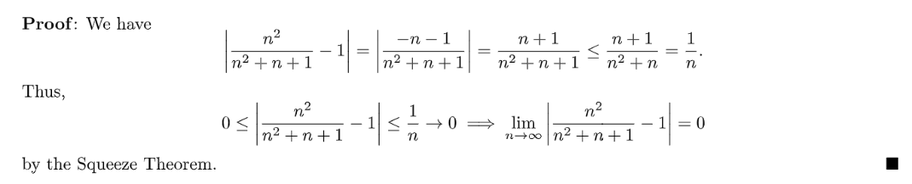
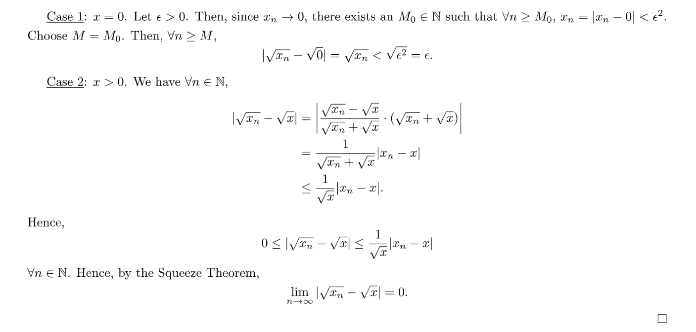

[Lecture Note 7.pdf](https://www.yuque.com/attachments/yuque/0/2022/pdf/12393765/1667885974174-6608d1ee-cf6d-448a-b2f0-9671148ce4e7.pdf)
# 1 Divergence Sequence
## Definitions
> 我们在上一小节已经介绍了数列收敛的定义:
> 
> 这里我们只需要将数列收敛的定义进行一些小小的修改就可以得到数列发散的定义。
> A sequence $\{x_n\}$diverges if $\exists \epsilon_0 >0, \forall M\in \mathbb{N}, ~~s.t.~~\exists n\geq M, |x_n-x|\geq \epsilon_0$。

**Example 1**
**Example 2**
Proof: Let $x\in \mathbb{R}$, we want $\{(-1)^n\}$doesn't converge to $x$。Let $\epsilon_0=1$, and let $M\in \mathbb{N}$, thus $2=|(-1)^M-(-1)^{M+1}|\leq |(-1)^M-x|+|(-1)^{M+1}-x|$
We want to find the following scenario: $|(-1)^M-x|\geq \epsilon_0$, and we notice that when $x=0$, we have $|(-1)^M-x|=1=|(-1)^{M+1}-x|$, thus when $x\neq 0$we have: either $|(-1)^{M}-x|\geq 1$or $|(-1)^{M+1}-x|\geq 1$, thus we are sure that such $\epsilon_0=1$exists.

## 数列收敛=>数列有界⭐⭐
> 
> 回顾一下`Bounded Sequence`的定义: $\exists B\geq 0, ~~s.t.~~ \forall n\in \mathbb{N},|x_n|\leq B$。
> 上面的**逆命题不成立**， $\{x_n\}$有界并不意味着$\{x_n\}$是收敛的。 

**Proof(Medium)**这个证明会有些复杂，我们先介绍证明思想。
首先因为$\{x_n\}$是收敛的, 假设收敛于$x$, 即$\lim_{n\to \infty}x_n=x$，所以$\exists \epsilon=1, \forall n\geq M,~~s.t.~~|x_n-x|<1$, 即$x_n\in (x-1,x+1),~~\forall n\geq M$。这也表明对于$n\leq M$, 存在有限个$x_n$在$(x-1,x+1)$这个区间之外。换句话说，就是$n\leq M$时，$|x_n|\leq max\{|x_1|,|x_2|,\cdots |x_{M-1}|\}=B$，本质上我们要寻找尽可能大的$B$使得$\{x_n\}$能够被$(-B,B)$区间包裹住。
有了上面的铺垫我们可以开始证明:
当$n \geq M$时，我们可以直接利用数列收敛的性质，于是我们有: $|x_n|=|x_n-x+x|\leq |x_n-x|+|x|\leq 1+|x|$
当$n\leq M$时，我们有: $|x_n|\leq B$。
于是$|x_n|$是有界的，证毕。

# 2 Monotone Sequence
## Definition
> 

**Example**

## 对于单调数列，有界=收敛
> 
> 这个定理暗含一个重要的思想，就是当一个数列$\{x_n;n\in \mathbb{N}\}$是单调的时候，我们可以把数列看成是一个`Ordered Field`, 同时这个数列是$\mathbb{R}$的子集，于是上界或者下界一定存在。
> 

> [!proof]
> **Proof of Theorem 6**
> **Proof of Theorem 7**
> 正方向: 首先由`Theorem 3`可知，因为$\{x_n\}$是收敛的， 所以$\{x_n\}$一定是有界的。
> 反方向: 假设数列$\{x_n\}$是有界的， 因为$\{x_n\}$是单调递减的，于是我们令$S=\{x_n|n\in \mathbb{N}\}$为一个集合，我们知道$S\subset \mathbb{R}$, 于是$inf S$存在，假设$x=infS$, 则根据最小下界的定义，我们知道$\forall \epsilon>0,\exists M_0\in \mathbb{N}  ~~s.t.~~ x\leq x_{M_0}<x+\epsilon$, 同时我们因为数列$\{x_n\}$是单调递减的，于是$x_{n}\geq x_{n+1}$, 于是$\forall n\geq M_0, x_n\leq x_{M_0}$。因为$x_n\in S$， 所以$x\leq x_n$。
> 所以我们有$\forall n\geq M_0, x-\epsilon<x\leq x_n\leq x_{M_0}<x+\epsilon$, 也就是$\exists M_0\in \mathbb{n},~s.t.~~\forall n\geq M_0, x-\epsilon<x_n<x+\epsilon$($|x_n-x|<\epsilon$), 就是$x_n\to x=infS$, 证毕。
 
 
## Examples
> [!example]
> **Theorem 1:** 如果$c\in (0,1)$,则$\lim_{n\to \infty} c^n=0$
> **Theorem 2: **如果$c>1$,则$\{c^n\}$is unbounded.
> 证明这两个定理需要一个**常用引理**:
> 假设$x\geq -1, n\in \mathbb{N}$, 则$(1+x)^n=1+C_{n-1}^1 1^{n-1}\cdot x+\cdots \geq 1+nx$

**Proof of Theorem 1(Medium)**首先证明存在性, 因为$c\in (0,1)$, 所以我们有$0<c^{n+1}<c^n, n\in \mathbb{N}$成立，我们也可以使用数学归纳法来证明:

1. $n=1$时， $0<c^2<c$成立
2. 假设$n=m$时， $0<c^{m+1}<c^m$成立, 则$n=m+1$时，$0<c^{m+1}\cdot c<c^{m}\cdot m\iff0<c^{m+2}<c^{m+1}$
3. 于是`By induction`, 我们有$0<c^{n+1}<c^n,\forall n\in \mathbb{N}$

所以$0<c^{n+1}<c^{n}<c^{n-1}<\cdots <c, \forall n$, 于是$\{c_n\}$单调递减且有界, 于是根据`Theorem 7`我们有:$\{c^n\}$收敛。假设收敛于$L$, 下面我们证明$L=0$, 你可能会想使用之前的方法证明$\begin{cases} L\geq 0\\L\leq 0\end{cases}$，但是这样会比较繁琐，而其实也不需要这么麻烦。在数学分析中，如果我们要证明一个数为$0$, 我们也可以使用极限的思想: $\forall \epsilon>0, |L|<\epsilon\implies L=0$来证明。由于$c\in (0,1)$, 则$1-c>0$, 我们可以好好利用一下这个性质。如果我们要证明$|L|<\epsilon ,\forall \epsilon$我们可以转而证明
$(1-c)|L|<(1-c)\epsilon\iff |(1-c)L|<(1-c)\epsilon \tag{1}$
而我们知道$\lim_{n\to \infty} c^n=L$, 这相当于在说$\forall \epsilon>0, \exists n\geq M_0, ~~s.t.~~ |c^n-L|<\epsilon$, 但是这个条件好像并不能帮助我们证明$(1)$, 于是我们考虑如下构造:
$\forall \epsilon>0, \exists n\geq M_0, ~~s.t.~~ |c^n-L|<(1-c)\frac{\epsilon}{2}$
于是:
$\begin{aligned}|(1-c)L|=|L-cL|=|L-c^{M_0+1}+c^{M_0+1}-cL|&\leq |L-c^{M_0+1}|+c|c^{M_0}-L|
\\&=|c^{M_0+1}-L|+c|c^{M_0}-L|\\&<(1-c)\frac{\epsilon}{2}+c(1-c)\frac{\epsilon}{2}\\&<(1-c)\frac{\epsilon}{2}+(1-c)\frac{\epsilon}{2}\\&=(1-c)\epsilon\end{aligned}$
所以$\forall \epsilon>0,|L|<\epsilon$, 所以$L=0$, 证毕。
**Proof of Theorem 2(Medium)**我们想要证明$\forall B\geq 0, \exists n\geq M_0,~~s.t.~~|c^n|=c^n> B$。看到形如证明$z^n>T$($z>1$时)的不等式，我们就可以考虑使用上面的引理先进行一些放缩(利用$c-1>0$的性质)。也就是我们可以进行如下操作:
$c^n=(1+(c-1))^n\geq 1+n(c-1)$
所以我们总是可以找到$\forall B\geq 0, n> \frac{B}{c-1},~~s.t.~~ c^n\geq 1+n(c-1)>\frac{B}{c-1}\cdot (c-1)=B$, 证毕。

# 3 Subsequence
## Definition
> 
> 注意这里要求$\{n_k\}$是一个`Strictly increasing sequence`, 也就是**要求**$n_1<n_2<\cdots n_k$**。**

**Examples**
**Remarks**第一个例子中之所以不是`subsequences`是因为我们不能令$n_k=1,\forall n\in \mathbb{N}$

## Important Lemma⭐⭐⭐
> [!lemma]
> 假设$1\leq n_1<n_2<\cdots<n_k$, 则$n_k \geq k,\forall k\in \mathbb{N}$
> 我们可以使用数学归纳法证明:
> 1. 根据`Subsequence`的定义,$n_1\geq 1$成立
> 2. 假设$n_m\geq m$成立，则$n_{m+1}-n_{m}\geq 1=n_m+1\geq m+1$
> 3. 根据数学归纳法， $\forall k\in \mathbb{N}, n_k\geq k$。证毕。

## 数列收敛=>所有子数列收敛
> [!important]
> 
> 如果我们写的清楚一些就会有: 
> 如果$\{x_n\}$converges to $x$, 则其任何`subsequences`$\{x_{n_k}\}$都有$\lim_{k\to \infty} x_{n_k}\to x$
> Proof(Medium)，应用上述引理，我们有如下证明过程:
> 假设数列$\{x_n\}$收敛, 不妨设$\lim_{n\to \infty} x_n=x$, 则根据收敛的定义: $\forall \epsilon>0, \exists M_0\in \mathbb{N},~~s.t.~~\forall n\geq M_0, |x_n-x|<\epsilon$此时我们选择$M=M_0$。如果$k\geq M_0$, 则$n_k\geq k\geq M_0$, 所以$\forall \epsilon>0,\exists M_0\in \mathbb{N}, ~~s.t.~~ \forall n_k>M_0,~|x_{n_k}-x|<\epsilon$, 这也意味着$\lim_{n\to\infty}x_{n_k}=x$，证毕。

## Divergence Remarks
> 

# 4 Methods to Check Convergence 
[Lecture Note 8.pdf](https://www.yuque.com/attachments/yuque/0/2022/pdf/12393765/1667885974163-6271733d-e78f-4906-bf53-d7ac2bd3a51c.pdf)

## Squeeze Theorem
> [!thm]
> 一种验证数列$\{x_n\}$收敛的方式就是找到其他两个数列满足下面的关系:
> 

> [!proof]
> **Proof(Easy)**

## Basic Facts
> [!lemma]
> 

> [!proof]
> **Proof(Easy from definition)**
> 1. 正方向:
> $\begin{aligned}\lim_{n\to \infty}x_n=x&\implies \lim_{n\to \infty}(x_n-x)=0\\&\implies \forall \epsilon >0,\exists M_0\in \mathbb{N} ~~s.t.~~ \forall n\geq M_0,|x_n-x|<\epsilon\\&\implies ||x_n-x|-0|<\epsilon\end{aligned}$,于是$\lim_{n\to \infty}|x_n-x|=0$
> 3. 反方向:$\begin{aligned}\lim_{n\to \infty}|x_n-x|=0&\implies \forall \epsilon >0,\exists M_0\in \mathbb{N} ~~s.t.~~ \forall n\geq M_0,||x_n-x|-0|<\epsilon\\&\implies|x_n-x|<\epsilon\end{aligned}$。于是$\lim_{n\to \infty} x_n=x$

> [!example]
> **Example(Application of the theorem 3)**

## 数列的比较
> [!thm]
> 

> [!proof]
> **Proof of Part 1(Medium)**因为$\{x_n\}$和$\{y_n\}$都是收敛的数列，不妨设$\lim_{n\to \infty}x_n=x, \lim_{n\to \infty}y_n =y$且$y<x$($x-y>0$), 所以我们有: $\exists M_0\in \mathbb{N}, \forall n\geq M_0, |y_n-y|<\frac{x-y}{2}$, 即$y-\frac{x-y}{2}<y_n<y+\frac{x-y}{2}$, $\exists M_1\in \mathbb{N}, \forall n\geq M_1, |x_n-x|<\frac{x-y}{2}$, 即$x-\frac{x-y}{2}<x_n<x+\frac{x-y}{2}$于是我们为了让上述关系均成立，我们取$M\geq max\{M_0,M_1\}$, 此时我们有:$y_M<y+\frac{x-y}{2}=\frac{x+y}{2}=x-\frac{x-y}{2}<x_M$, 所以$\exists M\in \mathbb{N},~~s.t.~~ x_M>y_M$, 这和$\forall n\in \mathbb{N}, x_n\leq y_n$是矛盾的。于是$\forall n\in \mathbb{N}, x_n\leq y_n$， 证毕。
> **Proof of Part 2(Easy)**直接使用`Theorem 6`的第一部分即可。
> **Remarks about Theorem:**
> $\forall n, x_n<y_n \not \Rightarrow \lim_{n\to \infty} x_n<\lim_{n\to \infty}y_n$
> **Example:**
> $x_n=0, \forall n$, $y_n=\frac{1}{n}$then $x_n<y_n$and $\lim_{n\to \infty}x_n=0,\lim_{n\to \infty} y_n=0$, 此时$\lim_{n\to \infty}x_n=\lim_{n\to \infty} y_n$

## 极限的保号性
> [!thm]
> 

> [!proof]
> 

## 数列的代数运算
### Basic Algebraic Operations
> 

> [!proof]
> **Proof of 1(Easy)**因为$\lim_{n\to \infty}x_n=x,\lim_{n\to \infty}y_n=y$, 所以我们有: $\forall \epsilon>0, \exists M_0\in \mathbb{N}, ~~s.t.~~ \forall n\geq M_0, |x_n-x|<\frac{\epsilon}{2}$, $\forall \epsilon>0, \exists M_1\in \mathbb{N}, ~~s.t.~~ \forall n\geq M_1, |y_n-y|<\frac{\epsilon}{2}$, 于是我们取$M=M_0+M_1$满足$M\geq \max\{M_0,M_1\}$, 所以:
> $\begin{aligned}|x_n+y_n-(x+y)|&\leq |x_n-x|+|y_n-y|\\&<\frac{\epsilon}{2}+\frac{\epsilon}{2}\\&=\epsilon\end{aligned}$
> 所以$\lim_{n\to \infty}x_n+y_n\to x+y$, 证毕。
> **Proof of 2(Easy)**因为$\lim_{n\to \infty}x_n=x$， 所以$\forall \epsilon>0, \exists M_0\in \mathbb{N}, ~~s.t.~~ \forall n\geq M_0, |x_n-x|<\frac{\epsilon}{|c|+1}$, 这么做的目的马上就能看到。于是$|cx_n-cx|=|c||x_n-x|<\frac{|c|}{|c|+1}\epsilon<\epsilon$所以$\lim_{n\to \infty} cx_n \to cx$
> 那么为什么要取$\frac{\epsilon}{|c|+1}$而不是$\frac{\epsilon}{|c|}$呢？原因就是我们要为了防止$c=0$的情况。
> 那为什么不取$\frac{\epsilon}{|c|-1}$呢? 原因是我们需要借助$<$关系过渡到$\epsilon$上，但是$\frac{\epsilon}{|c|-1}$不能实现这个需求。
> **Proof of 3(Medium): Triangle Inequality&Squeeze Theorem**我们根据极限的定义和三角不等式有:
> $\begin{aligned}|x_ny_n-xy|&=|(x_n-x)y_n+xy_n-xy|\\&\leq|x_n-x||y_n|+|x||y_n-y|\end{aligned}$
> 于是现在我们需要利用$<$关系将$|x_n-x||y_n|+|x||y_n-y|$过渡到$\epsilon$。因为数列$\{y_n\}$是收敛于$y$的， 所以根据`Theorem 7.3`$\{y_n\}$是`Bounded`的, 换句话说$\exists B\geq 0, \forall n\in \mathbb{N}, |y_n|\leq B$。同时根据`Theorem 8.3`我们知道因为$\lim_{n\to \infty}x_n=x,\lim_{n\to \infty}y_n=y$, 所以
> $\lim_{n\to \infty}|x_n-x|=0,\lim_{n\to \infty}|y_n-y|=0$
> 所以:
> $0\leq |x_n-x||y_n|+|x||y_n-y|\leq |x_n-x|B+|x||y_n-y|$而根据`Theorem 8.8`我们有$\lim_{n\to \infty} x_n+y_n=x+y$:
> $\lim_{n\to \infty} |x_n-x|B+|x||y_n-y| =0+|x|\cdot 0=0$
> 根据`Theorem 8.1 Squeeze Theorem`可知$\lim_{n\to \infty}|x_ny_n-xy|=0$, 这意味着$\lim_{n\to \infty} x_ny_n=xy$,证毕。
> **Proof of 4(Medium): Triangle Inequality&Squeeze Theorem**为了证明这个结论, 我们实际上可以利用已经证明的结论$\lim_{n\to \infty}x_ny_n=xy$。于是我们只要证明$\lim_{n\to \infty}\frac{1}{y_n}=\frac{1}{y}$
> 为了摆脱对于$\epsilon$的复杂讨论，我们转而证明$\lim_{n\to \infty}|\frac{1}{y_n}-\frac{1}{y}|=0$, 同时我们为了利用夹逼定理， 需要为$|\frac{1}{y_n}-\frac{1}{y}|$找一个上界, 且这个上界趋近于零。
> 因为: $|\frac{1}{y_n}-\frac{1}{y}|=\frac{|y_n-y|}{|y_n||y|}$, 但是$\frac{|y_n-y|}{|y_n||y|}$不一定趋近于零，我们需要利用$\leq$关系进行放缩
> 这个于是我们可以为$|y_n|$找一个下界来$b$, 使得$\forall n\in \mathbb{N}, |y_n|\geq b, ~~s.t.~~ \frac{|y_n-y|}{|y_n||y|}\leq \frac{|y_n-y|}{b|y|}$。
> 因为$\lim_{n\to \infty}y_n=y$, 所以数列$\{y_n\}$是有界的，所以$\{|y_n|\}$也一定是有界的，于是
> $\exists M_0, \forall n\geq M_0,~~s.t.~~ |y_n-y|\leq M_0$, 所以根据三角不等式: $|y_n|=|y_n-y+y|\leq |y_n-y|+|y|\leq M_0+|y|$，但这仅仅对$\forall n\geq M_0$成立。
> 对于$n=1,2,\cdots, M_0-1$：
> $\{|y_n|\}$上界是$\min\{|y_1|,|y_2|,\cdots, |y_n|\}$, 不妨令$b=\min\{|y_1|,|y_2|,\cdots, M_0+|y|\}$, 使得$\forall n\in \mathbb{N}, |y_n|\geq b$
> 于是$\frac{|y_n-y|}{|y_n||y|}\leq \frac{|y_n-y|}{b|y|}$, 根据夹逼原理，$\lim_{n\to \infty}|\frac{1}{y_n}-\frac{1}{y}|=0$，根据$\lim_{n\to \infty}x_ny_n=xy$和$\lim_{n\to \infty}\frac{1}{y_n}=\frac{1}{y}$, 我们知道$\lim_{n\to \infty}\frac{x_n}{y_n}=\frac{x}{y}$成立，证毕。

### Power Operations
> [!thm]
> 

> [!proof] **Proof of Theorem 10**
> 

> [!proof] Proof of Remark 9
> 利用极限的乘法性质即可。

### Absolute Value
> [!thm]
> 
> **Reverse Triangle Inequality:**
> $\forall a,b\in \mathbb{R}$, $||a|-|b||\leq |a-b|$
> 注意: `Theorem 12`的逆命题不一定成立。比如$x_n=(-1)^n$, $|x_n|=1\to 1$但是$x_n$diverges.
> 但是如果$\lim_{n\to \infty}|x_n|=0$, 则$\lim_{n\to \infty} x_n=0$成立(`By Theorem 8.3`)
> 即`Absolute Convergence` doesn't necessarily imply `Convergence`

> [!proof]
> **Proof of Reverse Triangle Inequality**$|a|=|a-b+b|\leq |a-b|+|b|\implies |a|-|b|\leq |a-b|$
> $|b|=|b-a+a|\leq |b-a|+|a|\implies |b|-|a|\leq |b-a|$
> 于是$||a|-|b||\leq |a-b|$
> **Proof of Theorem 12 Using Theorem 10**
> **Proof of Theorem 12 Using Reverse Triangle Inequality**根据`Reverse Triangle Inequality`$0\leq ||x_n|-|x||\leq |x_n-x|$, 根据夹逼定理，得到$\lim_{n\to \infty}||x_n|-|x||=0$。

# 5 Basic Topology: Closed Sets
[Basic Topology.pdf](https://www.yuque.com/attachments/yuque/0/2022/pdf/12393765/1668439588279-1a4657a2-81e7-4d2b-985a-c9c762d63099.pdf)

## Definition
> 

**Sets are not doors(不是非黑即白的，也不是open/closed二分的)**
**Neither open nor closed sets**
**Rational Set is neither open nor closed**

## Sequence Definition
> 

**Proof(Medium)****正方向:**
假设$F$是`Closed Set`, 我们只需要证明任何完全包含在$F$中的数列$\{x_n\}_{i=1}^n$($x_i\in F, \forall n\in \mathbb{N}$)都有$\lim_{n\to \infty} x_n=x\in F$。我们可以使用反证法。假设$\lim_{n\to\infty} x_n=x\in F^c$, 则我们根据定义$\forall \epsilon>0, \exists n=M_0\in \mathbb{N},~~s.t.~~ \forall n\geq M_0, |x_n-x|<\epsilon$, 但是因为$F^c$是`Open set`, 所以$\forall x\in F^c$, $\exists n\in\mathbb{N}~~s.t.~~x_n\in(x-\epsilon,x+\epsilon)\subset F^c$, 这和数列$\{x_n\}_{i=1}^n$完全包含在$F$中是矛盾的，于是$\lim_{n\to \infty}x_n=x$。 
**反方向:**
假设所有完全包含在$F$中的数列$\{x_n\}_{i=1}^n$满足$\lim_{n\to \infty}x_n=x\in F$。为了证明$F$是`Closed Set`, 我们只要证明$F^c$是`Open set`。对于$\forall y\in F^c$, 如果不存在`Neighbor`$U\in F^c$, 则$\forall n\in \mathbb{N},\exists x_n\in F,~~s.t.~~x_n\in (y-\frac{1}{n},y+\frac{1}{n})$且$\lim_{n\to \infty} x_n=y\in F^c$, 矛盾，所以$F^c$是`Open Set`, 对应的$F$就是`Closed Set`。
**Examples(Interesting)**

## Intersection and Union
> 
> **同时我们还有:**
> 1. A** finite union **of closed sets is **closed.**
> 2. A** infinite union** of closed sets may be** open**.
> 
证明很简单，只需要利用[Intersection and Union](https://www.yuque.com/alexman/cbermo/ntsocp#wJAaR)中给出的两个性质:** **
> 1. **Arbitrary Union of Open Set is Open**
> 2. **Finite Intersection of Open set is Open**

**Proof(Easy)**
**Example: **The union of infinitely many closed sets needn't be closed.

# 6 Assignment and Concepts
[hw4.pdf](https://www.yuque.com/attachments/yuque/0/2022/pdf/12393765/1668218626296-56899535-7014-4ba4-8cd0-17a37236dd01.pdf)

## Closed Sets
> 

**(a) Basics**如果我们要证明$[a,b]$是`Closed Set`, 其实只需要证明$(-\infty, a)\cup (b,\infty)$是`Open Set`
而我们知道$(-\infty, a)$和$(b,\infty)$都是`Open Set`, 而Arbitrary Union of open set is open set, 所以$(-\infty, a)\cup (b,\infty)$是`Open Set`, 证毕。
**(b) 整数集是Closed Set**我们知道$\mathbb{R}\backslash\mathbb{Z}$可以写成$\bigcup_{i=1}^n\{(n,n+1):n\in \mathbb{Z}\}$, 而对于每一个集合$(n,n+1)$, 他都是`Open Set`, 而我们知道`Arbitrary Union of Open Set`是`Open Set`, 所以$\mathbb{R}\backslash\mathbb{Z}$是`Open Set`, 于是对应的，$\mathbb{Z}$是`Closed Set`。
**(c) 有理数集 is neither open nor close set**我们知道$\mathbb{R}\backslash \mathbb{Q}$是无理数集，而对于无理数集$\mathbb{I}$来说，$\forall x\in \mathbb{I}, \exists y\in \mathbb{Q},~~s.t.~~ y\in (x-\epsilon,x+\epsilon)\subsetneq \mathbb{I}$, (因为有理数和无理数紧密排列), 于是$\mathbb{I}$不是`Open Set`, 于是$\mathbb{Q}$不是`Closed Set`

## Union/Intersection of Close Sets
> 

**(a) Arbitrary Intersection of Closed Set is Closed**为了证明$\bigcap_{\lambda\in \Lambda} F_{\lambda}$是`Closed Set`, 我们只需要证明$(\bigcap_{\lambda\in \Lambda} F_{\lambda})^c$是`Open Set`, 而根据`De Morgan's Laws`我们知道: $(\bigcap_{\lambda\in \Lambda} F_{\lambda})^c=\bigcup_{\lambda \in \Lambda}F_{\lambda}^c$, 同时因为`Arbitrary Union of open set is open`的结论，我们知道$(\bigcap_{\lambda\in \Lambda} F_{\lambda})^c$is open, 同时对应的$\bigcap_{\lambda\in \Lambda} F_{\lambda}$is close.
**(b) Finite Union of Closed Set is Closed**和$(a)$问中的思路类似, 为了证明$\bigcup_{m=1}^n F_{m}$是`Closed Set`, 我们只需要证明$(\bigcup_{m=1}^n F_{m})^c$是`Open Set`, 而根据`De Morgan's Laws`我们知道: $(\bigcup_{m=1}^n F_{m})^c=\bigcap_{m=1}^n F_{m}^c$, 同时因为`Finite Intersection of open set is open`的结论，我们知道$\bigcap_{m=1}^n F_{m}^c$is open, 同时对应的$\bigcup_{m=1}^n F_{m}$is close, 证毕。

## Closed Set Sequence
> 

**Proof(Medium)**假设$F$是`Closed Set`, 我们只需要证明任何完全包含在$F$中的数列$\{x_n\}_{i=1}^n$($x_i\in F, \forall n\in \mathbb{N}$)都有$\lim_{n\to \infty} x_n=x\in F$。我们可以使用反证法。假设$\lim_{n\to\infty} x_n=x\in F^c$, 则我们根据定义$\forall \epsilon>0, \exists n=M_0\in \mathbb{N},~~s.t.~~ \forall n\geq M_0, |x_n-x|<\epsilon$, 但是因为$F^c$是`Open set`, 所以$\forall x\in F^c$, $\exists n\in\mathbb{N}~~s.t.~~x_n\in(x-\epsilon,x+\epsilon)\subset F$, 这和数列$\{x_n\}_{i=1}^n$完全包含在$F$中是矛盾的，于是$\lim_{n\to \infty}x_n=x$。 

## Convergent Sequence
> 

**Proof(Easy)**假设$\lim_{n\to \infty} x_n=x$，使用数学归纳法：

1. $k=1$时，我们有$\lim_{n\to \infty} x_n^1=(\lim_{n\to\infty}x_n)^1$成立。
2. 假设$k=m$时，$\lim_{n\to \infty} x_n^m=(\lim_{n\to\infty}x_n)^m$成立，则$k=m+1$时:

$\lim_{n\to \infty} x_n^{m+1}=\lim_{n\to \infty}x_n^m\cdot x_n=\lim_{n\to \infty}x_n^m\cdot \lim_{n\to \infty}x_n=\lim_{n\to \infty}x_n^m\cdot x$
$(\lim_{n\to \infty}x_n)^{m+1}=(\lim_{n\to \infty}x_n)^m\cdot \lim_{n\to \infty}x_n=(\lim_{n\to \infty}x_n)^m\cdot x$
因为$\lim_{n\to \infty} x_n^m=(\lim_{n\to\infty}x_n)^m$, 所以$\lim_{n\to \infty}x_n^m\cdot x=(\lim_{n\to \infty}x_n)^m\cdot x$, 于是					$\lim_{n\to \infty} x_n^{m+1}=(\lim_{n\to \infty}x_n)^{m+1}$

3. 于是根据数学归纳法，我们知道$\lim_{n\to \infty} x_n^{k}=(\lim_{n\to \infty}x_n)^{k}$成立。证毕。

## Squeeze Theorem
> 

**Key(Easy)**因为$-1\leq cos(n)\leq 1,\forall n\in \mathbb{N}$
所以我们有$\frac{n-1}{n}\leq x_n\leq \frac{n+1}{n},\forall n\in \mathbb{N}$成立。
因为$\lim_{n\to \infty} \frac{n+1}{n}=1$,$\lim_{n\to \infty} \frac{n-1}{n}=1$, 所以根据夹逼原理，$\lim_{n\to \infty} x_n=1$

## Boundedness and Sequence
> 

**Proof(Medium)****正方向:** 
根据我们的`Hint`, 我们知道如果$a_0=supA$则：
$\forall n\in \mathbb{N}, \exists a_n\in A,~~s.t.~~a_0-\frac{1}{n}<a_n\leq a_0$, 且因为$\begin{aligned}\lim_{n\to \infty} a_0-\frac{1}{n}&=a_0\\\lim_{n\to \infty}a_0&=a_0\end{aligned}$, 根据夹逼原理，我们有$\lim_{n\to \infty} a_n=a_0$
**反方向：**
根据题意，假设there exists a sequence $\{a_n\}$of elements of $A$such that $\lim_{n\to \infty}a_n=a_0$, 则根据$\lim$的定义我们有$\forall \epsilon>0, \exists M_0\in \mathbb{N}, ~~s.t.~~\forall n\geq M_0, |a_n-a_0|<\epsilon$
即$\forall \epsilon>0, \exist a_n\in A,~~s.t.~~ a_0-\epsilon<a_n<a_0+\epsilon$, 而我们知道$A$是`Bounded Above`的，且根据题意上界为$a_0$, 于是我们有$\forall \epsilon>0, \exist a_n\in A,~~s.t.~~ a_0-\epsilon<a_n\leq a_0$, 因为$A\subset \mathbb{R}$且$\mathbb{R}$具有`Least Upper Bound Property`, 所以$a_0=supA$，证毕。

## Limit/Cluster Point
> 
> **Concept Check:** [https://www.youtube.com/watch?v=McJ7RWs_trY](https://www.youtube.com/watch?v=McJ7RWs_trY)
> **视频中的几个结论:**
> 1. 对于集合$A=(-\infty,1]\cup \{0\}\cup[2,\infty)$来说$x_0=0$不是`Cluster Point`。
> 2. 所有的`Isolated Point Set`都没有`Cluster Point`，比如整数集。
> 

**(a) Cluster Point (Medium)****正方向:**
根据我们的`Hint`: 我们可以根据`Squeeze Theorem`很快得到$\lim_{n\to \infty}x_n=x$
**反方向:**
假设存在一个数列$\{x_n\}_{i=1}^n$(数列中所有元素都在$E\backslash\{x\}$中)，满足$\lim_{n\to \infty} x_n=x$, 即$\forall \epsilon>0, \exists M_0\in \mathbb{N}, \forall n\geq M_0,|x_n-x|<\epsilon$且$x_n\neq x$, 这意味着$\forall \epsilon>0,\exists x_n\in E\backslash\{x\}, ~~s.t.~~ x_n\in(x-\epsilon,x+\epsilon)$, 再换句话就是$\forall \epsilon>0, \exists x_n\in (x-\epsilon,x+\epsilon)\cap E\backslash \{x\}$, 此时$x_n\in (x-\epsilon,x+\epsilon)\cap E\backslash \{x\}\neq \emptyset$, 证毕。
**(b) Set of cluster points is closed**首先我们引入一个记号，就是`Neighborhood`, 对于$x\in \mathbb{R}$来说，其`Neighborhood`用记号$U_{\epsilon}(x)$表示，代表的是$(x-\epsilon,x+\epsilon)$这个区间。
为了证明这个结论，我们需要一个关于`Closed Set`的新的定义:
我们称一个集合$L$是`Closed`的如果它包含了所有的`Limit Points`。**换句话说，如果**$x$**是**$L$**的一个**`**Limit Point**`**, 则**$x\in L$**。**
**证明:**

